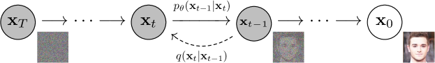
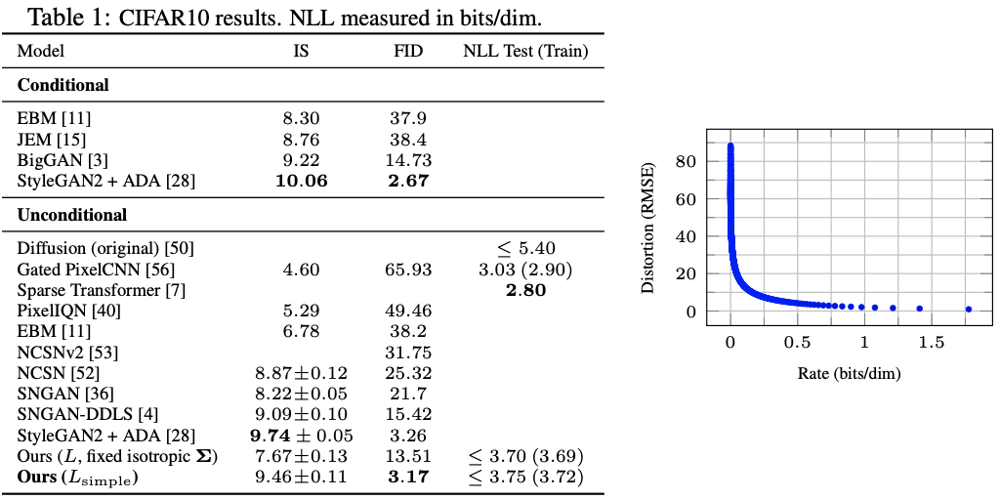

## 一句话定位
DDPM 是把 [[diffusion-sohl-dickstein-2015]]（非平衡热力学扩散）真正做到 GAN 级图像质量的奠基工作：通过将扩散模型重参数化为「预测噪声 ε」并配合一个去掉权重的简化 MSE 目标（L_simple），把训练目标化简成一行均方误差，同时揭示其与去噪分数匹配 + 退火 Langevin 动力学的等价性；在无条件 CIFAR10 上取得 IS=9.46、FID=3.17（当时 SOTA，优于多数有条件模型），256×256 LSUN 质量与 ProgressiveGAN 相当。它是后续所有 T2I 扩散模型（[[ddim]] [[improved-ddpm]] [[diffusion-models-beat-gans]] [[latent-diffusion-ldm]] [[imagen]] [[stable-diffusion-1]]）的直接源头。

## 背景与定位
2020 年前，高质量图像生成由 GAN（BigGAN、StyleGAN2）和自回归/流模型主导；扩散模型（diffusion probabilistic models，Sohl-Dickstein 2015，ref.[53]）理论优雅但「从未被证明能生成高质量样本」。与此并行的另一条线是 Song & Ermon 的 NCSN（score-based，ref.[55,56]）——用去噪分数匹配在多噪声尺度上训练，再用退火 Langevin 采样。

DDPM 的核心定位：
- **证明扩散模型能出高质量样本**：是首个让扩散模型在 CIFAR10/LSUN 上对标乃至超过 GAN 的工作。
- **统一两条技术路线**：通过 ε-prediction 参数化，把「扩散模型的变分下界训练」与「去噪分数匹配 + Langevin 采样」在数学上等价起来（作者称这是其主要贡献之一）。
- **大幅简化训练**：从复杂的变分下界（VLB）化简为一个加权 MSE，再进一步去掉权重得到 L_simple，工程上极易实现。

相对前置工作（Appendix C 明确列出与 NCSN 的 4 点差异）：(1) 用带自注意力的 U-Net 而非 RefineNet，且在每一层都注入时间 t 的 sinusoidal 嵌入；(2) 前向过程每步用 √(1−β_t) 缩放数据使方差不发散（NCSN 无此缩放）；(3) 前向过程彻底破坏信号使 q(x_T|x_0)≈N(0,I)，先验与聚合后验匹配，且 β_t 很小保证可逆；(4) Langevin 式采样器的系数严格由 β_t 推导，训练直接以变分推断方式优化采样器本身，而非 NCSN 那样事后手工设定。

## 模型架构

> 图源：Ho et al., "Denoising Diffusion Probabilistic Models" (arXiv:2006.11239) Figure 2 — 前向 q(x_t|x_{t-1}) 与反向 p_θ(x_{t-1}|x_t) 的有向图模型

**Backbone：带自注意力的 U-Net。** 沿用 PixelCNN++（ref.[52]）的主干，本质是基于 Wide ResNet（ref.[72]）的 U-Net（ref.[48]）。把原版的 weight normalization 换成 **group normalization** 以简化实现。

- **分辨率层级**：32×32 模型用 4 个特征图分辨率（32×32 → 4×4）；256×256 模型用 6 个层级。每个分辨率层级有 **2 个卷积残差块**。
- **自注意力**：在 **16×16 分辨率**的特征图上、卷积块之间插入 self-attention（ref.[63] non-local block 风格）。
- **时间条件注入**：扩散时间步 t 通过 **Transformer sinusoidal position embedding**（ref.[60]）加到**每一个残差块**中（参数在所有时间步间共享）。这一点与 NCSN 只在归一化层或仅输出端条件化不同。
- **网络输出**：预测噪声 ε_θ(x_t, t)，输出维度与图像同形（无 VAE/latent，直接在像素空间操作）。
- **参数量**：CIFAR10 模型 **35.7M**；LSUN / CelebA-HQ 模型 **114M**；另有一个增大 filter 数的 LSUN Bedroom 大模型约 **256M**。

注意：DDPM 是**像素空间**无条件生成模型，没有 text encoder、没有 VAE/tokenizer、没有文本条件——这些都是后续工作（LDM 引入 latent + cross-attention 文本条件）才加入的。本文的「条件」仅指扩散时间步 t。

**关键公式（方法核心）：**
- 前向过程闭式：q(x_t|x_0)=N(x_t; √ᾱ_t·x_0, (1−ᾱ_t)I)，其中 α_t=1−β_t，ᾱ_t=∏α_s——可一步采样任意 t 的加噪样本。
- ε-prediction 参数化（Eq.11）：μ_θ(x_t,t)=1/√α_t·(x_t − β_t/√(1−ᾱ_t)·ε_θ(x_t,t))。
- 反向过程方差固定为非训练常数 σ_t²I（取 σ_t²=β_t 或 σ_t²=β̃_t 效果相近，二者分别对应反向过程熵的上下界）；消融显示**学习对角方差 Σ_θ 反而训练不稳、样本更差**。

## 数据
DDPM 是无条件图像生成，使用标准学术数据集，无大规模图文/合成数据，无 re-captioning（这些概念在 T2I 时代才出现）。
- **数据集**：CIFAR10（32×32）、CelebA-HQ 256×256、LSUN Bedroom / Church / Cat（均 256×256，ref.[71]）。
- **数据加载**：CIFAR10、CelebA-HQ 用 TensorFlow Datasets 提供的版本；LSUN 用 StyleGAN 的预处理代码。数据划分沿用各数据集在生成建模语境中的标准设定。
- **数据缩放**：图像整数 {0,…,255} 线性缩放到 **[−1,1]**，保证反向过程从标准正态先验出发时输入尺度一致。
- **数据增强**：CIFAR10 用随机水平翻转（实验对比有/无翻转，翻转略微提升样本质量）；除 LSUN Bedroom 外其他数据集也用水平翻转。
- 无美学/安全过滤等内容（学术数据集，不涉及）。

## 训练方法
**训练目标：去权重的简化变分下界 L_simple（本质是 ε 上的 MSE）。**

- 完整目标是负对数似然的变分下界 L（Eq.3/5），经 Rao-Blackwell 化简为各项高斯 KL 的闭式比较（L_T + Σ L_{t-1} + L_0）。
- 经 ε-prediction 重参数化后单项简化为 Eq.12（带 β_t²/(2σ_t²α_t(1−ᾱ_t)) 权重的 ‖ε − ε_θ‖²）。
- **L_simple（Eq.14）**：直接丢掉上述权重，得到
  L_simple(θ) = E_{t,x_0,ε} ‖ε − ε_θ(√ᾱ_t·x_0 + √(1−ᾱ_t)·ε, t)‖²，t 在 1…T 上均匀采样。
- 去权重的效果等价于**下调小 t（低噪声）项的权重、上调大 t（高噪声）难任务项的权重**，让网络专注于更难的去噪任务——消融证明这个 reweighting 带来更好的样本质量。
- **训练算法（Algorithm 1）极简**：采 x_0、采 t、采 ε，对 ‖ε − ε_θ(√ᾱ_t·x_0 + √(1−ᾱ_t)·ε, t)‖² 做一步梯度下降，直到收敛。

**采样（Algorithm 2）**：从 x_T∼N(0,I) 出发，t=T…1 逐步 x_{t-1}=1/√α_t·(x_t − β_t/√(1−ᾱ_t)·ε_θ(x_t,t)) + σ_t·z（t>1 时 z∼N(0,I)，t=1 时 z=0），共需 **T=1000 次网络前向**——这是 DDPM 推理慢的根源（后续 [[ddim]] 等加速工作的动机）。

**关键超参（Appendix B，均来自原文，主要在 CIFAR10 上搜后迁移到其他数据集）：**
- 扩散步数 **T=1000**（未做 sweep）。
- β_t **线性 schedule**，从 β_1=1e−4 到 β_T=0.02（从 constant/linear/quadratic 中选，约束 L_T≈0；L_T=D_KL(q(x_T|x_0)‖N(0,I))≈1e−5 bits/dim）。
- 优化器 **Adam**（早期对比过 RMSProp 后选 Adam），超参用默认值。
- 学习率 **2e−4**（32×32），256×256 降到 **2e−5**（大学习率训练不稳）。
- Batch size **128**（CIFAR10）/ **64**（256×256），均未 sweep。
- **EMA** 衰减 0.9999（未 sweep）。
- Dropout：CIFAR10 用 **0.1**（在 {0.1,0.2,0.3,0.4} 上 sweep；无 dropout 会出现类似 PixelCNN++ 的过拟合伪影），其他数据集设 0。
- 训练步数：CIFAR10 800k；CelebA-HQ 0.5M；LSUN Bedroom 2.4M（大模型 1.15M）；LSUN Cat 1.8M；LSUN Church 1.2M。

蒸馏/加速：**本文不涉及**（consistency/LCM/ADD 等是后续工作）。

## Infra（训练 / 推理工程）
- **硬件**：全部实验用 **Google Cloud TPU v3-8**（论文称约相当于 8× V100）；由 Google TensorFlow Research Cloud (TFRC) 提供。
- **框架**：TensorFlow 1.15 + Python 3.5（README），依赖 tensorflow-probability 0.8、tensorflow-gan、tensorflow-datasets 2.1.0；数据存于 GCS bucket。
- **训练吞吐**：CIFAR10 在 batch 128 下 **21 steps/s**，训到 800k 步约 **10.6 小时**；CelebA-HQ/LSUN（256²）在 batch 64 下 **2.2 steps/s**。
- **采样耗时**：CIFAR10 采 256 张约 **17 秒**；256² 模型采 128 张约 **300 秒**（T=1000 步串行，推理慢是 DDPM 固有短板）。
- 无并行/分布式/量化等大规模工程描述（单 TPU v3-8 规模，学术 setup）。

## 评测 benchmark（把效果讲清楚）

> 图源：Ho et al., DDPM (arXiv:2006.11239) Table 1（CIFAR10 IS/FID/NLL，DDPM L_simple FID=3.17）+ Figure 5 右（率失真曲线）；取自官方项目页 hojonathanho.github.io/diffusion

所有数字均来自论文 Table 1/2/3（一手源）。

**CIFAR10（无条件，Table 1）：**
- DDPM (L_simple)：**IS=9.46±0.11，FID=3.17**（对训练集；对测试集 FID=5.24），NLL ≤3.75 bits/dim。
- DDPM (L, fixed isotropic Σ)：IS=7.67±0.13，FID=13.51，NLL ≤3.70 bits/dim（变分下界训练 NLL 更好，但样本质量明显差于 L_simple）。
- 对比同期：StyleGAN2+ADA FID=2.67（仍领先一点）、NCSN(ref.[55]) FID=25.32、NCSNv2 FID=31.75（DDPM 大幅超越 score-based 前作）、SNGAN FID=21.7、原始 Diffusion(ref.[53]) FID=65.93。**DDPM 的 FID=3.17 优于文中绝大多数模型，包括多数有条件模型**（如有条件 BigGAN FID=14.73）。

**LSUN 256×256（FID，Table 3）：**
- Bedroom：**4.90**（大模型）/ 6.36（小模型）——对比 ProgressiveGAN 8.34、StyleGAN 2.65、StyleGAN2 未报。
- Church：**7.89** —— 对比 ProgressiveGAN 6.42、StyleGAN2 3.86。
- Cat：**19.75** —— 对比 ProgressiveGAN 37.52、StyleGAN2 6.93。
- 结论：与 ProgressiveGAN 同级（Bedroom/Cat 更好，Church 略逊），但仍落后于 StyleGAN2。

**消融（Table 2，反向过程参数化 × 训练目标）：**
- 预测 μ̃（baseline）：仅在用真实变分下界训练时有效（FID=13.22），换成无权重 MSE 则训练不稳/出界。
- 学习对角方差 Σ_θ：训练不稳、样本更差。
- **预测 ε（本文）**：在 fixed-Σ 变分下界训练下与预测 μ̃ 相当（FID=13.51），但配合 **L_simple 后大幅领先（FID=3.17）**。这是本文方法选择的实证依据。
- 预测 x_0：早期实验发现样本质量更差，遂弃用。

**其他分析（非 benchmark）：**
- 渐进式有损压缩：最高质量模型 rate=1.78 bits/dim、distortion=1.97 bits/dim（RMSE=0.95 on 0–255），>一半码长用于描述「不可感知」的细节；率失真曲线（Table 4）显示低码率区失真陡降。
- 对数似然不具竞争力（相比 Sparse Transformer 等），但作者论证扩散模型有「优秀的有损压缩器」归纳偏置。
- 揭示与自回归解码的联系（把高斯扩散看作具有「广义比特序」的自回归模型）。
- 无 GenEval/T2I-CompBench/DPG/HPS/人评 ELO 等——**这些 T2I 评测在 2020 年尚不存在，论文未报告**（DDPM 是无条件像素生成，不涉及文本对齐）。

## 创新点与影响
**核心贡献：**
1. **ε-prediction + L_simple**：把扩散模型训练化简为一行噪声 MSE，工程极简、稳定，成为之后几乎所有扩散模型的默认训练目标。
2. **统一扩散模型与去噪分数匹配/Langevin 动力学**：在数学上证明二者等价，连通了 Sohl-Dickstein 路线与 Song-Ermon (NCSN) 路线。
3. **首次证明扩散模型可达 GAN 级图像质量**（CIFAR10 FID=3.17，LSUN 对标 ProgressiveGAN）。
4. 提出固定方差、√(1−β_t) 数据缩放、每层时间嵌入注入等一系列让扩散训练稳定的工程选择。

**对后续工作的影响（直接源头）：**
- [[ddim]]（确定性、少步采样）、[[improved-ddpm]]（学习方差 + cosine schedule）、[[diffusion-models-beat-gans]]（classifier guidance，"diffusion beats GANs"）。
- 潜空间化与文本条件：[[latent-diffusion-ldm]] / [[stable-diffusion-1]]（在 VAE latent 上做 DDPM + cross-attention 文本条件）、[[imagen]]、[[dall-e-2]]。
- 几乎所有现代 T2I/视频/音频扩散生成模型的训练目标与采样框架都可追溯到本文。

**已知局限（论文自述）：**
- 采样慢：需 T=1000 次串行网络前向（256² 采 128 张约 300s）。
- 对数似然不及顶尖似然模型（Sparse Transformer 等）。
- 仅无条件像素空间生成，无文本/类别条件、无 latent 压缩（后续工作补足）。
- 学习方差不稳定（本文只能固定方差，后由 Improved DDPM 解决）。
- Broader Impact 中作者指出生成模型的滥用风险（深伪）与数据偏置问题。

## 原始链接
- arxiv_abs: https://arxiv.org/abs/2006.11239
- arxiv_pdf: https://arxiv.org/pdf/2006.11239
- github: https://github.com/hojonathanho/diffusion
- project_page: https://hojonathanho.github.io/diffusion/

## 本地落盘文件
- ../../../sources/omni/2020/arxiv-2006.11239.pdf
- ../../../sources/omni/2020/ddpm--readme.md
- ../../../sources/omni/2020/ddpm--project-page.md
