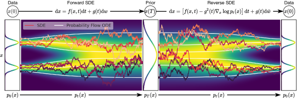

## 一句话定位
用一个连续时间**随机微分方程（SDE）**框架把分数匹配（SMLD/NCSN）与扩散概率模型（[[ddpm]]）统一起来：前向 SDE 注噪、逆向 SDE 去噪，逆向过程只依赖各时刻扰动分布的 score `∇x log p_t(x)`。在此框架下提出**预测-校正（Predictor-Corrector）采样**、与 SDE 共享边缘分布的**概率流 ODE（probability flow ODE，可精确算似然）**，以及改进网络 **NCSN++/DDPM++**，在 CIFAR-10 无条件生成上刷到 **IS 9.89 / FID 2.20**、似然 **2.99 bits/dim**，并首次用 score-based 模型生成 **1024×1024** 高保真图像。ICLR 2021 Outstanding Paper。

## 背景与定位
2020 年前后有两类"加噪—学反向"的生成模型并行发展：
- **SMLD / NCSN**（Song & Ermon 2019/2020）：在一串离散噪声尺度 σ₁<…<σ_N 上用去噪分数匹配训练 Noise Conditional Score Network，采样用退火 Langevin 动力学。
- **DDPM**（[[ddpm]]）：训练反向去噪马尔可夫链，对连续状态空间其训练目标隐式地估计了各噪声尺度的 score。

二者本质都在"估计 score + 逐尺度去噪"，但用离散噪声尺度，理论割裂、采样方法各异。本文的核心洞见：**当噪声尺度数 N→∞，这两套离散加噪过程分别收敛到两个不同的连续时间 SDE**。于是把整套问题搬到连续时间 SDE 上，得到统一框架，并解锁三类新能力：(1) 任意通用 SDE 数值解法 + 新的 PC 采样；(2) 概率流 ODE 带来确定性采样、精确似然、可逆编码与隐空间编辑；(3) 用单个无条件模型经条件逆向 SDE 做可控生成（类条件、inpainting、上色等逆问题）。它是连续时间扩散/flow 视角的理论奠基工作，直接启发后续 [[ddim]]、概率流 ODE 加速、以及 flow matching/rectified flow 一系。相关后续生态如 [[latent-diffusion-ldm]] 也建立在这套连续扩散观之上。

## 模型架构

> 图源：Song et al., "Score-Based Generative Modeling through Stochastic Differential Equations" (ICLR 2021), Figure 2 — Overview of score-based generative modeling through SDEs（https://arxiv.org/abs/2011.13456）

本文是**方法 + 架构改进**双线，不是单一新模型。

**核心数学对象（与具体网络无关）**
- 前向 SDE：`dx = f(x,t)dt + g(t)dw`，drift `f`、diffusion `g(t)` 由人为指定、**无可训练参数**，把 p_data 平滑扩散到固定先验 p_T。
- 逆向 SDE（Anderson 1982）：`dx = [f(x,t) − g(t)² ∇x log p_t(x)] dt + g(t) dw̄`，反向时间运行，**只依赖 score**。
- 训练目标即用时间相关网络 `s_θ(x,t)` 去逼近 `∇x log p_t(x)`（见"训练方法"）。

**三种具体 SDE（关键设计）**
- **VE SDE（Variance Exploding，= SMLD 连续极限）**：`dx = √(d[σ²(t)]/dt) dw`，t→∞ 方差爆炸。
- **VP SDE（Variance Preserving，= DDPM 连续极限）**：`dx = −½β(t)x dt + √β(t) dw`，初始单位方差时全程方差恒为 1。
- **sub-VP SDE（本文新提）**：`dx = −½β(t)x dt + √(β(t)(1−e^{−2∫β}))dw`，各时刻方差被 VP 上界控制，**对似然特别友好**。三者 drift 都是仿射的 → 扰动核 p_{0t}(x(t)|x(0)) 都是闭式高斯，训练高效。

**Backbone：U-Net（NCSN++ / DDPM++）**，在 DDPM 的 U-Net 上做架构升级（Appendix H）：
1. 上/下采样改用基于 **FIR（有限冲激响应）抗锯齿** 滤波（沿用 StyleGAN2 的实现与超参）。
2. 所有 **skip connection 乘 1/√2 重缩放**（ProgressiveGAN/StyleGAN/BigGAN 同款 trick）。
3. 把 DDPM 原 residual block **换成 BigGAN 型 residual block**。
4. 每分辨率 residual block 数 **2→4**（"deep" 版再翻倍）。
5. 引入 **progressive growing** 结构（input 端 "input skip"/"residual"，output 端 "output skip"/"residual"）。
- **时间条件注入**：离散目标用 sinusoidal positional embedding；切到连续目标后改为 **random Fourier feature embedding**（scale 固定 16），以条件化连续时间变量 t。
- 消融结论：**NCSN++（VE 最优）** = FIR + skip 重缩放 + BigGAN block + 4 blocks/res + input 端 "residual"、output 端不用 progressive；**DDPM++（VP 最优）** 在 144 种配置里最优配置不用 FIR、不用 progressive growing。EMA rate 影响显著：VE 用 0.999、VP 用 0.9999。equalized learning rate 在此任务上反而有害。

## 数据
- **CIFAR-10**（32×32）—— 主战场，架构探索、FID/IS/似然全在此。
- **CelebA 64×64**（VE 架构探索的第二数据集，按 NCSNv2 预处理）。
- **LSUN bedroom / church outdoor 256×256**（VE SDE + 连续目标，验证 PC 采样在高分辨率上的优势）。
- **CelebA-HQ 1024×1024**（首次用 score-based 模型做 1024px 高保真生成）。
- 似然评测在 **uniformly dequantized CIFAR-10** 上，仅与同样做 uniform dequantization 的模型比较。
- 无数据来源采集/清洗/re-captioning/合成数据等环节——这是 2020 年的小数据集学术 benchmark 工作，数据即标准公开数据集，**无文本条件、无图文对**。注：因 Google 政策，原始 CelebA / CelebA-HQ checkpoint 未公开发布，作者后续用个人资源在 FFHQ 1024/256、CelebA-HQ 256 重训了相近性能的权重。

## 训练方法
- **训练目标 = 连续时间去噪分数匹配**（denoising score matching 的连续推广）：
  `θ* = argmin E_t{ λ(t) · E_{x(0)} E_{x(t)|x(0)} ‖ s_θ(x(t),t) − ∇_{x(t)} log p_{0t}(x(t)|x(0)) ‖² }`
  其中 t 在 [0,T] 均匀采样，λ(t) 为正权重函数，典型取 `λ ∝ 1/E‖∇log p_{0t}‖²`。仿射 drift ⇒ 转移核为闭式高斯，故 `∇log p_{0t}` 有解析式，训练只需采高斯噪声、算闭式 score 目标。也可用 sliced score matching / finite-difference score matching 替代（绕开对一般 SDE 写出 `∇log p_{0t}` 的需要）。
- **离散 vs 连续目标**：架构探索阶段先用原 SMLD/DDPM 的离散目标训（Eqs.1/3），找到最优架构后再**迁移到连续目标 Eq.7**——切连续目标 + 加深网络能进一步提升所有 SDE 的 FID 与似然。
- **优化超参**（沿用 DDPM）：Adam、learning rate warm-up、gradient clipping；CIFAR-10 batch size 128、LSUN 64、CelebA-HQ 1024 用 8。EMA（VE 0.999 / VP 0.9999 / CelebA-HQ 0.9999）。
- **训练步数**：架构探索默认 1.3M iter（每 50k 存一次 ckpt）；连续目标的 NCSN++/DDPM++ cont. 减到 0.95M iter 抑制过拟合（VP SDE 的 FID 在 0.5M iter 后会回升）；CelebA-HQ 1024 训约 2.4M iter。
- **无 RL / 无偏好对齐 / 无蒸馏**：这是 2020 年纯生成方法工作。采样加速走的是**概率流 ODE + 黑盒自适应步长 ODE 求解器（Dormand-Prince RK45）**这条确定性路线，可在不损画质下把 score 网络评估次数（NFE）减少 90%+，而非后来的 consistency/步数蒸馏。

## Infra（训练 / 推理工程）
- **双实现**：官方 **JAX + FLAX**（主），另有 **PyTorch** 版（除"用预训练分类器做类条件生成"外功能齐全）。代码模块化，新 SDE/predictor/corrector 都可继承抽象类后即插即用，似然计算与采样自动适配。
- **训练吞吐 benchmark**（README，4× Tesla V100 32GB，训 NCSN++ cont. + VE SDE）：

  | 框架 | 秒/步 | 总显存 (GB) |
  |---|---|---|
  | PyTorch | 0.56 | 20.6 |
  | JAX (`n_jitted_steps=1`) | 0.30 | 29.7 |
  | JAX (`n_jitted_steps=5`) | 0.20 | 74.8 |

  即 JAX 把多个训练步 jit 在一起（`n_jitted_steps=5`）能把每步降到 0.20s，但显存涨到 74.8GB（拿显存换吞吐）。PyTorch 省显存但更慢。
- **混合精度 / 多机并行规模 / 总 GPU·时**：论文与 README 均**未披露**。代码含云环境抢占恢复（meta-checkpoint）机制，暗示在可抢占的云资源上训练。
- **推理 / 采样工程**：
  - PC 采样在 CIFAR-10 用 1000 步（predictor + corrector），CelebA-HQ 1024 用 2000 步；采样 batch size CIFAR-10 用 1024、LSUN 用 8。
  - corrector 的信噪比 `snr`（r）需调，CIFAR-10 网格搜索（步长 0.01）取最优，LSUN 固定 0.075、CelebA-HQ 0.15、VE 架构探索用 0.16；典型 snr 区间 0.05–0.2，越大越平滑、越小越多样但质量降。
  - 概率流 ODE 用黑盒 RK45 可显式权衡精度/效率，误差容限放大时 NFE 降 90%+ 而不损画质。

## 评测 benchmark（把效果讲清楚）
全部数字来自已抓取的论文 PDF / 官方 README。

**CIFAR-10 无条件生成（Table 3，sample quality）**
- **NCSN++ cont. (deep, VE)：FID 2.20 / IS 9.89** —— 同时刷新当时无条件 SOTA 的 FID 与 IS，甚至**优于此前最佳的有条件生成模型**（如 StyleGAN2-ADA 有条件 FID 2.42），且不需标签。
- NCSN++ cont. (VE) FID 2.38 / IS 9.83；NCSN++（基础）FID 2.45。
- DDPM++（VP 基础）FID 2.78；DDPM++ cont. (VP) FID 2.55、(sub-VP) 2.61；DDPM++ cont. (deep, VP/sub-VP) 均 FID 2.41。
- 对照：原 DDPM FID 3.17 / IS 9.46；NCSNv2 FID 10.87；NCSN FID 25.32。

**CIFAR-10 似然（Table 2，ODE 精确似然，bits/dim，uniformly dequantized）**
- **DDPM++ cont. (deep, sub-VP)：2.99 bits/dim** —— 当时 uniformly dequantized CIFAR-10 的最高似然记录，且 FID(ODE) 同行 **2.92**。
- 规律：(i) 同一个 DDPM 模型用精确 ODE 似然优于其 ELBO；(ii) 连续目标重训进一步降 bits/dim；(iii) **sub-VP 似然总是优于 VP**（VP 3.16 → sub-VP 3.02 等）；(iv) 加深架构 + sub-VP 拿到 2.99 记录，且无需 maximum-likelihood 训练。

**采样器消融（Table 1，CIFAR-10，相同算力比较）**
- reverse diffusion predictor 始终优于 ancestral sampling；corrector-only（C2000）在同等算力下最差。
- **PC1000（1000 predictor + 1000 corrector）几乎总优于 P2000（纯 2000 步 predictor）**——加 corrector 比单纯翻倍 predictor 步数更划算。以 **VP SDE（DDPM）的 PC1000 列**为例：ancestral 3.21 / reverse diffusion 3.18 / **probability flow 3.06**（probability-flow predictor + corrector 在该 SDE 下取得本表最低 FID）。注：3.18 与 3.06 均属 VP SDE 同一 PC1000 列，并非分属 VE/VP（论文 Table 1）。
- 高分辨率 256×256 LSUN 上 PC 采样在可比算力下明显胜过 predictor-only。

**概率流 ODE 效率**：黑盒 RK45 自适应步长，误差容限放大可把 NFE 从数百降到十几（图 3 给出 NFE=14/86/548 的可视化），画质不明显下降。

**其他能力（定性）**：类条件生成（用时间相关分类器，免重训）、256×256 LSUN inpainting / colorization、可逆隐码插值与 temperature scaling、**uniquely identifiable encoding**（前向 SDE 无参数 ⇒ 给定数据分布编码唯一可辨识，区别于普通可逆模型）。

## 创新点与影响
**核心贡献**
1. **统一框架**：把 SMLD 与 DDPM 证明为两个连续时间 SDE（VE / VP）的离散化，给出 score-based 生成的连续时间理论底座。
2. **逆向 SDE 采样**：基于 Anderson 逆时扩散定理，逆过程只需各时刻 score；提出 reverse diffusion sampler（与前向同样离散化，易于推广到新 SDE）。
3. **Predictor-Corrector 采样**：数值 SDE 解法（predictor）+ score-based MCMC/Langevin（corrector）混合，统一并改进 SMLD/DDPM 各自的采样法。
4. **概率流 ODE**：与 SDE 共享所有时刻边缘分布的确定性过程，是一种 neural ODE → 解锁**精确似然**、自适应步长快采样、可逆唯一编码、隐空间编辑。
5. **新 SDE（sub-VP）**与**NCSN++/DDPM++ 架构**，把 score-based 模型一举推到 CIFAR-10 sample-quality 与 likelihood 双 SOTA，并首次做到 1024px。
6. **可控生成统一视角**：条件逆向 SDE `∇log p_t(x) + ∇log p_t(y|x)`，单个无条件 score 模型即可做类条件、inpainting、colorization 等一大类逆问题，免重训。

**影响**：连续时间 + 概率流 ODE 的视角是后续整条扩散加速线（[[ddim]] 确定性采样、ODE 求解器、DPM-Solver 类）与 flow matching / rectified flow 的直接思想源头；"score = 各时刻分布梯度场"成为扩散生成的标准语言；PC 采样、VE/VP/sub-VP 命名沿用至今；可控生成的条件逆向 SDE 写法是后来 classifier guidance / classifier-free guidance 的形式化前身。ICLR 2021 Outstanding Paper。

**已知局限**（论文自述）：采样仍比同数据集上的 GAN 慢（即便有概率流 ODE 加速）；缩小 score-based 模型与隐式模型（GAN）的采样速度差距是重要后续方向；1024px CelebA-HQ 样本有可见瑕疵（如面部对称性），更优架构有望显著提升。

## 原始链接
- openreview: https://openreview.net/forum?id=PxTIG12RRHS
- arxiv_abs: https://arxiv.org/abs/2011.13456
- arxiv_pdf: https://arxiv.org/pdf/2011.13456
- github (JAX/FLAX 官方实现): https://github.com/yang-song/score_sde
- github (PyTorch 实现): https://github.com/yang-song/score_sde_pytorch

## 本地落盘文件
- ../../../sources/omni/2020/arxiv-2011.13456.pdf
- ../../../sources/omni/2020/score-sde--readme.md
