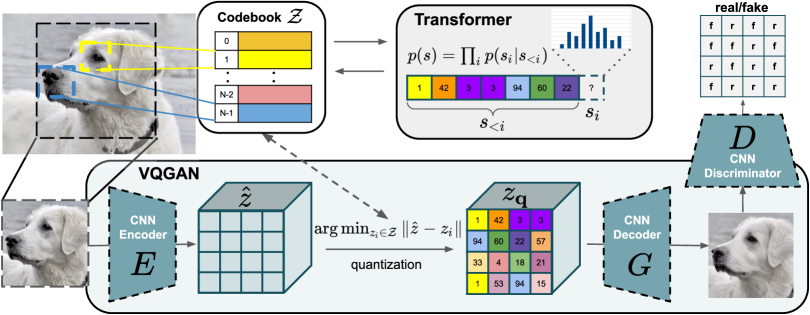

## 一句话定位
VQGAN 用「对抗损失 + 感知损失」训练一个卷积式离散 codebook 把图像压成 16×16 的视觉 token，再用 GPT-2 式自回归 transformer 建模 token 序列——奠定「离散视觉 token + 序列建模」范式。核心结果：在 256×256 class-conditional ImageNet 上以约 10× 更少参数（vs VQVAE-2，论文原文 "≃10× less"）刷新自回归 SOTA（无拒绝采样 FID 15.78，配合 classifier rejection 后低至 5.20，超过 BigGAN/IDDPM），并首次用 transformer 合成 megapixel（图 1 即 1280×460）级图像。

## 背景与定位
2020 年的两个事实之间存在尖锐矛盾：(1) transformer 在低分辨率图像自回归建模上已稳定超过卷积模型（[[image-gpt]]、Sparse Transformer），但 (2) 注意力对序列长度是 O(n²)，而图像像素数随分辨率二次增长，导致 iGPT 这类纯像素 transformer 卡在 192×192 以下、算力天价。

VQGAN 的破局点是 **two-stage（两阶段）**思路的强化版：
- 前置工作 **VQVAE / VQVAE-2**（van den Oord 2017、Razavi 2019）已提出「先学离散表示、再自回归建模」，但它们刻意用**浅层、小感受野**的量化器以保持空间不变性，且第二阶段仍用卷积式 PixelCNN/PixelSNAIL 做密度估计——难以建模高分辨率图像的长程关系。
- [[image-gpt]] 把 transformer 用在像素/极浅量化上，证明 transformer 优于卷积自回归，但分辨率受限。

VQGAN 的关键论断是反 VQVAE 的：**第一阶段要尽可能"强"、感受野尽可能大、压缩率尽可能高**（codebook 装"上下文丰富的视觉部件"而非局部 patch），把建模低层统计量的活儿从 transformer 卸给 CNN+GAN；transformer 只负责它最擅长的——长程组合关系。这一"强 tokenizer + 序列模型"分工后来被 [[latent-diffusion-ldm]]（直接复用 VQGAN 的 autoencoder 做 latent space）、Parti、Muse、Chameleon 等全面继承。两位一作 Esser/Rombach 正是 Stable Diffusion 的核心作者。

## 模型架构

> 图源：Esser et al., "Taming Transformers for High-Resolution Image Synthesis" (arXiv:2012.09841), Figure 2

两阶段，二者通过**离散 codebook**对接：

**第一阶段：卷积 VQGAN（tokenizer）**
- Encoder E：CNN，含 m 个下采样块（Residual + Downsample），最低分辨率处加**一个 Non-Local（注意力）块**聚合全局上下文，把图像 x∈R^{H×W×3} 压成 ẑ=E(x)∈R^{h×w×nz}，其中 h=H/2^m、w=W/2^m、下采样因子 f=2^m。
- **向量量化 q(·)**：每个空间码 ẑ_ij 最近邻映射到可学习 codebook Z={z_k}_{k=1..|Z|}⊂R^{nz} 中最近的条目，得到 z_q；等价于一串 h·w 个 codebook 索引（序列 s）。量化不可导，用 **straight-through 梯度估计**直通回传。
- Decoder G：对称结构（Residual+Non-Local+Upsample），x̂=G(z_q) 重建图像。Encoder/Decoder 架构沿用 DDPM 的网络设计（无 skip-connection）。
- **判别器 D**：patch-based PatchGAN（基于 [28] pix2pix）——这是 VQGAN 相对 VQVAE 的核心改动之一。
- 典型配置：|Z|=1024（class-cond ImageNet 用 16384），nz=256，f=16（即 256×256 图像 → 16×16=256 个 token）。

**第二阶段：自回归 transformer**
- 架构**完全等同 GPT-2**（minGPT 实现），主要靠层数 nlayer 调容量（85M–1.4B），注意力头固定 nh=16。把 token 序列 s 按 **row-major（光栅扫描）**顺序展开，做 next-index 预测 p(s_i|s_{<i})。
- **条件注入用 decoder-only "prepend" 策略**：非空间条件（类别）就是一个前置 token；空间条件（分割图/深度/边缘/姿态/低分辨率图）**再训一个 VQGAN** 编成索引序列 r，直接拼到 s 前面，把 NLL 限制在 s 的部分上——一套机制统一所有条件任务，无需任务专用模块。
- **滑动注意力窗口（sliding window）**生成 megapixel 图：训练时把图裁到 16×16 token 的可行长度，采样时以滑窗方式逐块生成，只要数据统计近似空间不变或有空间条件即可；无条件对齐数据则额外 condition on 图像坐标。

## 数据
本工作是方法论文，**不构建新的大规模数据集**，在多套公开/自采数据上分别训练独立模型（每个数据集一对 VQGAN+transformer）：
- **ImageNet (IN)**：class-conditional 与 unconditional；以及子集 Restricted ImageNet（RIN，动物类）。
- **人脸**：FFHQ、CelebA-HQ，以及二者合并的 FacesHQ。
- **场景/分割**：ADE20K、COCO-Stuff、LSUN Churches+Towers。
- **S-FLCKR（自采）**：从 Flickr + 多个 subreddit 抓取 **107,625 张**图（train 96,861 / val 10,764），用在 COCO-Stuff 上训练的 DeepLab v2 生成分割掩码作为空间条件。因版权未公开发布，只给采集说明。
- **深度条件（D-RIN）**：用 MiDaS v2.0 对 ImageNet 提取深度图作为条件信号。
- **CIFAR-10**：用于"像素 vs latent"对照实验。

数据**清洗/re-caption/美学过滤等几乎未涉及**（无文本条件、无 caption），与后来 T2I 大模型的数据工程不同——这是纯类别/空间条件的早期范式。

## 训练方法
**两阶段分别训练，不是端到端联合。**

**阶段一 VQGAN 目标**（论文 Eq.4–6）：
- VQ 损失 = 重建损失 + codebook 损失 + commitment 损失（后两项用 stop-gradient）。**重建损失 L_rec 用感知损失（LPIPS）替代 VQVAE 的 L2**——VQGAN 两大改进之一。
- 加入**对抗损失 L_GAN**（patch 判别器），完整目标为 min_{E,G,Z} max_D E[L_VQ + λ·L_GAN]。
- **自适应权重 λ**：λ = ∇_{G_L}[L_rec] / (∇_{G_L}[L_GAN]+δ)，即按"重建梯度 / 对抗梯度"在 decoder 最后一层 L 上的范数比自动平衡两个损失（δ=1e-6）。
- 训练 trick：λ 在 warm-up 阶段置 0（建议至少一个 epoch 只做重建），warm-up 越长重建越好。语义分割图等离散条件的第一阶段改用 cross-entropy 重建损失。
- 勘误（论文附录 A Changelog）：commitment 权重 β 因实现 bug 从未生效、实际恒为 1.0（早期版本 Tab.8 原写 0.25），新版已从 Eq.4 移除 β。

**阶段二 transformer 目标**：标准 next-token 最大似然 L = E[−log p(s)]（条件版加前缀 r/c）。**无 RLHF/DPO/偏好对齐、无蒸馏**（这些是后来 T2I 才有的）。
- 采样：温度 t=1.0，top-k（默认 k=100，大 codebook 用更大 k）/ top-p（nucleus）/ **classifier rejection sampling**（用 ResNet-101 打分，保留 m-out-of-n，沿用 VQVAE-2 做法）多种解码策略，FID 对解码超参高度敏感。
- 推理加速：开源代码在 self-attention 里**缓存 key/value**（`sample_fast.py`），无需重算历史。

## Infra（训练 / 推理工程）
- **算力规模偏小、单机为主**（与同期大厂工作对比是其"省"的卖点）：超参设计使每个 transformer 至少能在 12GB 显存 GPU 上以 batch≥2 训练；通常用 **2–4 张 GPU、累计 48GB**；硬件允许时开 **16-bit 混合精度**。
- 旗舰 **class-conditional ImageNet transformer（Tab.8 "c-IN big"，nlayer=48、1400M=1.4B 参数）**：batch 16 × 梯度累积 8，训 **2.4M 步**，在**单张 A100 上耗时 45.8 天**（论文附录 A Changelog 明确给出）。
- GPT2-medium（307M）配 16×16 序列是"单张 12GB GPU 可训的最大可行长度"——架构选择直接受显存约束驱动。
- 推理：megapixel 靠滑窗（牺牲速度换分辨率）；KV-cache 加速采样。硬件致谢 NVIDIA 捐赠 + DFG 项目，**无超大集群披露**。

## 评测 benchmark（把效果讲清楚）
所有数字均来自论文表格（一手）。

**(1) transformer vs 卷积自回归（PixelSNAIL），NLL（越低越好，Tab.1）**：在 RIN/LSUN-CT/IN/D-RIN/S-FLCKR 全部数据集上 transformer 均胜——即便 PixelSNAIL 训练快约 2×、在等训练时间下比较仍输。例：S-FLCKR transformer 4.49 vs PixelSNAIL 4.64（fixed time）。证明 transformer 的优势能迁移到 latent 空间。

**(2) class-conditional ImageNet 256×256（Tab.4，FID/IS，对 50k 训练全集）**：
- VQGAN 旗舰：mixed-k/p=1.0、无拒绝 → FID **17.04**；k=250 → **15.98**；k=973,p=0.88 → **15.78**。
- 加 classifier rejection（acceptance rate 越低质量越高）：0.5→FID 10.26；0.25→7.35；**0.05→5.88**；0.005→6.59（IS 最高 402.7）。
- 对比（同表，acceptance=1.0 行）：**VQVAE-2 ~31（无拒绝）/ ~10（带 classifier rejection）**、DCTransformer 36.5、BigGAN 7.53、BigGAN-deep 6.84、IDDPM 12.3、ADM-G 无引导 10.94（1.0 引导 4.59、10.0 引导 9.11）。**VQGAN 在自回归路线内全面领先（无拒绝即超 VQVAE-2/DCTransformer）；开 classifier rejection 后超 BigGAN 与 IDDPM**（acceptance 0.25 → 7.35 已略胜 BigGAN 7.53，0.05 → 5.88）。且旗舰 transformer 参数量 1.4B，约为 VQVAE-2（论文估 13.5B）的 **1/10**。

**(3) 人脸（Tab.3，FID）**：CelebA-HQ 256 → ours(k=400) **10.2**（优于 GLOW 69.0、NVAE 40.3、VAEBM 20.4、DC-VAE 15.8，逊于 PGGAN 8.0、StyleGAN）；FFHQ 256 → ours(k=300) **9.6**（优于 VDVAE、VQGAN+PixelSNAIL 21.9、接近 BigGAN 12.4，逊于 StyleGAN2 3.8）。说明作为"统一模型"已逼近专用 GAN。

**(4) 语义合成 FID（256×256，Tab.2）**：COCO-Stuff **22.4**、ADE20K **35.5**，与专用 SPADE（22.6/33.9）相当，远胜 Pix2PixHD、CRN。

**(5) tokenizer 重建质量（rFID，Tab.5，关键消融）**：
- VQGAN f16/|Z|=1024 → FID/val **7.94**；f16/|Z|=16384 → **4.98**；f8/|Z|=8192（Gumbel-Softmax 变体 VQGAN*）→ **1.49**；两级 f8&f4/|Z|=512 → 1.45（其中 f16 单级序列仅 256，远短于 VQVAE-2 的 5120=32²+64²、DALL-E 的 1024）。
- 对比 **DALL-E dVAE 32.01（FID/val）、VQVAE-2 ~10（仅 FID/train，论文该行 FID/val 标 n/a）**——VQGAN 在更短序列下重建 FID 显著更优，直接量化了"对抗+感知损失"带来的压缩-保真增益。

**(6) latent vs 像素对照**：在 CIFAR-10 上，相同 transformer 训在 f=2 VQGAN latent（16×16）vs 直接训像素（k-means 512 RGB，iGPT 式）：**FID 改善 18.63%、采样快 14.08×**。

**(7) 上下文丰富度消融（Fig.7）**：固定序列长 16×16，FacesHQ 上 f=1（像素）几乎无法建模全局结构，f=8 出现半脸不一致，**只有 f=16 能合成高保真人脸**，同时 f16 相对 f1 采样**加速 280.68×**——直接论证"强压缩 tokenizer"的必要性。

**(8) token 排序消融（Fig.47）**：row-major NLL 4.767 最优，优于 spiral/z-curve/subsample/alternate 等。

## 创新点与影响
**核心贡献**：
1. **VQGAN tokenizer**：在 VQVAE 上加 **patch 判别器（对抗）+ LPIPS 感知损失 + 自适应 λ 平衡**，在高压缩率（f16）下仍保持锐利纹理与高保真重建——把"离散视觉 token"从模糊变可用。
2. **强 tokenizer + 自回归 transformer 的分工范式**：用 CNN 的局部归纳偏置压低层统计、用 transformer 建长程组合，首次让 transformer 合成 megapixel 图像。
3. **统一条件合成框架**：prepend 条件 token + 滑窗，一套方法覆盖 class/语义/深度/边缘/姿态/超分，无需任务专用网络。

**影响（深远）**：
- 直接催生 [[latent-diffusion-ldm]] / Stable Diffusion——LDM 复用 VQGAN/KL-autoencoder 把扩散搬到 latent 空间，是 VQGAN 第一阶段的"扩散版第二阶段"；同一作者团队。
- 奠定**离散视觉 token 自回归路线**：Parti、Google Muse（masked-token）、Meta Chameleon、各类多模态统一模型的 image tokenizer 思路均源于此。
- 与 CLIP 结合催生社区现象级的 **VQGAN+CLIP** 文生图（2021 AI 艺术潮的起点之一）。
- 工程遗产：minGPT 风格 transformer + 可复用 tokenizer，开源模型/colab 推动大规模复现。

**已知局限**：
- 两阶段非端到端；tokenizer 重建质量是生成质量的**硬上界**（f 过大重建崩坏）。
- 自回归采样慢（megapixel 靠滑窗逐块）、依赖 row-major 顺序与滑窗的空间不变性假设。
- 量化误差/codebook 坍缩问题；FID 无法检测 likelihood 模型对训练集的过拟合（需靠 val-NLL 早停）。
- 无文本条件、无偏好对齐——纯类别/空间条件，距现代 T2I 仍有代差。

## 原始链接
- arxiv_abs: https://arxiv.org/abs/2012.09841
- arxiv_pdf: https://arxiv.org/pdf/2012.09841
- github: https://github.com/CompVis/taming-transformers
- project_page: https://compvis.github.io/taming-transformers/

## 本地落盘文件
- ../../../sources/omni/2020/arxiv-2012.09841.pdf
- ../../../sources/omni/2020/arxiv-2012.09841.txt
- ../../../sources/omni/2020/taming-transformers-vqgan--readme.md
- ../../../sources/omni/2020/taming-transformers-vqgan--project-page.html
