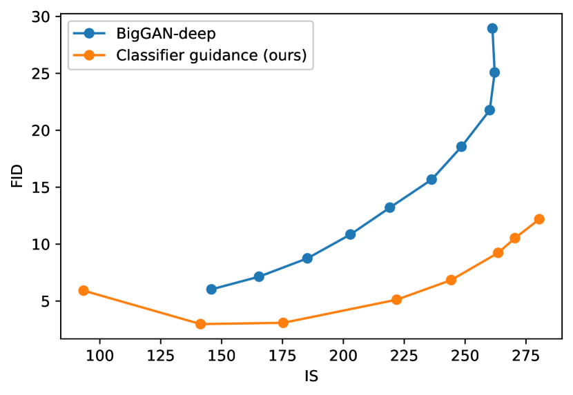

## 一句话定位
OpenAI（Dhariwal & Nichol, 2021-05）通过一系列架构消融得到改进的 U-Net（即 **ADM**），并提出 **classifier guidance（分类器引导）**——用一个在带噪图像上训练的分类器的梯度 $\nabla_{x_t}\log p_\phi(y|x_t)$ 引导采样，从而用一个标量旋钮在「多样性 vs 保真度」间权衡。首次让扩散模型在 ImageNet 上全面超越 BigGAN-deep：**ImageNet 128² FID 2.97 / 256² FID 4.59（+upsampling 3.94）/ 512² FID 7.72（3.85）**，且只需 25 步前向即可与 BigGAN 持平，同时分布覆盖（recall）更好。

## 背景与定位
2021 年初，GAN（尤其 BigGAN-deep）在 FID/IS/Precision 上仍是图像生成 SOTA，但训练不稳定、多样性差（recall 低）。扩散模型（[[ddpm]] Ho et al. 2020 + [[improved-ddpm]] Nichol & Dhariwal 2021）已在 CIFAR-10 上 SOTA，且具备「稳定训练目标 + 分布覆盖好 + 易扩展」的优点，但在 LSUN / ImageNet 这类困难数据集上仍落后 GAN。

作者把差距归因于两点：(1) GAN 的网络架构被反复打磨、扩散用的 U-Net 还很「原始」；(2) GAN 有 truncation trick 这种「牺牲多样性换保真度」的旋钮，扩散没有。本文对症下药：**先改架构（→ ADM），再发明引导旋钮（→ classifier guidance）**。这是「guidance（引导）」思想的源头——它直接催生了同年稍晚的 [[classifier-free-guidance]]（无需单独分类器），并为后续所有 text-to-image（[[glide]] / [[dall-e-2]] / [[latent-diffusion-ldm]] / [[imagen]]）确立了「扩散 + 引导」的统治性范式。模型代码与权重在 `openai/guided-diffusion` 开源。

## 模型架构

> 图源：Dhariwal & Nichol, "Diffusion Models Beat GANs on Image Synthesis" (arXiv:2105.05233) Figure 2 — 各项 U-Net/ADM 架构改动（多分辨率注意力、更多头、BigGAN 上/下采样残差块、skip rescale）的 FID-vs-wall-clock 消融

**Backbone：改进版 U-Net（论文称 ADM = Ablated Diffusion Model）。** 在 Ho et al. 的 U-Net（残差块栈 + 下采样卷积 + 对称上采样 + skip 连接 + 单头 16×16 全局注意力 + 时间步嵌入注入每个残差块）基础上，做了一组消融并保留以下改动：

- **多分辨率注意力**：在 32×32、16×16、8×8 三个分辨率都加注意力（而非仅 16×16）。
- **更多注意力头 / 更少 per-head 通道**：消融发现「头越多或每头通道越少 → FID 越好」；综合 wall-clock，默认取 **每头 64 通道**（与现代 transformer 一致）。
- **BigGAN 残差块做上/下采样**（来自 Song et al. score-SDE）。
- **宽度优先于深度**：增加深度也有效但训练更慢、收敛更慢，故选择「加宽」而非「加深」（2 个残差块/分辨率）。
- **Skip 连接按 $1/\sqrt 2$ 缩放**：消融显示几乎无收益，最终未采用。
- **Adaptive Group Normalization（AdaGN）**：把时间步嵌入和类别嵌入经线性投影成 $y=[y_s,y_b]$，以 $\text{AdaGN}(h,y)=y_s\,\text{GroupNorm}(h)+y_b$ 注入每个残差块（类似 AdaIN / FiLM）。消融：AdaGN 把 FID 从 15.08（Ho et al. 的「加法 + GroupNorm」）降到 13.06。

**最终默认架构**：可变宽度、2 残差块/分辨率、多头（每头 64 通道）、32/16/8 三分辨率注意力、BigGAN 上/下采样残差块、AdaGN 注入时间步与类别。

**参数量与分辨率策略**（来自附录 Table 11）：64² 296M、128² 422M、256² 554M、512² 559M（base 通道 192~256，channel-mult 形如 1,1,2,2,4,4）。**分类器**：直接复用 U-Net 的下采样主干 + 8×8 处 attention pool 输出 logits，规模较小（43M~65M）。**上采样模型**：把低分辨率图双线性插值后按通道拼到输入（concat condition），64→256（312M）、128→512（309M）。

无 text encoder、无 VAE/VQ tokenizer——这是**像素空间**的类别条件扩散（条件仅为 ImageNet 1000 类标签，经 AdaGN 注入）。文本条件要等到稍后的 GLIDE 才出现（本文在 model-card 里已用 CLIP 做引导探针，预告了这条路）。

## 数据
- **ImageNet（ILSVRC 2012 子集）**：约 100 万张图、1000 类，用于 64/128/256/512 四个分辨率的类别条件扩散模型 + 各分辨率的带噪分类器。模型卡指出：多数类别是动物/植物/自然物体；很多图含人但通常不被类别标签反映（如「tench, tinca tinca」类常是人手持鱼）。
- **LSUN（bedroom / horse / cat 三个单类）**：每类超 100 万张，2015 年用 AMT 人标 + 自动标注采集，专家测得整体标签准确率约 90%；图来自互联网，cat 类常呈「meme」格式，偶尔含人脸（尤其 cat 类）。用于**无条件**生成评测。
- **无 re-captioning / 无合成数据 / 无美学过滤**——这是纯标准学术数据集上的方法工作，不涉及网络规模图文对。
- 分类器训练加 **random crop** 以减少过拟合；带噪分类器在与对应扩散模型相同的加噪分布上训练。

## 训练方法
- **训练目标**：标准 DDPM 噪声预测 MSE $\|\epsilon_\theta(x_t,t)-\epsilon\|^2$（$L_{simple}$），并采用 [[improved-ddpm]] 的**学习方差 + 混合目标** $L_{simple}+\lambda L_{vlb}$，把反向方差 $\Sigma_\theta$ 参数化为在 $\beta_t$ 与 $\tilde\beta_t$ 之间插值的网络输出 $v$。这让少步采样不掉点。
- **classifier guidance（核心创新）**：在带噪图像上单独训练分类器 $p_\phi(y|x_t,t)$；采样时把无条件反向均值 $\mu$ 平移 $s\,\Sigma\,\nabla_{x_t}\log p_\phi(y|x_t)$（Algorithm 1）。对 DDIM 用 score-based trick：$\hat\epsilon=\epsilon_\theta-\sqrt{1-\bar\alpha_t}\,\nabla_{x_t}\log p_\phi(y|x_t)$（Algorithm 2）。
- **梯度缩放 $s$**：是把分布锐化为 $\propto p(y|x)^s$。实验发现 $s=1$ 时分类器只给目标类约 50% 概率且样本不像；放大梯度后概率逼近 100%、样本更符合类别。$s>1$ 单调地用 recall（多样性）换 precision/IS（保真度），FID/sFID 在中间取最优。引导可用于无条件模型，也可叠加在类别条件模型上（后者 FID 更低）。各分辨率最优 $s$（250 步）：64²=1.0、128²=0.5、256²=1.0、512²=4.0；DDIM 25 步对应 1.25/2.5/9.0。
- **采样器**：>50 步用 DDPM ancestral（250 步），<50 步用 DDIM（25 步，Song et al. uniform stride）。LSUN 用 1000 步（附录 J 给出更优的 250 步 noise schedule 可基本追平）。
- **优化器/精度**：Adam/AdamW，$\beta_1=0.9,\beta_2=0.999$；**16-bit 混合精度 + loss scaling**，但权重/EMA/优化器状态保持 32-bit；**EMA rate 0.9999**。learning rate 1e-4~3e-4（分类器 3e-4~6e-4）。batch size：**ImageNet 64² 用 2048**，其余（128²/256²/512²/LSUN）均为 256（Table 11）。noise schedule：64² 用 cosine，其余 linear，T=1000。
- 未使用蒸馏/consistency/LCM 等加速（论文「局限」一节点名 Luhman & Luhman 的单步蒸馏为未来方向）；加速主要靠 DDIM 减步数（最低 25 步）。

## Infra（训练 / 推理工程）
- **硬件**：全部用 **NVIDIA Tesla V100**，PyTorch 1.7；跨机时每机 8×V100，含双机通信时间。
- **吞吐（Table 7，imgs/V100-sec）**：朴素 PyTorch 实现利用率仅 18-25%；优化版（更大 per-GPU batch + fused GroupNorm-Swish + fused Adam CUDA op）把 128² 模型 per-GPU batch 从 4 提到 32，利用率升到约 38%。优化后吞吐：64²≈74、128²≈25、256²≈6.4、64→256≈9.5、128→512≈2.3 imgs/V100-sec（理论上限分别 182/65/18/32/8）。
- **训练算力（Table 10，V100-days）**：ImageNet 128² ADM-G（4360K iters）= 生成器 521 + 分类器 9 = **530**；256² ADM-G（1980K）= 916 + 46 = **962**；512² ADM-G+ADM-U（4360K+1050K）= 1878 + 36 = **1914**。BigGAN-deep 的算力 Table 10 仅给区间：128²=64–128、256²=128–256、512²=256–512 V100-days；StyleGAN2 换算自其 TPU 估算（2 TPU-v3-day = 1 V100-day），如 LSUN horse 130 V100-days。结论：作者用更少迭代即超 BigGAN——256² ADM-G 训到 750K 仅 393 V100-days（FID 6.49 < BigGAN 6.95）、加上 ADM-U 后 ADM-G(540K)+ADM-U(500K) 359 V100-days 即得 FID 3.85，远好于 BigGAN 的同量级算力。
- **早停**：128² 模型训到 500K iters（全程 1/8）即超 BigGAN-deep 的 FID 6.02；256² 训到 750K（约 1/3）即反超——说明不必训满即可超 GAN。
- **推理**：250 步（DDPM）或 25 步（DDIM）；分类器引导每步多一次分类器前向 + 反传梯度。部署形态为开源 checkpoint（`classifier_sample.py` / `image_sample.py` / `super_res_sample.py`）。

## 评测 benchmark（把效果讲清楚）

> 图源：Dhariwal & Nichol, "Diffusion Models Beat GANs on Image Synthesis" (arXiv:2105.05233) Figure 5 — ImageNet 128² 上 classifier guidance（橙）的 FID-vs-IS 权衡严格优于 BigGAN-deep truncation（蓝）

主表（Table 5，ADM=改进架构，ADM-G=加分类器引导，ADM-U=加上采样栈）：

**ImageNet 128×128**：BigGAN-deep FID 6.02 / Prec 0.86 / Rec 0.35；ADM 5.91；**ADM-G FID 2.97**，Prec 0.78 / Rec 0.59；ADM-G 仅 25 步 FID 5.98。

**ImageNet 256×256**：BigGAN-deep FID 6.95 / Prec 0.87 / Rec 0.28；ADM 10.94；ADM-G 25 步 5.44；**ADM-G FID 4.59**（Prec 0.82 / Rec 0.52）；**ADM-G + ADM-U 进一步到 FID 3.94**。对比 IDDPM 12.26、SR3 11.30、VQ-VAE-2 31.11。

**ImageNet 512×512**：BigGAN-deep FID 8.43 / Prec 0.88 / Rec 0.29；ADM 23.24；**ADM-G FID 7.72**（Prec 0.87 / Rec 0.42）；**ADM-G + ADM-U 到 FID 3.85**（Rec 0.53，远高于 BigGAN 的 0.29）。

**ImageNet 64×64**：ADM(dropout) FID **2.07**（IDDPM 2.92、BigGAN-deep 4.06），架构改进单独即 SOTA。

**LSUN 256×256（无条件，仅靠架构）**：bedroom ADM(dropout) FID **1.90**（StyleGAN 2.35、DDPM 4.89）；horse **2.57**（StyleGAN2 3.84）；cat **5.57**（StyleGAN2 7.25）。

**关键消融数字**：架构改动在 ImageNet 128² 上把 FID 从约 15.33（700K）逐项叠加改善（多分辨率注意力、4 头、BigGAN up/down 等均为正收益且可叠加）；AdaGN 13.06 vs 加法+GroupNorm 15.08；attention 头消融显示「更多头/更少 per-head 通道」更好。引导的核心结论（Table 4，256²）：无引导无条件 FID 26.21 → 引导 s=10 降到 12.00（precision 0.61→0.76、recall 0.63→0.44）；条件模型 s=1 FID 4.59。**与 BigGAN truncation 对比（Fig 5）**：在 FID-vs-IS 权衡上 classifier guidance 严格优于 BigGAN-deep；precision/recall 权衡上在某 precision 阈值前更优。

人评/ELO/Arena、CLIPScore、GenEval、T2I-CompBench 等：**未报告**（本文是类别条件 ImageNet/LSUN 的 FID/sFID/IS/Precision/Recall 评测，无文本条件，故无文图对齐与人评竞技场指标）。

## 创新点与影响
- **核心贡献**：(1) 系统化的 U-Net 架构消融 → ADM，单凭架构就在 LSUN / ImageNet 64² 拿到无条件 SOTA；(2) **classifier guidance**——首个给扩散模型的「多样性↔保真度」旋钮，且理论上对应锐化分类器分布 $p(y|x)^s$；(3) 证明扩散 + 引导可在 ImageNet 全分辨率超越 BigGAN，且 recall（覆盖）显著更好、25 步即可竞争。
- **影响**：直接确立「扩散是图像生成 SOTA 范式」；guidance 思想是后续一切的源头——同年 Ho & Salimans 的 [[classifier-free-guidance]] 去掉独立分类器（成为今日标配），model-card 里的「CLIP 引导探针」预告了文本条件，催生 [[glide]] / [[dall-e-2]] / [[latent-diffusion-ldm]] / [[imagen]]。ADM 的 U-Net 也成为 LDM/SD 的默认骨干雏形。
- **已知局限**（论文 + model-card）：采样慢（多步前向，仍慢于 GAN，未做蒸馏）；classifier guidance 需带标签数据、对无标签数据无现成旋钮；引导降多样性会放大数据集偏见（性别/种族）；生成人脸常不真实（ImageNet 偏非人物体）；可能记忆训练图（但作者认为泄露风险与既有 GAN 相当）。模型仅供研究、不供商用。

## 原始链接
- arxiv_abs: https://arxiv.org/abs/2105.05233
- arxiv_pdf: https://arxiv.org/pdf/2105.05233
- github: https://github.com/openai/guided-diffusion
- model-card: https://github.com/openai/guided-diffusion/blob/main/model-card.md

## 一手源存档（sources/）
- [arxiv-2105.05233.pdf](https://arxiv.org/pdf/2105.05233)  （arXiv 原文 PDF，不入 git）
- [readme.md](https://github.com/zhao9797/ai-research/blob/main/sources/omni/2021/diffusion-models-beat-gans--readme.md)
- [model-card.md](https://github.com/zhao9797/ai-research/blob/main/sources/omni/2021/diffusion-models-beat-gans--model-card.md)
- [arxiv-abs.md](https://github.com/zhao9797/ai-research/blob/main/sources/omni/2021/diffusion-models-beat-gans--arxiv-abs.md)
