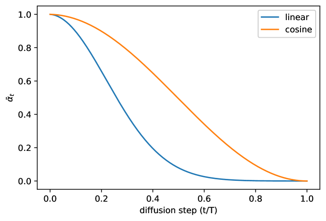
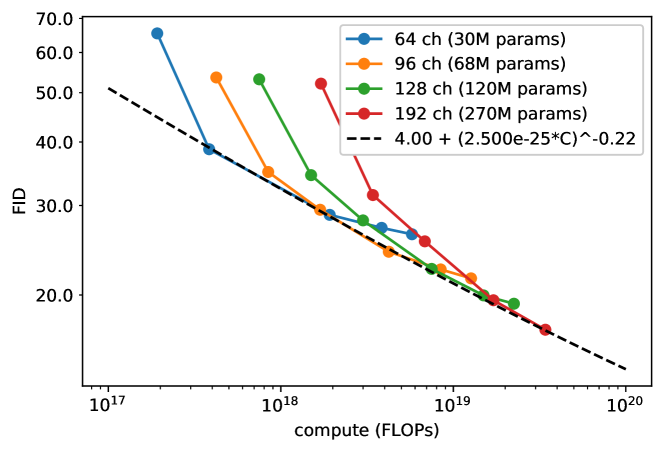

## 一句话定位
OpenAI（Alex Nichol & Prafulla Dhariwal, 2021-02）对 [[ddpm]] 的四点关键改进——**学习反向过程方差（混合目标 L_hybrid）+ 余弦噪声调度 + VLB 重要性采样降噪 + 跳步快速采样**——首次让扩散模型在 ImageNet 64×64 上取得与最佳卷积类 likelihood-based 模型可竞争（略逊于纯 transformer）的 **3.53 bits/dim** 对数似然，并把高质量采样所需前向次数从数百步压到 **50–100 步**（near-optimal FID），同时在召回率上压过 BigGAN-deep（recall 0.71 vs 0.59）。这是把扩散模型从"能出好图"推进到"既好又快又能 scale"的工程奠基工作。

## 背景与定位
[[ddpm]]（Ho et al. 2020）证明了扩散模型能产出高保真图像（CIFAR-10/LSUN 上 FID 优异），但留下三个未解问题：
1. **对数似然不行**——DDPM 用固定方差 σ²ₜI + 重加权简化目标 L_simple，在 likelihood 上打不过自回归（PixelCNN/Sparse Transformer）和 VAE（NVAE/VDVAE）等 likelihood-based 模型；而 likelihood 普遍被认为是衡量"是否覆盖所有 mode"的好指标。
2. **不确定能否 scale 到高多样性数据集**——DDPM 主要在 CIFAR-10/LSUN（单类/低多样性）上验证，未证明能在 ImageNet 这类高多样性集上成立。
3. **采样太慢**——产生一张好图要数百次网络前向，部署不现实。

本文逐一回应：用**学习方差 + 混合目标**把似然做上去；选 **ImageNet 64×64**（多样性与分辨率的折中、且有大量自回归/VAE 基线可比）作为主战场证明可 scale；用**跳步采样**把步数降一个数量级。论文还用 **precision/recall** 与 GAN 正面比较 mode coverage。与本文**并行**的 [[ddim]]（Song et al. 2020a）走的是另一条快采样路线（确定性隐式模型），文中作为对照纳入实验。这条改进线随后直接被 OpenAI 自家 [[diffusion-models-beat-gans]]（guided diffusion / classifier guidance）继承，并最终汇入 [[glide]]、[[dall-e-2]] 乃至整个文生图工程范式；其代码库 `openai/improved-diffusion` 成为后续大量扩散工作的事实基座。

## 模型架构

> 图源：Improved DDPM 论文 Figure 5（余弦 vs 线性噪声调度 ᾱ_t），https://arxiv.org/abs/2102.09672

- **Backbone：U-Net**（沿用 [[ddpm]] 的结构，pixel-space，非 latent）。相对 DDPM 的改动：
  - 注意力层改用 **multi-head attention**（4 个 head，总通道数不变，原 DDPM 为 1 head）；
  - 注意力不只在 16×16 分辨率用，**额外在 8×8 分辨率也加注意力**；
  - **时间条件注入方式**从 `GroupNorm(h + v)` 改为 **scale-shift / AdaGN 形式** `GroupNorm(h)·(w+1) + b`（预测 w、b 两个调制向量），在 ImageNet 64×64 上略微改善 FID。这一 scale-shift-norm（adaptive group norm）后来被 guided diffusion 等广泛沿用。
- **ImageNet 64×64 主结构**：下采样栈 4 步、每步 3 个 residual block，上采样栈镜像；各 stage 通道 **[C, 2C, 3C, 4C]**，C=128 时约 **120M 参数、单次前向约 39 GFLOPs**。
- **CIFAR-10 结构**：更小，每 stage 3 个 resblock，层宽 **[C, 2C, 2C, 2C]**，C=128。
- **方差参数化（核心创新）**：不直接预测 Σθ（范围太小、难学、易不稳），而是让网络输出**逐维插值系数 v**，把方差写成 βₜ 与 β̃ₜ 在 **log 域的插值**：
  `Σθ(xₜ,t) = exp(v·log βₜ + (1−v)·log β̃ₜ)`（公式 15）。未对 v 加约束（理论上可超出 [β̃ₜ, βₜ]），实测网络不会越界，说明该区间足够表达。
- **类条件注入**：把 class embedding vᵢ 加到 timestep embedding eₜ 上，走与 t 相同的通路注入 residual block。
- **分辨率策略**：64×64 直接建模；256×256 用**两阶段级联**——预训练 64×64 模型 p(x₆₄|y) + 上采样扩散模型 p(x₂₅₆|x₆₄, y)（x₆₄ 作为 UNet 额外条件输入），思路类似 VQ-VAE-2 的多尺度先验。

## 数据
- 训练数据集（均为公开标准集，无自建数据/无 re-captioning，纯像素生成任务）：
  - **ImageNet 64×64**（官方 ImageNet-64，van den Oord 2016a 版本）——主实验集，无/有类条件两种设定。
  - **CIFAR-10**。
  - **LSUN bedroom 256×256**（高分辨率验证，附录 B）。
- **预处理**：图像自动缩放 + center-crop；类条件 ImageNet 64×64 / 256×256 用 center crop + area downsample（follow Brock et al. 2018）。
- **数据规模口径**：LSUN bedroom 训练 **153.6M examples**（= batch 64 时 240 万次迭代）。其余按迭代数计（见训练方法）。
- **本工作不涉及图文对、美学过滤、合成数据或安全过滤**——纯无条件/类条件像素生成，数据维度按当时基准集即可，无额外披露。

## 训练方法
- **训练目标（本文最核心贡献）**：
  - DDPM 的 **L_simple**（公式 14，预测噪声 ε 的重加权 MSE）对 Σθ **无梯度信号**，故 DDPM 只能固定方差。
  - 本文提出**混合目标** `L_hybrid = L_simple + λ·L_vlb`，**λ=0.001**（防止 VLB 压过 simple 项）；并对 L_vlb 项里的 μθ 输出**加 stop-gradient**——让 **L_vlb 只引导方差 Σθ、L_simple 仍主导均值 μθ**。这是"既保样本质量又拿到似然"的关键设计。
  - **反直觉发现**：直接优化 L_vlb 反而比 L_hybrid 难训、似然更差——因为 L_vlb 各时间步项数量级差异巨大（前几步贡献绝大部分 NLL），**uniform 采样 t 引入巨大梯度噪声**。
- **VLB 重要性采样降噪**（公式 18）：按 pₜ ∝ √E[L²ₜ] 重要性采样 t，维护每个 loss 项**最近 10 个值**的历史动态估计 E[L²ₜ]（训练初期先 uniform 采到每个 t 各 10 个样本）。该技巧把 L_vlb 的梯度噪声大幅降低，使**直接优化 L_vlb 能取得全文最佳 NLL**；但对本就低噪的 L_hybrid 无帮助。代码对应 `--schedule_sampler loss-second-moment`。
- **余弦噪声调度**（公式 17）：DDPM 的 linear schedule 在 64×64/32×32 上"末端太吵"——前向过程后 ~20% 步几乎纯噪声、对样本质量几乎无贡献（Fig 3/4）。新调度直接以 ᾱₜ = f(t)/f(0)、f(t)=cos²((t/T+s)/(1+s)·π/2) 定义，使 ᾱₜ 在中段线性下降、两端变化平缓，信息销毁更慢。小偏移 **s=0.008**（使 √β₀ 略小于像素 bin 1/127.5，避免起始噪声过小难学）；βₜ 截断到 ≤0.999 防末端奇异。
- **扩散步数**：早期发现把训练 T 从 1000 提到 **4000** 即可把 ImageNet64 NLL 从 3.99 降到 3.77；全文主实验均用 **T=4000**。
- **超参（附录 A）**：Adam，batch 128，lr 1e-4，**EMA 0.9999**；CIFAR-10 扫 dropout {0.1,0.2,0.3}（linear 用 0.1、cosine 用 0.3，因 cosine 更易过拟合需更多正则）；大类条件 ImageNet64 实验 **batch 放大到 2048**。linear schedule 在 T=4000 时把 β₁=0.0001/4 线性插到 β₄₀₀₀=0.02/4 以保持 ᾱₜ 形状。
- **快速采样（无需微调）**：训练用 4000 步，采样时取 1..T 的任意子序列 S，对应 ᾱ_{Sₜ} 自动重算 β_{Sₜ}/β̃_{Sₜ}，**学习到的方差插值会自动 rescale 到短链**——这正是学习方差带来的"白送"红利。从 T 降到 K 步：取 1..T 间 K 个等距实数四舍五入。L_hybrid 学习方差模型在 100 步即达近似最优 FID，固定方差的 L_simple 模型则在少步时质量大幅崩坏。
- **未涉及**：本工作**无 SFT / RLHF / DPO / reward model / 蒸馏**（consistency/LCM/ADD 等步数蒸馏尚未出现），快采样纯靠跳步而非蒸馏。

## Infra（训练 / 推理工程）
- **分布式**：代码库基于 **MPI（mpiexec）** 做多 GPU/多机数据并行，配 `--microbatch` 做梯度累积省显存；EMA 权重单独保存（采样优先用 EMA）。
- **算力 / scaling 设定**：scaling 实验在 ImageNet 64×64 上训 4 个模型，首层通道 64/96/128/192 → 参数量 **30M / 68M / 120M / 270M**；按 channel multiplier 缩放学习率（lr ∝ 1/√multiplier，128ch 对应 lr 1e-4）。算力轴用理论 FLOPs（120M 模型单前向 ~39 GFLOPs，假设满硬件利用率）。**具体 GPU 型号/卡数/GPU·时未披露**——论文仅称"单张现代 GPU 上生成一张图需数分钟"，跳步后降到数秒。
- **训练规模口径**：unconditional ImageNet64 最佳模型训 **1.5M 迭代**；CIFAR-10 训 500K；类条件 ImageNet64 "small"（100M 参数）训 **1.7M 步**、"large"（270M）训 250K 步，BigGAN-deep 基线训 125K 步。
- **推理加速**：核心就是**跳步采样**（25/50/100/200/400/1000/4000 步可选，对应 `--timestep_respacing`），100 步即近最优；NLL 评估则用 strided 子集 + 补上 1..T/K 的每一步（额外 T/K 步）以避免似然劣化。**无量化/缓存/蒸馏**。
- **开源资产**：`openai/improved-diffusion` 提供训练/采样脚本与多个预训练 checkpoint（LSUN bedroom 100M、unconditional ImageNet64 / CIFAR-10 的 L_vlb+cosine 版本，存于 `openaipublic.blob.core.windows.net`）。

## 评测 benchmark（把效果讲清楚）

> 图源：Improved DDPM 论文 Figure 10（FID 随训练算力的幂律 scaling，4 个模型尺寸 30M/68M/120M/270M），https://arxiv.org/abs/2102.09672

数字均来自论文表/图（一手）。

**ImageNet 64×64 消融（Table 1，200K 迭代除非注明，NLL=bits/dim，FID 多为 10K 样本口径）**：
| 设置 | T | 调度 | 目标 | NLL | FID |
|---|---|---|---|---|---|
| DDPM 基线 | 1K | linear | L_simple | 3.99 | 32.5 |
| +T=4000 | 4K | linear | L_simple | 3.77 | 31.3 |
| +L_hybrid | 4K | linear | L_hybrid | 3.66 | 32.2 |
| +cosine | 4K | cosine | L_simple | 3.68 | **27.0** |
| **+cosine+hybrid** | 4K | cosine | L_hybrid | **3.62** | 28.0 |
| +cosine+VLB | 4K | cosine | L_vlb | 3.57 | 56.7（FID 变差） |
| 全训 L_hybrid | 4K | cosine | L_hybrid | 3.57 | **19.2**（1.5M iters） |
| 全训 L_vlb | 4K | cosine | L_vlb | **3.53** | 40.1（1.5M iters） |

结论：**L_hybrid + cosine 在不牺牲 FID 的前提下显著提升似然**；纯 L_vlb 似然最好（3.53）但 FID 明显变差——故论文**默认推荐 L_hybrid**（似然/质量兼顾）。

**CIFAR-10 消融（Table 2）**：DDPM 基线 NLL 3.73 / FID 3.29 → T=4000 后 3.37/2.90 → cosine+L_hybrid 3.17/3.19 → L_vlb 2.94/11.47（似然最好、FID 崩）。

**与 likelihood-based SOTA 对比（Table 3，NLL bits/dim）**：
- CIFAR-10：Improved DDPM **2.94**，明显优于自家 DDPM(Ho 3.70)、Glow(3.35)、PixelCNN(3.14)、Flow++(3.08)，但**仍逊于当时最强模型**——NVAE(2.91)、Image Transformer(2.90)、Very Deep VAE(2.87)、PixelSNAIL(2.85)、Sparse Transformer(2.80) 均比它好。论文原话：与最佳卷积模型可竞争，逊于纯 transformer。
- ImageNet 64×64（unconditional）：Improved DDPM **3.53**，优于自家 DDPM(3.77)，与最佳卷积/混合模型同档——SPN/Very Deep VAE/PixelSNAIL 均 3.52、Image Transformer 3.48；略逊于纯 transformer——Sparse Transformer 3.44、Routing Transformer 3.43。（注：Table 3 中 DDPM cont-flow(Song 2020b) 仅报 CIFAR 2.99，**ImageNet 一栏为空**，不存在其 ImageNet=3.53 的数字。）

**快采样（Fig 8）**：4000 步训练的 L_hybrid 模型用 **100 步即达近最优 FID**；固定方差 L_simple 模型在少步时质量大幅下降。与 [[ddim]] 对比：**DDIM 在 <50 步时更好，≥50 步时 Improved DDPM（学习方差）更好**；LSUN 256×256（Fig 11）同样规律（DDIM 喜欢小 batch/小 lr，本方法吃得下大 batch/大 lr）。

**与 GAN 比 mode coverage（Table 4，class-conditional ImageNet 64×64，50K 样本，Inception-V3 + K=5）**：
| 模型 | FID | Precision | Recall |
|---|---|---|---|
| BigGAN-deep (100M) | **4.06** | **0.86** | 0.59 |
| Improved Diffusion (small, 100M, 1.7M 步) | 6.92 | 0.77 | **0.72** |
| Improved Diffusion (large, 270M, 250K 步) | **2.92** | 0.82 | **0.71** |

结论：**large 扩散模型 FID（2.92）超过 BigGAN-deep（4.06），且召回率全面碾压**（0.71 vs 0.59）——证明扩散模型 mode coverage 显著优于 GAN。large 模型用 250 采样步、L_hybrid。

**ImageNet 256×256（Table 5，class-conditional）**：单阶段扩散 FID 31.5、**两阶段级联 12.3**（对比 VQ-VAE-2 38.1，BigGAN 7.7 / BigGAN-deep 7.0）——likelihood-based 里最佳 FID，显著缩小与 GAN 差距。

**Scaling（Fig 10）**：30M/68M/120M/270M 四模型，FID 在 log-log 图上近似直线，**FID ≈ 4.00 + (2.5e-25·C)^−0.22** 的幂律（C=训练 FLOPs）；NLL ≈ 3.40 + (3.0e-15·C)^−0.17，但 NLL 拟合幂律不如 FID 干净（疑似不可约 loss 偏高或过拟合）。结论：**FID/NLL 随训练算力可预测地改善**。

**关键消融补充**：(a) 附录 D——把 θ_hybrid（用于 t∈[100,T−100)）与 θ_vlb（两端）组合的 ensemble 取得 FID 19.9 / NLL 3.52，似然优于单个模型；(b) 附录 F——cosine 调度比 linear 更快收敛也更快过拟合，故 cosine 需更大 dropout；(c) 附录 E——NLL 跳步时需补 1..T/K 每步否则似然劣化。

## 创新点与影响
**核心贡献（四项工程改进）**：
1. **学习反向方差**（log 域 β/β̃ 插值 + 混合目标 L_hybrid + 对 μ 加 stop-gradient）——在不损样本质量下把对数似然做到与最强 likelihood-based 模型可竞争。
2. **VLB 重要性采样**——揭示并解决"直接优化 L_vlb 难训"的梯度噪声问题，使 L_vlb 可直接优化拿到最佳似然。
3. **余弦噪声调度**——修正 linear schedule 在低分辨率"末端过噪"的缺陷，成为后续扩散工作的标配之一。
4. **学习方差带来的快采样红利**——无需微调即可跳步到 50–100 步保持高质量 FID，且方差插值随短链自动 rescale。

**影响**：scale-shift adaptive group norm、cosine schedule、学习方差 + L_hybrid、跳步采样这套组合，被 OpenAI 自家 [[diffusion-models-beat-gans]]（classifier guidance）直接继承并进一步证明"扩散 > GAN"，再经 [[glide]] / [[dall-e-2]] 推向文生图。`openai/improved-diffusion` 代码库成为社区扩散研究的事实基座。本文用 precision/recall 量化了"扩散召回率 > GAN"这一被反复引用的结论。

**已知局限（论文自述）**：
- 纯 L_vlb 似然最佳但 FID 明显变差，似然与样本质量存在 trade-off，无法单一目标两全（故折中用 L_hybrid）。
- NLL 随算力的 scaling 不如 FID 干净（疑不可约 loss 偏高 / 过拟合）；在 CIFAR-10 与类条件 ImageNet64 上均观察到过拟合（FID 随训练变差），建议 early stop + 增大模型而非延长训练。
- 似然仍逊于纯 transformer 架构。
- 采样仍需数十步（相比 GAN 单步仍慢），步数蒸馏尚未出现；本工作未做条件/文本生成（纯无条件/类条件像素生成）。

## 原始链接
- arxiv_abs: https://arxiv.org/abs/2102.09672
- arxiv_pdf: https://arxiv.org/pdf/2102.09672
- github: https://github.com/openai/improved-diffusion

## 本地落盘文件
- ../../../sources/omni/2021/arxiv-2102.09672.pdf
- ../../../sources/omni/2021/improved-ddpm--readme.md
