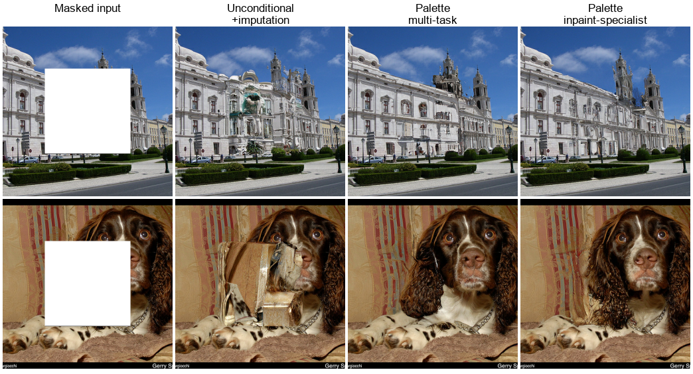
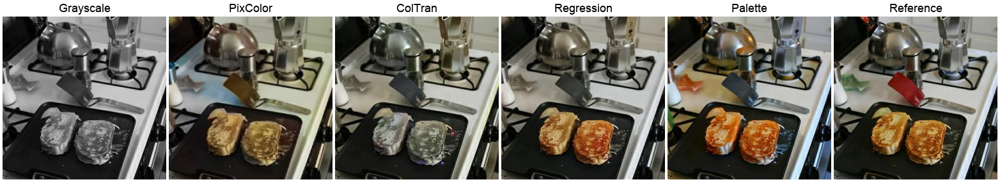

## 一句话定位
Palette 是 Google Brain 提出的**首个统一条件扩散框架**，用**同一套架构、同一套超参、同一个 L2 去噪目标**（无任务专属定制、无辅助损失）同时拿下 colorization / inpainting / uncropping / JPEG restoration 四类图像到图像任务，全面击败强 GAN 与回归基线——例如着色 FID-5K 从 ColTran 的 19.37 降到 **15.78**、人评 fool rate 逼近理想值 50%（达 **47.8%**），inpainting / uncropping 上对 Co-ModGAN / Boundless 大幅领先。它把扩散模型确立为通用图像编辑/复原引擎。

## 背景与定位
图像处理的大量任务（超分、着色、inpainting、去压缩伪影、深度/分割等）都可统一为 **image-to-image translation**：给定输入 x 学习输出 y 的条件分布 p(y|x)，而这些都是**多解逆问题**（一张灰度图对应多种合理着色）。在 Palette 之前，这一领域由 GAN（[[pix2pix]] 系）主导——能出高保真结果但训练不稳、易 mode collapse、缺多样性，且每个任务都要专属架构、辅助损失（边缘/上下文/结构约束）和方法特定数据集。

扩散模型当时刚在多个方向证明实力：[[ddpm]] 奠定去噪扩散框架，[[improved-ddpm]]、[[diffusion-models-beat-gans]]（Dhariwal & Nichol）在 class-conditional ImageNet 上 FID 超越 GAN，SR3（Saharia et al. 2021，Image Super-Resolution via Iterative Refinement）在人脸超分上压过 GAN，WaveGrad 在语音上达 SOTA 自回归水平。但当时尚无人验证扩散是否能像 GAN 一样**通用**地处理一整套图像编辑任务。

Palette 的定位正是回答这个问题：它**不是新方法**，而是用最朴素的条件扩散实现（源图 concat 进 U-Net）在四个互不相同的任务上做严格对照实验，证明"扩散模型 = 通用图像翻译引擎"。同期相关工作中，SDEdit（[[sdedit]]）和 score-SDE 的 inpainting 走的是**改造无条件模型 + imputation**的路线，Palette 明确选择**直接训练条件模型 + 多任务训练**，并在论文里实验证明前者在 ImageNet 这种多样数据集上效果差（见多任务一节）。

## 模型架构

> 图源：Palette: Image-to-Image Diffusion Models (arXiv:2111.05826), Figure 9 — conditional vs. unconditional diffusion for inpainting，直观说明 Palette 的核心方法决策：直接训练条件模型（concat 源图进 U-Net）优于在无条件模型上做 imputation。注：原论文无独立的框架/pipeline 示意图（方法即"源图 concat 进标准 DDPM U-Net"），此图为最贴近方法本身的对比图。

- **Backbone：U-Net**，直接复用 [[diffusion-models-beat-gans]]（Dhariwal & Nichol 2021）的 **256×256 class-conditional U-Net**，仅做两处改动：
  1. **去掉 class-conditioning**（图像翻译任务不需要类别标签）；
  2. **源图像 x 通过通道维 concatenation 注入**（沿用 SR3 的条件方式）——即把条件图直接拼到带噪目标 ỹ 上送入网络，这是 Palette 唯一的"条件机制"，没有 cross-attention、没有额外 encoder。
- **输入输出**：所有任务统一为 **256×256 RGB**。着色不用 LAB/YCbCr 而坚持 RGB 以保持跨任务通用性（论文称 YCbCr 与 RGB 效果相当）。
- **参数量**：架构消融表（Table 5）给出 **Global Self-Attention 配置约 552M 参数**；全卷积替代方案 603M–624M。
- **Self-attention 的重要性（关键架构结论）**：U-Net 在 32×32 / 16×16 / 8×8 分辨率放置 **global self-attention**。论文做了四种替代消融（global / local self-attention / 更多 ResNet 块 / 空洞卷积）以换取对未见分辨率的泛化。结论：**global self-attention 显著优于全卷积方案**（即使后者参数多 15%），且**local self-attention 反而比全卷积更差**。说明对 inpainting 这类需要全局依赖的任务，全局自注意力不可替代——这是论文核心架构发现之一。
- **无 VAE / 无 latent / 无 text encoder**：Palette 是**像素空间扩散**，不走 latent（区别于同期 [[latent-diffusion-ldm]]），也无文本条件，纯图像条件。

## 数据
- **训练数据集**：标准公开数据集，**未训练于私有大规模数据**。
  - 着色 / uncropping / JPEG restoration 等主要在 **ImageNet** [Deng et al. 2009] 上训练评测。
  - Inpainting 训练两个版本：**Palette(I)** 仅 ImageNet；**Palette(I+P)** 为 ImageNet + **Places2** [Zhou et al. 2017] 均匀混采。论文发现 Palette(I) 在 ImageNet 上反而略优于 Palette(I+P)，即加 Places2 增广在 ImageNet 评测上无增益。
  - **规模/配比/清洗/re-captioning：不适用 / 未披露**——Palette 用现成数据集，无自建数据管线、无合成数据、无美学/安全过滤这类近代 T2I 大模型的工序（2021 年的复原任务范式）。
- **任务数据构造（条件对的生成方式）**：
  - **着色**：源图取灰度，目标预测全 RGB；训练时随机取最大正方形 crop 后 resize 到 256。
  - **Inpainting**：free-form mask（用 DeepFillv2/Yu et al. 2019 的 Algorithm 1）+ 矩形 mask 混合，60% 概率 free-form、40% 矩形；矩形 mask 1–5 个、覆盖 10%–40% 面积。**不传二值 mask 通道**——直接把被遮区填标准高斯噪声（与扩散兼容），损失只在被遮区计算以加速训练。
  - **Uncropping**：沿单方向或四方向外扩，被遮区恒为图像的 **50%**，训练时均匀选择"单边/四边"及具体边。
  - **JPEG restoration**：在 quality factor **(5, 30)** 区间训练，因低 QF 更难，按 **指数分布 ∝ e^(−Q/10)** 采样 QF（偏向低质量/高难度）；难度推到 **QF 低至 5**（severe artifacts），远超此前 GAN 工作通常 QF≥10 的限制。

## 训练方法
- **训练目标：标准去噪扩散 L_simple（ε-prediction）**，即 [[ddpm]] 的预测噪声目标。给定 ỹ = √γ·y₀ + √(1−γ)·ε，网络 f_θ(x, ỹ, γ) 预测 ε，损失为 ‖f_θ − ε‖_p。**无 flow matching、无 rectified flow、无蒸馏/consistency**——纯 1000 步迭代采样（2021 范式）。
- **L1 vs L2 的关键消融**：论文系统对比去噪范数 p=1 与 p=2。结论：**两者 FID/感知质量相当，但 L2 样本多样性显著更高**（更低 pairwise MS-SSIM、更高 LPIPS：inpainting L1 LPIPS 0.11 → L2 0.13；着色 0.09 → 0.15）。L1 更"保守"、易 drop modes（PD 略低，因易落在含 ground-truth 的那个 mode）。前作 SR3/WaveGrad 偏好 L1，Palette 反向选 **L2 以更忠实地捕获输出分布**——这是论文给后续工作的重要经验。
- **多阶段 / 偏好对齐：无**。Palette 是单阶段从头训练，**没有 SFT / RLHF / DPO / reward model**（这些是后来 T2I 大模型的范式，2021 年尚未出现）。
- **多任务训练**：训一个 **generalist Palette**（同时学 JPEG restoration + inpainting + colorization）。结论（Table 7）：generalist **超过专用 JPEG specialist**（QF=5：8.3 → 7.0 FID），在 inpainting / colorization 上略逊于对应专用模型但差距很小，且论文预期延长训练可拉平。这是首次展示"单个扩散模型多任务复原"的可行性。
- **关键超参（Appendix B）**：
  - mini-batch **1024**，训练 **1M steps**（未见过拟合，直接取 1M 步 checkpoint）。
  - **Adam**，固定 LR **1e-4**，**10k 步线性 warmup**；**EMA 0.9999**。
  - **α-conditioning**（沿 WaveGrad/SR3）使推理期可调噪声调度与步数。
  - 训练噪声调度：linear (1e-6, 0.01)，**2000 timesteps**；推理：**1000 refinement steps**，linear (1e-4, 0.09)。
  - **无任务专属超参调整、无架构改动**——这是论文反复强调的"通用性"卖点。

## Infra（训练 / 推理工程）
- **硬件平台：Google TPU**（Brain 团队，JAX 生态）。具体训练用多少 TPU、总 GPU/TPU·时**未在论文披露**。
- **推理速度**：1000 张测试图，**TPUv4 上约 0.8 秒/图**；论文坦承采样比 GAN 慢（1000 步迭代），且模型加载 + 初次 JIT 编译有较大开销。**无步数蒸馏 / LCM / consistency / 量化等加速**（2021 年这些技术尚未普及）。
- **架构消融的训练规模**：Table 5 的 4 种架构配置各训 **500K steps、batch size 512**。
- **部署形态**：研究原型，发布了 model outputs、inpainting masks 与评测数据用于 benchmark（bit.ly/eval-pix2pix）；论文致谢提到准备代码与 checkpoint 公开发布，但**官方未维护独立 GitHub/HF 仓库**（社区有复现实现，非一手源）。

## 评测 benchmark（把效果讲清楚）

> 图源：Palette: Image-to-Image Diffusion Models (arXiv:2111.05826), Figure 3 — ImageNet 着色定性对比（灰度输入 → PixColor / ColTran / 回归基线 / Palette / 原图），对应 Table 1 中 Palette FID-5K 15.78、fool rate 47.8% 的 SOTA 结果。

Palette 倡导**统一评测协议**：基于 ImageNet（用 [Larsson 2016] 的 **ctest10k** 子集）+ 自建类别平衡的 Places2 子集 **places10k**；指标用 **FID、Inception Score(IS)、ResNet-50 Top-1 分类准确率(CA)、感知距离(PD, Inception-v1 特征欧氏距离)**，外加 **2AFC 人评 fool rate**；多样性用 **pairwise MS-SSIM 与 LPIPS**。刻意**避开 PSNR/SSIM**（对需"幻想"细节的任务会偏好模糊回归输出）。下列数字全部来自已落盘 PDF（Table 1–7）。

**着色（ImageNet val，Table 1）** — FID-5K↓ / fool rate↑：
| 模型 | FID-5K↓ | fool rate↑ |
|---|---|---|
| pix2pix | 24.41 | —（未报告） |
| PixColor | 24.32 | 29.90% |
| ColTran | 19.37 | 36.55% |
| Regression (本文强基线) | 17.89 | 39.45% |
| **Palette** | **15.78** | **47.80%** |
| Original images | 14.68 | — |
- Palette 着色立 SOTA，fool rate 较 ColTran **提升 10%+**、逼近理想 50%；FID 已非常接近原图。ctest10k 上 Palette(L2) FID-10K **3.4**（GT 2.7）。值得注意：**本文的纯回归基线（FID 17.89）也超过所有此前专用方法**，凸显现代架构 + 大规模训练的威力。

**Inpainting（ImageNet / Places2，Table 2）** FID↓：
| 配置 | DeepFillv2 | HiFill | Co-ModGAN | **Palette** | GT |
|---|---|---|---|---|---|
| 20–30% free-form (ImageNet) | 9.4 | 12.4 | —（ImageNet 未报告） | **5.2** | 5.1 |
| 128×128 center (ImageNet) | 18.0 | 20.1 | —（ImageNet 未报告） | **6.6** | 5.1 |
| 20–30% free-form (Places2) | 13.5 | 15.7 | 12.4 | **11.7** | 11.4 |
- Palette 在所有 mask 配置上大幅领先；20–30% free-form 的 FID（5.2）几乎贴平原图（5.1）。注意 Co-ModGAN 在 ImageNet 上未报告 FID（论文表 2 仅给其 Places2 上 20–30% free-form FID=12.4 / 128×128 center FID=13.7）；HiFill/Co-ModGAN 评测时获得 4× 更大上下文（512 crop）仍被超越。

**Uncropping（Table 3，50% 外扩）** FID↓ / fool rate↑：
| 模型 | ImageNet FID↓ | Places2 FID↓ | fool rate |
|---|---|---|---|
| Boundless | 18.7 | 11.8 | 25% |
| InfinityGAN | — | — | 15% |
| **Palette** | **5.8** | **3.53** | **40%** |
| Original | 2.7 | 2.1 | — |
- 大幅压过 GAN 基线；并能**重复 8 次左右外扩拼出 256×2304 全景**而不崩，展现稳健性。

**JPEG restoration（ImageNet，Table 4）** FID-5K↓：
| QF | Regression | **Palette** |
|---|---|---|
| 5 | 29.0 | **8.3** |
| 10 | 18.0 | **5.4** |
| 20 | 11.5 | **4.3** |
- QF 越低（越难），Palette 对回归基线的领先越大；回归输出模糊，Palette 出锐利细节。

**架构消融（Table 5，inpainting）**：Global Self-Attention（552M）FID **7.4** vs 全卷积（624M）FID 8.0 / 空洞卷积（603M）8.1 / local self-attention（552M）9.4——**全局自注意力最优**。

**多任务（Table 7）**：generalist Palette 在 JPEG(QF=5) FID **7.0** 优于专用模型 8.3；inpainting 6.8 vs 专用 6.6、着色 3.7 vs 专用 3.4，仅微小退化。

## 创新点与影响
**核心贡献**：
1. **首个统一条件扩散框架**覆盖 colorization / inpainting / uncropping / JPEG restoration，证明同一朴素实现（源图 concat + L2 去噪）**无需任何任务专属定制即全面超越强 GAN 与回归基线**——把扩散从"特定任务能打"提升为"通用图像翻译/复原引擎"。
2. **关键经验性发现**：(a) 去噪损失 **L2 比 L1 多样性显著更好**（修正了 SR3/WaveGrad 偏好 L1 的认知）；(b) U-Net 中 **global self-attention 不可替代**，全卷积与 local attention 都更差。
3. **单一 generalist 多任务扩散模型**可与专用模型持平甚至更优，开启多任务扩散方向。
4. **标准化评测协议**（ImageNet ctest10k + Places2 places10k + FID/IS/CA/PD + 2AFC fool rate，弃 PSNR/SSIM），并发布模型输出与 mask 供后续对照。

**影响**：Palette 与 SR3、CDM（[[cascaded-diffusion-models]]）同属 Google Brain 这条"扩散做图像生成/复原"主线，其作者团队（Saharia、Ho、Salimans、Fleet、Norouzi 等）随后主导了 [[imagen]]。"把条件图 concat 进 U-Net 直接训练条件扩散"成为 inpainting/编辑的标准做法之一，影响了后续 Stable Diffusion inpainting、ControlNet 之前的条件注入思路，并把"扩散 = 通用图像编辑后端"的认知固化下来。

**已知局限（论文自述）**：采样慢（1000 步、TPUv4 0.8s/图，远慢于 GAN，且无蒸馏加速）；像素空间 256×256、未做高分辨率/latent；未与显式鼓励多样性的 GAN 直接比多样性；多任务模型在部分任务上仍微逊专用模型；未含文本条件（非 T2I）。

## 原始链接
- paper (arXiv abs): https://arxiv.org/abs/2111.05826
- paper (PDF): https://arxiv.org/pdf/2111.05826
- project page（已落盘此页）: https://iterative-refinement.github.io/palette/
- project page（论文 abstract 给出的另一镜像）: https://diffusion-palette.github.io/
- 评测数据/输出发布（论文给出）: https://bit.ly/eval-pix2pix
- 注：Google 官方未维护独立 GitHub/HF model 仓库；社区有第三方复现（非一手源，未采纳）。

## 一手源存档（sources/）
- [arxiv-2111.05826.pdf](https://arxiv.org/pdf/2111.05826)  （arXiv 原文 PDF，不入 git）
- [project-page.html](https://github.com/zhao9797/ai-research/blob/main/sources/omni/2021/palette-image-to-image-diffusion--project-page.html)
