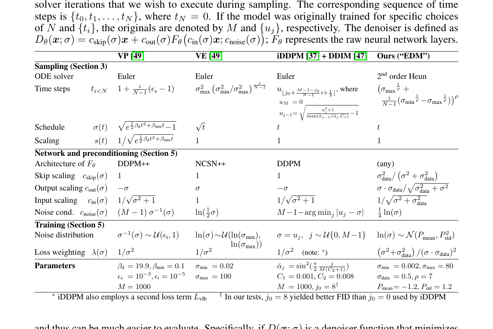
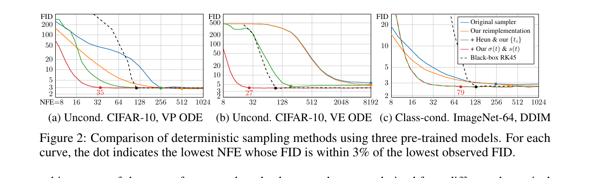

## 一句话定位

EDM（Karras 等，NVIDIA，NeurIPS 2022）把扩散模型从"理论缠绕的一整块"解耦成**采样、训练、预处理三组可独立调的设计模块**，给出最优噪声调度 `σ_i = (σ_max^{1/ρ} + i/(N-1)·(σ_min^{1/ρ}-σ_max^{1/ρ}))^ρ`（ρ=7）、二阶 Heun ODE 采样器与基于"单位方差"原则推导的预处理系数；在 CIFAR-10 仅用 **35 次网络评估（NFE）** 刷到 class-conditional FID **1.79** / unconditional **1.97**，并把别人预训练的 ImageNet-64 模型仅换采样器就从 FID 2.07 提到 1.55、重训后到 **1.36** 新 SOTA。它是后续几乎所有现代扩散训练配方（[[consistency-models]]、Karras EDM2、Stable Diffusion 3 等）的基石。

## 背景与定位

- **解决什么问题**：当时扩散模型（[[ddpm]]、[[score-sde]] 的 VP/VE SDE、[[improved-ddpm]] iDDPM、[[ddim]]）的采样调度、训练动态、噪声参数化都直接绑死在各自的理论框架（SDE / 离散马尔可夫链）上，组件之间隐式耦合——"改一个就崩全套"，阻碍了对设计空间的针对性探索。
- **核心洞见**：作者主张从**实践视角**重写这套理论，只关注训练/采样阶段真正出现的"可触摸对象与算法"（去噪器 D、噪声调度 σ(t)、缩放 s(t)、时间步 {t_i}、预处理 c_*），把它们整理成一张 **Table 1** —— VP / VE / iDDPM+DDIM / EDM 四种方法在同一张表里逐格对照。在这个框架里**组件之间没有隐式依赖**，任意（合理的）组合都能得到能工作的模型。
- **技术脉络中的位置**：建立在 [[score-sde]]（Song 等的 probability flow ODE/SDE 统一视角）与 denoising score matching（Vincent 2011）之上；继承 [[ddim]] 的 σ(t)=t、s(t)=1 选择；架构沿用 [[ddpm]] 的 DDPM++、[[ncsnv2]] 系的 NCSN++ 以及 [[diffusion-models-beat-gans]] 的 ADM。它**不提出新架构**，而是证明"采样过程与模型如何训练正交"——可作为 drop-in 替换插入已有模型。与 [[dpm-solver]]（同期、走多步 ODE 求解器路线）并列为 2022 年扩散加速采样两大代表，但 EDM 更强调整个设计空间的解耦与最优配方。

## 模型架构

> 图源：Karras et al., "Elucidating the Design Space of Diffusion-Based Generative Models" (NeurIPS 2022), Table 1 — https://arxiv.org/abs/2206.00364

EDM 本身不发明 backbone，而是复用三种现成 U-Net 类去噪网络 F_θ，并统一套上预处理外壳（Table 1 / Table 8）：

- **三种 backbone**（均为带 self-attention 的 U-Net）：
  - **DDPM++**（VP 配置）：Box 重采样滤波、Positional 噪声嵌入、每分辨率 4 个残差块、注意力在 16×16、1 个注意力头。
  - **NCSN++**（VE 配置）：Bilinear 重采样、Fourier 噪声嵌入、encoder 用 residual skip、其余同 DDPM++。
  - **ADM**（ImageNet-64，沿用 [[diffusion-models-beat-gans]] 原样不改）：Box 重采样、Positional 嵌入、每分辨率 3 残差块、注意力在 {32,16,8}、注意力头 6-9-12、encoder 9 + decoder 13 个注意力块。
- **统一的去噪器外壳（预处理）**：核心架构创新是把"原始网络 F_θ"和"去噪器 D_θ"解耦，写成
  `D_θ(x;σ) = c_skip(σ)·x + c_out(σ)·F_θ(c_in(σ)·x ; c_noise(σ))`
  其中 σ-相关的 skip 连接让网络可以自适应在"预测干净信号 y"和"预测噪声 n"之间插值——大 σ 时偏向直接预测 D(x;σ)（避免预测 n 时误差被放大 σ 倍），小 σ 时偏向 skip。
- **预处理系数（从单位方差/最小误差放大原则推导，非拍脑袋）**，σ_data=0.5：
  - `c_skip(σ) = σ_data² / (σ² + σ_data²)`
  - `c_out(σ) = σ·σ_data / √(σ² + σ_data²)`
  - `c_in(σ) = 1 / √(σ² + σ_data²)`（让网络输入恒为单位方差）
  - `c_noise(σ) = ¼·ln(σ)`（经验选取）
  cin/cout 由"输入与训练目标都为单位方差"导出，cskip 由"尽量少放大 F_θ 的误差"导出。
- **容量重分配（config C）**：相对 Song 等原模型，**砍掉 4×4 最低分辨率层**（主要贡献过拟合）、**把 16×16 层容量翻倍**（对质量关键）。具体：32×32 模型约 **56M 参数**，64×64 模型约 **62M 参数**——比原 baseline 略少。通道数从"64×64:128 / 32×32:128 / 16×16,8×8,4×4:256"改为"64×64:128 / 32×32,16×16,8×8:256"。
- **分辨率策略**：CIFAR-10 在 32×32、FFHQ/AFHQv2/ImageNet 在 64×64 直接像素空间训练（非 latent）。高分辨率被明确列为未来工作（建议配 super-resolution / latent 等正交扩展，如 [[latent-diffusion-ldm]]）。

## 数据

EDM 是方法论文，用标准学术数据集，无大规模图文对：

- **CIFAR-10**（32×32，50k 训练图，class-conditional 与 unconditional 两种）。
- **FFHQ**（人脸，下采样到 64×64，unconditional）。
- **AFHQv2**（动物脸，64×64，unconditional）。
- **ImageNet**（class-conditional 64×64，center-crop）。
- **数据增强（非泄漏 / non-leaking augmentation）**：从 GAN 文献（StyleGAN2-ADA，Karras 2020）借来的几何增强管线（缩放、各向异性缩放、平移、x-flip 等），在加噪**之前**对训练图施加；关键 trick 是**把增强参数 a 作为条件喂给 F_θ**，推理时令 a=0，保证生成图只来自未增强分布、增强不"泄漏"到输出。x-flip 用 100% 概率执行（而非数据集层面随机翻转），既得增益又不会让文字/logo 镜像。CIFAR-10 增强概率 12%、FFHQ 15%、AFHQv2 等见 Table 7。ImageNet-64 因数据量大、未见过拟合，**未用增强**。
- 无 re-captioning、无合成数据、无美学/安全过滤（学术 benchmark 数据集，与文生图产品无关）。

## 训练方法

- **训练目标**：denoising score matching 的加权 L2 去噪损失
  `E_{σ,y,n}[ λ(σ)·‖D(y+n;σ) - y‖² ]`，σ~p_train，n~N(0,σ²I)。等价地对原始网络 F_θ 的有效目标见论文 Eq.8。
- **噪声采样分布 p_train（config E 关键创新）**：训练时 σ 采用 **对数正态分布** `ln(σ) ~ N(P_mean, P_std²)`，**P_mean = -1.2，P_std = 1.2**。动机来自观察 per-σ 损失曲线：极低噪声"难且无意义"、极高噪声"目标恒等于数据均值"，**只有中等噪声有可学习的信号**，于是把训练算力集中到中段。这取代了 VP 的均匀 σ⁻¹ 或 VE 的均匀 ln(σ)。
- **损失加权 λ(σ)（config E）**：设 `λ(σ) = 1/c_out(σ)²`，使预处理后每个 σ 的**有效损失权重 λ·c_out² 被均衡为常数**，从而初始训练损失在整个 σ 区间齐平。
- **多阶段消融配方（Table 2，config A→F 逐步加料）**：
  - A 基线（Song 等原设置）→ B 调超参（4→8 GPU、batch 128→512、关梯度裁剪、lr 0.0002→0.001 带 ramp-up、EMA 半衰期标准化）→ C 容量重分配 → D 换 EDM 预处理（本身几乎不改 FID，但让训练更稳健）→ E 换 EDM 的 p_train + λ（**FID 大幅跳水**，是质量主要来源）→ F 加非泄漏增强（再降一截，拿到 CIFAR-10 SOTA）。
- **采样侧两种采样器**（与训练正交，可 drop-in 任意已有模型）：
  - **确定性 Heun 二阶 ODE 采样器（Algorithm 1）**：用改进 Euler（梯形法）做二阶校正，局部误差 O(h³)，每步多 1 次 D_θ 评估；σ→0 时退回 Euler 避免除零。配最优时间步 Eq.5（ρ=7）。CIFAR-10 仅需 **18 步 = NFE 35**。
  - **随机采样器（Algorithm 2）**：在二阶 ODE 上叠加 Langevin 式 "churn"——每步先把噪声从 t_i 抬到 t̂_i=t_i+γ_i·t_i 再回解 ODE，γ_i = S_churn/N（仅在 σ∈[S_tmin, S_tmax] 区间启用以避免颜色过饱和），并把 S_noise 略设 >1 抵消 L2 去噪器"回归均值、去噪过度"导致的细节流失。最优 {S_churn,S_tmin,S_tmax,S_noise} 需逐数据集 grid search。
- **关键发现**：随机采样的价值随模型变强而**递减**——EDM 训好的 CIFAR-10 模型上，任何随机性都有害（确定性最佳）；但更难/更多样的 ImageNet-64 上随机采样仍有用（最优 S_churn 比预训练模型时低很多）。
- **关键超参（Table 7）**：
  - CIFAR-10：4 GPU、200 Mimg(≈40 万步)、batch 128、lr 2e-4、LR ramp-up 0.64 Mimg、EMA 半衰期 0.89/0.9 Mimg、dropout 13%。
  - FFHQ/AFHQv2：4 GPU、200 Mimg、batch 128、lr 2e-4、dropout **5%（FFHQ）/ 25%（AFHQv2）**、增强概率 15%。
  - ImageNet-64：32 GPU、**2500 Mimg**、batch **4096**、lr 1e-4、LR ramp-up 10 Mimg、**EMA 半衰期 50 Mimg**、dropout 10%、用 FP16。
  - 通用：去掉梯度裁剪、用 EMA、按数据集 1% 步长 grid search dropout。

## Infra（训练 / 推理工程）

- **硬件**：全部用 NVIDIA V100 与 A100 开发测试。CIFAR-10 32×32 训练约 **2 天 / 8×V100**；FFHQ & AFHQv2 64×64 约 **4 天 / 8×V100**；ImageNet-64 用 **32×A100（4 台 DGX A100，每台 8×80GB）约 13 天**。
- **混合精度**：仅 ImageNet-64 用 FP16；CIFAR/FFHQ/AFHQv2 用 FP32。
- **分布式**：torchrun 多卡 + 多节点；默认 batch 512 平分到 8 卡（64/卡），显存不够时用 `--batch-gpu` 走梯度累积得到等价结果。
- **总能耗**：论文 Societal impact 自报整个项目在自建 V100 集群上消耗 **约 250 MWh** 电力。
- **推理加速（本工作的核心卖点之一）**：靠采样器改进把 NFE 大幅压缩——VP **7.3×**、VE **300×**、DDIM **3.2×** 提速（同等 FID 下）。CIFAR-10 上单张 V100 可生成 **26.3 张高质量图/秒**。CIFAR-10 推理 NFE=35（18 步 Heun），FFHQ/AFHQv2 NFE=79（40 步），ImageNet-64 推荐随机采样 256 步（NFE=511，S_churn=40,S_min=0.05,S_max=50,S_noise=1.003）。
- **部署形态**：官方 PyTorch 参考实现（一次性 code drop，不接 PR），CC BY-NC-SA 4.0，提供 config A/F 预训练 pkl。注意它走的是**few-step ODE 求解器**路线，与蒸馏（[[consistency-models]]/progressive distillation）正交——EDM 不做步数蒸馏。

## 评测 benchmark（把效果讲清楚）

> 图源：Karras et al., "Elucidating the Design Space of Diffusion-Based Generative Models" (NeurIPS 2022), Figure 2（FID vs NFE，三个预训练模型的确定性采样器对比）— https://arxiv.org/abs/2206.00364

指标统一为 FID（5 万生成图 vs 全部真实图，每个数取 3 次最小值）。

**采样器改进（仅换采样器，不重训，Figure 2/4）**：

| 模型 | 原采样器 FID/NFE | EDM 确定性/随机采样器 |
| :-- | :-- | :-- |
| ImageNet-64（ADM 预训练，Dhariwal-Nichol） | 2.07 | **1.55**（仅换随机采样器，逼近当时 SOTA 1.48 cascaded、1.52 StyleGAN-XL） |
| Uncond. CIFAR-10 VP | — | NFE 降至原 1/7.3 |
| Uncond. CIFAR-10 VE | — | NFE 降至原 1/300 |

**训练改进（重训，config F，确定性采样器 NFE=35/79，Table 2）**：

| 数据集 / 设定 | EDM FID（VP / VE） | 此前记录 |
| :-- | :-- | :-- |
| CIFAR-10 conditional | **1.79 / 1.79** | 1.85（StyleGAN-XL，ref [45]） |
| CIFAR-10 unconditional | **1.97 / 1.98** | 2.10（LSGM，Vahdat 等 ref [53]） |
| FFHQ-64 unconditional | **2.39 / 2.53** | — |
| AFHQv2-64 unconditional | **1.96 / 2.16** | — |
| ImageNet-64 conditional（重训，ADM 架构 + config E，随机采样） | **1.36** | 1.48（cascaded diffusion） |

**消融关键结论**：
- config A→F 逐项增益：**E（新 p_train + λ）是 FID 跳水的主因**（如 CIFAR-10 cond VP 从 config D 的 2.09 降到 config E 的 1.88），F（增强）再压到 1.79。D（预处理）单独几乎不改 FID（除 VE 在 64×64 大幅改善），其价值在于**让训练更稳健**从而能安全改损失。
- ρ=7 的时间步调度近似最优（ρ=3 理论上均衡截断误差，但 5–10 实测更好，说明小 σ 附近误差影响大）。
- σ(t)=t、s(t)=1 让 ODE 轨迹近似直线、曲率集中在窄 σ 段，是低 NFE 高质量的几何原因。
- 自适应 RK45 求解器成本超过收益，固定调度的二阶 Heun 更划算。
- ImageNet-64 重训未见过拟合，故未用增强。

（注：本工作早于 GenEval/T2I-CompBench/DPG-Bench/HPSv2 等文生图评测，亦无视频 VBench——这些在源中**未涉及**，因 EDM 是无条件/类条件像素扩散方法，不做文生图。）

## 创新点与影响

- **核心贡献**：①把扩散模型设计空间**解耦成正交模块**（采样调度/求解器/预处理/训练分布与加权各自可调）并制成对照表；②给出从第一性原理推导的预处理系数与"单位方差"训练目标；③对数正态噪声采样分布 p_train（P_mean=-1.2, P_std=1.2）与 λ=1/c_out²；④二阶 Heun + ρ=7 时间步的确定性采样器（35 NFE 出 SOTA）；⑤可调随机性的 churn 采样器并澄清"随机性的作用是纠正早期步误差，模型越强越不需要它"；⑥非泄漏几何增强用于扩散。
- **影响**：EDM 成为**现代扩散训练配方的事实标准**——σ_data 归一化、c_skip/c_out/c_in 预处理、lognormal σ 采样、Heun 采样器被后续工作（[[consistency-models]] 及其 EDM 参数化、Karras 等 2024 的 EDM2、Stable Diffusion 3 的部分设计、众多 latent diffusion 训练脚本）广泛沿用；"扩散=可解耦设计空间"的视角深刻改变了领域研究范式。EDM 的预训练模型与采样器至今是扩散 baseline 的常用起点。
- **已知局限**（论文自陈）：①很多超参在更高分辨率数据集上需重调；②随机采样器需逐模型 grid search {S_churn,S_tmin,S_tmax,S_noise}，且作者警告"用随机采样作为评判模型改进的主要手段，可能反过来扭曲架构/训练的设计选择"；③只在像素空间、≤64×64、无条件/类条件验证，未触及文生图与高分辨率（留作正交扩展）；④随机性与训练目标的精确相互作用仍是开放问题；⑤L2 去噪器的非保守向量场会导致细节流失/颜色过饱和，只能靠 S_noise>1、限制 churn σ 区间等启发式缓解。

## 原始链接

- arxiv_abs: https://arxiv.org/abs/2206.00364
- arxiv_pdf: https://arxiv.org/pdf/2206.00364
- github: https://github.com/NVlabs/edm
- 预训练模型（config A/F）: https://nvlabs-fi-cdn.nvidia.com/edm/pretrained/

## 本地落盘文件

- ../../../sources/omni/2022/arxiv-2206.00364.pdf （EDM 论文 v2，2022-10-11，已精读正文+附录 B.6/F.2/F.3 + Table 1/2/7/8）
- ../../../sources/omni/2022/edm-text.txt （上 PDF 的 pdftotext 全文，用于检索）
- ../../../sources/omni/2022/elucidating-edm--readme.md （NVlabs/edm 官方 README，含训练配置/GPU·时/采样器命令）
