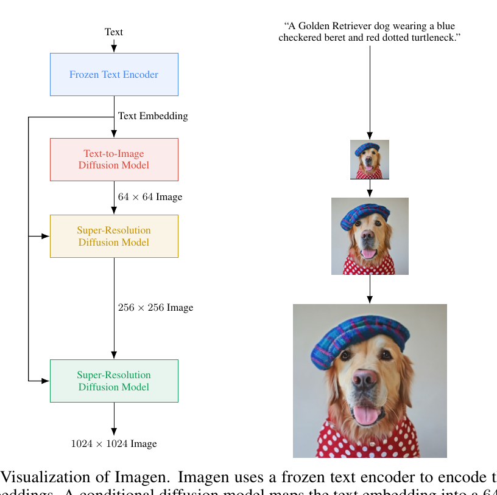
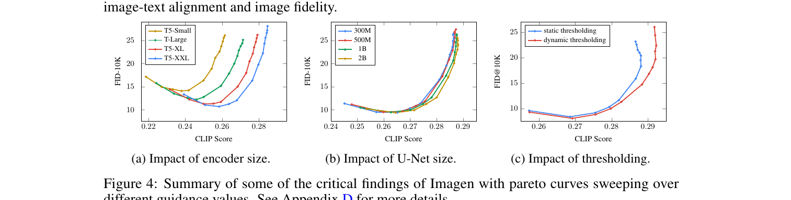

## 一句话定位
Imagen 是 Google 2022 年 5 月发布的级联**像素空间**文本到图像扩散模型，核心发现是：**用只在纯文本上预训练、且训练中冻结的大语言模型（T5-XXL）当文本编码器**，比放大图像 U-Net 更能提升保真度与图文对齐；零样本 COCO FID-30K 刷到 **7.27**（优于同期 DALL·E 2 的 10.39、GLIDE 的 12.24），并提出 **DrawBench** 人评基准，在与 DALL·E 2 / GLIDE / LDM / VQGAN+CLIP 的对比中人评全面胜出。

## 背景与定位
2022 上半年文本到图像有三条主线：自回归 VQ-Transformer（DALL·E、Make-A-Scene）、扩散（GLIDE、DALL·E 2），以及 GAN（XMC-GAN 等）。前置工作里文本编码器几乎都建立在**图文配对数据**上——要么从零训练（GLIDE、DALL·E），要么用 [[clip]] 这类图文对比预训练的编码器（DALL·E 2）。Imagen 反其道而行：直接借用 NLP 社区的通用大语言模型（[[t5]]），**只读纯文本语料预训练**、生成训练时**完全冻结**，发现其文本表征对图文合成出奇地有效，且"放大文本编码器"的边际收益远大于"放大扩散 U-Net"。

相对同期 [[dall-e-2]]，Imagen 在结构上更简单：DALL·E 2 需要先学一个把 CLIP 文本隐变量映射到 CLIP 图像隐变量的"diffusion prior"，Imagen 不需要任何隐空间 prior，直接文本嵌入 → 级联像素扩散，却在 COCO FID 与 DrawBench 人评上都更好。相对 [[glide]]，Imagen 同样用级联扩散，但把"小的从零训练文本编码器"换成"大的冻结预训练 LM"。技术上承接 [[ddpm]] / [[classifier-free-guidance]] / Ho 等人的级联扩散与噪声条件增强（cascaded diffusion + noise conditioning augmentation）。它与 [[latent-diffusion-ldm]] 的关键区别是：LDM 在 VAE 隐空间做扩散，Imagen 直接在像素空间做（64→256→1024 三级）。

## 模型架构

> 图源：Imagen 论文 Figure A.4 "Visualization of Imagen" (arXiv:2205.11487)

**整体管线**：文本 → 文本编码器 → 一个 64×64 base 扩散模型 → 64×64→256×256 超分扩散 → 256×256→1024×1024 超分扩散。三个扩散模型都条件于同一份文本嵌入序列，且都用 classifier-free guidance。

**文本编码器（核心）**：冻结的 **T5-XXL encoder**（论文给出 4.6B 参数，指 encoder 部分；完整 T5-XXL encoder+decoder 为 11B）。文本被映射成一串上下文嵌入序列，训练中不微调。论文同时实验了 BERT(base/large 至 340M)、T5(small→XXL)、CLIP(ViT-L/14) 作对照。

**条件注入**：
- base 64×64 U-Net：文本以两种方式注入——(1) 把文本嵌入做 attention-pooling 得到一个 pooled 向量，**加到 diffusion timestep 嵌入上**（类似类别条件）；(2) 在多个分辨率（论文配置 [32,16,8]）上对**整段文本嵌入序列做 cross-attention**。消融表明 cross-attention 序列条件显著优于 mean/attention pooling。
- 对文本嵌入在 attention/pooling 层加 **LayerNorm** 明显提升效果。
- cross-attention 的实现是把文本嵌入序列拼到每个 self-attention 层的 key-value 上。

**Efficient U-Net（超分模型新架构）**：为两个超分模型设计的 U-Net 变体，更简单、收敛更快、更省显存，采样快 2–3×。关键改动：
1. **参数从高分辨率块下移到低分辨率块**（低分辨率块通道多，加更多 residual block 提容量而不爆显存；低分辨率用到 8 个 residual block，常规 U-Net 只用 2–3 个）；
2. 当低分辨率用大量 residual block 时，把 skip connection 按 1/√2 缩放，显著加快收敛；
3. **反转下/上采样与卷积的顺序**（下采样块里把降采样放在卷积前、上采样块里把升采样放在卷积后），明显加快前向、无性能损失。

**参数量与分辨率策略**（默认配置）：base 64×64 模型 **2B** 参数；64→256 超分 **600M**；256→1024 超分 **400M**。256→1024 超分**移除 self-attention**、只保留文本 cross-attention（论文称 cross-attention 对超分至关重要），并在 64→256 的随机裁剪 crop 上训练以省算力。base 用 cosine 噪声调度、连续时间 t∼U(0,1)；最高分辨率超分用 1000 步线性噪声调度（start/end = 1e-4/0.02）。

## 数据
- 训练数据为**图文配对**：内部数据集约 **460M** image-text pairs ＋ 公开 **LAION**（[[laion]]）约 **400M** image-text pairs，合计约 **860M** 对。
- **未在 COCO 上训练**，COCO 仅作零样本评测。
- 文本编码器侧：T5 在 ~800GB 的纯文本 C4 语料上以去噪目标预训练（BERT 约 20GB Wikipedia+BooksCorpus；CLIP 在图文对比语料上）——这些都是**冻结复用**，Imagen 不重新训练它们。
- 数据清洗/过滤/re-captioning：论文坦言训练数据"largely uncurated, web-scraped"，并在 §6 讨论了数据集偏见（社会刻板印象、少数群体贬损联想、人物/肤色偏差）；**未披露**具体美学过滤、NSFW 过滤或合成 caption（re-captioning）流程——这是该工作明确的局限。无合成数据相关披露。

## 训练方法
- **目标**：标准扩散去噪目标（公式 1），预测 x̂θ(αt·x + σt·ε, c) 对 x 的加权平方误差；连续时间 t∼U(0,1)、cosine（base/中超分）或线性（顶超分）噪声调度。
- **Classifier-free guidance**：三个模型都以 **10% 概率丢弃文本条件**做无条件联合训练，采样时用 ε̃ = w·ε(zt,c) + (1−w)·ε(zt)。Imagen 关键依赖 CFG，且用**比前作大得多的 guidance 权重**。
- **Dynamic thresholding（动态阈值，本文新方法）**：高 guidance 权重会让 x-prediction 超出训练数据范围 [−1,1]，造成 train-test mismatch、图像过饱和甚至发散。静态阈值（clip 到 [−1,1]）只能部分缓解。动态阈值：每步取 x̂t0 绝对像素值的某个百分位 s（论文用 p=99.5），若 s>1 则把 x̂t0 截到 [−s,s] 再除以 s，把饱和像素往内推。消融显示动态阈值在大 guidance 下显著提升真实感与对齐。
- **Noise conditioning augmentation（噪声条件增强）**：两个超分模型训练时对低分辨率条件图加随机强度（aug_level∈[0,1]）的高斯噪声并把 aug_level 作为条件；推理时扫不同 aug_level 选最佳（实践常用 0.1–0.3）。让超分对低分辨率图的伪影更鲁棒、并增强对文本的依赖。
- **优化器**：base 64×64 用 **Adafactor**（与 Adam 性能相近但省显存）；两个超分用 **Adam**（Adafactor 在超分上掉点）。学习率 1e-4，10000 步 warmup + cosine decay。
- **训练规模**：所有模型 **batch size 2048、2.5M steps**；论文称未观察到过拟合，认为再训可能更好。
- **蒸馏/步数加速**：本文**未做**步数蒸馏/一致性蒸馏（progressive distillation / consistency 等不在本工作范围）。

## Infra（训练 / 推理工程）
- 硬件：base 64×64 用 **256 块 TPU-v4**；两个超分各用 **128 块 TPU-v4**。
- 因文本编码器冻结，**文本嵌入可离线预计算并缓存**，训练时无需反传到编码器，省算力且让"放大文本编码器"几乎免费。
- 推理：纯像素空间三级级联采样，用 ancestral sampler / DDIM；Efficient U-Net 在超分上采样快 2–3×（steps/second）。
- 具体 GPU·小时、并行/分布式策略、混合精度、吞吐等工程数字论文**未披露**。
- 部署：Google **未开源代码、未放公开 demo**（§6 出于责任化考量明确说明）。

## 评测 benchmark（把效果讲清楚）

> 图源：Imagen 论文 Figure 4 "Summary of some of the critical findings of Imagen with pareto curves"（(a) 文本编码器规模 (b) U-Net 规模 (c) 动态阈值，arXiv:2205.11487）

**COCO 256×256 FID-30K（Imagen 用 guidance：base=1.35，超分=8.0）**。论文 Table 1 分两块：上块是**在 COCO 上训练**的模型，下块是**零样本**：

零样本（zero-shot FID-30K）：

| 模型 | FID-30K |
|---|---|
| **Imagen（zero-shot）** | **7.27** |
| DALL·E 2（zero-shot） | 10.39 |
| GLIDE（zero-shot） | 12.24 |
| DALL·E（zero-shot） | 17.89 |
| LAFITE（zero-shot） | 26.94 |

在 COCO 上训练的对照（同表上块）：Make-A-Scene 7.55、LAFITE 8.12、XMC-GAN 9.33、DM-GAN+CL 20.79、DF-GAN 21.42、DM-GAN 32.64、AttnGAN 35.49。

Imagen 是**零样本**就拿到 7.27，甚至优于在 COCO 上**训练过**的最好模型 Make-A-Scene（7.55）。（注：LAFITE 在两块都出现——训练版 8.12、零样本版 26.94，勿混。）

**COCO 人评（与原始参考图对比）**：图文对齐（alignment）得分 91.4 vs 原图 91.9，**基本持平**；photorealism 偏好率 39.5%（满分对照 50%）；剔除含人物的 prompt 后真实感偏好率升到 43.9%，说明 **Imagen 生成真实人物的能力受限**。

**DrawBench（本文提出，~200 prompt，11 类：colors / counting / conflicting / DALL-E / description / Marcus et al. / misspellings / positional / rare words / Reddit / text）**：成对人评（每模型 8 张非精挑生成），Imagen 对 DALL·E 2、GLIDE、LDM、VQGAN+CLIP **在对齐与保真上均被显著偏好**（论文聚合全部类别/打分员，未在正文给单一总分百分比，细分见附录 E）。细分：Imagen vs DALL·E 2，**对齐在 11 类中 7 类领先、保真 11 类全胜**；Imagen vs GLIDE，对齐 8/11、保真 10/11 领先；Imagen 对 DALL·E 2 优势尤其大的类是 **Colors / Positional / Text / DALL-E / Descriptions**（论文 §E 原文列举）。

**关键消融结论**：
- **放大文本编码器 > 放大 U-Net**：T5 从 small 到 XXL，CLIP-FID Pareto 持续改善，且收益大于把 U-Net 从 300M 放到 2B。
- **T5-XXL vs CLIP**：在 COCO 的 CLIP/FID-10K 上两者接近（on-par），但 DrawBench 人评中 T5-XXL 在**全部 11 类**的图文对齐上都被更偏好——说明纯文本 LM 在复杂/组合 prompt 上强于图文对比编码器。（论文此项专门训了 64×64 **1B** 参数模型分别配 T5-XXL / CLIP 做对比，因 300M 模型在 DrawBench 难 prompt 上表现太弱。）
- **动态阈值关键**：大 guidance 下显著优于静态/无阈值。
- **噪声条件增强关键**：提升超分的 CLIP/FID，并支持更强文本条件。
- **文本条件方式关键**：cross-attention 序列条件 > mean/attention pooling。
- **Efficient U-Net 关键**：更省显存、收敛更快、采样更快、质量更好。

（注：本文未报告 GenEval / T2I-CompBench / DPG-Bench / HPSv2 / ImageReward / PickScore 等后来才流行的指标——2022 年这些基准尚未出现，源里"未报告"。）

## 创新点与影响
**核心贡献**：
1. 证明**纯文本预训练 + 冻结的大 LM（T5-XXL）做文本编码器**对 T2I 极其有效，且"放大文本编码器"比"放大扩散网络"更划算——把 NLP 大模型的语言理解迁移到了视觉生成。
2. 提出 **dynamic thresholding**，解锁更大 classifier-free guidance 权重而不过饱和。
3. 提出 **Efficient U-Net**，更省显存、收敛/采样更快。
4. 刷新零样本 COCO FID 到 **7.27**。
5. 提出 **DrawBench** 结构化人评基准，成为后续 T2I 工作的常用评测之一。

**影响**：确立了"冻结大文本编码器 + 级联像素扩散"这条与 LDM（隐空间扩散）并行的技术路线；"文本编码器规模 > 生成网络规模"的观察影响了后续众多 T2I 设计（如 [[ediff-i]] 同时用 T5+CLIP、[[deepfloyd-if]] 直接复刻了 Imagen 的 T5-XXL+像素级联思路并开源）；催生了 **Imagen Video**（视频）、**Imagen Editor / Imagen 2 / Imagen 3** 等 Imagen 家族产品。

**已知局限**：(1) 生成真实**人物/人脸**能力受限，剔除人物 prompt 后真实感偏好率明显提升；(2) 训练数据来自大规模未精筛网络图文，带有社会偏见与有害刻板印象风险——Google 据此决定**不开源、不放公开 demo**；(3) 纯像素空间三级级联，推理成本高于隐空间方法；(4) 复杂组合/计数类（conflicting / counting）prompt 仍难，"A horse riding an astronaut" 这类反常识 prompt 对齐仍弱。

## 原始链接
- arxiv_abs: https://arxiv.org/abs/2205.11487
- arxiv_pdf: https://arxiv.org/pdf/2205.11487
- project_page: https://imagen.research.google/
- DrawBench prompts（项目页给出）: https://docs.google.com/spreadsheets/d/1y7nAbmR4FREi6npB1u-Bo3GFdwdOPYJc617rBOxIRHY/edit

## 一手源存档（sources/）
- [arxiv-2205.11487.pdf](https://arxiv.org/pdf/2205.11487)  （arXiv 原文 PDF，不入 git）
- [project-page.md](https://github.com/zhao9797/ai-research/blob/main/sources/omni/2022/imagen--project-page.md)
