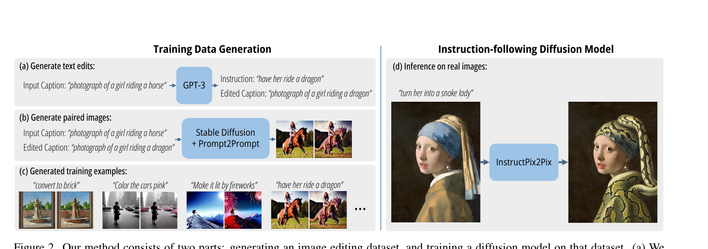
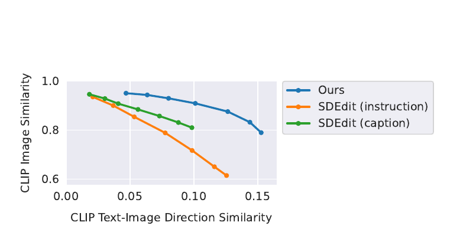

## 一句话定位
InstructPix2Pix 是首个**指令式（instruction-based）图像编辑**扩散模型：用户只需给一张图 + 一句自然语言指令（如 "Turn him into a cyborg"），模型在**单次前向传播**里直接完成编辑，**无需掩码、无需输入/输出图的完整描述、无需逐张图的反演或微调**。最关键创新是**训练数据全靠合成**——用微调后的 **GPT-3** 生成「编辑指令 + 改前/改后 caption」三元组（论文最终 **454,445** 条），再用 **Stable Diffusion + [[prompt-to-prompt]]** 把每对 caption 变成一致的改前/改后图像对（论文正文称 "over 450,000 training examples"；公开发布的 CLIP 过滤版为 **313,010** 对，详见数据节）；模型从 [[latent-diffusion-ldm]]（SD v1.5）微调而来，仅训练 10,000 步（8×A100 40GB，25.5 小时）。单张图编辑在 A100 上约 9 秒，开创了"对图片说人话就能改图"的范式（CVPR 2023 Highlight）。

## 背景与定位
2022 下半年，基于扩散模型的文本图像编辑方法已经不少，但在**交互范式**上都不够直观：

- **需要"完整描述"而非"指令"**：[[sdedit]]（SDEdit，整图加噪再去噪）、Text2Live、DiffusionCLIP 等都需要用户提供**目标图像的完整 caption**（"a photograph of a girl riding a dragon"），而不是**动作指令**（"have her ride a dragon"）。指令更精确、更省事，用户不必描述要保持不变的部分。
- **需要掩码 / 额外图**：Blended Diffusion、GLIDE inpainting 需要用户画掩码；DreamBooth / Textual Inversion 需要同一概念的多张参考图。
- **需要逐张图反演或微调**：Imagic、DiffusionCLIP 对每张待编辑图都要做一次反演或权重微调，单张图成本极高、速度慢。

InstructPix2Pix 的定位是把这些都去掉：**纯前馈、纯指令、单图**。它继承指令微调（instruction tuning，[[instructgpt]] 系一脉）在 NLP 上的思路——"教模型听人话"——把它迁移到图像编辑。技术上它站在三块基石上：[[latent-diffusion-ldm]]（潜空间扩散 / Stable Diffusion 作 backbone 与数据生成器）、[[prompt-to-prompt]]（Hertz 等，保证改前/改后两次生成在像素上高度一致，是合成配对数据的关键）、[[classifier-free-guidance]]（CFG，被作者推广成双条件版本）。它最大的方法学贡献其实在**数据生成**而非模型结构：用两个跨模态的预训练大模型（语言 GPT-3 + 图文 SD）"互相配合造监督信号"，解决了"指令-编辑配对数据天然不存在、无法规模化采集"的根本难题。

## 模型架构

> 图源：InstructPix2Pix: Learning to Follow Image Editing Instructions (arXiv:2211.09800) Figure 2

- **Backbone**：直接复用 **Stable Diffusion v1.5** 的 latent-diffusion U-Net（[[latent-diffusion-ldm]]），权重从 SD v1.5 的 **EMA checkpoint** 初始化。即在预训练 VAE（improved ft-MSE autoencoder）的潜空间里做扩散去噪。
- **VAE / tokenizer**：沿用 SD 的 KL-VAE（连续潜空间，下采样 8×），数据生成阶段用了 stabilityai 的 `vae-ft-mse-840000` 改进自编码器权重。
- **Text encoder**：复用 SD 原有的 **CLIP 文本编码器**——关键 trick 是**直接把"编辑指令"喂进原本为"caption"设计的文本条件通道**，不改文本编码机制，省去了重训文本编码器。
- **图像条件注入（核心改动）**：为支持"以输入图为条件"，作者在 U-Net **第一层卷积上额外加输入通道**，把噪声潜变量 `z_t` 与输入图编码 `E(c_I)` 在通道维**拼接（concat）**。所有可复用的权重从 SD 预训练 checkpoint 初始化，而**新增输入通道对应的权重初始化为零**（zero-init，保证训练初期等价于原 SD，稳定起步）。
- **双条件设计**：模型同时吃两路条件——输入图 `c_I` 与文本指令 `c_T`，学习 `P(z | c_I, c_T)`。这使得后面可以对两路条件各自做 CFG（见训练方法）。
- **分辨率策略**：训练在 **256×256**，但作者发现模型能**良好泛化到 512×512**（甚至论文图里有 768 分辨率结果），推理默认在 512 出图。
- **参数量**：本论文**未披露**具体参数量。结构上基本等同 SD v1.5 U-Net（业界公认约 8.6 亿参数，此数非本文报告）+ 第一层卷积少量新增输入通道，新增量级可忽略。

## 数据
这是本工作的灵魂。数据**完全合成**，分两阶段（论文 Sec 3.1）：

**阶段 1 — 文本三元组（GPT-3 生成）**
- 先**人工写 700 条**训练样本：每条是 (输入 caption, 编辑指令, 改后 caption) 三元组，覆盖尽量广的编辑类型（换物体、改背景、改季节/天气、换艺术媒介等）。输入 caption 从 **LAION-Aesthetics V2 6.5+** 采样（选它是因为内容多样、含专有名词与流行文化、媒介丰富——照片/油画/数字画都有；缺点是噪声大、caption 常冗长无意义，靠后续过滤 + CFG 缓解）。
- 用这 700 条**微调 GPT-3 Davinci，单 epoch，默认超参**。微调格式：输入 caption + 分隔符 `\n##\n`；输出 = 指令 + `\n%%\n` + 改后 caption + `\nEND`（停止符）。推理时 `temperature=0.7`、`frequency_penalty=0.1`，并**剔除改前=改后 caption 的样本**。
- 用微调后的 GPT-3 大规模生成，最终得到 **454,445** 条文本三元组（输入 caption 仍取自 LAION，去重 caption 与重复 URL）。

**阶段 2 — 图像对（Stable Diffusion + Prompt-to-Prompt）**
- 把每对（改前/改后）caption 用 SD v1.5（EMA + ft-MSE VAE，100 步 Euler-ancestral 采样，Karras 噪声调度）各生成一张图。
- **难点**：SD 对两个相近 prompt 也会产生差异巨大的图（"a cat" vs "a black cat" 可能是完全两只猫），不适合做编辑监督。**解法用 [[prompt-to-prompt]]**：在前 `p` 比例的去噪步里**共享/借用注意力权重**，让两次生成高度相似。本工作的实现细节：**对第二张图替换的是 self-attention 权重**（而非原 P2P 按编辑类型分情形替换 cross-attention），且对所有编辑统一用同一替换策略；改前/改后两张图**用完全相同的初始噪声与随机采样噪声**。
- **关键自适应**：不同编辑需要不同的"改动幅度"，`p` 难以从文本预判。所以**每对 caption 生成 100 个图像对**，每个对随机取 `p ~ U(0.1, 0.9)`，再用 **CLIP 过滤**择优。
- **CLIP 过滤三道阈值**（Appendix A.2）：image-image CLIP 相似度 ≥ **0.75**（防两图差太多）、image-caption CLIP ≥ **0.2**（图要对得上 caption）、**方向性 CLIP 相似度（directional CLIP similarity，Gal 等提出）≥ 0.2**（改前→改后在图像空间的变化方向要与 caption 变化方向一致）。通过全部过滤的对按方向性 CLIP 排序，**每对 caption 最多保留 4 个样本**。
- **过滤效果**（README/消融）：方向性 CLIP 过滤既提升图对的多样性与质量，也让数据生成对 P2P / SD 的失败更鲁棒。
- **最终数据集规模**（**公开发布版**，在论文 454,445 条文本三元组基础上**额外做了 NSFW 过滤**后剩 451,990 条；以下两版来自 README 的表，对应论文方法的 CLIP 过滤 / 随机两种采样）：
  - `clip-filtered-dataset`：**313,010** 个编辑样本，436 GB（CLIP 过滤版，对应论文训练所用的过滤策略；论文正文仅称 "over 450,000"，未给出过滤后的精确训练样本数，313,010 是 NSFW+CLIP 过滤后的发布数）
  - `random-sample-dataset`：451,990 个样本，727 GB（随机选、不做 CLIP 过滤）
  - 每个样本 = 输入图 + 编辑指令 + 输出图。

## 训练方法
- **训练目标**：标准**潜空间扩散去噪**（latent diffusion，ε-prediction）。学一个网络 `ε_θ(z_t, t, E(c_I), c_T)` 预测加到噪声潜变量上的噪声，最小化 L2 损失（论文 Eq.1）。不是 flow matching，不是 next-token，就是经典 DDPM/LDM 式 noise-prediction。
- **微调而非从头训**：援引 Wang 等（PITI）的结论——图像翻译任务中，**微调大型预训练扩散模型优于从头训练**（尤其配对数据有限时）。故从 SD v1.5 EMA 权重初始化，复用其文生图先验。
- **双条件 Classifier-Free Guidance（核心训练 trick）**：把 [[classifier-free-guidance]] 推广到**两路独立条件**。训练时随机丢条件：**5% 只丢图像条件**（`c_I=∅`）、**5% 只丢文本条件**（`c_T=∅`）、**5% 两个都丢**。这样模型同时学会对两路条件的有/无条件去噪。推理时引入两个独立 guidance scale **`s_I`（图像保真）与 `s_T`（指令强度）**，分数估计为三项叠加（论文 Eq.3）：
  - `ε̃ = ε(z_t,∅,∅) + s_I·[ε(z_t,c_I,∅) − ε(z_t,∅,∅)] + s_T·[ε(z_t,c_I,c_T) − ε(z_t,c_I,∅)]`
  - 直觉：`s_I` 把概率质量推向"忠于输入图"，`s_T` 推向"忠于指令"。作者推导了这一分解的概率含义（Appendix B），并指出顺序可换但此分解实测更好。
  - **推荐取值**：`s_T ∈ [5,10]`、`s_I ∈ [1,1.5]`（diffusers 默认 text CFG 7.5 / image CFG 1.5）；实践中逐样本微调两个 scale 取最佳平衡。
- **训练配置**（Appendix A.3）：训练 **10,000 步**，**8× NVIDIA A100 40GB**，**25.5 小时**；分辨率 **256×256**；**总 batch size 1024**；学习率 **1e-4（无 warmup）**；增强：随机水平翻转 + 随机裁剪（先缩放到 256~288 再裁到 256）；从 SD v1.5 EMA 初始化。
- **无 RL / 无偏好对齐 / 无蒸馏**：本工作没有 SFT 之外的对齐阶段，没有 reward model/DPO，没有步数蒸馏。作者在 Discussion 里把"human-in-the-loop RL 改进对齐"列为未来工作（彼时尚未做）。

## Infra（训练 / 推理工程）
- **训练算力**：8×A100 40GB × 25.5h ≈ **204 A100-小时**（极轻量，得益于"微调而非从头训"）。
- **数据生成算力**：远大于训练——每对 caption 跑 100 次 SD 生成（100 步采样）+ CLIP 过滤，整套 45 万对数据"造价数千美元"（README 原话 "cost thousands of dollars"，主要是 GPT-3 API + 海量 SD 推理）。单 GPU（V100/A100）按 partition 并行可扩展到上百卡。
- **推理形态**：**单次前向、无反演、无逐图微调**。默认 512 分辨率、**100 步 Euler-ancestral 采样**（Karras 噪声调度），单张图在 **A100 上约 9 秒**。VRAM 需求约 >18 GB（官方），diffusers 版做了优化、显存更省、可跑更小卡。
- **部署**：官方 GitHub（基于 CompVis/stable-diffusion 代码库）、HuggingFace Space（`timbrooks/instruct-pix2pix`）、Replicate API、Imaginairy（可在无 GPU 的 MacBook 上跑）、🧨 diffusers（`StableDiffusionInstructPix2PixPipeline`）。
- 未披露：吞吐细节、并行策略（数据生成显然是 embarrassingly parallel 的多 partition）、量化/缓存等推理加速（未做）。

## 评测 benchmark（把效果讲清楚）

> 图源：InstructPix2Pix: Learning to Follow Image Editing Instructions (arXiv:2211.09800) Figure 8（vs SDEdit 的图像一致性↔编辑方向性 trade-off 曲线）

本工作**未用 FID/GenEval/T2I-CompBench 等标准 benchmark 跑分**，主要靠两类 CLIP 指标的**折中曲线（trade-off）**与定性对比，外加消融。具体数字（来自论文 Fig.8/Fig.10 与正文）：

- **两个相互竞争的指标**：
  1. **CLIP image similarity**（输出图与输入图的 CLIP embedding 余弦相似度）= "改得有多保守、保不保得住原图"；
  2. **CLIP text-image direction similarity**（Gal 等的方向性指标）= "图像变化方向与文本变化方向有多一致"，即"改得对不对、听不听指令"。
  - 二者天然此消彼长：越大胆改图 → 与原图越不像。论文画的是这条 trade-off 曲线（X=方向性、Y=图像一致性，都越高越好）。
- **vs [[sdedit]]（主要定量对手）**：固定 text guidance=7.5，扫 `s_I ∈ [1.0, 2.2]`（SDEdit 则扫 denoising strength ∈ [0.3,0.9]）。**结论：在相同方向性相似度下，InstructPix2Pix 的图像一致性显著更高**——即同样"听懂指令"的前提下更能保住原图、不乱改无关区域（论文 Fig.8，无单点数值表，仅曲线整体占优）。
- **定性 vs SDEdit / Text2Live**（Fig.9）：SDEdit 在"内容近似不变、只换风格"时尚可，但难保持身份、难隔离单个物体，且需要完整输出描述（而非指令）；Text2Live 仅擅长可加性图层编辑，编辑类型受限。
- **消融（Fig.10，固定 `s_T` 扫 `s_I ∈ [1.0,2.2]`）**：
  - **缩小数据集**（10%、1%）→ 大幅削弱"做大改动"的能力，只能做微弱/风格性调整（图像相似度高但方向性低）；
  - **去掉 CLIP 过滤** → 与输入图的整体一致性下降。
  - 结论：**完整数据规模 + CLIP 过滤**的配置最优，二者都重要且作用机制不同。
- **CFG 双 scale 消融**（Fig.4/正文）：增大 `s_T` → 编辑更强（更贴指令）；增大 `s_I` → 更能保住输入图空间结构。最佳区间 `s_T∈[5,10]`、`s_I∈[1,1.5]`。
- **其他能力展示**：循环施加不同指令可叠加编辑（Fig.11）；改变 latent 噪声可对同一图+指令产出多种结果（Fig.12）。
- **失败案例**（Fig.13）：**做不了视角变换**（"zoom into / move to Mars"）、有时**过度改动**、**有时无法隔离指定物体**、**难做物体重排/交换位置**——这些短板根源于 SD 与 [[prompt-to-prompt]] 本身在空间推理/计数上的弱点，被合成数据继承。
- **偏见**（Fig.14）：继承 LAION/SD/GPT-3 的偏见，如"职业↔性别"相关性（"make them look like doctors/flight attendants"会带出刻板印象）。

> 说明：原论文确实**未报告** FID、CLIPScore 绝对值、GenEval、MJHQ-30K、人评 ELO 等指标；以上均为论文一手内容，缺失维度按原文如实标注为"未报告/未做"。

## 创新点与影响
**核心贡献**
1. **开创"指令式图像编辑"范式**：第一次让用户用一句**动作指令**（而非完整描述、掩码、参考图）就能编辑任意真实图像，且**单次前向、秒级**完成，无反演无逐图微调。
2. **跨模态大模型协同造数据**：用 **GPT-3（语言知识）+ Stable Diffusion + Prompt-to-Prompt（图像一致性）** 组合，从零合成 45 万+指令-编辑配对，解决了该任务"配对监督数据天然不存在"的根本瓶颈——这是比模型结构更深远的方法学贡献。
3. **双条件 Classifier-Free Guidance**：把 [[classifier-free-guidance]] 推广到图像 + 文本两路独立可调 scale，给出"保真度 ↔ 编辑强度"的连续旋钮，成为后续编辑模型的标准做法。
4. **极轻量微调**：仅在第一层卷积加通道（zero-init）+ 10k 步微调即从 SD 拿到强编辑能力，工程门槛极低。

**影响**
- 成为**指令编辑事实标准基线**，被 MagicBrush、HIVE、InstructDiffusion、Emu Edit、UltraEdit、字节 SeedEdit、Qwen-Image-Edit、Step1X-Edit 乃至 Nano-Banana / GPT-4o image 等几乎所有后续编辑工作引用与对比。
- "**用大模型合成配对数据**"的范式被广泛沿用（MagicBrush 用它做种子、InstructDiffusion 扩到多任务、UltraEdit 扩到百万级自由形态编辑）。
- 直接进入 🧨 diffusers（`StableDiffusionInstructPix2PixPipeline`）、Replicate、HF Space，成为社区即用即得的编辑工具，被 ControlNet 等条件控制工作并列为"给 SD 加条件"的经典案例。CVPR 2023 Highlight。

**已知局限**（作者自述）
- 视觉质量天花板受限于生成数据的质量（即 SD v1.5 本身的天花板）；
- 泛化能力受限于 700 条人工指令、GPT-3 改 caption 能力、以及 P2P 的编辑能力；
- **空间推理/计数弱**（移动、交换位置、左右、数数都不行）；
- 继承底座模型的社会偏见；
- 无对齐阶段（RLHF/偏好优化留作未来工作）。

## 原始链接
- arxiv_abs: https://arxiv.org/abs/2211.09800
- arxiv_pdf: https://arxiv.org/pdf/2211.09800
- github: https://github.com/timothybrooks/instruct-pix2pix
- project_page: https://www.timothybrooks.com/instruct-pix2pix/
- hf_model: https://huggingface.co/timbrooks/instruct-pix2pix
- hf_demo: https://huggingface.co/spaces/timbrooks/instruct-pix2pix
- dataset: http://instruct-pix2pix.eecs.berkeley.edu/

## 一手源存档（sources/）
- [arxiv-2211.09800.pdf](https://arxiv.org/pdf/2211.09800)  （arXiv 原文 PDF，不入 git）
- [readme.md](https://github.com/zhao9797/ai-research/blob/main/sources/omni/2022/instructpix2pix--readme.md)
- [project-page.md](https://github.com/zhao9797/ai-research/blob/main/sources/omni/2022/instructpix2pix--project-page.md)
