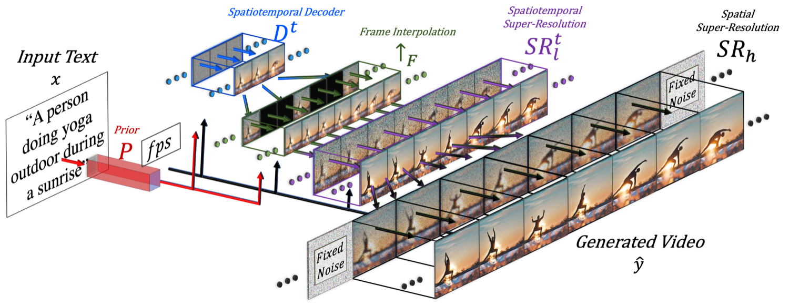

## 一句话定位
Make-A-Video（Meta AI，2022-09）是最早的开放域文生视频（T2V）扩散方法之一：核心思想是"从配对图文学世界长什么样、从无标注视频学世界怎么动"——**完全不需要配对的文本-视频数据**，通过把一个 DALL·E-2 式的 T2I 扩散模型用 **伪 3D（Pseudo-3D）时空因子化卷积/注意力** 扩展到时间维度，再叠加帧插值与时空超分级联，生成 768×768、76 帧的视频（具体秒数取决于推理时所选 fps，论文未给定时长）。零样本在 MSR-VTT 上 FID 13.17 / CLIPSIM 0.3049、UCF-101 零样本 FVD 367.23，均大幅超过同期 CogVideo / VDM，并在人评质量/忠实度上以 73–84% 偏好率领先。

## 背景与定位
2022 年 T2I 已经爆发（[[dall-e-2]]、[[imagen]]、[[latent-diffusion-ldm]] / Stable Diffusion、Parti），靠的是互联网上数十亿 (alt-text, image) 配对。但视频无法廉价收集到同等规模的高质量 (text, video) 配对，且视频是更高维数据，建模更难。同期 T2V 工作要么局限在窄域（移动数字、特定动作），要么依赖自建的私有配对数据：CogVideo（Hong et al., 2022）和 VDM（Video Diffusion Models, Ho et al., 2022）都各自收集了 1000 万条私有文本-视频对。

Make-A-Video 的核心命题：**既然已有强大的 T2I 模型，从零训 T2V 是浪费**。论文主张：
- 文本-图像配对教会模型"世界长什么样、如何被语言描述"；
- 无标注（无配对文本的）视频教会模型"世界如何运动"——运动规律本身无需文字也能从视频里无监督地学到（海浪怎么动、象鼻怎么甩）；
- 静态图像里其实已隐含动作语义（"喝咖啡的女人""踢球的大象"），这让只见过图文的模型也能生成短视频。

由此带来三大优势：(1) 加速 T2V 训练——不必从零学视觉与多模态表征；(2) 不需要配对文本-视频数据，从而可扩展到更大量级的视频；(3) 生成视频继承了 T2I 模型的多样性（美学、奇幻概念）。相对前作的差异：① 架构上打破了"必须有文本-视频配对"的依赖；② 对 T2I 权重做 **微调**（而非像 CogVideo 那样冻结），能更有效适配；③ 用 pseudo-3D 卷积 + 时间注意力，比 VDM 的因子化方式有更好的时序信息融合（VDM 只在注意力上加 1D 时间，卷积仍是 2D；Make-A-Video 还额外加了 3×1×1 时间卷积投影，让时间信息也穿过每个卷积层）。此外全部用公开数据集（LAION 子集 + WebVid-10M + HD-VILA），更易复现。

## 模型架构

> 图源：Make-A-Video 论文 Figure 2 "Make-A-Video high-level architecture"（arXiv:2209.14792）

整体是一条 **级联式像素扩散管线**（非 latent），最终推理公式：

```
ŷ_t = SR_h ∘ SR^t_l ∘ ↑F ∘ D^t ∘ P ∘ (x̂, C_x(x))
```

各部件（x 为输入文本，C_x 为 CLIP 文本编码器，x̂ 为 BPE 编码）：

- **Prior P**：DALL·E-2 式先验网络，输入文本嵌入与 BPE token，输出 CLIP **图像嵌入**。是整个系统中**唯一吃文本**的部件，仅在配对图文上训练、**不在视频上微调**。
- **Decoder D^t（时空解码器）**：以 CLIP 图像嵌入为条件，生成低分辨率 **64×64、16 帧** 视频（其 T2I 版本 D 生成单张 64×64）。
- **帧插值/外推网络 ↑F**：把 16 帧上采样到更高帧率（实验用 frame skip 5 → 76 帧），也可做前/后帧外推（延长视频、图像动画）。
- **时空超分 SR^t_l**：把 64×64 升到 **256×256**，**跨空间+时间维**操作（保证超分时"幻想"出的细节在帧间一致，避免闪烁——论文称显著优于逐帧超分）。
- **空间超分 SR_h**：升到 **768×768**，因显存/算力及高清视频数据稀缺，**只在空间维**操作；为鼓励帧间细节一致，对每帧用**相同的噪声初始化**。（最终再用 bicubic 降到 512 以求更干净的美学。）

**T2I 骨干**：与 DALL·E-2（Ramesh et al., 2022）共享核心组件——prior + 解码器 + 两级超分，先在纯图像上训练。

**时空层（核心创新）**——把 2D 条件网络扩展到时间维，只改两类构件：

1. **Pseudo-3D 卷积层**：受可分离卷积启发，在每个预训练 2D 卷积后**堆一个 1D 时间卷积**。`Conv_P3D(h) = Conv1D(Conv2D(h)∘T)∘T`（∘T 为时空维转置）。这样既避免完整 3D 卷积的算力负担，又把预训练 2D 权重与新初始化的 1D 时间权重**干净地分区**：1D 时间卷积**初始化为恒等函数**，保证从"纯空间"到"时空"的无缝过渡（初始化时网络对同一文本生成 K 张各自忠实但无时序连贯的图）。
2. **Pseudo-3D 注意力层**：完整时空注意力在显存上不可行，故在每个预训练空间注意力后**堆一个时间注意力**。`ATTN_P3D(h) = unflatten(ATTN1D(ATTN2D(flatten(h))∘T)∘T)`。同样 ATTN2D 从预训练 T2I 继承，**ATTN1D 的时间投影初始化为零 → 恒等函数**。

**帧率（fps）条件**：除 T2I 的常规条件外，额外注入 fps 条件，既作训练增强（缓解视频数据量有限），也提供推理时的运动控制。

- **文本编码器**：CLIP text encoder（Radford et al., 2021）+ BPE 编码。
- **条件注入**：解码器以 CLIP **图像嵌入**为条件（继承 DALL·E-2 unCLIP 思路），文本仅通过 prior 进入系统。
- **分辨率/帧策略**：64²×16 帧 → ↑F 升至 76 帧 → 256² → 768²（再降 512）。
- **参数量**：论文**未披露**具体参数规模。

## 数据
- **图像（训练 T2I 部件）**：LAION（Schuhmann et al., 2022，即 LAION-5B）的 **2.3B 英文子集**。过滤掉 NSFW 图像、含毒性词的文本、以及水印概率 >0.5 的图。NSFW 检测用开源 `GantMan/nsfw_model`。
- **视频（训练 T2V 部件，只用视频、无配对文本）**：
  - **WebVid-10M**（Bain et al., 2021）——解码器 D^t 与插值模型 ↑F 在此训练；
  - **HD-VILA-100M 的 10M 子集**（Xue et al., 2022）——这 100M 片段源自 3.1M 视频，每个视频随机下 3 个片段构成 HD-VILA-10M；时空超分 SR^t_l 在 WebVid-10M + HD-VILA-10M 上训练。
- **关键点**：**所有视频均不使用对齐文本**——这是该工作的命门。对比 CogVideo / VDM 各自收集 10M **私有配对** 文本-视频，Make-A-Video 仅用公开数据集，更易复现。
- 训练时从原视频采 16 帧，**fps 在 1–30 间随机采样**（论文原文称用 "beta function" 采样）；训练解码器时**先从高 fps（运动少）起步、再过渡到低 fps（运动大）**，作为一种课程式增强。
- 合成数据 / re-captioning / 美学打分过滤：**未使用 / 未披露**（该工作不依赖视频侧文本）。

## 训练方法
- **训练目标**：基于扩散（DDPM 式像素空间去噪），非 flow matching、非 latent。各部件**独立分阶段训练**。
- **分阶段**：
  1. 先在**纯图像**上训练 prior、解码器、两级超分（解码器吃 CLIP 图像嵌入，超分吃下采样图像）；prior 在配对图文上训练且**不**在视频上微调。
  2. 加入并初始化新的时间层（1D 时间卷积=恒等、时间注意力时间投影=零），在**无标注视频**上微调时间层。
  3. **掩码帧插值模型 ↑F** 从时间解码器微调而来：在 U-Net 输入额外加 **4 个通道**——3 个 RGB 掩码视频输入 + 1 个二值通道（标记哪些帧被掩码），被掩码帧零填充；用**可变 frame-skip 与 fps 条件**训练，使推理时支持多种时间上采样率。同一架构通过掩码视频首/尾帧即可做视频外推或图像动画。
- **运动课程**：训练解码器时按 fps 由高到低（运动由弱到强）过渡。
- **偏好对齐 / RLHF / DPO**：**无**（2022 年，尚无此类后训练）。
- **蒸馏 / 步数加速（consistency/LCM/ADD）**：**未使用 / 未披露**。
- **分类器无关引导（CFG）**：论文方法承袭自 GLIDE/DALL·E-2 体系，但文中**未给出 T2V 的具体 guidance scale 等超参**。

## Infra（训练 / 推理工程）
- **算力规模 / GPU·时 / 并行分布式 / 混合精度 / 吞吐**：论文**全部未披露**（无 infra 章节，无附录工程细节；arXiv v1 仅 13 页正文+参考文献，无补充材料）。
- **推理形态**：级联多模型串行——Prior → 时空解码器（64²×16）→ 帧插值（→76 帧）→ 时空超分（→256²）→ 空间超分（→768²）→ 降采样 512。各级独立扩散采样，步数/缓存/量化等**未报告**。
- **部署**：闭源，未发布权重与代码，仅项目页 demo（make-a-video.github.io）。

## 评测 benchmark（把效果讲清楚）
全部为**零样本**评测（除 UCF-101 另给微调设定），数字均来自论文 Table 1–3。

**MSR-VTT（Table 1，越低越好 FID / 越高越好 CLIPSIM）**——用测试集全部 59,794 条 caption，每输入仅生成 1 个样本：

| 方法 | 零样本 | 样本/输入 | FID ↓ | CLIPSIM ↑ |
|---|---|---|---|---|
| GODIVA | 否 | 30 | – | 0.2402 |
| NÜWA | 否 | – | 47.68 | 0.2439 |
| CogVideo (中文) | 是 | 1 | 24.78 | 0.2614 |
| CogVideo (英文) | 是 | 1 | 23.59 | 0.2631 |
| **Make-A-Video (ours)** | 是 | 1 | **13.17** | **0.3049** |

Make-A-Video 零样本即大幅超过在 MSR-VTT 上训练过的 GODIVA / NÜWA，也超过同为零样本的 CogVideo（中/英），泛化更强。

**UCF-101（Table 2，IS ↑ / FVD ↓）**——对每类写一条固定模板句、不生成视频做提示，按训练集类分布采样、10K 样本（评测模型只看 16 帧/0.5 秒）：

- **零样本**：Make-A-Video IS **33.00** / FVD **367.23**（256²）；CogVideo 中文 23.55 / 751.34、英文 25.27 / 701.59（480²）——零样本已优于在 UCF-101 上训练的多种方法。
- **微调**：Make-A-Video IS **82.55** / FVD **81.25**（256²），FVD 取得 SOTA（最低）。对比（Table 2 微调列，IS↑ / FVD↓）：CogVideo IS 50.46 / FVD 626（160²，pretrain）、VDM IS 57.80±1.3（64²，FVD 未报告）、TATS-base IS 79.28±0.38 / FVD 278±11（128²）、MoCoGAN-HD IS 33.95±0.25 / FVD 700±24（256²）、DIGAN IS 32.70±0.35 / FVD 577±22、TGANv2 IS 26.60±0.47（128²，FVD 未报告）。Make-A-Video 在 IS 与 FVD 两项上均明显领先。

**人评（Table 3，给出"偏好我方"的评分者百分比）**——视频生成 76×256×256：

| 对比 | benchmark | 质量 | 忠实度 |
|---|---|---|---|
| vs. VDM | VDM 网页 28 例 | 84.38 | 78.13 |
| vs. CogVideo(中) | DrawBench(200) | 76.88 | 73.37 |
| vs. CogVideo(英) | DrawBench(200) | 74.48 | 68.75 |
| vs. CogVideo(中) | 自建测试集(300) | 73.44 | 75.74 |
| vs. CogVideo(英) | 自建测试集(300) | 77.15 | 71.19 |

在所有 benchmark 上，质量与忠实度均显著领先（无 cherry-pick）。

**帧插值人评 vs. FILM**（先生成 1 FPS 视频再各自上采样到 4 FPS）：评分者认为 Make-A-Video 运动更真实的比例——自建测试集 **62%**、DrawBench **54%**；在帧间差异大、需要真实世界运动常识时优势更明显（FILM 只是平滑过渡、缺乏语义理解）。

**测试集**：作者从 AMT 收集 **300 条** zero-shot T2V 人评提示（5 类：动物、奇幻、人物、自然与场景、食饮），并计划发布；另用 Imagen 的 DrawBench 提示做人评。

**消融结论**：论文正文未设独立大型消融表，主要通过定性观察支撑设计选择——如时空超分 SR^t_l 显著优于逐帧超分（去闪烁）、SR_h 用相同噪声初始化保证帧间细节一致、运动课程（fps 由高到低）。

## 创新点与影响
**核心贡献**：
1. 提出**无需配对文本-视频数据**的 T2V 范式——用配对图文学外观、用无标注视频学运动，把 T2I 的进展直接迁移到 T2V。
2. **Pseudo-3D 时空因子化**卷积与注意力 + 恒等/零初始化，使预训练 T2I 模型能"无缝"扩展到时间维并联合微调（而非冻结），既省算力又保留视觉先验。
3. 首次给出**空间+时间双向超分**策略，生成高清（768²）、高帧率（经 ↑F 由 16 帧上采到 76 帧）视频；同一插值/外推网络还支持图像动画、视频外推、视频变体等多任务。
4. 比同期工作**更彻底的评测**（自动 + 人评 + 多 benchmark），并收集发布 300 条 T2V 人评提示集。

**影响**：作为最早的开放域 T2V 扩散工作之一，确立了"复用 T2I 先验 + 时空因子化扩展"的主流思路，与同期 [[imagen-video]] 共同把扩散推向开放域文生视频；深刻影响后续 ModelScopeT2V、AnimateDiff、Stable Video Diffusion 等——它们普遍沿用"图像预训练→插入时间层→视频微调"的范式。fps 条件、级联超分、伪 3D 因子化都成为后续视频扩散的常见组件。横向对照的同期工作见 [[cogvideo]]。

**已知局限（论文自述）**：
- 无法学到**只能从视频推断、图像无法体现**的文本-现象关联（如"人把手从左挥到右 vs 从右挥到左"的方向语义）——因为文本只进 prior、prior 不碰视频。
- 仅能生成**短**视频，缺乏多场景、多事件、长叙事能力。
- 像所有 web 大数据模型一样，可能学到并放大社会偏见与有害内容（已做 NSFW/毒词过滤）。
- 工程细节（参数量、算力、采样步数）未公开，未开源权重/代码。

## 原始链接
- arxiv_abs: https://arxiv.org/abs/2209.14792
- arxiv_pdf: https://arxiv.org/pdf/2209.14792
- project_page: https://make-a-video.github.io/

## 一手源存档（sources/）
- [arxiv-2209.14792.pdf](https://arxiv.org/pdf/2209.14792)  （arXiv 原文 PDF，不入 git）
- [project-page.md](https://github.com/zhao9797/ai-research/blob/main/sources/omni/2022/make-a-video--project-page.md)
