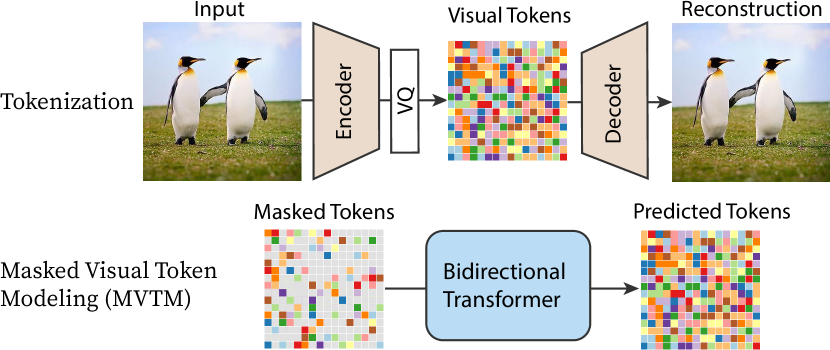
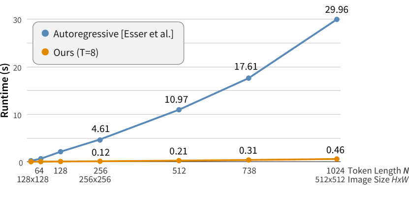

## 一句话定位
MaskGIT 提出"掩码视觉 token 建模 + 调度并行解码"（predict-all-then-resample）的图像合成范式：用双向 transformer 一次性预测全部 token、只保留最自信的、迭代细化，在 ImageNet 上把自回归 VQ transformer（VQGAN）的解码加速 **30–64x**（256×256 只需 8 步、512×512 只需 12 步而非 256/1024 步），并把 512×512 的 FID 从 26.52 刷到 **7.32**（创当时新 SOTA），256×256 FID 6.18 vs VQGAN 15.78。

## 背景与定位
两阶段生成（VQVAE/VQGAN/[[dall-e-1]]）此前都把图像当作一维 token 序列、按光栅扫描（raster scan）逐 token 自回归解码，借用 NLP 的自回归范式。作者指出这"既非最优也低效"：
- **图像非序列**——画家是先打草稿再整体细化（less-to-more），而非逐行打印；
- **序列过长**——token 数随分辨率二次增长（256 或 1024 token，远长于自然语言句子），长程相关难建模、解码不可并行（32×32 token 自回归在 GPU 上要约 30 秒/张）。

MaskGIT 受 BERT 的掩码语言建模（MLM）和 NMT 的非自回归 / mask-predict 解码启发，把第二阶段从"单向自回归"换成"双向掩码 + 并行迭代解码"。论文自称是首个在标准 ImageNet 基准上验证掩码建模用于图像生成有效性的工作。第一阶段 tokenizer 直接沿用 [[taming-transformers-vqgan]] 设置，不做改动（把 tokenizer 改进留给未来工作）。这条线后续直接孵化了文生图的 [[muse]]、视频的 [[magvit]] / MAGVIT-v2 与 [[phenaki]] 的掩码解码。

## 模型架构

> 图源：MaskGIT: Masked Generative Image Transformer (arXiv:2202.04200) Figure 3 "Pipeline Overview"

两阶段设计（图 3 Pipeline）：

**第一阶段 — VQ tokenizer（沿用 VQGAN）**
- Encoder E 把图像 x∈R^{H×W×3} 压缩为离散 latent；codebook 大小 **K=1024**（论文正文 4.1 明确"codebook with 1024 tokens"）；下采样固定因子 **16**（H×W → (H/16)×(W/16)），即 256×256→16×16=256 token，512×512→32×32=1024 token。
- 每个数据集只训练**一套** autoencoder + decoder + codebook（在裁剪到 256×256 的图上训练），且发现这套 tokenizer 可直接复用到 512×512 合成。
- Tokenizer 重建质量（README）：ImageNet 256 重建 FID **2.28**，512 重建 FID **1.97**。

**第二阶段 — 双向 transformer（本文核心）**
- 多层双向 self-attention transformer，做 Masked Visual Token Modeling（MVTM）：把部分 token 替换成特殊 `[MASK]`，预测被掩码位置的 token 概率 P(y_i | Y_M)。关键区别于自回归：条件依赖是**双向**的，能 attend 图像所有方向的 token。
- 统一配置（所有模型相同）：**24 层、8 注意力头、embedding 维度 768、hidden 维度 3072**；可学习位置嵌入、LayerNorm、truncated-normal 初始化（stddev=0.02）。
- 参数量：表 1 报告 MaskGIT 为 **227M**（与作者复现的同架构 VQGAN baseline 227M 一致，便于公平对比）。类别条件通过 class token 注入（class-conditional）。
- 编辑任务零改架构、零任务训练：把 inpainting / outpainting / 类别条件编辑统统视为"对迭代解码初始二值 mask M 的约束"即可直接处理。

## 数据
- **生成主任务**：ImageNet（256×256 与 512×512 class-conditional），训练 300 epoch。
- **图像补全任务（inpaint/outpaint）**：Places2 数据集，在 512×512 center-crop 上训练 MaskGIT（200 epoch），所有超参与 ImageNet 模型保持一致。
- 数据增强：RandomResizeAndCrop；256×256 的 CAS 评测按惯例额外用 RandAugment（附录另报无增强版本）。
- 无文本-图像配对数据（这是纯类别条件/图像编辑工作，非文生图）；数据清洗/配比/re-captioning 不适用、论文未涉及。

## 训练方法
**训练目标 — MVTM（掩码视觉 token 建模）**
- 令 Y=[y_i]（VQ-encoder 输出的 latent token），M=[m_i] 为二值 mask。掩码采样由**调度函数 γ(r)∈(0,1]** 参数化：先采样比例 r∈[0,1)，再均匀选 ⌈γ(r)·N⌉ 个 token 置为 `[MASK]`。
- 损失为被掩码 token 的负对数似然（masked tokens 的交叉熵）：L_mask = −E[ Σ_{m_i=1} log p(y_i | Y_M) ]。
- 与 BERT 固定 15% 掩码率不同：图像要"从零生成"，需要**可变且能覆盖高掩码率**的调度，故 r 在 [0,1) 全范围采样。
- 训练超参：label smoothing=0.1，dropout=0.1，Adam（β1=0.9, β2=0.96）。

**推理 — 调度并行解码（iterative decoding，核心创新）**
T 步生成（无 beam-search / top-k / nucleus / classifier guidance 也能跑），从全掩码"空白画布"Y_M^{(0)} 开始，每步：
1. **Predict**：双向 transformer 并行预测所有掩码位置的概率 p^{(t)}∈R^{N×K}。
2. **Sample**：每个掩码位按预测分布采样一个 token，其预测分值作为 "confidence"；未掩码位 confidence 设为 1.0；采样带 **temperature annealing** 以增多样性。
3. **Mask schedule**：按 γ 算本步要保留/掩码数 n=⌈γ(t/T)·N⌉。
4. **Mask**：掩掉 confidence 最低的 n 个 token，下一步重预测；mask ratio 单调递减直到全部生成。

**掩码调度设计（决定成败的关键）** γ 需连续、在 [0,1] 单调递减、γ(0)→1、γ(1)→0（保证解码收敛）。比较三族函数：
- 线性（每步掩等量）；
- **凹函数（concave，less-to-more）**：cosine / square / cubic / exponential——开头掩得多、只做少量高置信预测，结尾掩码率骤降逼模型做大量正确预测；
- 凸函数（more-to-less）：square-root / logarithmic。

结论：**cosine 最优**（见评测消融），过度凹（cubic、exponential）反而变差。无蒸馏/无 consistency/无 LCM 等加速——加速完全来自"并行解码 + 步数从 256/1024 降到 8/12"这一范式本身。

## Infra（训练 / 推理工程）
- 算力：所有模型在 **4×4 TPU**（即一个 4×4 的 TPU pod 切片，共 16 芯）上训练，batch size **256**。
- 训练时长：ImageNet 300 epoch / Places2 200 epoch。具体 GPU·时、并行策略、混合精度、吞吐论文**未披露**。
- 推理加速：核心就是步数极少（8–12 步 forward pass）。表 1 "# steps" 指生成一张样本所需的神经网络前向次数：MaskGIT 在所有非 GAN 模型里步数最少（256@256 vs VQGAN 256；512@512 为 12 vs VQGAN 1024）。图 4 给出 wall-clock：单 GPU 上比 VQGAN 解码快 **30–64x**，且分辨率（token 长度）越大加速越显著。
- 量化 / 缓存 / 部署形态：论文**未报告**。官方放出 Jax 实现与 4 个 checkpoint（256/512 tokenizer + transformer）及 Colab demo（README）。

## 评测 benchmark（把效果讲清楚）

> 图源：MaskGIT: Masked Generative Image Transformer (arXiv:2202.04200) Figure 4 "Transformer wall-clock runtime comparison between VQGAN and ours"（单 GPU，比 VQGAN 解码快 30–64x）

**ImageNet 256×256 class-conditional（表 1，无 rejection sampling）**
| 模型 | FID↓ | IS↑ | Prec↑ | Rec↑ | #params | #steps | CAS Top-1↑ | CAS Top-5↑ |
|---|---|---|---|---|---|---|---|---|
| VQGAN [15] | 15.78 | 78.3 | n/a | n/a | 1.4B | 256 | 53.10 | 76.18 |
| VQGAN*（作者复现同架构） | 18.65 | 80.4 | 0.78 | 0.26 | 227M | 256 | 63.14 | 84.45 |
| BigGAN-deep | 6.95 | 198.2 | 0.87 | 0.28 | 160M | 1 | — | — |
| ADM（扩散） | 10.94 | 101.0 | 0.69 | 0.63 | 554M | 250 | — | — |
| VQVAE-2 | 31.11 | ~45 | 0.36 | 0.57 | 13.5B | 5120 | — | — |
| **MaskGIT (Ours)** | **6.18** | **182.1** | 0.80 | 0.51 | 227M | **8** | **63.43** | **84.79** |

要点：256 上 FID 6.18 vs VQGAN 15.78、IS 182.1 vs 78.3，且只用 8 步（vs 256）。Recall 高于 BigGAN（更好覆盖/多样性），Precision 高于 VQVAE-2 / 扩散（更好样本质量）。CAS（先在生成样本上训 ResNet-50 再测 ImageNet 验证集，真实数据参考为 Top-1 76.6 / Top-5 93.1）刷新 SOTA。

**ImageNet 512×512 class-conditional（表 1）**
| 模型 | FID↓ | IS↑ | #params | #steps | CAS Top-1↑ | CAS Top-5↑ |
|---|---|---|---|---|---|---|
| BigGAN-deep | 8.43 | 232.5 | 160M | 1 | 44.02 | 68.22 |
| ADM | 23.24 | 58.06 | 559M | 250 | — | — |
| VQGAN* | 26.52 | 66.8 | 227M | 1024 | 51.29 | 74.24 |
| **MaskGIT (Ours)** | **7.32** | 156.0 | 227M | **12** | **63.43** | **84.79** |

512 上 FID 7.32 创新 SOTA（优于 BigGAN-deep 的 8.43），步数 12 vs VQGAN 1024。

**带 classifier-based rejection sampling（附录 B 表 4，acceptance rate 0.05）**：256 上 FID **4.02 / IS 355.6**（vs ADM+guidance 4.59/186.70、VQGAN 5.88/304.8）；512 上 FID **4.46 / IS 342.0**（vs ADM 7.72/172.71）——取得当时 SOTA Inception Score。

**Places2 inpaint/outpaint（表 2）**
- Outpainting（right 50%）：MaskGIT-512 FID **6.78** / IS 11.69，胜过 Boundless、In&Out、InfinityGAN、Boundless-TF（FID 7.80），达 SOTA。
- Inpainting（center 50%×50%）：MaskGIT-512 FID **7.92**，远胜 DeepFill（11.51）/HiFill，接近 SOTA 的 CoModGAN（7.13）。
- 注：MaskGIT 非专门为补全设计，却拿到与专用模型可比的成绩，且能单模型任意方向 outpaint（自回归/ImageGPT 做不到）。

**关键消融（256×256，表 3 / 图 8）— 掩码调度函数**
| γ | 最佳 T | FID↓ | IS↑ |
|---|---|---|---|
| Exponential | 8 | 7.89 | 156.3 |
| Cubic | 9 | 7.26 | 165.2 |
| Square | 10 | 6.35 | 179.9 |
| **Cosine** | 10 | **6.06** | **181.5** |
| Linear | 16 | 7.51 | 113.2 |
| Square Root | 32 | 12.33 | 99.0 |
| Logarithmic | 60 | 29.17 | 47.9 |

结论：凹函数普遍优于线性优于凸函数；cosine 最佳 FID 6.06 且 sweet spot 最早（8–12 步）。迭代步数 T 存在"甜点"——并非越多越好（步数过多会压制低置信预测、损害 token 多样性）。

**重建/冗余分析（附录 A，图 9/10）**：visual token 高度冗余——掩 95% 仍能恢复整体（pose/形状），约 **90% 处有拐点**，质量与一致性在 90% 前急剧改善、之后趋缓；仅约 10% token 即可支撑整体重建（与并发的 MAE 高掩码率观察相互印证）。

## 创新点与影响
**核心贡献**
1. 提出 **MVTM（掩码视觉 token 建模）** 与**调度并行解码（predict-all-then-resample）** 这一全新图像合成范式，把双向 BERT 式掩码建模首次在 ImageNet 上验证用于生成。
2. 把自回归 VQ transformer 的解码从 256/1024 步降到 8–12 步，**加速 30–64x**，同时质量更高（256 FID 6.18、512 FID 7.32 创 SOTA）。
3. 揭示 **mask scheduling（尤其 cosine）** 是生成质量决定因素；给出收敛性约束（单调递减、γ(0)→1、γ(1)→0）。
4. 同一模型零改架构、零任务训练即可做 inpainting / outpainting / 类别条件编辑（仅需改初始 mask），并能任意方向外扩（自回归不可行）。

**对后续工作的影响**：奠定"掩码生成"主线——文生图 [[muse]]（把 MaskGIT 范式扩到文本条件 + 超分级联）、视频 [[magvit]] / MAGVIT-v2、[[phenaki]] 的掩码解码均直接继承其并行迭代解码与置信度重采样思想；也是后续讨论"扩散 vs 自回归 vs 掩码生成"三分天下的基石之一。

**已知局限（附录 F）**：(1) outpainting 长程外扩时受有限注意力窗口影响，可能"遗忘"一端的语义/颜色，造成语义或色彩漂移；(2) 有时会忽略或改动边界处物体；(3) 在人脸、文字、对称物体等复杂结构上可能过度平滑或产生伪影；(4) 单步全预测虽理论可行，但因与训练任务不一致而效果差，故需迭代（仍非真正 one-step）。

## 原始链接
- paper: https://arxiv.org/abs/2202.04200
- pdf: https://arxiv.org/pdf/2202.04200
- project: https://masked-generative-image-transformer.github.io/
- github: https://github.com/google-research/maskgit
- demo: https://colab.research.google.com/github/google-research/maskgit/blob/main/MaskGIT_demo.ipynb

## 一手源存档（sources/）
- [arxiv-2202.04200.pdf](https://arxiv.org/pdf/2202.04200)  （arXiv 原文 PDF，不入 git）
- [readme.md](https://github.com/zhao9797/ai-research/blob/main/sources/omni/2022/maskgit--readme.md)
- [project.md](https://github.com/zhao9797/ai-research/blob/main/sources/omni/2022/maskgit--project.md)
