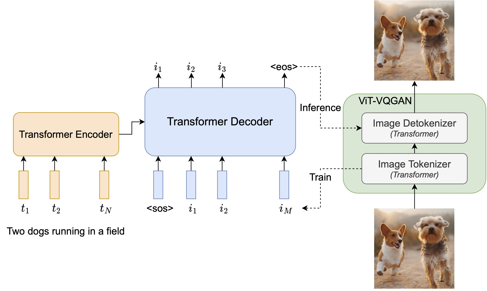
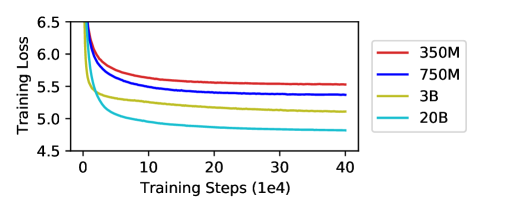

## 一句话定位
Parti（Pathways Autoregressive Text-to-Image）是 Google Research 2022 年的自回归文生图代表作：用 **ViT-VQGAN** 把图像离散化成 token，再用一个标准 **encoder-decoder Transformer** 像做"机器翻译"一样从文本 token **自回归预测图像 token**，把模型 scale 到 **20B 参数**，在 MS-COCO 上拿到 **zero-shot FID 7.23 / finetuned FID 3.22**（彼时 AR 模型新 SOTA），并证明 AR 路线在 content-rich、强组合泛化与世界知识上能与扩散模型（[[imagen]]/[[dall-e-2]]）并驾齐驱。

## 背景与定位
2022 年文生图有两条主线：
- **自回归（AR）/ 语言建模路线**：[[dalle]]（DALL-E 1）、CogView、Make-A-Scene——把图像经 dVAE/VQ-VAE 离散成"视觉词"，再用 GPT 式 decoder-only LM 自回归生成。
- **扩散路线**：GLIDE、[[dall-e-2]]（unCLIP）、[[imagen]]——抛弃离散 token，直接在像素/latent 上做迭代去噪。彼时扩散刚在 MS-COCO zero-shot FID 与美学上反超 AR。

Parti 的论点是：**AR 路线并未过时**——它能直接复用大语言模型 scaling 的全部经验（数据/模型一起放大、infra 成熟），只要把 tokenizer 与 Transformer 都做扎实，AR 同样能到 SOTA。论文与官方页面反复强调 Parti 与同门 Imagen "互补"（AR vs diffusion 两个家族），并为未来两者结合留口子。相对前作的关键改进：
- 把 DALL-E/CogView 的 **decoder-only** 换成 **encoder-decoder**（seq2seq），实验证明 350M–750M 量级 encoder-decoder 在训练 loss 与生成质量上都优于 decoder-only，故全程聚焦 encoder-decoder 扩展。
- tokenizer 从 dVAE/VQ-VAE/VQGAN 升级到 **ViT-VQGAN**（[[vit-vqgan]]，arXiv 2110.04627，同组 Jiahui Yu 等），重建保真度与码本利用率更高。
- 把规模直接推到 **20B**，并系统给出 350M→20B 的 scaling 曲线。
- 发布 **PartiPrompts (P2)** 这一 1600+ 英文 prompt 的整体性 benchmark，并提出"Growing a Cherry Tree"（养樱桃树）这一刻意区分"挑樱桃"与"交互式提示工程"的概念。

## 模型架构

> 图源：Parti 论文 Figure 3（Scaling Autoregressive Models for Content-Rich Text-to-Image Generation, arXiv:2206.10789）https://ar5iv.labs.arxiv.org/html/2206.10789

**两阶段（two-stage）**结构，与 DALL-E/CogView/Make-A-Scene 同范式，但组件全部是标准 Transformer：

**第一阶段：图像 tokenizer（ViT-VQGAN）**
- backbone：ViT-VQGAN，带 **ℓ2-归一化码 + 因子化码（factorized codes）**，提升训练稳定性、重建质量与码本利用率。
- 训练用与 ViT-VQGAN 原文相同的 loss 与超参（感知 loss + StyleGAN loss + ℓ2 loss）。
- **码本 8192** 个视觉 token；输入/输出分辨率 **256×256**，编码成 **32×32 = 1024 个图像 token**。
- 先训一个 **ViT-VQGAN-Small** 配置（8 blocks / 8 heads / dim 512 / hidden 2048，**整模型约 30M 参数**，原文表述为 "about 30M total parameters"）——第二阶段只用到它的 encoder 与码本。
- 为提升视觉锐度，**冻结 encoder 与码本**，单独 finetune 一个更大的 **decoder**（32 blocks / 16 heads / dim 1280 / hidden 5120，约 **600M 参数**）。
- 发现 ViT-VQGAN 输出在放大时有像素化伪影，溯源到 sigmoid 前输出投影层权重病态——**移除最后的 sigmoid 激活与 logit-laplace loss**，直接把原始值当 [0,1] RGB；该修复可热插拔到已训 tokenizer（只 finetune decoder 即可）。
- **超分模块**：在 tokenizer 之上叠一个卷积残差超分网络（WDSR 风格，12 个残差块、128 通道），**不依赖文本条件**，把 256×256 重建图升采到 512×512（约 15M 参数）或 1024×1024（约 30M 参数）；用与 ViT-VQGAN 相同的 loss 训练。论文指出这里也可换成扩散式迭代超分（如 DALL-E 2/Imagen 那样）。

**第二阶段：文→图的 encoder-decoder Transformer**
- **text encoder**：输入文本 token（自建 16k 词表的 SentencePiece，从训练语料采样训得）；最大文本长度 **128 token**。
- **image decoder**：自回归预测光栅化（rasterized）后的 1024 个图像 token，causal mask；解码用 **conv-shaped masked sparse attention**（同 DALL-E）。
- 尺寸四档（不含 tokenizer 参数）：

  | 模型 | Enc 层 | Dec 层 | model dim | MLP dim | heads | 参数量 |
  |---|---|---|---|---|---|---|
  | Parti-350M | 12 | 12 | 1024 | 4096 | 16 | 350M |
  | Parti-750M | 12 | 36 | 1024 | 4096 | 16 | 750M |
  | Parti-3B | 12 | 36 | 2048 | 8192 | 32 | 3B |
  | Parti(-20B) | 16 | 64 | 4096 | 16384 | 64 | 20B |

  设计偏好：**decoder 远比 encoder 深**（20B 时 64 层 decoder vs 16 层 encoder，4×），因为建模图像 token 更吃容量；MLP 扩张比沿用 4×，model dim 翻倍则 heads 翻倍。
- **text encoder 预训练（warm-start）**：encoder-decoder 解耦了文本编码与图像生成，可以用预训练 encoder 热启。在 **C4 上做 BERT 式预训练** + 在自有图文数据上做**对比学习**（对比预训练的 image encoder 不用）。预训练后 encoder 在 GLUE 上与 BERT 相当，但经过完整文→图训练后 encoder 会退化；该预训练对 3B 的文→图 loss 只有边际帮助，**默认在 20B 上启用**。

## 数据
- **训练数据**（三个图文集混合，所有 Parti 模型同一配比）：
  - **LAION-400M**（公开）。
  - **FIT400M**：从训练 ALIGN 模型的 18 亿样本里**过滤出的 4 亿子集**。
  - **JFT-4B**：带文本标注标签的图像集；其文本描述**随机在原标签（多标签则拼接）与 SimVLM 生成的机器 caption 之间切换**——即用了**合成/再 caption** 的策略增强文本侧。
- 图像预处理沿用 DALL-E 的 dVAE 输入流程（tokenizer 训练）与 DALL-E Transformer 输入流程（encoder-decoder 训练）。
- **未披露**：精确的总样本数、各数据集采样配比权重、美学过滤/去重的具体阈值与安全过滤细节（论文只在 Broader Impacts 定性承认数据含偏见与 Western bias，未给清洗管线数字）。
- **评测数据**：MS-COCO (2014)（train 82K / val 40K，平均 caption 10.5 词）；Localized Narratives 的 COCO 子集 LN-COCO（train 134K / val 8K，平均 **42.1 词**，约 MS-COCO 的 4 倍长，用于测长描述泛化）；自建 **PartiPrompts (P2)**：1600+ 英文 prompt，每条标注 1 个类别（12 类：abstract/animals/arts/vehicles/world-knowledge…）与 1 个挑战维度（11 类：basic/quantity/words&symbols/linguistic-structures/complex…），约 7% prompt 采自既有论文。

## 训练方法
- **训练目标**：纯 **next-token prediction**——对 8192 词表的图像码本做 softmax 交叉熵，loss 按每例 1024 个图像 token 平均。这是 AR 路线，**不是 diffusion / flow matching / masked-token**。
- **多阶段**：(1) 训 ViT-VQGAN-Small encoder+码本 → (2) 训 encoder-decoder（可选 text-encoder 预训练热启）→ (3) 冻结 tokenizer encoder/码本、finetune 大 decoder 与超分模块。文中**未使用 RLHF/DPO/reward-model 等偏好对齐**；"对齐"靠的是 CF-guidance + CoCa reranking（见下）。
- **采样期增强**：
  - **Classifier-Free Guidance (CF-guidance)**：训练时按概率丢弃文本条件（换成 learned embedding）使模型兼具无条件/有条件生成；推理用 `I = G(z) + λ·(G(z,c) − G(z))`。在 AR 上 CF-guidance 显著改善图文对齐，尤其难 prompt。主结果用 **guidance scale λ=1.2**（与 DALL-E 2 一致）。论文特别致谢 Imagen 团队提前共享了 CF-guidance 重要性的发现。
  - **对比 reranking**：每条 prompt 采 **16 张**候选图（远少于 DALL-E 的 512），用一个 base-size **CoCa**（Contrastive Captioners）模型按图文对齐分重排取 top-1。reranking 与 CF-guidance 互补，且在小批量上计算很便宜。
- **关键超参（20B）**：优化器 **Adafactor**（β1=0.9, β2=0.96, decoupled weight decay 4.5e-2，一阶动量从 fp32 量化到 **int8** 省显存）；dropout 0.1（20B 用确定性版本以兼容 pipeline）；attention/FFN 用 **bfloat16**，layernorm 与输出保持 fp32；学习率 **4.5e-5**，5000 步 warm-up 后指数衰减（85k 步开始衰减，总 **450k 步**，末端比例 0.025）；**global batch 8192**；梯度范数裁剪到 4.0；**不用 EMA**（省显存）；encoder/decoder 输出端各加一层额外 LayerNorm。

## Infra（训练 / 推理工程）
- **框架/硬件**：在 **Lingvo** 中实现，用 **GSPMD**（XLA 编译器级别的自动分片系统）在 **Cloud TPU v4** 上训练与推理；GSPMD 把整片 TPU 当成单一虚拟设备，仅靠对少数张量加 sharding 注解就能自动把数据与计算铺到上千设备。
- **并行策略（按规模分层）**：
  - **350M / 750M**：纯数据并行。
  - **3B**：**4-way in-layer 模型并行 + 128-way 数据并行**；权重沿 FFN 隐藏维与注意力头维切分；与 Megatron-LM 不同的是把 FFN/attention 的**输出激活在另一维上完全分片**，通信模式从 AllReduce 变成 **ReduceScatter + AllGather**，显著降低峰值激活显存。
  - **20B**：因每层权重不算很宽，采用**流水并行**——encoder 与 decoder 各配 **16 stage** 的 GSPMD pipeline，再叠 **64-way 数据并行**；GSPMD 把 pipeline 实现为向量化程序上的张量分片，故底层 infra 可复用，且能在 transformer 层外（embedding/softmax/tokenizer 层）复用同一批设备做数据并行。由于 per-core batch 小导致 pipeline bubble 增大，decoder pipeline 用 **4-round circular schedule**（每 stage 4 层轮询执行）压低 bubble 比例。
- **推理**：目标是加速小 batch 出图。3B/20B 推理改用 **in-layer 模型并行**，且**不**对 FFN/attention 输出做完全分片（因每步 AR 解码张量很小、彼时小数据上 AllReduce 更快；推理无反向、激活显存不是瓶颈）。
- **未披露**：总 GPU·时 / TPU·时、训练墙钟时长、能耗、吞吐 token/s 等具体算力数字论文未给。无量化/蒸馏/步数蒸馏（AR 没有"采样步数"概念，加速主要靠 reranking 候选数仅 16 与并行策略）。

## 评测 benchmark（把效果讲清楚）

> 图源：Parti 论文 Figure 9 右图（350M→20B 训练 loss 随步数下降，规模越大 loss 越低，与 zero-shot FID 单调改善一致；arXiv:2206.10789）https://ar5iv.labs.arxiv.org/html/2206.10789

**MS-COCO (2014) 与 LN-COCO 的 FID（30k 样本，256×256，guidance 1.2，16 采样 + CoCa 重排）：**

| 方法 | 类型 | MS-COCO zero-shot FID↓ | MS-COCO finetuned FID↓ | LN-COCO zero-shot FID↓ | LN-COCO finetuned FID↓ |
|---|---|---|---|---|---|
| Retrieval Baseline | 检索 | 17.97 | 6.82 | 33.59 | 16.48 |
| Random Train Images | — | — | 2.47 | — | — |
| DALL-E | AR | ∼28 | — | — | — |
| TReCS | GAN | — | — | — | 48.70 |
| CogView | AR | 27.1 | — | — | — |
| CogView2 | AR | 24.0 | — | — | — |
| Make-A-Scene | AR | 11.84 | 7.55 | — | — |
| GLIDE | Diffusion | 12.24 | — | — | — |
| DALL-E 2 | Diffusion | 10.39 | — | — | — |
| Imagen | Diffusion | **7.27** | — | — | — |
| XMC-GAN | GAN | — | 9.33 | — | 14.12 |
| **Parti (20B)** | **AR** | **7.23** | **3.22** | **15.97** | **8.39 / 8.29** |

（DALL-E 的 MS-COCO zero-shot FID 论文 Table 5 标的是 "∼28"（约 28，非确切值），不是 27.5——原文给的就是近似号。LN-COCO finetuned 数字：表 5 标 8.39，正文 §5.3 写 8.29，论文内部小不一致，二者并列。TReCS（GAN）只在 LN-COCO finetuned 列报 48.70。）

要点：
- **zero-shot FID 7.23** 基本追平扩散模型 Imagen 的 7.27，这是 AR 路线首次在 MS-COCO zero-shot 上与扩散 SOTA 同档。
- **finetuned FID 3.22** 是当时新 SOTA，大幅优于前最佳 AR（Make-A-Scene 7.55），也优于 in-dataset 检索基线 6.82。
- **LN-COCO**：finetuned 8.39/8.29 远超 XMC-GAN 的 14.12；zero-shot 15.97 几乎追平 XMC-GAN 的 in-dataset finetuned 结果，体现对**长描述**的强泛化。

**Scaling（zero-shot MS-COCO FID）**：350M → **14.10**；750M → **10.71**；3B → **8.10**；20B → **7.23**。FID 与训练 loss 随规模单调改善，**750M→3B 出现明显质量跃迁**；20B 在更难 prompt（文字渲染等）上进一步超 3B。

**自动图文对齐（captioner evaluation，MS-COCO 5K test，VL-T5 caption + BLEU/METEOR/CIDEr/SPICE）**：Parti **26.4 / 23.9 / 83.9 / 16.5**，全面超过 minDALL-E、X-LXMERT 等，接近 Ground-Truth 上界（32.5 / 27.5 / 108.3 / 20.4），并与检索基线相当。

**人评（side-by-side，每对 5 人）**：
- Parti(20B, zero-shot) vs XMC-GAN(finetuned)：图像真实感 **91.7%** 偏好、图文匹配 **90.5%** 偏好——尽管 Parti 没在 MS-COCO 上训练。
- vs 检索基线（在约 4B 训练图上检索真实图）：真实感 **45.2%**（略输，因检索的是真照片）、图文匹配 **55.2%**（胜）——意味着近一半情况下人评认为 Parti 生成图比真实照片还真实。
- PartiPrompts(P2) 上 **20B 优于检索基线**：真实感 **63.2%**、图文匹配 **75.9%**（论文正文 §5.5）；**20B 优于 3B**：真实感 **56.8%**、图文匹配 **62.7%**。（注：官方项目页把 63.2%/75.9% 表述为"3B vs 20B 对比"，与论文正文存在口径不一致；此处以论文正文 §5.5 为准。）20B 相对 3B 的提升在 **Abstract / World-Knowledge / Vehicles / Arts** 类别与 **Writing&Symbols / Perspective / Imagination** 挑战维度上最显著。

**消融**：text-encoder 预训练（C4 BERT + 对比）对 3B 文→图 loss 仅边际改善（Fig.30），故主要用于 20B；CF-guidance 与 CoCa reranking 互补、对难 prompt 对齐增益大；reranking 还意外帮助 counting（如"five red apples"top-6 全对，"ten red apples"top-8 计数为 8/10/9/9/9/8/11/6）。

**注**：论文**未报告** CLIPScore、GenEval、T2I-CompBench、DPG-Bench、MJHQ-30K、HPSv2、ImageReward、PickScore、Arena ELO 等——这些 benchmark 多在 Parti 之后才流行，原文不含相应数字，故"未报告"。

## 创新点与影响
**核心贡献**
1. 证明 **AR + ViT-VQGAN + encoder-decoder seq2seq** 这条朴素路线，只要 scale 到 20B，就能在 MS-COCO 上达到与扩散 SOTA（Imagen）同档的 zero-shot FID（7.23）并刷新 finetuned FID（3.22），把"文生图当机器翻译"做实。
2. 系统给出 350M→20B 的 **scaling law 式证据**（FID/loss 随规模单调下降，强组合泛化与世界知识随规模涌现），把 LLM 的 scaling 直觉迁移到 T2I。
3. 发布 **PartiPrompts (P2)**（1600+ prompt、12 类别 × 11 挑战维度），成为后续文生图（尤其组合性/世界知识）常用评测集；并提出 **"Growing a Cherry Tree"** 概念，倡导诚实区分"挑樱桃展示"与"交互式提示工程"。
4. 工程上把 **GSPMD 流水 + in-layer 并行 + circular schedule** 用于 20B encoder-decoder 训练，是大规模 AR 生成模型的 infra 范例。

**影响**：Parti 与 Imagen 一道把 Google 的文生图推到 SOTA，确立"AR 与扩散并驾齐驱、互补"的叙事，启发后续 AR/混合路线（如把离散 token 生成与扩散结合、以及后来 LLM-原生多模态生成）。PartiPrompts 至今被广泛引用作组合泛化评测。其"scale AR 出强 T2I"的结论也为日后**统一多模态自回归**（图文同 token 序列）提供了背书。

**已知局限**（论文 §6.3 详列，均为定性失败模式）：
- **Color bleeding**（颜色外溢到未指定物体）、**feature blending**（相似物体特征融合，如金字塔与珠峰被融成一体）。
- **细节遗漏/幻觉/重复**；复杂场景尤甚。
- **错位与交互错误**（物体放错位置、该互动的没互动）。
- **计数**：同类物体可靠到 7 个，超过则不准；多类物体计数近乎完全失败。
- **空间关系**：上下尚可，左右基本随机；物体组之间的空间关系最易崩。
- **否定/缺失**：prompt 说"没有香蕉"模型仍画香蕉。
- **责任与发布**：Google **决定不公开发布 Parti 模型/代码/数据**（出于偏见与 deepfake 风险），仅在释出图上加 Parti 水印；开源仓库只放 PartiPrompts 与 data card。训练数据含 Western/性别等刻板偏见。

## 原始链接
- arxiv_abs: https://arxiv.org/abs/2206.10789
- arxiv_pdf: https://arxiv.org/pdf/2206.10789
- project_page: https://sites.research.google/parti/ （亦即 https://parti.research.google）
- github: https://github.com/google-research/parti
- data_cards: https://github.com/google-research/parti/tree/main/data_cards
- 关键依赖工作: ViT-VQGAN（arXiv 2110.04627）、GSPMD（Google AI Blog 2021-12）、Lingvo（github.com/tensorflow/lingvo）、CoCa、ALIGN/FIT400M、JFT-4B、SimVLM

## 一手源存档（sources/）
- [arxiv-2206.10789.pdf](https://arxiv.org/pdf/2206.10789)  （论文原始 PDF，51MB，含大量样图，已精读正文+实验+附录；.gitignore 排除不入 git）
- [fulltext.txt](https://github.com/zhao9797/ai-research/blob/main/sources/omni/2022/parti--fulltext.txt)  （PDF 全文 pdftotext 抽取，156KB）
- [readme.md](https://github.com/zhao9797/ai-research/blob/main/sources/omni/2022/parti--readme.md)  （GitHub README raw 快照）
- [project-page.md](https://github.com/zhao9797/ai-research/blob/main/sources/omni/2022/parti--project-page.md)  （官方项目页 cloakbrowser markdown 快照，16.6KB）
