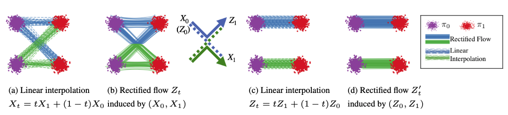
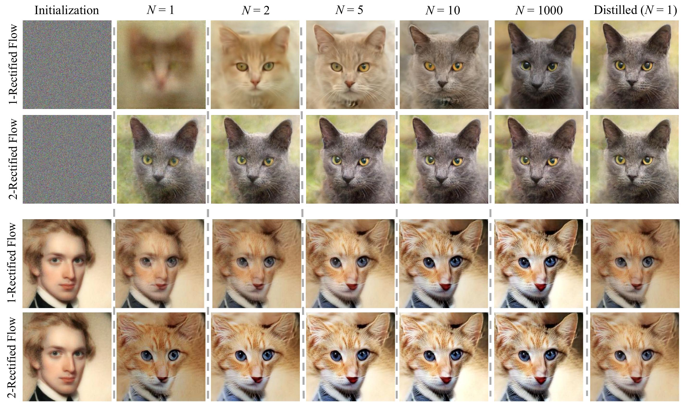

## 一句话定位

Rectified Flow（整流流）由 UT Austin 的 Liu、Gong、Liu 提出，用一个极简的最小二乘回归（学一条 ODE 去拟合两分布间样本对的直线方向 `X1−X0`），把生成建模与域迁移统一成"分布间运输映射"问题；配合 **reflow** 迭代把 ODE 轨迹拉直、再加 **distillation** 蒸馏，实现 **单步（1-NFE）生成**：CIFAR-10 上蒸馏后的 2-rectified flow 取得 **FID 4.85 / recall 0.50**，是当时 U-Net 类一步生成模型的 SOTA（击败 TDPM 的 8.91），而 1-rectified flow 全步求解（RK45）达 **FID 2.58 / recall 0.57**，recall 显著优于已有 ODE 与 GAN 方法。它是后来 [[stable-diffusion-3]] / [[flux-1]] 采用整流流路线的核心方法之一。

## 背景与定位

连续时间生成模型（[[score-sde]] 的 probability-flow ODE、[[ddpm]]、DDIM）相比 GAN/VAE 这类一步模型，最大缺陷是**推理慢**：采一个样本要反复调用昂贵的神经漂移函数解 ODE/SDE，而且 diffusion 的设计空间（噪声调度 αt/βt 等）超参众多、理论上仍理解不充分。同时，生成建模与域迁移（image-to-image translation、domain adaptation）通常被分开处理，需要为各自定制方法（如 CycleGAN、diffusion-based i2i）。

本文把所有这些任务统一为**运输映射问题（Transport Mapping Problem）**：给定经验观测的两个分布 π0、π1，找一个映射 `T` 使 `T(Z0)~π1`（当 `Z0~π0`），即构造 (π0, π1) 的一个 coupling。最优传输（OT）是天然的统一框架，但传统 OT 在高维大数据上慢，且传输代价并不完美对齐学习性能。

Rectified flow 的定位是：**用纯 ODE（不需要 SDE 工具）、用标准监督学习（无 minimax、无 MLE 近似、无 diffusion 的复杂超参）来求解运输映射，并把轨迹拉成直线以支持极少步乃至单步采样**。作者明确指出"若目标是学 ODE，根本不需要绕道 SDE"——PF-ODE/DDIM 是从数学上更复杂的 diffusion/SDE 推导出的副产品，形式被不必要地复杂化了。该工作（v1 于 2022-09 上线 arXiv，后为 ICLR 2023 Spotlight）与同期的 Flow Matching（Lipman 等）、Stochastic Interpolants（Albergo & Vanden-Eijnden）并称为"线性插值 / conditional flow"路线的三件奠基工作。

## 模型架构


> 图源：Flow Straight and Fast (arXiv 2209.03003), Figure 1 / 官方 GitHub README github_misc/intro_two_gauss.png — 线性插值轨迹相交 →(b) rectified flow 在交点"重布线"避免交叉 →(d) reflow 后轨迹趋直

本文是**方法论工作**，不引入新网络结构，沿用 diffusion 的成熟 backbone：

- **漂移网络 v(z,t)**：图像生成实验全部采用 [[score-sde]] 的 **DDPM++（U-Net）** 架构来表示漂移力 `v^X`，输出与输入同维（`R^d → R^d`），不引入任何额外参数——这正是 rectified flow 的卖点之一："可直接 scale 到大模型，开销等同标准监督学习"。
- **像素空间，无 VAE / latent**：本文在像素空间直接建模（CIFAR-10 为 32×32，高分辨率数据集为 256×256，i2i 为 512×512），不涉及 latent diffusion、VAE 或 visual tokenizer；text encoder 也不涉及（无文本条件，是无条件 / 无监督迁移设置）。把 rectified flow 搬到 latent space + 文生图是后续 InstaFlow / SD3 的事。
- **toy 实验的非参估计**：玩具数据上用 k 近邻核估计 `v^{X,h}(z,t)`（默认 h=1、m=100 近邻）来精确刻画理论性质；真实图像则用神经网络 + Adam。
- **核心"架构设计"在数学层面**：最优漂移 `v^X(z,t) = E[X1−X0 | Xt=z]`（沿时间 t 的线性插值点 `Xt=tX1+(1−t)X0`，回归经过该点的所有直线方向的条件期望）。ODE 解的唯一性带来**不交叉（non-crossing）性质**——插值轨迹 Xt 会相交（非因果），而 rectified flow 在交点处"重布线（rewire）"避免交叉，从而把非因果、非马尔可夫、随机配对的 Xt **因果化、马尔可夫化、去随机化**，同时保持每个时刻的边缘分布 `Law(Zt)=Law(Xt)`。

## 数据

无条件图像生成与迁移任务，使用公开数据集，无自建数据 / re-captioning / 合成数据管线（与 T2I 大模型不同）：

- **CIFAR-10**：32×32，无条件生成主战场。
- **高分辨率生成（256×256）**：LSUN Bedroom、LSUN Church、CelebA-HQ、AFHQ-Cat。
- **图像迁移（i2i，512×512）**：在 AFHQ（cat/dog/wild，各 5000 张、共 15000 张、原生 512×512）、MetFace（1336 张艺术品人脸、原生 1024×1024）、CelebA-HQ（30000 张人脸、原生 1024×1024）的域两两之间迁移；每个数据集随机取 80% 训练、20% 测试，统一 resize 到 512×512。
- **域适应（domain adaptation）**：DomainNet（6 域、345 类，取自 DomainBed）、Office-Home（4 域、各 65 类）；做法是把训练/测试数据映射到预训练模型最后隐层的 latent 表示，在 latent 上构造 rectified flow。
- **reflow 用的合成数据对**：reflow 阶段需要用上一代流模型**生成大量 (z0, z1) 配对**作为新训练集——CIFAR-10 上作者生成 **400 万对**（README 建议至少 1M 对），这是 reflow 这一方法独有的"自生成数据"环节，而非外部数据。

数据清洗、美学/安全过滤、标注等均不涉及（该工作年代与定位都在此类工程之前）。

## 训练方法

**核心训练目标（rectification）**——一个无约束最小二乘回归：

```
min_v ∫_0^1 E[ || (X1 − X0) − v(Xt, t) ||^2 ] dt,   Xt = t·X1 + (1−t)·X0,  t ~ Uniform([0,1])
```

即让漂移 v 拟合从 X0 指向 X1 的**直线方向 X1−X0**。用任意随机优化器（SGD/Adam）在 (X0,X1) 的经验抽样上求解即可，无需额外参数、无 minimax、无似然估计。前向采样解 `dZt=v(Zt,t)dt` 从 `Z0~π0` 到 π1；目标时间对称，反向（π1→π0）同样被偏好。

**三段式拉直与加速：**

1. **Rectify（整流）**：`(Z0,Z1)=Rectify((X0,X1))`。理论保证（Thm 3.3 边缘保持：(Z0,Z1) 是 π0,π1 的合法 coupling；Thm 3.5）：**对所有凸代价 c 同时不增传输代价** `E[c(Z1−Z0)] ≤ E[c(X1−X0)]`，是凸传输代价集合上的 Pareto 下降（但不针对任一特定 c 取最优，故不等于解 OT）。
2. **Reflow（迭代拉直）**：递归 `Z^{k+1}=RectFlow((Z0^k, Z1^k))`，用上一代流模拟出的配对当新数据再训一个流。随 k 增大轨迹**越来越直**（直线流满足 inviscid Burgers 方程，可用单 Euler 步精确模拟）；用直度指标 `S(Z)=∫E||(Z1−Z0)−Żt||^2 dt`（=0 即完全直）度量。**实操只做 1 次 reflow（得 2-rectified flow）就够**，reflow 太多会累积对 `v^X` 的估计误差。CIFAR-10 上每次 reflow：先生成 400 万对，再 fine-tune 上一代模型 **300,000 步**。
3. **Distill（蒸馏）**：把 k-rectified flow 蒸成一步生成器 `T̂(z0)=z0+v(z0,0)`，损失即 (1) 式在 t=0 处的项 `E||(Z1^k−Z0^k)−v(Z0^k,0)||^2`。注意区别：distillation 忠实逼近既有 coupling，而 rectification 产生**更直、传输代价更低的新 coupling**——蒸馏只在最终冲单步推理时用。对 k=1 单步蒸馏，**用 LPIPS 相似度替代 L2 损失**经验上更好；对 k 步生成器，把 t 从均匀采样改成只在 `{0,1/k,...,(k−1)/k}` 上离散采样 fine-tune。

**关键超参（附录）**：CIFAR-10 用 Adam，lr=2e−4，dropout 0.15，EMA ratio 0.999999；i2i 用 AdamW（β=(0.9,0.999)，weight decay 0.1，dropout 0.1），batch size 4 训 1000 epochs，EMA 0.9999，lr 网格搜索 {5e−4,2e−4,5e−5,2e−5,5e−6} 取训练损失最低者；域适应用 AdamW，batch size 16，50k 迭代，lr 1e−4，weight decay 0.1，OneCycle 调度。

## Infra（训练 / 推理工程）

- **硬件 / 软件栈（README）**：在 **Lambda Labs 1× A100 (40 GB SXM4)**、Ubuntu 20.04、CUDA 11.5、cuDNN 8.1 上验证；环境 Python 3.8 + PyTorch 1.11(cu113) + TensorFlow 2.9（评测管线）+ JAX 0.3.4。代码大量复用 [[score-sde]]（yang-song/score_sde_pytorch）。
- **训练规模**：论文未给出总 GPU·时；从配置看为单 A100 级别的学术规模实验。reflow 的数据生成可"离线预生成 400 万对落盘"或"在线由 teacher 边训边生成（更省存储但更慢）"两种管线。
- **推理加速 = 该工作的全部意义**：NFE（neural function evaluation 次数）= ODE/SDE 离散步数。rectified flow 把"全步求解（RK45 自适应，rectified flow 系列约 104–127 步）"压到"少步 Euler"乃至"单 Euler 步（N=1，1-NFE）"。相对 sub-VP ODE 在同样 RK45 下需更多步，rectified flow 全步达 FID 2.58 仅需约 127 NFE。
- **量化 / 缓存 / 并行**：均未涉及（方法论工作，不做这些工程优化）。
- **部署形态**：开源代码 + Google Drive 上的预训练 checkpoint（CIFAR-10 的 1/2/3-rectified flow 及各自蒸馏版、四个 256×256 数据集模型）。其工业化形态是后续 **InstaFlow**（把 rectified flow 用于 Stable Diffusion 做一步文生图）。

## 评测 benchmark（把效果讲清楚）


> 图源：官方 GitHub README github_misc/intro_rf.jpeg（AFHQ-Cat，arXiv 2209.03003）— 1-/2-Rectified Flow 在 N=1→1000 全步与蒸馏(N=1)下的采样：2-rectified flow 单步即出清晰图像，体现 reflow 拉直轨迹后的少步/单步生成质量

**CIFAR-10 无条件生成（DDPM++ 架构，Table 1a）**，FID↓ / IS↑ / Recall↑ / NFE↓：

单步行格式为「未蒸馏（蒸馏后）」，对应论文 Table 1(a) 原值：

| 设置 | 方法 | NFE | IS | FID | Recall |
|---|---|---|---|---|---|
| 全步 RK45 | **1-Rectified Flow** | 127 | 9.60 | **2.58** | **0.57** |
| 全步 RK45 | 2-Rectified Flow | 110 | 9.24 | 3.36 | 0.54 |
| 全步 RK45 | 3-Rectified Flow | 104 | 9.01 | 3.96 | 0.53 |
| 全步 RK45 | VP ODE [score-sde] | 140 | 9.37 | 3.93 | 0.51 |
| 全步 RK45 | sub-VP ODE [score-sde] | 146 | 9.46 | 3.16 | 0.55 |
| 全步 Euler N=2000 | VP SDE | 2000 | 9.58 | 2.55 | 0.58 |
| 单步 N=1（未蒸馏→蒸馏） | 1-Rectified Flow (+Distill) | 1 | 1.13 (9.08) | 378 (6.18) | 0.0 (0.45) |
| 单步 N=1（未蒸馏→蒸馏） | **2-Rectified Flow (+Distill)** | 1 | 8.08 (9.01) | 12.21 **(4.85)** | 0.34 (0.50) |
| 单步 N=1（未蒸馏→蒸馏） | 3-Rectified Flow (+Distill) | 1 | 8.47 (8.79) | 8.15 (5.21) | 0.41 (0.51) |
| 单步 N=1（未蒸馏→蒸馏） | VP ODE (+Distill) | 1 | 1.20 (8.73) | 451 (16.23) | 0.0 (0.29) |
| 单步 N=1（未蒸馏→蒸馏） | sub-VP ODE (+Distill) | 1 | 1.21 (8.80) | 451 (14.32) | 0.0 (0.35) |

> 注：括号内为"蒸馏后"数值（与官方 README checkpoint 列出的蒸馏 FID 一致：1-RF→6.18、2-RF→4.85、3-RF→5.21）。正文明确："蒸馏后的 2-rectified flow 取得 **FID 4.85**，击败已知最好的 U-Net 类一步生成模型 8.91（TDPM, Table 1b）"；2-rectified flow 与 3-rectified flow 的蒸馏 recall（0.50 / 0.51）**超过 GAN 最好结果 0.49（StyleGAN2+ADA）**，显示多样性优势——且这是 rectified flow 的 vanilla 实现，GAN 结果已用 ADA 等精调技巧。**轨迹拉直的决定性作用**：未拉直的 VP/sub-VP ODE 即便蒸馏，N=1 的 FID 仍达 16.23/14.32，未蒸馏更高达 451（基本崩溃）；而未拉直、未蒸馏的 1-rectified flow 在 N=1 也只有 FID 378，凸显 reflow（拉直）对少步采样不可或缺。

**关键消融 / 结论：**

- **reflow 在少步区间（N≤80）显著提升 FID 与 recall**，但在大步区间反而变差（`v^x` 估计误差累积）；每次 reflow 都带来 FID/recall 的可见提升。
- **轨迹直度（Fig 9/10）**：2-rectified flow 的终点外推 `ẑ1t=zt+(1−t)v(zt,t)` 几乎与 t 无关 → 路径近乎直线；1-rectified flow 虽不直，但在 t≈0.1 就出清晰图像，而 sub-VP ODE 需 t≈0.6。
- **不要做太多 reflow**：>2 代会累积误差。
- **高分辨率（256×256）**：在 LSUN Bedroom/Church、CelebA-HQ、AFHQ-Cat 上 1-rectified flow 生成高质量图（论文以定性图展示，**未报告这些数据集的 FID 数值**）。
- **图像迁移（512×512）**：cat↔wild、MetFace↔CelebA 等域间迁移，引入风格特征映射 `h(x)`（用区分两域的分类器 latent、由 ImageNet 预训练微调）做 saliency 重加权损失（式 20）；2-rectified flow 单 Euler 步（N=1）即得好结果。评测为定性，**无定量分数**。
- **域适应（Table 2，迁移后测试集分类准确率↑）**：Office-Home **69.2±0.5**（>CORAL 68.7）、DomainNet **41.4±0.1**（≈CORAL 41.5，明显优于 ERM 40.9 / IRM / ARM / Mixup / MLDG），达 SOTA 或持平最优。

> 本工作**未报告**：CLIPScore、GenEval、T2I-CompBench、DPG-Bench、MJHQ-30K、HPSv2、ImageReward、PickScore、人评 ELO/Arena、VBench 等——这些是文生图 / 视频大模型评测，与本方法论工作（无条件生成 + 无监督迁移，2022 年）不适用。

## 创新点与影响

**核心贡献：**

1. **Rectified flow 目标**：用对线性插值方向 `X1−X0` 的最小二乘回归学 ODE 漂移，把生成建模与域迁移统一成运输映射，训练等同标准监督学习（无 minimax / MLE / diffusion 超参）。
2. **Reflow 拉直 + 不交叉重布线**：理论证明对所有凸代价同时不增传输代价（Pareto 下降）、边缘保持，且迭代使轨迹趋直 → 用粗离散（少步乃至单步 Euler）即可精确模拟，直击连续时间模型推理慢的瓶颈。
3. **纯 ODE 视角去 SDE 化**：论证学 ODE 无需绕道 SDE，比 PF-ODE/DDIM 概念更简、数值更快。

**对后续工作的影响（深远）：**

- **少步 / 单步生成路线**：与同期 Flow Matching、Stochastic Interpolants 共同确立"线性插值 / conditional flow"范式，成为 diffusion 之外的主流训练目标。
- **InstaFlow**（同作者）把 rectified flow + reflow 套到 Stable Diffusion，实现**一步文生图**。
- **整流流进入旗舰 T2I**：**Stable Diffusion 3（[[stable-diffusion-3]]）与 FLUX（[[flux-1]]）采用 rectified flow / flow matching 目标**（结合 logit-normal 时间采样等改良）作为核心训练目标，使本文从学术方法升级为产业基座——这正是它入选本调研的原因。
- 配套理论续作《Rectified Flow: A Marginal Preserving Approach to Optimal Transport》(arXiv 2209.14577) 深化与 OT 的关系。

**已知局限：**

- reflow 需**自生成大量配对数据**（CIFAR-10 用 400 万对）并多轮 fine-tune，pipeline 较重；reflow 过多会累积 `v^X` 估计误差、损害大步区间质量。
- 单步质量仍依赖蒸馏（且 k=1 需换 LPIPS 损失）才达最佳；蒸馏会固化为特定步数模型。
- 本文实验在像素空间、无条件 / 无文本，未直接验证大规模条件文生图（留给 InstaFlow/SD3）。
- 递归 Rectify 一般**不收敛到任一指定 c 的 OT 最优解**（仅一维单调耦合是例外）。

## 原始链接

- arxiv_abs: https://arxiv.org/abs/2209.03003
- arxiv_pdf: https://arxiv.org/pdf/2209.03003
- github: https://github.com/gnobitab/RectifiedFlow
- project_page: https://www.cs.utexas.edu/~lqiang/rectflow/html/intro.html （README 指向，未单独抓取）
- 理论续作（README 指向）: https://arxiv.org/abs/2209.14577
- 文生图落地 InstaFlow（README 指向）: https://github.com/gnobitab/InstaFlow

## 一手源存档（sources/）

- [arxiv-2209.03003.pdf](https://arxiv.org/pdf/2209.03003) （论文全文 PDF，约 18 MB；.gitignore 排除，本地精读用）
- [readme.md](https://github.com/zhao9797/ai-research/blob/main/sources/omni/2022/rectified-flow--readme.md) （官方 GitHub README，含训练/推理/infra/checkpoint 细节）
