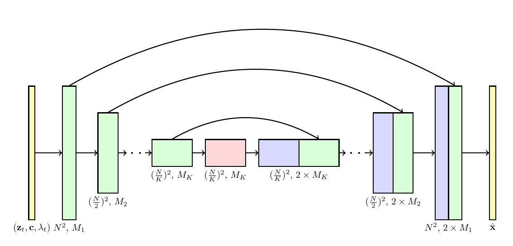
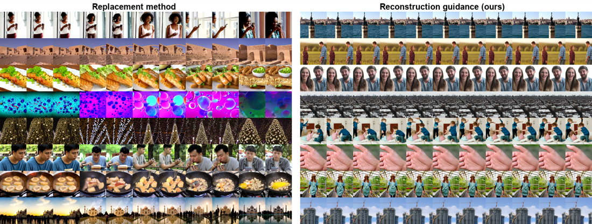

## 一句话定位
Video Diffusion Models（VDM，Jonathan Ho 等，Google，2022-04）是**第一个基于扩散模型的视频生成工作**，把图像扩散的 2D U-Net 直接扩展成"空间-时间因子化（space-time factorized）的 3D U-Net"，并提出**重建引导采样（reconstruction-guided / "gradient" sampling）**用于在无条件训练的模型上做自回归长视频外推与时空超分。在 UCF101 无条件生成（C3D 指标）上 FID **295±3 / IS 57±0.62**，大幅超过此前最佳 TGAN-v2 的 FID 3431（IS 接近真实数据的 60.2）；在 BAIR Robot Pushing 视频预测上 FVD **66.92**、Kinetics-600 上 FVD **16.2**，均刷新当时 SOTA，并首次给出大规模（1000 万对）文生视频结果。

## 背景与定位
2020–2021 年扩散模型已在图像（[[ddpm]]、[[improved-ddpm]]、GLIDE）和音频（WaveGrad/DiffWave）上做出高质量结果，但视频这一模态尚未验证。在此之前视频生成主流是 GAN（MoCoGAN、DVD-GAN、TGAN 系列）、VAE、normalizing flow（VideoFlow）和自回归 token 模型（VideoGPT、Video Transformer）。VDM 的核心主张是：**几乎不改动标准高斯扩散的公式（[46] Sohl-Dickstein 框架），只对网络架构做"直白"的改动以容纳视频，就能得到有效的视频生成器**。

它在脉络上：(1) 承接 [[ddpm]] / [[improved-ddpm]] 的 ε-/v-预测与 cosine 噪声调度、[[classifier-free-guidance]] 的无分类器引导、[[cascaded-diffusion-models]] 的级联超分思想；(2) 直接催生并支撑了同年晚些时候的 [[imagen-video]]（同组、级联七模型、像素空间）与 Meta 的 [[make-a-video]]；其因子化时空注意力与重建引导被后续大量视频扩散工作沿用。与并发工作 Yang et al.（用图像扩散逐帧 + RNN 时序自回归）不同，VDM 是**整块帧（block of frames）联合建模**。注意 VDM 工作在**像素空间**，不是潜空间方案（潜空间视频扩散要等到 Align-your-Latents / [[latent-diffusion-ldm]] 思路迁移到视频）。

## 模型架构

> 图源：Ho et al., "Video Diffusion Models" (arXiv:2204.03458), Figure 1 — 空间-时间因子化 3D U-Net 架构

**Backbone：空间-时间因子化 3D U-Net。** 从图像扩散标准 U-Net（Wide-ResNet 风格 2D 卷积残差块 + 空间注意力块）出发，做两处改动：

- **卷积空间化**：每个 2D 卷积改成"仅空间"的 3D 卷积，例如把 3×3 改成 **1×3×3**（第一轴 = 帧 / 时间，后两轴 = 高、宽），即卷积不跨时间混合。
- **插入时间注意力**：在每个空间注意力块（把帧轴当 batch、对空间做注意力）之后，插入一个**时间注意力块**（把空间两轴当 batch、对帧轴做注意力），并在时间注意力里用**相对位置编码（relative position embeddings）**，使网络区分帧序而不依赖绝对时间。

这种因子化时空注意力（借鉴 ViViT/TimeSformer/Axial Attention）计算高效。**关键设计**：因子化结构让"掩蔽成图像模式"变得极其简单——只要去掉时间注意力块内部的注意力运算（把注意力矩阵固定为每个时刻 query/key 自匹配的对角），整个网络就退化为独立处理单帧图像，从而**用同一套权重同时训练视频与图像目标**（见下文，对样本质量很重要）。

- **条件注入**：条件 c 与 log-SNR λt 作为 embedding 向量加进每个残差块（先经几层 MLP 处理再相加）。文生视频用 **BERT-large** 文本 embedding，经 attention pooling 后注入。
- **分辨率与参数策略**：每个模型只在固定帧数 × 固定分辨率上训练（如 16×64×64），靠采样阶段的条件技术外推到更长 / 更高分辨率。文生视频用级联：先 16×64×64 frameskip-4 基础模型，再 9×128×128 frameskip-1 模型做"同时空间超分 + 时序自回归扩展"。论文未给出总参数量数字（只给逐模型的 base channels / channel multipliers，见 Infra），属**未报告**。

## 数据
- **无条件 UCF101**：13,320 段人体动作视频（101 类），用 TF Datasets 自带 loader、**无额外预处理**，下采样到 64×64，建模 16 帧片段。
- **视频预测 BAIR Robot Pushing**：约 44,000 段机器人推物视频，64×64；条件 1 帧、预测后 15 帧；用 left-right flip 数据增强。
- **视频预测 Kinetics-600**：约 40 万训练视频、600 类活动，64×64；条件随机 5 帧子序列、预测后 11 帧。
- **文生视频**：**1000 万对 caption-视频**（10M captioned videos）。论文**未披露**该数据集的来源、采集、清洗过滤、美学/安全过滤、re-captioning 等细节（仅说用 BERT-large 编码 caption）。
- **图文联合训练的"图像"来源**：把随机独立图像帧拼到每段视频末尾——这些独立图像**取自同数据集内的随机视频帧**（不是外部图像数据集；论文称未来工作才考虑用更大图像数据集）。

## 训练方法
- **训练目标**：标准高斯扩散的加权 MSE 去噪损失（连续时间表述）。**ε-prediction** 为主、部分模型用 **v-prediction**（如 BAIR、Kinetics），采用 **cosine 噪声调度**，log-SNR 范围 [−20, 20]。
- **图文联合训练（关键 trick）**：把每段视频后接 0/4/8 帧独立图像，靠时间注意力掩蔽阻断视频帧与独立图像帧之间的信息混合。**消融**：在文生视频 16×64×64 上，独立图像帧从 0→4→8，FVD 202.28→68.11→**57.84**，FID-avg 37.52→18.62→**15.57**，视频与图像指标同步显著改善。作者解释为"对视频目标做偏置-方差权衡 / 减小 minibatch 梯度方差"的内存优化（一个 batch 塞更多独立样本）。
- **无分类器引导（[[classifier-free-guidance]]）**：˜ε = (1+w)εθ(z,c) − w·εθ(z)，与文生图一致——提高 IS 类指标、FID 类指标先降后升（w 过大反而变差）。文生视频实验里 frameskip-1 时 w=2.0 给到 FID-avg ~10.5。
- **采样器**：(1) 离散时间祖先采样器（ancestral，log-variance 插值超参 γ 控随机性）；(2) **predictor-corrector 采样器**——祖先步 + Langevin 校正步（步长 δ=0.1），与重建引导配合尤其有效。
- **重建引导采样（reconstruction guidance / "gradient method"，本文核心创新）**：解决"无条件训练的模型如何做条件外推/插值/超分"。前人的 **replacement / 插补法**（[48]）把已知部分 za 直接用前向过程样本替换，但作者发现视频上**不工作**——xb 单看不错却与 xa 不连贯，根因是 replacement 缺了一项 (σt²/αt)∇ log q(xa|zt)。VDM 把缺失项用高斯近似 q(xa|zt)≈N[x̂aθ(zt), (σt²/αt²)I]，得到对去噪输出的额外梯度修正项：
  - x̃bθ(zt) = x̂bθ(zt) − (wr·αt/2)·∇_{zbt} ‖xa − x̂aθ(zt)‖²
  - 这本质是一种基于"模型对条件数据的重建"的引导（类似 [[classifier-free-guidance]]/分类器引导），引导权重 wr>1 越大质量越好（论文实测 BAIR 用 wr=50、Kinetics 用 wr=9）。**消融**（16 帧模型扩展到 64×64×64，Table 6）：重建引导 FVD **136.22** vs replacement **451.45**，差距悬殊，证明时序连贯性大幅提升。该法同样适配**空间超分**（对模型输出的下采样版本施加 MSE 并反传过可微下采样），且可**同时**做"条件于低分辨率 + 时序自回归高分辨率扩展"。
- **关键超参（节选，详见附录）**：Adam（β2 多用 0.99）、lr 2e-4~3e-4、batch 128~256、EMA 0.999~0.9999、dropout 0~0.1、采样步 128~256（+Langevin 校正同等步数）。无蒸馏/一致性等加速方法（本文不涉及步数蒸馏）。

## Infra（训练 / 推理工程）
全部在 **TPU-v4** 上训练（像素空间，非潜空间），逐模型规模（附录 A）：

| 模型 | 分辨率 | base ch / mult | 硬件 | 训练步 |
|---|---|---|---|---|
| UCF101 | 16×64×64 | 256 / 1,2,4,8 | 128× TPU-v4 | 60k |
| BAIR | 16×64×64 | 128 / 1,2,3,4 | 128× TPU-v4 | 660k |
| Kinetics-600 | 16×64×64 | 256 / 1,2,4,8 | 256× TPU-v4 | 220k |
| 文生视频 small | 16×64×64 | 128 / 1,2,4,8 | 64× TPU-v4 | 200k |
| 文生视频 large | 16×64×64 | 256 / 1,2,4,8 | 128× TPU-v4 | 700k |
| 文生视频 large | 9×128×128 | 128 / 1,2,4,8,16 | 128× TPU-v4 | 800k |

注意头维 64（128×128 模型用 128），注意力分辨率 8/16/32。**未披露**总 GPU/TPU-小时、吞吐、并行/分布式具体策略、混合精度、推理延迟、参数量与量化等工程数字。推理加速方面本文只用"采样步数（128/256）+ Langevin 校正"，无蒸馏/缓存/量化。出于安全考虑**作者明确决定不发布模型**（无开源权重、无 HF/GitHub 代码仓）。

## 评测 benchmark（把效果讲清楚）

> 图源：Ho et al., "Video Diffusion Models" (arXiv:2204.03458), Figure 8 — 16 帧模型自回归扩展到 64 帧：左=replacement 法（时序不连贯），右=重建引导（ours，连贯），对应 Table 6 的 FVD 136 vs 451

评测指标：FVD（I3D 网络）、FID/IS（视频用 C3D，文生视频另用 Inception 跨帧平均）。

- **UCF101 无条件生成（16×64×64，C3D，10k 样本，Table 1）**：VDM **FID 295 ± 3 / IS 57 ± 0.62**；显著优于此前最佳 FID（TGAN-v2@64×64 的 3431±19；TGAN-F@128×128 7817；MoCoGAN 26998），IS 也远超各方法（DVD-GAN@128×128 IS 32.97、TGAN-v2@128×128 IS 28.87、VideoGPT@128×128 IS 24.69）。real data 仅报告 IS 60.2（论文未给 real-data FID），VDM 的 IS 57 已逼近真实数据上限。
- **BAIR Robot Pushing 视频预测（条件 1 帧→15 帧，FVD，Table 2）**：VDM 祖先采样 512 步 FVD **68.19**、Langevin 256 步 **66.92**；优于此前全部方法（NÜWA 86.9、FitVid 93.6、CCVS 99、DVD-GAN 109.8）。
- **Kinetics-600 视频预测（条件 5 帧→11 帧，FVD/IS，Table 3）**：VDM 祖先 256 步 FVD **18.6**、Langevin 128 步 **16.2 ± 0.34**（IS 15.64）；优于 Transframer 25.4、TrIVD-GAN-FP 25.74。（注：作者指出与 [33,14] 评测协议差异——若改用"有放回采样 + 不同随机种子"取 GT，FVD 从 16.2 升到 16.9，IS 不变。）
- **文生视频联合训练消融（16×64×64，4096 样本，Table 4）**：独立图像帧 0/4/8 → FVD 202.28/68.11/**57.84**，FID-avg 37.52/18.62/**15.57**，IS-avg 7.91/9.02/**9.32**——联合训练对视频与图像质量都关键。
- **文生视频无分类器引导消融（Table 5）**：frameskip-1 时 w=1/2/5 → FID-avg 12.49/**10.53**/13.54，IS-avg 10.80/13.22/14.80（IS 单调升、FID 先降后升），与文生图规律一致。
- **自回归扩展消融（16 帧模型扩展生成 64×64×64，Table 6）**：重建引导 vs replacement，FVD **136.22 vs 451.45**（w=2.0）、**133.92 vs 456.24**（w=5.0），FID-avg 13.77 vs 25.95（w=2.0），IS-avg 10.30 vs 7.00，重建引导大幅领先。

结论：VDM 在三个标准 benchmark 上同时刷新 SOTA，并通过消融证明三大要素（因子化 3D U-Net + 图文联合训练 + 重建引导/无分类器引导）各自的有效性。

## 创新点与影响
**核心贡献：** (1) **首个视频扩散模型**，证明几乎不改扩散公式、只改架构即可生成时序连贯视频；(2) **空间-时间因子化 3D U-Net**（仅空间卷积 + 时间注意力 + 相对位置编码），计算高效且天然支持图文联合训练（掩蔽即退化为图像模型）；(3) **图文联合训练**作为方差缩减 trick 大幅提升质量；(4) **重建引导采样（gradient method）**——从无条件模型导出条件采样，做长视频自回归外推、时序插值与空间超分，显著缓解了 replacement 法的时序不连贯问题；(5) 首次给出 1000 万对规模的文生视频结果。

**影响：** 直接奠定后续视频扩散范式——同组 [[imagen-video]] 的级联七模型像素空间方案、Meta [[make-a-video]] 的无配对视频先验、以及众多潜空间视频扩散（Align-your-Latents 等）都沿用因子化时空架构与/或重建引导思想；其"图文联合训练"与"无分类器引导迁移到视频"成为标准做法。

**已知局限：** 像素空间、低分辨率（最高 128×128）、短片段（9–16 帧基础块）、靠自回归拼接长视频导致误差累积；文生视频数据细节未公开；模型出于安全**未开源**；总算力/参数量等多项工程数字未披露；文本编码用 BERT-large（非 T5/CLIP），表达力弱于后续工作。作者亦自陈需审计社会/文化偏见。

## 原始链接
- paper (arXiv abs): https://arxiv.org/abs/2204.03458
- pdf: https://arxiv.org/pdf/2204.03458
- project page: https://video-diffusion.github.io/

## 本地落盘文件
- ../../../sources/omni/2022/arxiv-2204.03458.pdf
- ../../../sources/omni/2022/video-diffusion-models-vdm--project.html
