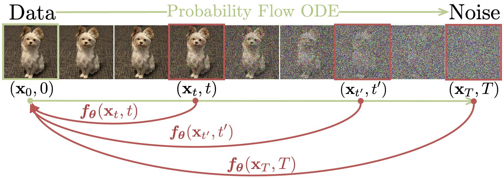
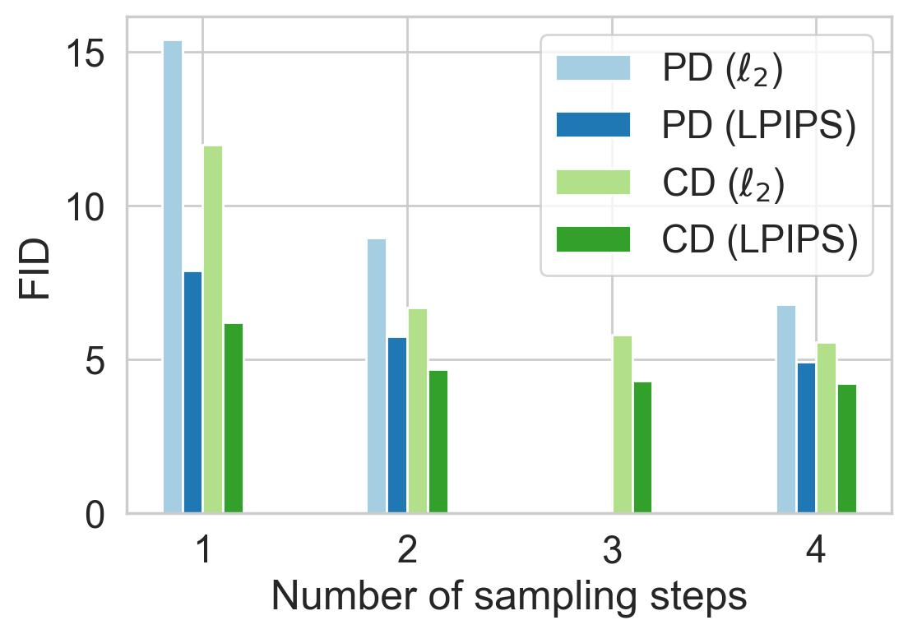

## 一句话定位
OpenAI（Yang Song、Prafulla Dhariwal、Mark Chen、Ilya Sutskever）提出的**一致性模型（Consistency Models）**，把扩散模型 PF-ODE 轨迹上任意一点直接映射回轨迹起点（干净数据），从而**单步（one-step）从噪声直接生成数据**，同时保留多步采样换质量与零样本编辑能力。其单步生成在 CIFAR-10 上取得 **FID 3.55**、在 ImageNet 64×64 上 **FID 6.20** 的当时蒸馏 SOTA，开创了 few-step 生成新范式（ICML 2023）。

## 背景与定位
扩散模型（[[ddpm]]、score-based、[[elucidating-edm]]）质量极高，但依赖迭代采样：用 ODE 求解器通常需要 10–2000 次网络评估，比 GAN/VAE/normalizing flow 等单步模型慢 10–2000 倍，限制实时应用。已有加速路线有两类：(1) 更快的数值 ODE 求解器（DDIM、DPM-solver、DEIS）——但仍需 >10 步；(2) 蒸馏（knowledge distillation、DFNO、progressive distillation/PD）——多数需先用昂贵 ODE/SDE 求解器**预先生成大量合成数据集**才能蒸馏，唯一不需要预构合成数据的是 progressive distillation（PD）。

一致性模型直接攻这个痛点：建立在连续时间扩散的 **Probability Flow (PF) ODE**（Song et al. 2021）之上，采用 [[elucidating-edm]]（Karras et al. 2022）的设定（μ=0、σ(t)=√(2t)、T=80、ϵ=0.002、pixel∈[−1,1]）。核心思想是学一个函数 f，把同一条 PF-ODE 轨迹上**任意** (x_t, t) 都映到轨迹原点 x_ϵ，这种"同一轨迹输出一致"即**自一致性（self-consistency）**。相比 PD 需要多轮逐次减半步数，一致性模型一次蒸馏即可单步生成；相比依赖合成数据集的蒸馏，它在线采样训练对、无需预构数据集；两种训练方式都**不需要对抗训练**，对架构约束极小。

## 模型架构

> 图源：Song et al., "Consistency Models" (arXiv:2303.01469) Figure 1

一致性模型不引入新 backbone，而是**复用扩散模型架构**，仅修改输出参数化以满足边界条件：

- **Backbone（U-Net 系）**：CIFAR-10 用 Song et al. (2021) 的 **NCSN++** 架构；ImageNet 64×64 与 LSUN Bedroom/Cat 256×256 用 Dhariwal & Nichol (2021)（[[diffusion-models-beat-gans]] guided-diffusion）的 U-Net 架构。与对应 [[elucidating-edm]] 模型完全同构，便于直接借用强力扩散架构并用预训练权重初始化。
- **一致性函数定义**：f: (x_t, t) ↦ x_ϵ，满足 f(x_t,t)=f(x_{t'},t') 对同一轨迹上任意 t,t'。
- **边界条件（boundary condition）**：必须满足 f(x_ϵ, ϵ)=x_ϵ，即 f(·,ϵ) 是恒等映射。这是一致性模型**最关键也最受限的架构约束**，并能阻止训练塌缩到平凡解 f≡0。
- **参数化（skip-connection 形式，论文全程采用）**：f_θ(x,t)=c_skip(t)·x + c_out(t)·F_θ(x,t)，其中 F_θ 是自由形式神经网络，要求 c_skip(ϵ)=1、c_out(ϵ)=0。沿用 [[elucidating-edm]] 的 preconditioning，但为满足 ϵ≠0 的边界条件做了平移修正：c_skip(t)=σ_data²/((t−ϵ)²+σ_data²)，c_out(t)=σ_data·(t−ϵ)/√(σ_data²+t²)，其中 **σ_data=0.5**。（另一种纯分段参数化 t=ϵ 时直接输出 x、否则输出 F_θ 也可，但因可微性较差未用于实验。）
- **条件**：ImageNet 64×64 为 class-conditional（类别标签注入，diffusers 示例中 class 145=king penguin）。无 text encoder——该工作是无条件/类条件图像生成方法，不涉及文生图。
- **分辨率**：直接在像素空间训练（非 latent），覆盖 32×32（CIFAR-10）、64×64（ImageNet）、256×256（LSUN）。

## 数据
该工作是生成方法研究，使用**标准公开图像数据集**，无网络爬取或 re-captioning：

- **CIFAR-10**（32×32，Krizhevsky 2009）
- **ImageNet 64×64**（Deng 2009，class-conditional）
- **LSUN Bedroom 256×256** 与 **LSUN Cat 256×256**（Yu 2015）
- 数据增强：所有模型、所有数据集均使用**水平翻转**。
- 蒸馏训练对的生成方式（CD）：从数据集采 x，按 SDE 转移密度 N(x, t²I) 采 x_{t_{n+1}}，再用一步数值 ODE 求解器得到相邻点 x̂_{t_n}，构成 PF-ODE 轨迹上的相邻对——**在线生成、无需预构合成数据集**。
- 配比/清洗/美学/安全过滤：不适用（标准学术数据集，未披露额外处理）。

## 训练方法
提出两种训练方式，均通过最小化"同一轨迹相邻点输出之差"来强制自一致性，并借鉴 RL（DQN）与对比学习（MoCo/BYOL）的**target network + EMA + stopgrad** 稳定训练：在线网络 f_θ，目标网络 f_{θ⁻}，θ⁻ ← stopgrad(μ·θ⁻ + (1−μ)·θ)。

**1) Consistency Distillation（CD，蒸馏模式，Algorithm 2）**
- 依赖预训练 score model s_ϕ（论文均自训 [[elucidating-edm]] 模型）。把 [ϵ,T] 离散成 N−1 段，边界用 [[elucidating-edm]] 公式 t_i=(ϵ^{1/ρ}+(i−1)/(N−1)·(T^{1/ρ}−ϵ^{1/ρ}))^ρ，ρ=7。
- 损失：L_CD = E[λ(t_n)·d(f_θ(x_{t_{n+1}},t_{n+1}), f_{θ⁻}(x̂^ϕ_{t_n},t_n))]，其中 x̂^ϕ_{t_n} 用一步 ODE 求解器（Euler 或 Heun）从 x_{t_{n+1}} 推得。
- 度量 d：比较 squared ℓ2、ℓ1、**LPIPS**——LPIPS 大幅最优。权重 λ(t_n)≡1 即可。
- 消融结论：ODE 求解器 **Heun（2 阶）> Euler（1 阶）**；离散步数 **N=18 最优**（N 足够大后对 N 不敏感）；与 Theorem 1 一致——高阶求解器同 N 下估计误差更小。
- 理论保证：Theorem 1，在 Lipschitz + ODE 局部误差 O(Δt^{p+1}) 条件下，若 L_CD=0 则估计误差 O((Δt)^p)，边界条件排除平凡解。
- 还给出连续时间（N→∞）蒸馏损失（Theorems 3–5），需 forward-mode 自动微分算 Jacobian-vector product；其中 stopgrad 版（Theorem 5）优于非 stopgrad 版，但整体**离散时间 CD 优于连续时间 CD**（连续时间方差更大，且离散可用高阶求解器）。

**2) Consistency Training（CT，独立训练模式，Algorithm 3）**
- **完全不依赖预训练扩散模型**，使一致性模型成为**独立的新生成模型族**。
- 用无偏 score 估计替换预训练 score：∇log p_t(x_t)=−E[(x_t−x)/t² | x_t]，即用 −(x_t−x)/t²。
- 损失：L_CT = E[λ(t_n)·d(f_θ(x+t_{n+1}·z, t_{n+1}), f_{θ⁻}(x+t_n·z, t_n))]，z~N(0,I)，**与扩散参数 ϕ 完全无关**。Theorem 2 证明 N→∞ 时 L_CD = L_CT + o(Δt)。
- 关键 trick——**渐进增大 N 的 schedule**：N 小（Δt 大）时 CT 损失"方差小、偏差大"利于初期快收敛，N 大时"方差大、偏差小"利于后期质量。故用 schedule 函数 N(k)=⌈√(k/K·((s1+1)²−s0²)+s0²)−1⌉+1 渐进增长离散步数，并配套 μ(k)=exp(s0·log μ0 / N(k)) 让 EMA 衰减率随 N 联动。CT 用 LPIPS，不需 Heun（损失不依赖具体求解器）。

**关键超参（Table 3）**
- 优化器：**Rectified Adam（RAdam）**，无学习率 decay/warmup、无 weight decay。
- CIFAR-10：lr 4e-4，batch 512，N=18（CD），ODE=Heun，EMA 0.9999，800k 迭代，FP16=No，dropout 0，**8 GPU**。
- ImageNet 64×64：lr 8e-6，batch 2048，N=40，CD 600k / CT 800k 迭代，EMA 0.999943，FP16=Yes，**64 GPU**。
- LSUN 256×256：lr 1e-5，batch 2048，N=40，CD 600k / CT 1000k 迭代，FP16=Yes，**64 GPU**；CD on Bedroom 用 zero EMA 效果更好。
- 蒸馏初始化：CD 用预训练 EDM 权重初始化；CT 随机初始化（但连续时间 CT 需从 EDM 初始化以稳定）。

## Infra（训练 / 推理工程）
- **硬件**：全部在 **Nvidia A100 GPU 集群**训练。GPU 数：CIFAR-10 用 8 卡，ImageNet 64×64 与 LSUN 256×256 用 **64 卡**。
- **混合精度**：CIFAR-10 不用 FP16；ImageNet/LSUN 用 **FP16 混合精度**。
- **训练规模**：迭代数 600k–1000k，batch 512–2048（自训的待蒸馏 EDM 在 LSUN 上 batch 从 4096 降到 2048，Bedroom 训 600k、Cat 训 300k 迭代）。具体 GPU·时未披露。
- **推理加速（核心卖点）**：**单次网络评估（NFE=1）即出图**，相比扩散模型的 79–2000 NFE 加速 1–2 个数量级；可通过 Algorithm 1 的多步采样（交替去噪+注噪）用更多 NFE 换质量；多步时间点 τ 用**贪心 + 三分搜索**逐个确定以优化 FID。
- **代码与部署**：官方仓库 `openai/consistency_models`（PyTorch，基于 `openai/guided-diffusion`，覆盖 ImageNet-64/LSUN-256）；CIFAR-10 实验为 JAX（`openai/consistency_models_cifar10`）。已集成进 HuggingFace **🧨 diffusers** 的 `ConsistencyModelPipeline`，`num_inference_steps=1` 单步采样，可用 `torch.compile()` 进一步提速。评测用 FID/Precision/Recall/IS（evaluator.py，沿用 guided-diffusion 协议）。

## 评测 benchmark（把效果讲清楚）

> 图源：Song et al., "Consistency Models" (arXiv:2303.01469) Figure 6 — ImageNet 64×64 上 CD（一致性蒸馏）vs PD（渐进蒸馏）随采样步数的 FID 对比，CD(LPIPS) 全程领先且单步即达 FID≈6

评测指标：FID（↓）、IS（↑）、Precision/Recall（↑）。NFE=网络评估次数。

**蒸馏对比（CIFAR-10，Table 1，FID↓）**
- **CD（1 NFE）FID 3.55**、**CD（2 NFE）FID 2.93** —— 当时单/双步蒸馏 **SOTA**。
- 对比同类蒸馏：PD 1 步 8.34 / 2 步 5.58；Knowledge Distillation*（需合成数据）9.36；DFNO* 4.12；1/2/3-Rectified Flow* 6.18/4.85/5.21。CD 在所有数据集、所有采样步数、所有度量上**一致优于 PD**（唯一例外：Bedroom 256 单步 CD-ℓ2 略逊 PD-ℓ2），且优于需预构合成数据的 KD 与 DFNO。
- 参考：多步扩散+求解器 DDIM 50 步 4.67、DPM-solver-fast 10 步 4.70、3-DEIS 10 步 4.17。

**蒸馏对比（ImageNet 64×64，Table 2，FID↓）**
- **CD（1 NFE）FID 6.20**、**CD（2 NFE）FID 4.70** —— 记录级单/双步成绩。
- 对比：PD 1 步 15.39 / 2 步 8.95；DFNO 1 步 8.35。参考全步扩散 ADM(250) 2.07、EDM(79) 2.44。

**直接生成（CT 作为独立生成模型，无预训练扩散）**
- CIFAR-10：**CT 1 步 FID 8.70**（IS 8.49）、**2 步 5.83**（IS 8.85）。超越所有单步非对抗模型（VAE/normalizing flow，如 Glow 48.9、Residual Flow 46.4、DC-VAE 17.9），并与 PD 单步质量相当；优于不少 GAN（如 AutoGAN 12.4、Diffusion GAN 14.6），但不及顶级 GAN（StyleGAN2-ADA 2.92、StyleGAN-XL 1.85）。
- ImageNet 64×64：CT 1 步 FID 13.0 / 2 步 11.1（Prec. 0.71/0.69）。
- LSUN Bedroom 256：CT 1 步 16.0 / 2 步 7.85；CD 1 步 7.80 / 2 步 5.22。
- LSUN Cat 256：CT 1 步 20.7 / 2 步 11.7；CD 1 步 11.0 / 2 步 8.84。

**重要消融/观察**
- 同一初始噪声下，独立训练的 CT 与 EDM 生成的样本**结构高度相似**，表明 CT **不易模式塌缩**（与 EDM 一致）。
- 度量函数：LPIPS 在 CD 与 CT 全程显著优于 ℓ1/ℓ2。
- 离散 vs 连续时间：CD 离散优于连续（连续方差大）；CT 连续优于离散（离散有 Δt>0 的偏差，连续无偏）。

**零样本编辑（无需任务专门训练，LSUN Bedroom CD 模型，Algorithm 4）**
支持 inpainting、colorization、super-resolution（32→256）、stroke-guided 生成（SDEdit 式）、denoising、插值，全部零样本。具体数值未报告（定性展示为主）。

## 创新点与影响
- **核心贡献**：(1) 提出自一致性这一全新建模原则，把 PF-ODE 轨迹任意点直接映射到原点，实现**设计即单步生成**；(2) 两种训练范式——CD（蒸馏现成扩散模型）与 CT（完全独立、无需扩散模型，成为新生成模型族）；(3) 均**无需对抗训练、无需预构合成数据集**，对架构约束极小；(4) 保留扩散的多步换质量与零样本编辑能力。
- **影响**：开启 **few-step / one-step 生成**新范式，直接催生后续大量加速工作——LCM（Latent Consistency Models，把一致性蒸馏搬到 [[latent-diffusion-ldm]] / Stable Diffusion 的 latent 空间）、LCM-LoRA、以及作者团队后续的 **iCT / Improved Consistency Training**（无需蒸馏即逼近扩散质量）与 sCM/连续时间一致性等。与 ADD/蒸馏路线共同推动实时文生图与扩散加速落地。已被 HuggingFace diffusers 标准化集成。
- **已知局限**：(1) 单步生成质量仍逊于顶级 GAN（StyleGAN-XL）；(2) CT 收敛对 N schedule 敏感，连续时间目标方差大、需从 EDM 初始化才稳；(3) 仅在无条件/类条件像素空间图像验证，未涉及大规模文生图、视频、音频；(4) 连续时间损失需 forward-mode 自动微分，部分框架支持不佳；(5) 多步时间点需贪心三分搜索调优，依赖 FID 单峰假设。

## 原始链接
- arxiv_abs: https://arxiv.org/abs/2303.01469
- arxiv_pdf: https://arxiv.org/pdf/2303.01469
- github: https://github.com/openai/consistency_models
- github (CIFAR-10/JAX): https://github.com/openai/consistency_models_cifar10
- huggingface (diffusers checkpoint): https://huggingface.co/openai/diffusers-cd_imagenet64_l2
- diffusers docs: https://huggingface.co/docs/diffusers/main/en/api/pipelines/consistency_models

## 一手源存档（sources/）
- [arxiv-2303.01469.pdf](https://arxiv.org/pdf/2303.01469)  （arXiv 原文 PDF，不入 git）
- [readme.md](https://github.com/zhao9797/ai-research/blob/main/sources/omni/2023/consistency-models--readme.md)
