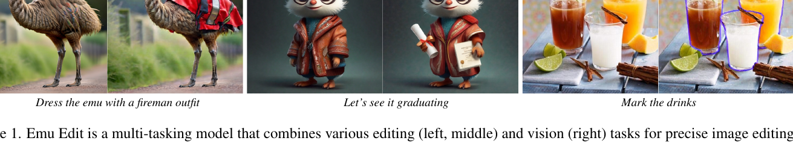
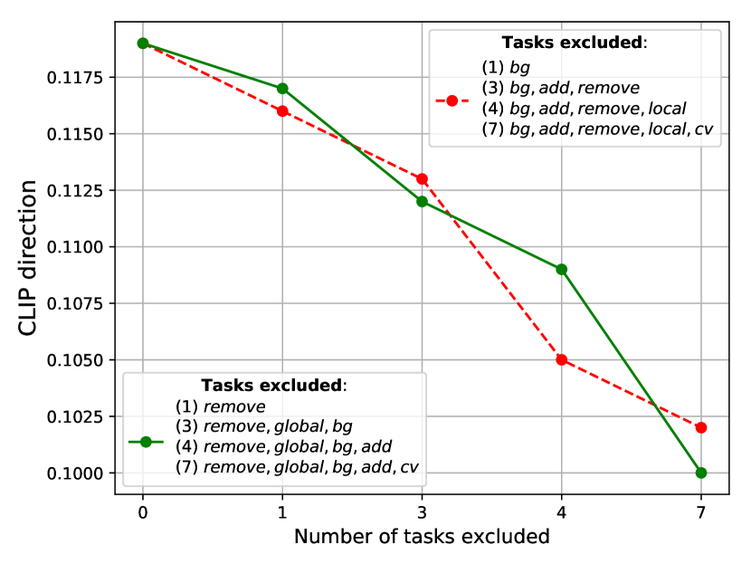

## 一句话定位
Emu Edit 是 Meta GenAI 提出的指令式图像编辑模型：把 16 种「编辑 + 识别 + 生成」任务统一成生成任务做多任务训练，并为每个任务学习一个 **task embedding** 注入 U-Net 来消解指令歧义，在 MagicBrush 与自建 Emu Edit benchmark 上的人评与自动指标全面刷新 SOTA（在自建测试集上 CLIPdir 0.109、CLIPout 0.231、DINO 0.819，人评对 InstructPix2Pix 77.3% 偏好率），并开源了覆盖 7 类编辑、test 集 3589 例的高质量评测基准。

## 背景与定位
指令式编辑（用一句自然语言「把茶杯换成花瓶」直接改图）此前以 [[instructpix2pix]] 为代表，但它有两大顽疾：(1) 指令理解不准、执行不精，对训练分布外的指令泛化差；(2) 训练数据全靠 Stable Diffusion 合成图 + GPT-3 合成指令，多样性/精度受限。MagicBrush 用人工在 DALL·E 2 编辑器上标注改善了数据，但又被该编辑器的能力边界所偏置。

Emu Edit 的核心论点：**编辑的目标不是产出一张「可信」的图，而是只改与指令相关的像素、其余原封不动**。为此作者把问题从「学一个编辑模型」升级为「学一个能多任务（含计算机视觉识别任务）的生成模型」，主张「把 CV 任务当成指令喂给生成模型，能带来前所未有的编辑控制力」。该工作与 Emu Video 同批发布（2023-11 Meta AI 博客），底座复用 Meta 自家的文生图基础模型 [[emu]]（Dai et al. 2023），技术脉络上承 [[latent-diffusion-ldm]] → [[emu]] → InstructPix2Pix 的指令编辑范式。

## 模型架构

> 图源：Emu Edit: Precise Image Editing via Recognition and Generation Tasks (arXiv:2311.10089) Figure 1（论文用以概括「单模型多任务」定位的 teaser，编辑+视觉任务统一；该工作无传统 pipeline 框图）

- **底座**：基于 Emu（[6]）的「scaled-down 版」latent diffusion 模型。Emu 原版是 2.8B 参数大 U-Net、16-channel autoencoder（encoder E / decoder D）、CLIP ViT-L + T5-XXL 双文本编码、11 亿图预训练。Emu Edit 实际用的是**缩小版**，文本条件改为 **CLIP ViT-L + T5-XL**（注意是 XL 不是 XXL），生成 **512×512** 分辨率。
- **backbone**：U-Net（ε-prediction 的 latent diffusion），非 DiT。
- **图像条件注入**：沿用 InstructPix2Pix 的做法，把待编辑图 cI 编码进 latent 后**拼接到 U-Net 输入通道**（增加输入通道数，新增权重零初始化），从而把纯文生图模型改造成「图 + 指令」条件的编辑模型。权重用 Emu 权重初始化。
- **指令条件**：编辑指令 cT 经文本编码后通过 cross-attention 注入。
- **关键创新 —— Learned Task Embedding**：为数据集中每个任务 i 学一个 embedding 向量 v_i（存在一张可学习的 embedding table 里），**与模型权重联合优化**。注入方式有两条：(1) 经 cross-attention 与 U-Net 交互；(2) 直接加到 timestep embedding 上。作用是当指令复杂或编辑类型有歧义时（如「把天空改成灰色」既可理解为 Global 也可理解为 Texture），给模型一个强条件把生成导向正确任务。推理时用一个微调过的 **Flan-T5-XL** 作为 task predictor，从指令预测任务下标。
- **CFG**：推理对图像与文本条件分别做 classifier-free guidance，图像 scale γ_I=1.5、文本 scale γ_T=5.0；并按 [12] 做 diffusion scheduler rescaling 使终端时刻达到 zero-SNR，避免训练/测试 mismatch。

## 数据
这是论文最重的部分——Meta 自建了一个**全新的 1000 万样本、16 个任务**的多任务编辑数据集（号称同类最大），每个样本是四元组 (cI 输入图, cT 指令, x 目标图, i 任务下标)。任务分三大类（Table 1）：
- **Region-based 编辑**：Local（替换物体/改属性）、Remove、Add、Texture（改外观不改结构）、Background。
- **Free-form 编辑**：Global（整图级编辑）、Style、Text Editing（增删改文字、字体/颜色）。
- **Vision 任务**：Detect（画 bbox）、Segment、Color（锐化/模糊/调色）、Image-to-Image Translation（sketch/depth/normal/pose/segmap 与图互转，双向）。

数据构造的两大关键工程：
1. **指令生成**：用对话版 **Llama-2-70B**，temperature=0.9、top-p=0.9。发现单 agent 生成所有任务会缺乏多样性且偏向特定任务，故为**每个任务**用 in-context learning 造一个 task-specific agent（给任务描述 + 少量 exemplar + 真实图 caption），让 LLM 输出 (1) 编辑指令 (2) 理想输出图的 caption (3) 需更新/新增的物体。为增多样性会 shuffle/随机抽 60% exemplar、随机替换动词。
2. **图像对生成（每任务一套独立 pipeline）**：核心是改进 InstructPix2Pix 所用的 Prompt-to-Prompt（P2P）。P2P 依赖输入/输出 caption 的逐词对齐来近似 mask，词不对齐时 mask 不准、结构/身份保不住。Emu Edit 提出 **Grounded Precise Editing**：先用 LLM 从指令定位编辑区，再用 **Grounding-DINO + SAM** 在生成前就造好精确 mask，编辑时做 **mask-based attention control**（前 blends 比例步用输入图的 noisy 版替换，其余步做 blending xt·m+(1−m)·yt，保结构）。针对 Add/Remove「替换成相似物而非真删」的问题，造三种 mask（精确 mask / dilation+高斯模糊扩张 mask / bbox mask）各生成再筛优。Style 用 PNP（对真实图做 DDIM inversion）、Text 用 OCR 取文字 mask 再 inpaint、Color 用图像滤镜（亮度/对比度/饱和度/色相调整、随机高斯模糊、锐化/虚焦）、im2im 沿用 ControlNet（[30]）的标注器从图像生成 depth/segmap/pose/normal/sketch 等条件图再双向配对。
3. **过滤**：四道闸 —— (i) task predictor 纠正错配任务的样本；(ii) CLIP 过滤指标（同 IP2P）；(iii) 基于输入/编辑图 depth map 的 L1 距离做结构保持过滤；(iv) 用检测器验证 Add 物体存在 / Remove 物体消失 / Local 物体被替换。该流程**过滤掉 70% 数据**，最终得 1000 万样本。

数据消融（Table 5）：在同一批 6000 样本上对比 Emu Edit pipeline vs InstructPix2Pix pipeline，逐任务全面胜出（如 Texture L1 0.189→0.033、DINO 0.671→0.923；Add L1 0.157→0.007）。

## 训练方法
- **训练目标**：标准 diffusion 去噪（ε-prediction）。基础目标式(1)：`min_θ E‖ε − ε_θ(z_t, t, E(cI), cT)‖²`；加上 task embedding 后变式(2)：`min_{θ,v_1..v_k} E‖ε − ε_θ(z_t, t, E(cI), cT, v_i)‖²`，即 **task embedding 与 U-Net 权重端到端联合训练**。
- **多任务而非专家**：作者验证「单模型多任务」优于「逐任务训练专家模型」（Table 7，多任务在 Local/Global/Add/Background 等的人评majority vote 上普遍胜出专家），且**任务越多性能越好**（Fig.8：逐步排除任务，Style/Texture 的 CLIPdir 单调下降）。尤其反直觉的发现：**加入检测/分割/im2im 等 CV 识别任务能提升编辑性能**——detect/segment 提升 region-based 编辑，im2im 提升 free-form 编辑（Table 4，去掉后人评胜率掉到约 50–60%）。
- **Task Inversion（少样本适配新任务）**：冻结 U-Net 全部权重，只学一个新 task embedding v_new（式(3)）。实验（Fig.6）显示：仅 1 个样本就能显著提升，100 个样本就逼近用 10 万样本训练的专家上界；task inversion 效果与「全量 finetune」相当，说明模型已具备所需信息、只需用新 embedding「query」即可。已验证可少样本泛化到 super-resolution(×4)、contour detection、mask-based inpainting、以及 add+detect 复合任务。
- **Sequential Edit Thresholding（多轮编辑保质）**：多轮反复编辑会累积重建/数值误差成噪点。方案：每轮后做 per-pixel 阈值——算输出与输入的 RGB L1 差 d，经低通滤波得 d̄，若 d̄<α 则保留输入像素、否则用新像素，取 α=0.03。
- **关键超参（Implementation Details, Sec.11）**：Adam optimizer，**batch size 512**，**learning rate 2e-5** + cosine decay + 2000 步 linear warmup，**训练 48,000 步**，分辨率 512×512。

## Infra（训练 / 推理工程）
论文未披露训练所用 GPU 数量、GPU·时、并行/分布式策略、混合精度与吞吐等系统级细节。能确定的工程量级仅：batch size 512、48k 步、512×512 分辨率（见上）。推理侧亦未报告步数蒸馏/量化/缓存等加速手段；该工作定位为基础研究（博客明确「purely fundamental research right now」），未发布权重或部署形态。**Infra 维度大部分未披露。**

## 评测 benchmark（把效果讲清楚）

> 图源：Emu Edit (arXiv:2311.10089) Figure 8 —— Style/Texture 任务的 CLIPdir 随逐步排除其它任务而单调下降，量化印证「训练任务越多、编辑性能越好」的跨任务增益。

**主结果（Table 2，对比 baseline）**——两个测试集，报告 CLIPdir / CLIPim / CLIPout / L1 / DINO + 人评（人评数字是「raters 偏好 Emu Edit 的百分比」，故 baseline 行的人评列其实是「Emu Edit 被偏好率」）：

- **Emu Edit 自建测试集**，Emu Edit (Our)：CLIPdir **0.109**、CLIPim 0.859、CLIPout 0.231、L1 0.094、DINO 0.819。
  - vs InstructPix2Pix：CLIPdir 0.078，人评 Emu Edit 被偏好 Text 77.33% / Image 76.71%。
  - vs MagicBrush：CLIPdir 0.090，人评 74.50% / 74.10%。
  - vs Null-Text Inv.（用了 GT caption）：CLIPdir 0.101，人评 81.63% / 85.47%。
  - PnP 在 CLIPdir 仅 0.028、DINO 0.153（几乎不保结构），人评 98.95% / 99.00% 压倒性偏好 Emu Edit。
- **MagicBrush 测试集**，Emu Edit (Our)：CLIPdir **0.135**、CLIPim 0.897、CLIPout 0.261、L1 0.052、DINO 0.879。
  - vs InstructPix2Pix 人评 71.79% / 71.60%；vs MagicBrush 59.54% / 60.39%；vs Null-Text Inv. 76.54% / 85.66%；vs PnP 97.24% / 96.96%。
  - 结论：除 Null-Text Inversion（因用 GT caption、与自动指标同源而占便宜）外，Emu Edit 在自动指标上也全面领先，人评则一致大幅领先所有 baseline。

**消融**：
- Task embedding（Table 3，验证集）：w/o task emb. CLIPdir 0.104 / DINO 0.792 → with predicted task 0.117 / 0.809 → with GT task 0.119 / 0.811。**预测任务已几乎追平 GT 上界**，证明 task predictor 有效、task 条件确实涨点。
- CV 任务贡献（Table 4）：去掉 detect/segment 后 region-based 人评胜率掉到 ~60%（即仍偏向带 CV 任务的完整模型）；去掉 im2im 后 free-form 人评 58–60%。
- 任务数量（Fig.8）：任务越多越好，且跨类增益（如 Background 任务能提升 Texture/Style）。

**Vision 任务零样本表现（Table 8，Emu Edit 未在这些数据集训练）**：检测 mAP@0.5 = **50.028**（MS-COCO）、语义分割 mIoU = **61.467**（ADE20K）、单目深度 RMSE = **0.246**（NYUv2）。说明生成式统一框架也能做识别任务。

**开源 benchmark（Emu Edit Test Set）**：取 MagicBrush 的输入图，crowd worker 三步标注（每个 (图,任务) 对由 3 个 worker 生成指令 → 5 个 worker 投票过滤无关项+多数表决定类 → 标注输入/输出 caption）。规模（HF 官方卡片）：**validation 2022 例、test 3589 例**，CC-BY-NC 4.0 许可，并额外发布了 Emu Edit 在 test 集上的生成结果（emu_edit_test_set_generations）供公平对比。注：arxiv v1 论文 Table 6 列的是 7 个任务 Add/Background/Color/Global/Remove/Local/Style（用 Color 而非 Texture），各任务样本数加和为 val 1759 / test 3055，**与 HF 卡片的 2022/3589 对不上**（差约 263/534，疑为 HF 发布版较 v1 表新增了一类任务或后续修订），故 benchmark 的精确任务构成以 HF 实际数据为准。

## 创新点与影响
- **核心贡献**：(1) 提出「编辑 + 识别 + 生成」16 任务统一为生成任务的多任务训练范式，实证 CV 识别任务能反哺编辑精度；(2) 提出 **learned task embedding** 消解指令歧义并支持 **task inversion** 少样本（甚至单样本）适配新任务而不动主干权重；(3) 一套逐任务定制、含 Grounded Precise Editing（DINO+SAM 预生成 mask）+ 四道过滤的高质量数据合成 pipeline，证明数据质量优于 InstructPix2Pix；(4) 开源更少偏置、更高多样性的 Emu Edit benchmark（7 类、test 3589 例）+ 模型生成结果，成为后续指令编辑工作的标准评测集之一。
- **影响**：Emu Edit benchmark + MagicBrush 成为指令编辑领域的常用评测组合；「多任务/把视觉理解任务纳入生成训练」「learned task embedding」「mask-guided 高保真数据合成」的思路被后续统一/编辑模型广泛借鉴。技术上承 [[emu]] 底座，是 Meta 把基础文生图模型产品化（Instagram 背景/风格编辑、Meta AI Imagine）研究脉络的一环。
- **已知局限**：(1) 缩小版 Emu 底座、512×512 分辨率，规模与分辨率受限；(2) 复杂推理型编辑（数物体、需要细粒度推理）仍弱，作者展望未来接入多模态 LLM；(3) 纯研究、未发布模型权重与推理加速方案，Infra/部署细节未公开；(4) 数据/标注依赖 Llama-2-70B 与 crowd worker，成本高、且继承底层合成图与 DINO/SAM 的偏置。

## 原始链接
- arxiv_abs: https://arxiv.org/abs/2311.10089
- arxiv_pdf: https://arxiv.org/pdf/2311.10089
- project_page: https://emu-edit.metademolab.com/
- official_blog: https://ai.meta.com/blog/emu-text-to-video-generation-image-editing-research/
- hf_benchmark: https://huggingface.co/datasets/facebook/emu_edit_test_set
- hf_generations: https://huggingface.co/datasets/facebook/emu_edit_test_set_generations

## 一手源存档（sources/）
- [arxiv-2311.10089.pdf](https://arxiv.org/pdf/2311.10089)  （arXiv 原文 PDF，不入 git）
- [project.md](https://github.com/zhao9797/ai-research/blob/main/sources/omni/2023/emu-edit--project.md)
- [meta-blog.md](https://github.com/zhao9797/ai-research/blob/main/sources/omni/2023/emu-edit--meta-blog.md)
- [hf-dataset-card.md](https://github.com/zhao9797/ai-research/blob/main/sources/omni/2023/emu-edit--hf-dataset-card.md)
