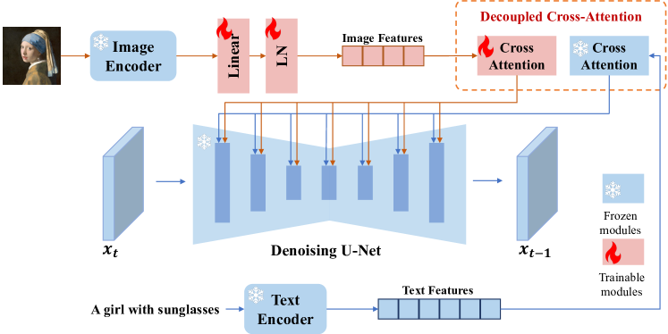

## 一句话定位
IP-Adapter 是一个仅 **22M 参数** 的轻量适配器，用「**解耦交叉注意力**（decoupled cross-attention）」给冻结的文生图扩散模型（SD）插上「图像 prompt」能力——为每个 cross-attention 层额外加一条只服务图像特征的 KV 分支。它在 COCO 上以 22M 参数取得 CLIP-I=0.828 / CLIP-T=0.588，**优于所有同类 adapter，并可比甚至超过 860M～1.2B 参数的全量微调图像 prompt 模型**；且训练一次即可复用到任何同基座微调模型、与 ControlNet 等结构控制工具叠加，并能图文混合 prompt。

## 背景与定位
文生图模型（[[stable-diffusion-1]]、Imagen、[[dall-e-2]]）虽强，但「写出好 text prompt」需要复杂的 prompt engineering，且文字难以表达复杂场景与概念——「一图胜千言」。给文生图模型加上「图像 prompt」于是成为刚需。此前路线有三类，各有硬伤：

- **从头训练支持图像 prompt**（unCLIP / Kandinsky / Versatile Diffusion）：参数大、成本高。
- **在 SD 上全量微调**（SD Image Variations、Stable unCLIP，把文本特征替换为 CLIP 图像 embedding 或加到 time embedding）：① 牺牲原有 text-to-image 能力；② 微调后的模型不可复用到其他同基座社区模型；③ 与 ControlNet 等工具不兼容。
- **轻量 adapter**（[[controlnet]] Shuffle、T2I-Adapter 的 style adapter、Uni-ControlNet 的 global controller、SeeCoder）：把 CLIP 图像特征经小网络映射后，**concatenate 进文本特征**再喂给原 cross-attention。但效果只达到「粗粒度可控」（如风格相近），远不及微调模型。

作者诊断核心病根：**原 cross-attention 的 K/V 投影权重是为文本特征训练的**，把图像特征拼进去只是「把图像特征对齐到文本特征空间」，从而丢失图像专有信息，导致只能做到粗粒度控制。IP-Adapter 的方案就是不去挤占文本通道，而是**给图像特征单独开一条 cross-attention 通道**。其灵感与 [[controlnet]] / T2I-Adapter 一脉相承（冻结主干、外挂可训练模块），但创新点在条件注入方式。

## 模型架构

> 图源：IP-Adapter 论文 Figure 2「The overall architecture of our proposed IP-Adapter with decoupled cross-attention strategy」（arXiv:2308.06721, https://ar5iv.labs.arxiv.org/html/2308.06721 ）

**Backbone**：标准 SD（基于 U-Net 的潜空间扩散模型，VAE 编解码到 latent，frozen CLIP text encoder 提供文本特征）。论文实现基于 **SD v1.5**。整套 IP-Adapter 由两部分组成：

**1) 图像编码器（image encoder）**
- 用预训练 **OpenCLIP ViT-H/14**（632M 参数，frozen）提取图像 prompt 的 **global image embedding**。
- 接一个小的 **projection 网络**：把 global embedding 投影成长度 **N=4** 的特征序列，维度与文本特征对齐。该投影网络仅由「一个 Linear 层 + 一个 LayerNorm」构成。

**2) 解耦交叉注意力（decoupled cross-attention）—— 核心**
- SD U-Net 中有 **16 个 cross-attention 层**。对每一层，IP-Adapter 在原文本 cross-attention 旁**新增一个只处理图像特征的 cross-attention 层**。
- **复用同一个 query**：图像 cross-attention 的 Q 与文本 cross-attention 完全相同（Q = Z·Wq），只为图像特征新增 **K′=ci·Wk′、V′=ci·Wv′** 两套权重。即每层只多 **Wk′、Wv′ 两个矩阵**。
- 输出 = 文本注意力输出 **直接相加** 图像注意力输出：
  `Z_new = Softmax(QKᵀ/√d)·V + Softmax(Q(K′)ᵀ/√d)·V′`
- **初始化技巧**：Wk′、Wv′ 用原文本层的 Wk、Wv 初始化，加速收敛。
- **可调权重 λ**：推理时 `Z_new = Attn(Q,K,V) + λ·Attn(Q,K′,V′)`，λ=0 退化为原文生图模型，λ 越大越贴近图像 prompt——这是「图文混合 prompt 平衡」的旋钮（README 推荐多模态场景 scale≈0.5）。

**参数量**：projection 网络 + 16 层的 (Wk′,Wv′)，合计约 **22M 可训练参数**，原 U-Net 全程冻结。

**Plus / 细粒度变体（来自论文消融 + 官方 README/模型卡）**
- **IP-Adapter-Plus**：不用 global embedding，而用 CLIP **倒数第二层的 grid/patch 特征**；用一个轻量 transformer 的 **query 网络**（16 个 learnable token，类 Resampler/Perceiver 思路）从 grid 特征抽信息。更贴近参考图，但会学到空间结构信息，可能降低生成多样性。
- **SDXL 版**：默认图像编码器为 **OpenCLIP ViT-bigG/14**（1.845B），另提供 `ip-adapter_sdxl_vit-h` 用 ViT-H；plus 系列在 SDXL 上统一用 ViT-H。
- **Face / FaceID 系列**（实验性，按官方 README 发布日志逐步发布）：
  - `plus-face`（2023-08-30）：用裁剪人脸图做条件（仍走 CLIP）。
  - **FaceID**（2023-12-20 起）：弃用 CLIP 图像 embedding，改用 **InsightFace 人脸识别模型（buffalo_l）的 face ID embedding**，并叠加 **LoRA** 提升 ID 一致性，可仅凭文本 prompt 换风格。
  - **FaceID-Plus**：face ID embedding（管身份）+ CLIP 图像 embedding（管脸部结构）双路。
  - **FaceID-PlusV2**：把 CLIP 结构 embedding 做成**可调权重**（s_scale）。
  - **FaceID-Portrait**：接受**多张人脸图（默认 5 张）增强相似度**，用 16 token、无 LoRA、无 ControlNet。

## 数据
- 训练集为自建多模态数据集，约 **1000 万 (10M) 图文对**，来自两个开源数据集：**LAION-2B** 与 **COYO-700M**。
- 预处理：图像短边 resize 到 512，再中心裁剪到 **512×512**。
- 数据清洗/过滤/美学/安全过滤等细节**未披露**；标注/re-caption 流程**未提及**（直接用原始图文对，作者注脚指出即便没有文本、仅用图像 prompt 也足以指导生成）。
- FaceID 系列受 InsightFace 与训练数据、基座、人脸识别模型限制，官方声明**仅供研究、不可商用**，泛化能力有限。

## 训练方法
- **训练目标**：沿用 SD 原始的 ε-prediction 去噪损失（DDPM 简化变分下界），只是条件扩展为「文本特征 ct + 图像特征 ci」：
  `L = E[‖ε − εθ(xt, ct, ci, t)‖²]`
- **只训练新增模块**：projection 网络 + 各层 (Wk′,Wv′)，原 U-Net + CLIP text/image encoder 全部冻结。
- **Classifier-free guidance（CFG）支持**：训练时随机丢弃条件——**5% 概率单独丢 text、5% 丢 image、5% 同时丢两者**；图像条件被丢弃时把 CLIP image embedding **置零**。推理时对图像/文本条件分别做 CFG。
- **超参（SD1.5 论文设定）**：8×V100 单机、batch=8/GPU、训练 **1M steps**；AdamW，固定 lr=1e-4、weight decay=0.01；DeepSpeed **ZeRO-2** 加速；HuggingFace diffusers 实现。
- **推理**：DDIM 50 步，guidance scale=7.5；仅用图像 prompt 时 text 置空、λ=1.0。
- **SDXL 两阶段训练 recipe（README 2023.9.8 披露）**：直接在 1024×1024 训练「极其低效」，改为**先在 512×512 预训练，再用多尺度策略 finetune**——作者顺带指出该策略或可用于加速 ControlNet 训练。
- 无蒸馏/一致性加速（IP-Adapter 本身是 adapter，加速由底层 sampler/社区蒸馏模型负责）。

## Infra（训练 / 推理工程）
- **训练算力**：单机 **8×V100**，DeepSpeed ZeRO-2，混合精度（README 训练脚本用 fp16），1M steps。整体训练成本相对全量微调极低（仅训 22M 参数）。
- **推理**：fp16；CLIP 图像编码一次前向 + 每个去噪步多一条图像 cross-attention。**SDXL 默认改用 ViT-H 而非 ViT-bigG** 的关键动机就是 infra——README 消融指出 bigG 比 H 大很多但效果无明显差异，**用更小的 H 可降低推理显存占用**。
- **吞吐/GPU·时**具体数字**未报告**。
- 部署形态：diffusers 原生支持（2023-11 合入）、safetensors、WebUI(sd-webui-controlnet)、ComfyUI、InvokeAI、AnimateDiff prompt-travel 等社区生态全面接入。

## 评测 benchmark（把效果讲清楚）

> 图源：官方 GitHub README 配图 `assets/demo/image_variations.jpg`（左：参考图 → 右：IP-Adapter 生成的 4 张变体），https://github.com/tencent-ailab/IP-Adapter

评测在 **COCO2017 验证集（5000 图带 caption）**上做：每个样本基于图像 prompt 生成 4 张，共 20000 张/方法。两指标（均用 CLIP ViT-L/14 计算）：
- **CLIP-I**：生成图与图像 prompt 的 CLIP 图像 embedding 相似度（衡量对参考图的忠实度）；
- **CLIP-T**：生成图与图像 prompt 的 caption 的 CLIPScore（衡量文本对齐/语义保留）。

**Table 1 关键数字**（↑ 越大越好）：

| 类别 | 方法 | 可训练参数 | CLIP-T↑ | CLIP-I↑ |
|---|---|---|---|---|
| 从头训练 | Open unCLIP | 893M | 0.608 | 0.858 |
| 从头训练 | Kandinsky-2-1 | 1229M | 0.599 | 0.855 |
| 从头训练 | Versatile Diffusion | 860M | 0.587 | 0.830 |
| 全量微调 | SD Image Variations | 860M | 0.548 | 0.760 |
| 全量微调 | SD unCLIP | 870M | 0.584 | 0.810 |
| Adapter | Uni-ControlNet (Global) | 47M | 0.506 | 0.736 |
| Adapter | T2I-Adapter (Style) | 39M | 0.485 | 0.648 |
| Adapter | ControlNet Shuffle | 361M | 0.421 | 0.616 |
| **Adapter** | **IP-Adapter** | **22M** | **0.588** | **0.828** |

读法：
- **碾压同类 adapter**：CLIP-I 0.828 远超 Uni-ControlNet(0.736)/T2I-Adapter(0.648)/ControlNet Shuffle(0.616)；CLIP-T 也最高（0.588）。
- **以 22M 打平/超过 860M+ 全量微调**：CLIP-I 0.828 > SD unCLIP(0.810) > SD Image Variations(0.760)；CLIP-T 0.588 也优于两者。
- **接近从头训练的大模型**：CLIP-I 仅略低于 Open unCLIP(0.858)/Kandinsky(0.855)，但参数量是其 1/40～1/56。

**额外能力（仅 IP-Adapter 同时满足）**：可复用到同基座定制模型 ✓、兼容结构控制工具 ✓、支持图文多模态 prompt ✓——三项其他方法均不全。

**消融结论**：
1) **解耦 vs 简单拼接**：与不解耦的 simple adapter（图像特征直接 concat 进文本特征再喂原 cross-attention）在同配置训 200k step 对比，IP-Adapter 在图像质量与对参考图的一致性上均更优——验证「解耦」是核心。
2) **global vs fine-grained 特征**：细粒度（Plus）特征更贴合参考图，但会学到空间结构、降低多样性；可叠加 text/structure 条件（如人体 pose）找回多样性。

**定性**：在 image variation、image-to-image/inpainting（配 SDEdit）、结构控制（配 ControlNet/T2I-Adapter）、多模态 prompt（配 Realistic Vision 等社区模型）多场景下，质量与对齐普遍优于 Versatile Diffusion / BLIP-Diffusion / Uni-ControlNet / T2I-Adapter / ControlNet Shuffle / ControlNet Reference-only。FaceID/人脸场景无量化指标，官方仅给定性结果并声明「未达完美 ID 一致性/写实度」。

## 创新点与影响
**核心贡献**
1. **解耦交叉注意力**：诊断出「文本/图像特征挤同一 cross-attention」是粗粒度控制的根因，提出为图像特征**独立开 KV 分支并相加**，每层仅多 Wk′/Wv′，22M 参数即达微调模型水平——简单、轻量、可解释。
2. **冻结主干 → 极强可迁移性**：训练一次即可零成本复用到任何 SD 同基座社区模型（Realistic Vision、Anything v4、ReV Animated，甚至 SD v1.4）；与 ControlNet/T2I-Adapter 即插叠加；λ 旋钮实现图文混合 prompt。

**影响**
- 成为开源生态**事实标准**的图像参考/风格/人脸注入组件：diffusers 原生支持，WebUI、ComfyUI（ComfyUI_IPAdapter_plus 等）、InvokeAI 普遍内置。
- 衍生与启发大量后续工作：**InstantStyle**（基于 IP-Adapter 的风格迁移）、**InstantID / PhotoMaker** 等身份保持方案、以及把「解耦 cross-attention 注入参考」范式带入视频（AnimateDiff prompt-travel）与各类定制化生成。FaceID 系列把人脸识别 embedding + LoRA 引入 ID 一致性，是低成本「换脸/写真」路线的开端之一。
- 验证了「冻结大模型 + 轻量旁路注入新模态条件」这一通用 adapter 哲学在生成式视觉里的有效性。

**已知局限**
- 只能让生成图在**内容与风格**上「相似」于参考图，**无法做到主体级高度一致**（不及 [[textual-inversion]] / [[dreambooth]] 的 subject-driven 保真），作者明确将「更强一致性」列为未来工作。
- Plus 细粒度版以多样性换一致性。
- 非正方形图因 CLIP 中心裁剪会丢边缘信息（README 建议直接 resize 到 224×224）。
- FaceID 系列受 InsightFace 许可限制，**仅研究用途、不可商用**；ID 一致性与写实度未臻完美。

## 原始链接
- arxiv_abs: https://arxiv.org/abs/2308.06721
- arxiv_pdf: https://arxiv.org/pdf/2308.06721
- github: https://github.com/tencent-ailab/IP-Adapter
- project_page: https://ip-adapter.github.io
- hf_modelcard: https://huggingface.co/h94/IP-Adapter
- hf_faceid_card: https://huggingface.co/h94/IP-Adapter-FaceID

## 本地落盘文件
- ../../../sources/omni/2023/arxiv-2308.06721.pdf
- ../../../sources/omni/2023/ip-adapter--readme.md
- ../../../sources/omni/2023/ip-adapter--hf-modelcard.md
- ../../../sources/omni/2023/ip-adapter--hf-faceid-card.md
