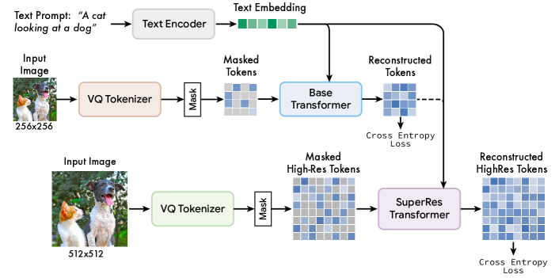
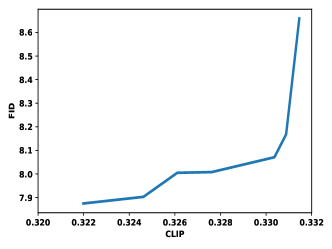

## 一句话定位
Muse 是 Google Research 提出的文生图模型，用**掩码生成式 Transformer 在离散 VQGAN token 空间**上做**并行解码**（一次前向预测多个 token，base 仅 24 步、super-res 仅 8 步），在效率上碾压扩散/自回归路线——3B 模型生成 512×512 单图仅 1.3s（TPUv4），比 Imagen-3B / Parti-3B 快 >10×、比 Stable Diffusion v1.4 快 3×；质量上 zero-shot COCO FID 7.88、CLIP 0.32（CLIP 高于 Imagen 的 0.27），CC3M 上 900M 模型 FID 6.06 创当时 SOTA，且天然支持零样本 inpainting / outpainting / mask-free 编辑（无需微调或反演）。

## 背景与定位
2022 年文生图被两条路线主导：像素空间级联扩散（[[imagen]]、DALL-E 2 / [[dall-e-2]]）与离散 token 自回归（[[parti]]、DALL-E）。前者推理需上百步去噪，后者需逐 token 串行解码（256 或 4096 步），都很慢。Muse 走第三条路——把 [[maskgit]]（Chang et al., CVPR 2022，同一作者）的**掩码生成式建模（masked generative modeling）**从类条件扩展到大规模文生图：在 VQGAN 离散 token 上训练一个 BERT 式掩码预测器，推理时按置信度并行解码，可视为以 `[MASK]` 为吸收态（absorbing state）的**离散扩散过程**（Austin et al., 2021）。

相对前置工作的关键改进与继承：
- 继承 [[imagen]] 的核心发现——**冻结的预训练 LLM（T5-XXL）作为文本编码器**对高质量、强语义对齐至关重要；论文初期实验中"从训练数据从头学语言模型"在长 prompt / 罕见词上显著更差。
- 继承 [[maskgit]] 的**cosine 掩码调度 + 并行迭代解码**，把它扩到 3B 参数、460M 图文对、512×512 分辨率。
- 相对 [[latent-diffusion-ldm]]（Stable Diffusion）：两者都在 VQGAN 隐空间工作，但 Muse 用掩码 token 预测取代隐空间扩散，迭代步数从数十/数百降到个位数～二十几步，因而更快。
- 掩码训练的副产品：**随机可变掩码率**让模型学到 `P(x_i | x_Λ)`（任意子集条件），从而**开箱即用地支持零样本编辑**，无需像扩散编辑那样反演（inversion）。

定位意义：Muse 是"统一掩码生成（masked generative）"路线在文生图上的标志性工作，影响了后续 MaskGIT 系、MAGE、以及把离散 token + 并行/掩码解码与自回归/扩散对比的一系列研究，也是"非扩散、非自回归亦可达扩散质量且更快"的有力证据。

## 模型架构

> 图源：Muse: Text-To-Image Generation via Masked Generative Transformers (arXiv:2301.00704) Figure 3 — Muse Framework

Muse 是**多子模型级联（cascade）**，除 VQGAN 外全部基于 Transformer。整体含 5 个部件（见论文 Figure 3）：

1. **冻结文本编码器 T5-XXL**（4.6B 参数，不参与训练）：输入 caption → 一串 4096 维语言嵌入，再线性投影到 Transformer 隐维度。论文强调 T5 嵌入携带名词（物体）、动词（动作）、形容词（视觉属性）、介词（空间关系）、基数（cardinality）与组合等丰富语义。

2. **两个 VQGAN "tokenizer"**（编码器+量化层+解码器，全卷积、去掉 non-local block 以支持任意分辨率）：
   - **低分辨率 VQGAN**：下采样比 `f=16`，256×256 图 → **16×16 = 256 个 token**，给 base 模型用。
   - **高分辨率 VQGAN**：下采样比 `f=8`，512×512 图 → **64×64 = 4096 个 token**，给 super-res 用。
   - **codebook 大小 8192**（论文实测更大 codebook 无增益）；base VQGAN 每分辨率 2 个 residual block、base 通道 128；论文正文另提到 tokenizer 用了 19 个 ResNet block 的 CNN。

3. **Base 掩码 Transformer**（参数主体）：输入 = 投影后的 T5 嵌入（全部不掩码） + 部分掩码的低分辨率图像 token（被掩位置替换为 `[MASK]`）。结构含 self-attention（图像 token 间）+ cross-attention（文本→图像）+ MLP；输出层 MLP 把每个被掩 token 映射到 codebook 大小的 logits，交叉熵损失对齐 ground-truth token。**最大 base 模型 3B 参数 = 48 层、hidden 2048、MLP 8192**。训练时一次预测所有被掩 token，推理时改为迭代并行解码。

4. **Super-Resolution Transformer**：把 base 输出的 16×16 低分辨率 token "翻译"到 64×64 高分辨率 token（再由高分辨率 VQGAN 解码成 512×512 图）。论文发现直接预测 512×512 会让模型偏重低级细节而忽略大尺度语义，故采用级联。结构：先用 **16 层** self-attention Transformer 编码低分辨率 token，与文本嵌入拼接后，对被掩高分辨率 token 做 **cross-attention**；用 **multi-axis attention**（Zhao et al., 2021）层处理高分辨率序列；配置为 **32 层、hidden 1024、MLP 4096**。同样用文本条件 + 交叉熵掩码预测。

5. **解码器微调（Decoder Finetuning）**：在不动 VQGAN 编码器/codebook/两个 Transformer 的前提下，给 VQGAN **解码器**加更多 residual layer 与通道（微调解码器：每分辨率 4 个 residual block、base 通道 256），只微调新增解码层。因 token "语言"不变，可在不重训其他组件的情况下提升细节（招牌、门牌号、窗栏等更清晰，见 Figure 13）。

模型规模谱系：image decoder 从 **632M 到 3B**（文中也提到 600M～3B、900M=632M base+268M super-res 这一档），T5-XXL 额外 4.6B（冻结）。

关键架构设计点：**分辨率分级（base 16×16 → super-res 64×64）**、**离散 token + 分类损失（而非回归）**、**全卷积 tokenizer 支持任意分辨率**、**文本以 cross-attention 注入**、**2D 学习位置嵌入**。

## 数据
- **大规模文生图训练**：使用 **Imagen 数据集，约 460M 文本-图像对**（Saharia et al., 2022，与 Imagen 同源）。
- **CC3M 对照实验**：Conceptual Captions 3M（Sharma et al., 2018），用于"训练+评测均在 CC3M"的同分布 SOTA 对比。
- **清洗/过滤/re-captioning/合成数据/美学与安全过滤的具体配比**：**论文未披露**（仅引用 Imagen 数据集，未给出本工作自己的清洗、配比、re-caption 流程细节）。
- 论文在"Social Impact"一节坦承大规模自动爬取数据集存在偏见、同意、刻板印象等问题，并据此**选择不开源代码与公开 demo**。

## 训练方法
- **训练目标：掩码 token 预测（masked-token modeling）+ 交叉熵**。每个样本采**可变掩码率 r**，从截断 arccos 分布采样，密度 `p(r) = (2/π)(1−r²)^(−1/2)`，**期望掩码率 0.64**，强偏向高掩码率（让预测更难）。可变掩码率使模型学到任意子集条件分布，既支撑并行采样也支撑零样本编辑。
- **Classifier-Free Guidance (CFG)**：训练时 **10% 样本随机去掉文本条件**（退化为图像 token 自注意力）；推理 `l_g = (1+t)·l_c − t·l_u`。创新点：**采样过程中线性增大 guidance scale t**——早期 token 低/无引导以保多样性，后期增大引导以贴合 prompt，缓解 CFG "牺牲多样性换保真"的代价。复用该机制实现**负向提示（NegPrompt）**：把无条件 logit 换成负 prompt 条件 logit。
- **多阶段训练顺序**：先训 VQGAN tokenizer → 训 base 掩码 Transformer → 训 super-res Transformer（在 base 训完之后）→ 最后微调 VQGAN 解码器。**未使用 SFT / RLHF / DPO / reward model**（这是 2023 初的 base 生成模型，无偏好对齐阶段）。
- **EMA 的省显存做法**：为省 TPU 显存训练时**不在线做 EMA**，而是每 5000 步存 checkpoint，**离线对 checkpoint 做 EMA（decay 0.7）**得到最终权重。
- **优化器与超参（附录 Table 4/5/6）**：
  - Base 3B：AdaFactor，lr 1e-4，weight decay 0.045，β1=0.9 β2=0.96，batch 512，cosine decay，warmup 5000，**训练步数 1.5M（附录）**——注：正文 §3 写"1M steps"，两处略有出入，以附录 Table 4 的 1.5M 为详细配置、正文 1M 可能为约数或不同档模型，**论文未明确解释差异**。
  - VQGAN：Adam，判别器/生成器 lr 各 1e-4，wd 1e-4，β2=0.99，batch 256，warmup 10000，训练 1M 步；感知损失权重 0.05、对抗损失权重 0.1。
  - Super-res：AdaFactor，lr 1e-4，wd 0.045，batch 512，warmup 5000，训练 1M 步。
- **用 AdaFactor 的动机**：省显存，使 **3B 模型无需模型并行**即可单独装下。
- **蒸馏/加速**：本工作**未做**步数蒸馏（consistency/LCM/ADD 等）；论文明确指出 Muse 的加速来自离散 token + 并行解码本身，并把蒸馏列为未来可行方向。

## Infra（训练 / 推理工程）
- **训练算力**：base 模型在 **512-core TPU-v4** 上，batch 512，跑 1M 步，**约 1 周**。
- **省显存策略**：AdaFactor + 离线 EMA，使 3B 模型**无需模型并行**。
- **推理加速核心 = 并行迭代解码（cosine 调度）**：每步按 cosine schedule 取置信度最高的一批被掩 token 定下、不再改，逐步缩小掩码集合。**base 模型 256 token 仅 24 步**、**super-res 4096 token 仅 8 步**（对比自回归需 256/4096 步、扩散需上百步）。super-res 因有低分辨率 token 条件，收敛所需步数更少。
- **推理时延（TPUv4 内部基准，论文 Table 3 / 项目页表）**：

  | 模型 | 分辨率 | 单批推理时间 |
  |---|---|---|
  | Muse-3B | 256×256 | **0.5s** |
  | Muse-3B | 512×512 | **1.3s** |
  | Parti-3B | 256×256 | 6.4s |
  | Imagen | 256×256 | 9.1s |
  | Imagen | 1024×1024 | 13.3s |
  | LDM/SD v1.4（50 步） | 512×512 | 3.7s（A100，最佳报告值）|
  | LDM（250 步，用于达 FID 的配置） | 512×512 | 18.5s |

  注：Muse/Imagen/Parti 在 TPUv4 内部基准；SD/LDM 取 Lambda Labs 在 A100 上的最佳报告值（论文称其 TPU 实现并不更快）。结论：Muse 比 Imagen-3B / Parti-3B 快 >10×、比 SD v1.4 快 ~3×（尽管 Muse 参数约为 SD 的 3 倍）。
- **交互式编辑**（项目页）：每次更新 760ms = base 模型 1 次前向 + super-res 8 次前向，可实时交互编辑。
- **量化 / 部署形态**：论文**未披露**量化方案；且**明确不开源代码、不放公开 demo**（出于滥用与数据偏见的伦理考量）。

## 评测 benchmark（把效果讲清楚）

> 图源：Muse: Text-To-Image Generation via Masked Generative Transformers (arXiv:2301.00704) Figure 8 — CLIP vs. FID tradeoff curve

**CC3M（训练+评测同分布，Table 1）**——Muse 创当时 SOTA：

| 方法 | 类型 | 参数 | FID↓ | CLIP↑ |
|---|---|---|---|---|
| VQGAN | 自回归 | 600M | 28.86 | 0.20 |
| ImageBART | 扩散+自回归 | 2.8B | 22.61 | 0.23 |
| LDM-4 | 扩散 | 645M | 17.01 | 0.24 |
| RQ-Transformer | 自回归 | 654M | 12.33 | 0.26 |
| Draft-and-revise | 非自回归 | 654M | 9.65 | 0.26 |
| **Muse (base)** | 非自回归 | 632M | **6.8** | 0.25 |
| **Muse (base+super-res)** | 非自回归 | 632M+268M | **6.06** | 0.26 |

**Zero-shot MS-COCO 256×256（Table 2）**——与同期大模型对比：

| 方法 | 类型 | Zero-shot FID-30K↓ | CLIP↑ |
|---|---|---|---|
| DALL-E | 自回归 | 17.89 | - |
| LDM | 扩散 | 12.63 | - |
| GLIDE | 扩散 | 12.24 | - |
| DALL-E 2 | 扩散 | 10.39 | - |
| Imagen-3.4B | 扩散 | **7.27** | 0.27 |
| Parti-3B | 自回归 | 8.10 | - |
| Parti-20B | 自回归 | **7.23** | - |
| **Muse-3B** | 非自回归 | **7.88** | **0.32** |

解读：Muse-3B 的 FID 7.88 略优于参数相当的 Parti-3B（8.10），略逊于 Imagen（7.27）与 Parti-20B（7.23）；但 **CLIP 0.32 显著高于 Imagen 的 0.27/0.29**（Imagen 在 FID 7.27 时 CLIP 仅约 0.27；其 CLIP 0.29 需牺牲 FID 到约 20）。论文据 Figure 8 给出 CLIP-FID Pareto 前沿（FID 7.9～8.6 对应 CLIP 0.320～0.332），说明 Muse 在对齐-保真权衡上表现强。

**人评（PartiPrompts 1650 prompt，5 名匿名评分者，每 prompt 取 16 张中 CLIP 最高一张，对比 SD v1.4）**：≥3 人共识下，**Muse 对齐更好占 70.6%**、SD 更好占 25.4%、无共识 4%，即 Muse 对齐能力约 **2.7×** 于 SD v1.4。论文有意**不做"真实感"人评**，理由是 mode-collapse 模型会在该题上虚高，realism 只在对齐相近的模型间才有意义。

**关键消融/结论**：
- 大 codebook（>8192）无增益。
- 用 **VQGAN 优于 ViT-VQGAN**（论文实测），且指出"更好的 tokenizer 不一定带来更好的文生图"。
- **冻结预训练 LLM > 从头学语言模型**，尤其长 prompt / 罕见词。
- super-res 级联优于直接生成 512（避免偏重低级细节）。
- 解码器微调显著改善细节保真（定性，Figure 13）。

**编辑评测**：inpainting/outpainting/mask-free editing 均为**零样本定性展示**（Figure 2/10/11/12，项目页 GIF），mask-free 编辑做法为"Gibbs 采样式"迭代——每轮重采 8% token、共 100 轮、guidance scale 4、token logits 上做 top-k(k=3) 防发散。**论文未在 GEdit/MagicBrush 等编辑基准上报数字**（这些基准多为后续工作），亦无视频 VBench（Muse 不涉视频）。

## 创新点与影响
**核心贡献**：
1. 首次把**掩码生成式 Transformer（MaskGIT 路线）规模化到大规模文生图**（3B、460M 图文对、512），证明非扩散、非自回归路线可达扩散级质量。
2. **离散 token + 并行迭代解码**带来数量级推理加速（base 24 步 / super-res 8 步；512×512 单图 1.3s），同时通过冻结 T5-XXL 维持强语义对齐（CLIP 0.32 超 Imagen）。
3. **可变掩码率训练**天然解锁**零样本 inpainting / outpainting / mask-free 编辑**，无需微调或反演——这是相对扩散编辑的工程优势。
4. 工程 trick：采样中线性增大 CFG guidance、负向提示复用 CFG、离线 EMA 省显存、VQGAN 解码器微调解耦细节提升。

**对后续工作的影响**：成为"统一掩码生成"路线的代表作，推动后续把离散 token + 并行/掩码解码作为扩散/自回归之外的第三极进行系统对比；其"冻结 LLM 文本编码器至关重要"再次印证 Imagen 结论，影响后续 T2I 文本编码选型；解码器微调、CFG 调度、掩码编辑等做法被后续复用。

**已知局限（论文坦陈）**：
- **长多词短语直接渲染易出错**（重复或只渲染部分），文字渲染仍弱。
- **高基数计数易错**（如"10 个酒瓶"常只画 7 个），基数越大越差；**多基数 prompt**（"4 只猫和 3 只狗"）常至少错一个。
- 数据集偏见、滥用风险促使作者**不开源代码与 demo**，并明确不建议在缺乏用例审视的情况下用于生成人物/人脸。
- 未与扩散加速法（progressive distillation、DPM-Solver 等更快 ODE 解法）直接对比，留作未来工作。

## 原始链接
- arxiv_abs: https://arxiv.org/abs/2301.00704
- arxiv_pdf: https://arxiv.org/pdf/2301.00704
- project_page: https://muse-model.github.io/
- 备注：Google Research **未发布**官方独立博客、代码仓库、HuggingFace/ModelScope 权重或公开 demo（论文 §5 明确出于伦理考量不开源）。已检索确认无官方代码/权重一手源。

## 本地落盘文件
- ../../../sources/omni/2023/arxiv-2301.00704.pdf
- ../../../sources/omni/2023/muse--project-page.md
