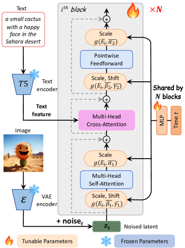
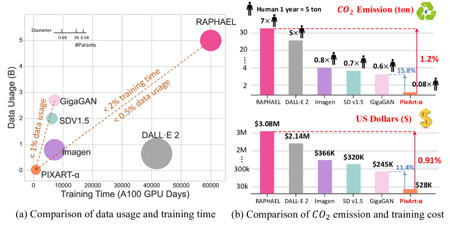

## 一句话定位
PixArt-α 是首个把 **DiT（Diffusion Transformer）成功用于文生图**、且做到“接近商用质量”的开源工作：在 DiT 中插入 **cross-attention 注入 T5 文本条件**，配合“**三阶段训练分解 + adaLN-single 参数瘦身 + LLaVA 高密度 re-caption**”三招，仅用 **753 A100 GPU-days / 约 25M 图、约 2.6–2.8 万美元**就训出 1024px T2I 模型——训练算力约为 Stable Diffusion v1.5 的 **~12%（753 vs 6250 A100 days，论文口径；README/项目页另给 675 days = 10.8% 的圆整口径）**、RAPHAEL 的 **~1%**，COCO 零样本 **FID-30K = 7.32**，在 T2I-CompBench 6 个子项上 **5 项取全表最优**（Color/Shape/Texture/Spatial/Complex；仅 Non-Spatial 略逊 GORS），且对 SDXL 6 项全胜。ICLR 2024 Spotlight。

## 背景与定位
2023 年的主流文生图（SD、Imagen、DALL·E 2、RAPHAEL）训练成本极高：RAPHAEL 60000 A100 days、约 308 万美元、排放 35 吨 CO2，对学术界和创业者构成门槛。论文的核心命题是“**能不能把 T2I 训练成本压到 ~1%**”。

技术脉络上，它站在三条线的交汇处：
- **扩散主干**：从 [[ddpm]] / score-based 出发，经 [[latent-diffusion-ldm]]（Stable Diffusion，在 VAE 潜空间做扩散 + cross-attention 控制）到 **DiT**（Peebles & Xie 2023，用 Transformer 替换 U-Net，可扩展性更好但原版只做 ImageNet 类条件生成）。
- **文本编码**：沿用 Imagen / DeepFloyd 的路线用 **大 T5 编码器**（而非 CLIP）。
- **数据质量**：呼应当时 re-captioning 思潮（DALL·E 3 同期亦强调密集 caption），用 VLM 重写描述。

PixArt-α 的定位是把 **DiT 从“类条件 toy”升级为“高质量 T2I”**，且证明只要训练策略与数据足够好，0.6B 小模型也能逼近商用产品。它是开源 DiT-T2I 的代表作，后续 PixArt-δ（LCM/ControlNet 加速）、PixArt-Σ（4K、弱到强）、以及 Sora/SD3/FLUX 这一代 DiT/MMDiT 都受其启发。

## 模型架构

> 图源：PixArt-α 论文 Figure 4（arXiv:2310.00426 "PixArt-α: Fast Training of Diffusion Transformer for Photorealistic Text-to-Image Synthesis"）

**主干：DiT-XL/2**（28 个 Transformer block，patch size = 2，hidden size 对应 XL 规格），在 LDM 潜空间上工作。总参数 **0.6B（约 611M）**，相比把同样 cross-attn 加进原版 DiT 的 833M 配置减了 **26%**。

关键架构改动（论文 §2.3）：

1. **Cross-Attention 注入文本**：在每个 DiT block 内，于 self-attention 与 FFN 之间插入一个 multi-head cross-attention 层，让图像 token 与 T5 文本 embedding 交互。**输出投影层初始化为 0**（zero-init，恒等映射），从而在初始化时不破坏从 ImageNet 类条件模型继承的权重。

2. **adaLN-single（时间条件瘦身）**：原版 DiT 用每个 block 独立的 MLP 从 `(class + time)` 算 adaLN 的 scale/shift（β1,β2,γ1,γ2,α1,α2 共 6 组），这些线性投影占了 **27%** 参数。由于 T2I 不再需要 class 条件，作者改为：**只在第一个 block 用一个全局 MLP 从 time embedding 算一组共享的 `S̄ = f(t)`**，各层再用 `S(i) = g(S̄, E(i))`（g 为求和，E(i) 是各层可学习 embedding）做层级微调。由此把 per-layer MLP 换成“全局 MLP + 层级 embedding”。

3. **Re-parameterization（兼容预训练权重）**：所有 `E(i)` 初始化为“在选定 t（经验取 t=500）下让 adaLN-single 输出与原 DiT（去掉 class 项）一致”的值，从而能**直接 load ImageNet 预训练的 DiT-XL 权重**作初始化，复用自然图像分布的先验、加速收敛。

其他模块（全部为现成、frozen）：
- **Text encoder：T5（4.3B Flan-T5-XXL）**；与多数工作固定 77 token 不同，PixArt 取 **120 个文本 token**（因为 caption 更密，需要承载更细的细节）。
- **VAE：直接复用 LDM/SD 的预训练 frozen VAE（80M）**，不自训（论文提到自训 VAE 需额外 64×V100×25h，但未计入主训练成本）。
- 时间步：256 维频率 embedding + 两层 MLP（SiLU）。
- **多尺度 / 多宽高比**：借鉴 SDXL，把图像尺寸分成 40 个 bucket（aspect ratio 0.25~4），每个 step 用单一 bucket、交替切换；并用 DiffFit 的位置编码 trick 适配分辨率变化。仅在高美学阶段启用多尺度。

## 数据
**核心洞见：现有图文对（如 LAION）caption 信息密度低、长尾严重**——LAION 文本常只描述图中部分对象，2.46M distinct nouns 中仅 **8.5%** 有效（出现 >10 次），平均每图 6.4 个名词。作者认为 T2I 学习效率取决于“概念密度”。

**Re-captioning 流水线**：用 VLM **LLaVA-7B**，以提示 “Describe this image and its style in a very detailed manner” 自动重写密集伪 caption。三类数据的密度对比（论文 Table 1，有效名词比 / 总名词数 / 每图名词数）：
- LAION 原始：8.5% / 72M / 6.4 per img
- **LAION-LLaVA**：13.3% / 234M / 20.9 per img
- **SAM-LLaVA**：18.6% / 328M / **29.3 per img**（最高密度）
- Internal：26.1% / 137M / 12.2 per img

**为什么选 SAM 而非 LAION 做主力**：LAION 多为购物网站的简单产品图，对象组合多样性差；**SAM 数据集**（原用于分割）图像“对象丰富多样”，更适合学文本-图像对齐。对 SAM 全量跑 LLaVA 得到高概念密度图文对。

**三阶段用数据**：
- Stage1 像素依赖：**1M ImageNet**（类条件预训练）。
- Stage2 文本-图像对齐：**10M SAM**（LLaVA caption）。
- Stage3 高美学：**14M HQ = 4M JourneyDB + 10M 内部数据**（提升美学超越写实照片）。

总训练图量约 **25M**（论文与 Table 2 口径）。已开源 **SAM-LLaVA-Captions10M** 数据集（HF）。美学/安全过滤的细节未单独披露。

## 训练方法
**目标函数**：标准 DDPM/扩散去噪损失（在 LDM 潜空间），未采用 flow matching / rectified flow（那是后续 SD3/FLUX 路线）。

**三步“训练策略分解”（§2.2）——把 T2I 拆成三个子任务分别优化**：
1. **像素依赖学习（Stage1）**：用便宜的 ImageNet 类条件 DiT-XL 预训练学“自然图像像素分布”，并以此作 T2I 模型初始化（靠上文 re-param 兼容权重）。
2. **文本-图像对齐（Stage2）**：在高信息密度的 SAM-LLaVA 上训，重点学概念-像素对齐。
3. **高美学微调（Stage3）**：在 JourneyDB + 内部高质量数据上微调提升观感。

**逐阶段超参（论文 Table 4，GPU days 为 V100）**：

| 阶段 | 分辨率 | 图量 | Steps(K) | Batch | LR | V100 days |
|---|---|---|---|---|---|---|
| Pixel dependency | 256 | 1M ImageNet | 300 | 128×8 | 2e-5 | 88 |
| Text-Image align | 256 | 10M SAM | 150 | 178×64 | 2e-5 | 672 |
| High aesthetics | 256 | 14M HQ | 90 | 178×64 | 2e-5 | 416 |
| High aesthetics | 512 | 14M HQ | 100 | 40×64 | 2e-5 | 320 |
| High aesthetics | 1024 | 14M HQ | 16 | 12×32 | 2e-5 | 160 |

优化器 **AdamW**（weight decay 0.03，**常数 LR 2e-5**）。最终模型在 **64×V100 上训约 26 天**。

**加速 / 蒸馏**：原版 PixArt-α 不含蒸馏；**采样默认 DPM-Solver 20 步**（也试了 iDDPM、SA-Solver，语义控制相近）。少步加速由后续 **PixArt-δ** 引入 **LCM（Latent Consistency Model）**——4 步即可，并加了 ControlNet（见下 Infra/影响）。

**省成本的关键 trick 汇总**：① 好初始化（ImageNet DiT 权重，靠 re-param 直接 load）；② 参数瘦身（adaLN-single 减 26% 参数、省 21% 显存）；③ 高密度 caption（每次迭代学到更多概念，对齐更快）；④ 离线预抽 T5/VAE 特征（不计入训练时间）；⑤ 训练分解避免“一锅炖”。

## Infra（训练 / 推理工程）
- **训练算力**：最终模型 **64× V100（约 26 天）**。换算 **总计约 753 A100 GPU-days**（论文 Table 2；由 1656 V100 days 按 U-Net A100 相对 V100 2.2× 加速折算，等价 332 A100 days @ 5× Transformer 加速）。README/项目页给出对外口径 **675 A100 days、约 2.6–2.8 万美元、减排 ~90% CO2**（不同 round 略有出入，本质都是“SD v1.5 的 ~10–12%”）。
- **特征离线化**：T5 文本特征与 VAE 图像特征**预先离线抽取并缓存**（仓库 `extract_features.py`），训练时直接读，故 GPU-days 不含这部分；caption（LLaVA 标 SAM ~24h@64×V100）与 VAE 自训（~25h@64×V100）也都不计入。
- **并行**：训练脚本基于 `torch.distributed`（DDP/多卡），未披露更复杂的张量/流水并行——0.6B 规模无需。混合精度等细节论文未单列。
- **推理加速 / 部署**（来自 README，含 PixArt-δ）：DPM-Solver 20 步；PixArt-δ（LCM）可 **4 步、A100 上 1024×1024 约 0.5s**；速度对比（README）：1024px 下 PixArt-δ 4 步 A100 0.51s / V100 0.8s，PixArt-α 14 步 A100 2.2s / V100 5.5s，对照 SDXL 标准 25 步 A100 3.8s。已开源 256/512/1024 全部 checkpoint、Diffusers 集成、Docker/Gradio 部署、DreamBooth/ControlNet 扩展。
- 量化未在论文讨论。

## 评测 benchmark（把效果讲清楚）

> 图源：PixArt-α 论文 Figure 2（arXiv:2310.00426，左：数据量 vs 训练 GPU 天；右：T2I 模型 CO2 排放与训练成本对比）

> 数字均来自已抓取的一手源（论文 ar5iv 全文 + README）。原始 PixArt-α 论文**未报告** GenEval / DPG-Bench / MJHQ-30K / HPSv2 / ImageReward / PickScore 等后来才流行的指标——这些此处一律标“未报告”，不臆造。

**1) 保真度 FID-30K（COCO 零样本，论文 Table 2）**：

| 方法 | 类型 | #Params | #Images | FID-30K↓ | A100 GPU-days |
|---|---|---|---|---|---|
| LDM | Diff | 1.4B | 400M | 12.64 | — |
| DALL·E 2 | Diff | 6.5B | 650M | 10.39 | 41,667 |
| SDv1.5 | Diff | 0.9B | 2000M | 9.62 | 6,250 |
| GigaGAN | GAN | 0.9B | 2700M | 9.09 | 4,783 |
| Imagen | Diff | 3.0B | 860M | 7.27 | 7,132 |
| RAPHAEL | Diff | 3.0B | 5000M+ | **6.61** | 60,000 |
| **PixArt-α** | Diff | **0.6B** | **25M** | **7.32** | **753** |

PixArt-α 用 **12% 的训练时间、1.25% 的训练样本**就拿到 7.32（接近 Imagen 7.27），仅 RAPHAEL 更低但其代价是 200× 数据、80× 时长、5× 参数。README 另给 **COCO fine-tune 后 FID = 5.51**。作者强调 COCO FID 与视觉美感**负相关**（引 SDXL、Pick-a-pic、Betzalel et al.），故更看重人评。

**2) 组合性 T2I-CompBench（论文 Table 3，越高越好）**：

| 模型 | Color | Shape | Texture | Spatial | Non-Spatial | Complex |
|---|---|---|---|---|---|---|
| SDXL | 0.6369 | 0.5408 | 0.5637 | 0.2032 | 0.3110 | 0.4091 |
| **PixArt-α** | **0.6886** | **0.5582** | **0.7044** | **0.2082** | 0.3179 | **0.4117** |

6 项中 **5 项最优**（仅 Non-Spatial 略逊 GORS 的 0.3193），尤其 Texture（0.7044）大幅领先。作者归因于 Stage2 的高质量图文对齐训练。

**3) 人评 User Study（论文 §3.2，300 固定 prompt，50 人）**：对比 DALLE-2 / SDv2 / SDXL / DeepFloyd。相对 SDv2，PixArt-α **图像质量 +7.2%、对齐 +42.4%**（最显著优势在对齐）。

**消融（论文 §3.3，SAM 上 zero-shot FID + 显存）**：
- **adaLN-single vs adaLN**：FID 上 adaLN-single 略差，但视觉结果相当；显存 **29GB→23GB（省 21%）**，参数 **833M→611M（省 26%）**。综合效率选 adaLN-single（长训 1500K 即 “adaLN-single-L” 为最终方案）。
- **去掉 re-parameterization（from scratch）**：即便补训 200K，结果仍“持续出现扭曲、缺关键细节”——证明 ImageNet 权重初始化的重要性。
- 超参分析（A.6）：不同 cfg scale 下 T2I-CompBench 稳定；FID-CLIP 曲线略优于 SDv1.5。

## 创新点与影响
**核心贡献**：
1. **首个高质量 DiT-T2I 范式**：把 cross-attention 文本注入 + adaLN-single + re-param 组合进 DiT，证明 Transformer 扩散主干能做出商用级 T2I。
2. **训练成本压到 ~1%**：753 A100 days / 25M 图 / ~2.7 万美元，给学术界与创业公司提供“可负担地从头训 T2I”的配方；同时强调 CO2 减排（vs RAPHAEL 35 吨）。
3. **概念密度 + VLM re-caption**：系统量化“caption 信息密度”对训练效率的影响，用 LLaVA 给 SAM 重标，开源 SAM-LLaVA-Captions10M。
4. **训练策略分解**：把 T2I 拆成像素依赖→对齐→美学三阶段，各阶段用最匹配的数据与算力配比。

**影响**：
- 是 **DiT 走向文生图主流的里程碑**——直接催生 PixArt-δ（LCM 少步 + ControlNet）、PixArt-Σ（弱到强、4K）；其“cross-attn + T5 + DiT”思路与同期/后续的 SD3/MMDiT、FLUX、Sora 等 DiT 系一脉相承。
- 把 **VLM re-captioning** 推为 T2I 标配（与 DALL·E 3 同期共同确立）。
- 开源全套 checkpoint / 训练-推理代码 / Diffusers 集成，成为社区研究低成本 T2I 的常用基线。

**已知局限**：
- FID 并非最优（RAPHAEL 更低），作者亦自陈 FID 不适合衡量美感；规模仅 0.6B，论文把“scaling PixArt-α”留作 future work。
- 依赖 frozen 大 T5（4.3B），推理时文本编码器本身不轻量；多尺度仅在高美学阶段启用。
- 数据美学/安全过滤、内部 10M 数据来源等细节未充分披露；自训 VAE/LLaVA 标注成本被排除在“训练成本”之外（口径上有“算少了”的成分，论文已注明）。
- 原版仅 256/512/1024 与有限步采样，少步加速、可控生成需借后续 δ 版本。

## 原始链接
- arxiv_abs: https://arxiv.org/abs/2310.00426
- arxiv_pdf: https://arxiv.org/pdf/2310.00426
- ar5iv 全文 HTML: https://ar5iv.labs.arxiv.org/html/2310.00426
- github: https://github.com/PixArt-alpha/PixArt-alpha
- project_page: https://pixart-alpha.github.io/
- HF 权重: https://huggingface.co/PixArt-alpha/PixArt-XL-2-1024-MS
- HF 数据集 SAM-LLaVA-Captions10M: https://huggingface.co/datasets/PixArt-alpha/SAM-LLaVA-Captions10M
- Diffusers pipeline: https://huggingface.co/docs/diffusers/main/en/api/pipelines/pixart
- 后续 PixArt-δ: https://arxiv.org/abs/2401.05252

## 一手源存档（sources/）
- [paper-ar5iv.md](https://github.com/zhao9797/ai-research/blob/main/sources/omni/2023/pixart-alpha--paper-ar5iv.md) （ar5iv 论文全文 markdown，80KB，含全部表格/消融/附录——主要精读源；arxiv PDF 因本环境到 arxiv.org 的 TLS 出口被间歇性阻断，多次 curl 直连/代理均失败未能落盘，已改用 ar5iv 全文 HTML 精读，内容覆盖完整正文+附录）
- [readme.md](https://github.com/zhao9797/ai-research/blob/main/sources/omni/2023/pixart-alpha--readme.md) （GitHub README，含 checkpoint 清单、推理速度、675 A100 days 口径）
- [project-page.md](https://github.com/zhao9797/ai-research/blob/main/sources/omni/2023/pixart-alpha--project-page.md) （官方 project page，ICLR24 Spotlight、作者/机构、摘要、CO2/成本数字）
