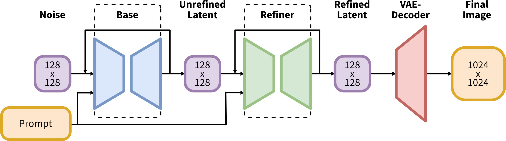

## 一句话定位
SDXL 是 Stability AI 2023 年 7 月开源的潜空间扩散文生图基座模型：把 [[latent-diffusion-ldm]]/Stable Diffusion 的 UNet 放大到 **2.6B 参数（3×）**、改用 **CLIP ViT-L + OpenCLIP ViT-bigG 双文本编码器**、引入 **size/crop/aspect 微条件** 与 **独立 refiner 精修模型**，原生 1024×1024 出图。用户研究中 base+refiner 组合在四模型对比里以 **48.4% 胜率** 远超 SD 1.5（7.9%）/SD 2.1（6.7%），并在 PartiPrompts 上以 **54.9%** 的偏好率小幅超过当时的 Midjourney v5.1，成为此后两年开源 t2i 的事实底座。

## 背景与定位
SDXL 的目标是把开源 Stable Diffusion 推到能与 Midjourney、DALL·E 2、Bing Image Creator 等闭源黑盒掰手腕的水平，同时保持完全开放（代码 + 权重）以利复现与生态二创。它建立在 [[latent-diffusion-ldm]]（在预训练自编码器的低维潜空间里跑 [[ddpm]] 式扩散）之上，沿用 SD 1.x/2.x 的 UNet+cross-attention 范式，但做了一系列"模块化、可单独使用"的改进。论文自陈这些改进多数也适用于像素空间扩散模型。

定位上 SDXL 是一份"工程化扩展报告"而非纯学术论文——核心不是新损失/新架构，而是把规模、文本编码、条件注入、多分辨率训练、两阶段精修这些工程杠杆叠起来，叠出对前代的"drastic improvement"。它明确放弃了把"更好的 FID"当目标（论文 App. F 论证 COCO zero-shot FID 与人类审美负相关），转而以**人评偏好**为主要评测口径。相关同期工作可参见 [[deepfloyd-if]]、[[dall-e-3]]、[[kandinsky-2]]。其后续衍生有蒸馏加速线 [[latent-consistency-models]]/[[lcm-lora]] 与对抗蒸馏 SDXL-Turbo（ADD），偏好对齐线 [[diffusion-dpo]]。

## 模型架构

> 图源：SDXL: Improving Latent Diffusion Models for High-Resolution Image Synthesis (arXiv:2307.01952), Figure 1 (right)

**Backbone：放大且异构的 UNet（非 DiT）。** SDXL 仍用卷积 UNet，但相对 SD 把 transformer 计算重心下移到低分辨率特征层（follow Hoogeboom et al.）：
- **异构 transformer block 分布**：最高分辨率层不放 transformer block，较低两层分别放 **2 和 10 个 block**（记为 `[0, 2, 10]`），并**整层删掉 8× 下采样那一级**。channel multiplier 为 `[1, 2, 4]`。
- **UNet 参数量 = 2.6B**（SD 1.4/1.5 为 860M，SD 2.0/2.1 为 865M，故称"3× 更大"）。参数增量主要来自更多 attention block 与更大的 cross-attention context。

**双文本编码器（关键改动）。** 同时使用 **OpenCLIP ViT-bigG** 与 **CLIP ViT-L**，取两者倒数第二层（penultimate）文本特征沿 channel 轴拼接，得到 **context dim = 2048**（SD 1.x 为 768，SD 2.x 为 1024）。除了 cross-attention 注入逐 token 文本特征外，还额外把 **OpenCLIP 的 pooled text embedding** 作为全局条件注入。两个文本编码器合计 **817M 参数**（推理时冻结）。

**条件注入（micro-conditioning）。** size/crop/aspect 三类标量条件各自做 **Fourier feature 编码**后拼成一个向量，**加到 timestep embedding 上**注入 UNet（与文本走的 cross-attention 通道不同）。

**自编码器 / VAE。** SDXL 重新从头训练了与原版 SD 同架构的 VAE（latent 下采样 8×），用更大 batch（256 vs 9）并对权重做 EMA 跟踪；在 COCO2017 256×256 重建上全面优于旧 VAE（见"评测"表）。base 与 refiner **共用同一个 VAE**。

**Refiner（精修专家）。** 一个在同一潜空间训练的独立 LDM，专门处理高质量高分辨率数据，只特化在前 200 个（离散）噪声尺度上（论文 Sec. 2.5）。定位是 image-to-image（SDEdit/img2img）而非独立 t2i（refiner card tags=image-to-image）。**文本编码器口径需注意**：refiner 的 HF model card 与 base card 用了**同一段 boilerplate**，都写"uses two fixed, pretrained text encoders（OpenCLIP-ViT/G 和 CLIP-ViT/L）"——这是 SDXL 家族级模板，**并非对 refiner 的逐模型架构披露**；论文正文未单独说明 refiner 的文本编码器数量。社区/diffusers 实现里 refiner 仅以 `text_encoder_2`(OpenCLIP ViT-bigG) 驱动（cross-attention context dim = 1280），但**此点在已落盘一手源中无直接文字佐证**，故此处不当作论文结论断言。HF model card 把整条 pipeline 称为 **"ensemble of experts"**（base 出 latent → refiner 接管最后的去噪步），官方博客给出整套 pipeline 参数 **6.6B**、base 单模型 **3.5B**（announcement 原文："a 3.5B parameter base model and a 6.6B parameter model ensemble pipeline"；含 VAE/文本编码器的口径，与论文 UNet-only 的 2.6B 不同）。

**分辨率策略。** base 在多阶段里逐步升分辨率（256²→512²→多宽高比 ~1024² 面积），推理默认原生出 1024×1024；通过 size-conditioning，用户可在推理时指定"目标观感分辨率"来调节细节丰富度。

## 数据
- **来源/规模**：论文只说在 **internal dataset（内部数据集）** 上预训练，并给出该数据集的高×宽分布图（Fig. 2）说明长尾小图很多——**未披露图文对总量、数据来源构成、版权/许可、语言分布**。
- **过滤策略的反面教训**：论文以这份内部数据为例论证"按 256² 阈值丢弃小图会丢掉 **39%** 的训练数据"，正是这一点催生了 size-conditioning（见下）——即**不丢小图，而是把原始尺寸作为条件喂进去**。
- **标注 / re-captioning / 合成数据 / 美学过滤 / 安全过滤**：论文与 model card **均未披露**具体的 caption 来源、是否重写 caption、是否用合成数据、美学打分阈值或 NSFW 过滤管线。官方博客提到偏好数据来自 Discord 上实验模型的生成与外部测试，但这是用于评测/选型而非训练数据描述。
- 评测用数据：ImageNet（size-conditioning 消融）、COCO2017 val（VAE 重建 + FID-vs-CLIP）、PartiPrompts P2（Midjourney 人评对比）。

## 训练方法
**训练目标。** 标准 denoising score matching / DSM 的扩散目标，**1000 步离散时间噪声调度**，权重函数 λ_σ = σ⁻²（与 DDPM/LDM 一致）。GitHub 代码库已迁到 EDM/Karras 的"denoiser framework"（支持连续时间），但**最终发布的 SDXL 用的是离散时间公式**，并依赖 **offset-noise（level 0.05）** 来获得审美上更讨喜的结果（论文 Future Work 明言这是离散公式的一个需要的修正，EDM 连续时间是更优候选）。

**多阶段训练流程（base）：**
1. **预训练**：256×256，**600,000** 步，batch size **2048**，开启 size- + crop-conditioning；
2. **续训**：512×512，再 **200,000** 步；
3. **多宽高比微调**：在 ~1024² 面积的多个 bucket 上做 multi-aspect 微调，叠加 **offset-noise 0.05**，并把 aspect bucket 的 target size 也作为条件（car = (htgt, wtgt)）。

**两条招牌"微条件"（无需额外监督）：**
- **Size-conditioning**：把图像的**原始（缩放前）高宽** (h_orig, w_orig) 作为条件喂入。好处：不必丢小图；推理时用户可用它控制细节量。ImageNet 512² 消融证明有效：CIN-size-cond 取得 **FID-5k 36.53 / IS-5k 215.34**，优于 CIN-nocond（39.76 / 211.50）和只用大图的 CIN-512-only（43.84 / 110.64）。
- **Crop-conditioning**：训练时 dataloader 随机裁剪会把"被裁掉的头/物体"泄漏进生成结果（SD 1.5/2.1 的典型失败模式）。SDXL 把裁剪左上角坐标 (c_top, c_left) 也作为条件喂入；推理时设 (0,0) 即得物体居中、无裁切伪影的图。size 与 crop 条件沿 channel 轴拼接后加到 timestep embedding（论文 Alg. 1 给出在线采样流程，无需额外预处理）。
- **Multi-aspect**：按宽高比分 bucket（像素数尽量贴近 1024²，高宽按 64 的倍数变化，完整 bucket 列表见 App. I，从 512×2048 到 2048×512），同一 batch 取自同一 bucket，逐步在 bucket 间交替。

**Refiner 训练。** 单独训一个同潜空间 LDM，特化在前 200 个噪声尺度的高质量高分辨率数据上。推理时用 **SDEdit（img2img）** 把 base 出的 latent 直接在潜空间加噪-去噪精修，沿用相同文本输入。diffusers 实现里以 **denoising 80/20 切分**（base 跑前 80% 步、refiner 跑后 20%）作为"ensemble of experts"用法。该步骤**可选**，主要提升细节背景与人脸质量。

**蒸馏/加速。** 原始 SDXL **未做**步数蒸馏；论文 Future Work 把 guidance/knowledge/progressive distillation 列为待办。加速由后续工作补齐：[[latent-consistency-models]]/[[lcm-lora]]（一致性蒸馏）、SDXL-Turbo（对抗扩散蒸馏 ADD，可单步出图）。

**训练框架。** PyTorch Lightning；核心类从旧 ldm 的 `LatentDiffusion` 重构为 `DiffusionEngine`，config 驱动（`instantiate_from_config`）。

## Infra（训练 / 推理工程）
- **训练算力 / GPU·时 / 并行分布式 / 吞吐**：论文与官方材料**均未披露**（只给了步数与 batch size：256² 阶段 600k 步 × bs 2048）。
- **推理部署**：官方博客称 SDXL 1.0 **可在 8GB VRAM 的消费级 GPU 上有效运行**；两阶段架构在不显著牺牲速度/算力的前提下提升鲁棒性。
- **推理优化（来自 HF model card）**：fp16 推理；`torch>=2.0` 下用 `torch.compile(mode="reduce-overhead")` 可提速 **20–30%**；VRAM 受限可用 `enable_model_cpu_offload`；可选 `xformers` memory-efficient attention；通过 Optimum 支持 **OpenVINO / ONNX Runtime**。base+refiner 全量加载需把两个大模型同时驻留内存（论文 Future Work 列为可访问性短板）。
- **发布渠道**：开源权重/代码在 GitHub + HuggingFace；闭源/托管侧上线 Clipdrop、DreamStudio、Stability Platform API、**AWS SageMaker JumpStart 与 AWS Bedrock**。
- **采样器**：论文实验多用 DDIM 50 步、cfg-scale 8.0（定性对比）或 cfg 5.0（ImageNet 消融）。
- **输出水印**：diffusers 用法要求安装 `invisible_watermark`，对输出嵌入不可见水印。

## 评测 benchmark（把效果讲清楚）

> 图源：SDXL: Improving Latent Diffusion Models for High-Resolution Image Synthesis (arXiv:2307.01952), Figure 1 (left)

**人评偏好（主指标）：**
- **四模型用户研究**：base+refiner 胜率 **48.44%**，base **36.93%**，SD 1.5 **7.91%**，SD 2.1 **6.71%**——SDXL（尤其加 refiner）大幅领先前代（Fig. 1）。
- **对比 Midjourney v5.1（PartiPrompts P2，AWS GroundTruth 人评）**：共 **17,153** 次偏好对比，SDXL（这里用的是 v0.9）被偏好 **54.9%**，按 prompt 遵从度略胜 Midjourney v5.1。按 P2 类别分：6 类中 4 类 SDXL 胜（Fig. 10，仅 2 类落后）；按 challenge 分：10 项中 7 项 SDXL 不输或更优。base+refiner 在复杂 prompt 上 10 类中 7 类持平或更优（Fig. 11）。

**Size-conditioning 消融（ImageNet 512²，5k 样本，DDIM 50 步，cfg 5.0）：**

| 模型 | FID-5k ↓ | IS-5k ↑ |
|---|---|---|
| CIN-512-only（丢小图，仅 70k 训练图） | 43.84 | 110.64 |
| CIN-nocond（用全部图，无 size 条件） | 39.76 | 211.50 |
| CIN-size-cond（加 size 条件） | **36.53** | **215.34** |

**VAE 重建（COCO2017 val，256×256）：**

| VAE | PSNR ↑ | SSIM ↑ | LPIPS ↓ | rFID ↓ |
|---|---|---|---|---|
| SDXL-VAE | **24.7** | **0.73** | **0.88** | **4.4** |
| SD-VAE 1.x | 23.4 | 0.69 | 0.96 | 5.0 |
| SD-VAE 2.x | 24.5 | 0.71 | 0.92 | 4.7 |

（注：LPIPS 列论文原表数值如上，方向标记 ↓；SDXL-VAE 在全部四项重建指标上最优。）

**FID / CLIP（COCO，10k 文图对，App. F）：** 论文刻意指出 SDXL 的 **CLIP-score 仅略有提升**，而 **COCO zero-shot FID 反而是三者中最差**（差于 SD 1.5 与 SD 2.1）。作者据此论证 COCO FID 与人类审美负相关（呼应 Kirstain et al.），不适合评估文生图基座，故全文以人评为准——**这是一个反直觉但重要的结论**：不要用 FID 给 SDXL 这类模型排座次。

**未报告**：GenEval、T2I-CompBench、DPG-Bench、HPSv2、ImageReward、PickScore、MJHQ-30K 等后来流行的自动化 t2i benchmark 在原始 SDXL 论文里**均未报告**（论文早于这些榜单普及）。

## 创新点与影响
**核心贡献：**
1. **3× UNet + 双文本编码器（CLIP ViT-L ⊕ OpenCLIP ViT-bigG，context 2048）**：把开源 SD 的容量与文本理解一举拉到与闭源竞品同档。
2. **size- / crop-conditioning 两个"无需额外监督"的微条件**：分别解决"丢小图损失数据"和"随机裁剪伪影泄漏"两个长期痛点，且方法通用（不限于 LDM）。
3. **multi-aspect 训练**：原生支持多宽高比出图，贴合真实横/竖屏需求。
4. **base + refiner 两阶段"ensemble of experts"**：用 SDEdit 在潜空间精修，提升细节/人脸质量。
5. **以人评取代 FID 作为评测口径**，并公开论证 FID 的不适用性。
6. **完全开源**（代码 + 权重，CreativeML OpenRAIL++-M 许可），强调透明与可复现。

**影响：** SDXL 成为 2023–2024 年开源文生图的**事实底座**——ControlNet/IP-Adapter/LoRA/T2I-Adapter 生态、社区 finetune（Pony、Juggernaut 等无数 checkpoint）、加速蒸馏（[[latent-consistency-models]]、[[lcm-lora]]、SDXL-Turbo/ADD）、偏好对齐（[[diffusion-dpo]] 的 SDXL 变体）几乎都以它为底。size/crop micro-conditioning 的思路被后续多分辨率训练广泛借鉴。它也是 Stability AI 从 UNet 范式走向后续 DiT/MMDiT（Stable Diffusion 3）之前的最后一代旗舰 UNet 模型。

**已知局限（论文 + model card 自陈）：**
- 手部/复杂解剖结构仍易出错；
- 未达完美写实，细微光照/纹理可能缺失；
- 训练数据带来的社会/种族偏见；
- **"concept bleeding"**（属性绑定错位，如"蓝帽红手套"变成"红帽蓝手套"），归因于文本编码器把信息压成单 token 的特性；
- **长文本渲染**仍不可靠（论文建议未来用 character-level tokenizer 或继续 scale）；
- 两阶段需同时加载两个大模型，损害可访问性与速度（单阶段等质量是 Future Work）；
- 自编码是有损的。

## 原始链接
- arxiv_abs: https://arxiv.org/abs/2307.01952
- arxiv_pdf: https://arxiv.org/pdf/2307.01952
- github: https://github.com/Stability-AI/generative-models
- hf (base 1.0): https://huggingface.co/stabilityai/stable-diffusion-xl-base-1.0
- hf (refiner 1.0): https://huggingface.co/stabilityai/stable-diffusion-xl-refiner-1.0
- official_blog (SDXL 1.0 announcement): https://stability.ai/news/stable-diffusion-sdxl-1-announcement

## 本地落盘文件
- ../../../sources/omni/2023/arxiv-2307.01952.pdf
- ../../../sources/omni/2023/arxiv-2307.01952.txt
- ../../../sources/omni/2023/sdxl--github-readme.md
- ../../../sources/omni/2023/sdxl--hf-base-modelcard.md
- ../../../sources/omni/2023/sdxl--hf-refiner-modelcard.md
- ../../../sources/omni/2023/sdxl--stability-announcement.md
