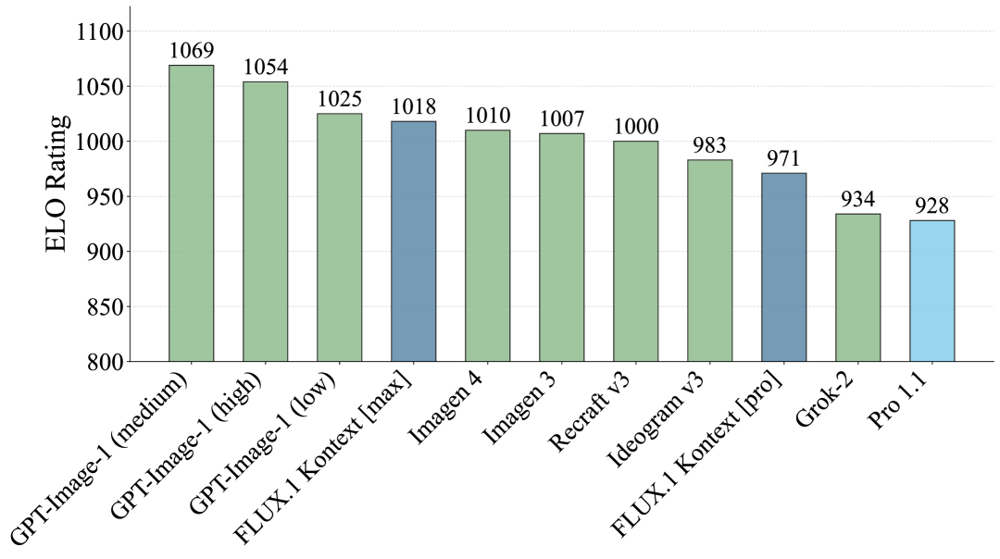

## 一句话定位
FLUX.1 是前 Stability 核心团队（VQGAN / Latent Diffusion / SD / SDXL / SD3 作者）创立的 Black Forest Labs（BFL）于 2024-08-01 首发的文生图模型套件，核心是一个 **12B 参数的整流流（rectified flow）Transformer**，在 SD3 的 MMDiT 基础上引入双流/单流混合块、3D RoPE、并行注意力与融合前馈，配以 16 通道 VAE。它以 `[pro]`（闭源 API，benchmark 超越 Midjourney v6 / DALL·E 3 HD / SD3-Ultra）/`[dev]`（开源权重，guidance 蒸馏）/`[schnell]`（开源 Apache-2.0，LADD 蒸馏 1–4 步）三档发布，刷新了当时开源 T2I 的质量与速度上限，成为 2024–2025 整个开源 T2I 与图像编辑生态的事实标准底座。

## 背景与定位
- **解决的问题**：在 SD3（[[stable-diffusion-3]] / Esser et al. 2024, arXiv 2403.03206）把整流流 + MMDiT 路线验证后，开源社区缺一个质量真正对标闭源（Midjourney/DALL·E 3）且推理足够快的底座模型。BFL 用 FLUX.1 同时回答"开源能多强"与"few-step 能多快"两个问题。
- **技术脉络位置**：FLUX.1 是 [[latent-diffusion-ldm]] → [[sdxl]] → [[stable-diffusion-3]] 这条"潜空间 + 整流流 + 多模态 DiT"主线的工业化集大成者。BFL 团队本身就是这条线的原作者（blog 自述其贡献含 VQGAN、Latent Diffusion、SDXL、Stable Video Diffusion、Rectified Flow Transformers、Adversarial Diffusion Distillation）。
- **相对前置工作的改进**：相比 SD3，FLUX.1 把规模拉到 12B、改用双流/单流混合块结构 + 3D RoPE + 并行注意力 + 融合 FFN 提升硬件效率，VAE 通道数提升到 16 改善重建，并把"高质量底座 + few-step 蒸馏 + 开源权重"打包成可直接落地的生态资产。launch 博客明确把 `[pro]/[dev]` 定位为"超过 Midjourney v6.0、DALL·E 3 (HD)、SD3-Ultra"。
- 注：BFL 在 launch 博客承诺"近期发布更详细技术报告"，但 FLUX.1 基座模型本身**始终未出独立技术报告**。目前对其架构最权威的一手文字描述，来自 2025-06 的 **FLUX.1 Kontext 论文**（arXiv 2506.15742）第 2 节"FLUX.1"，本页架构细节主要据此 + launch 博客。

## 模型架构

> 图源：FLUX.1 Kontext 论文（arXiv 2506.15742）Figure 4 "High-level overview of FLUX.1 Kontext" —— 展示 FLUX.1 同栈的 text encoders → VAE image encoder → N/2 双流块(text/visual stream) → N 个 fused DiT 块(combined stream) → VAE decoder，以及 3D 位置嵌入 [T,h,w]

**Backbone：rectified flow Transformer（MMDiT 变体），12B 参数，潜空间扩散。** 据 Kontext 论文第 2 节与 launch 博客：

- **整体范式**：在图像自编码器的潜空间里做整流流（rectified flow）建模——非像素空间。这是 LDM/SD3 路线的延续。
- **自编码器（Flux-VAE）**：从零训练的卷积自编码器，带对抗目标（沿用 Rombach et al. LDM 配方），**16 个潜通道**（比 SD/SDXL 的 4 通道大幅提升）。通过加大训练算力 + 16 通道，重建质量优于同类（见 benchmark 节 VAE 对比表）。autoencoder 权重以 Apache-2.0 单独开源。
- **Transformer 块结构（混合双流/单流）**：
  - **Double-stream blocks（双流块）**：图像 token 与文本 token 使用**独立权重**，混合通过在"图文 token 拼接序列"上做注意力实现——即 SD3 的 MMDiT 思想（每模态独立 QKV/FFN，注意力跨模态联合）。
  - **Single-stream blocks（单流块）**：双流处理后将图文序列**拼接**，再过 **38 个单流块**；最后丢弃文本 token、只解码图像 token。
  - **融合 FFN（fused feed-forward）**：借鉴 Dehghani et al.（22B ViT）的设计——(i) 把 FFN 的调制参数量减半，(ii) 把注意力的输入/输出线性层与 MLP 融合成更大的矩阵乘，从而提升训练/推理吞吐与 GPU 利用率。
  - **3D RoPE**：用三维旋转位置编码（3D RoPE），每个潜 token 以时空坐标 (t, h, w) 索引（单图时 t≡0）。这给后续 Kontext 的"多图 in-context 拼接"留好了接口（context 图整体加常数 time 偏移分隔）。
  - **并行注意力层（parallel attention）**：launch 博客明确提及用 rotary embeddings + parallel attention layers 提升性能与硬件效率。
- **Text encoder**：FLUX.1 沿用 SD3 的双文本编码器组合——**T5-XXL（细粒度语义/长文本/排版）+ CLIP（池化全局条件）**。这点 BFL 自家 launch 博客/model card 未逐字写明，但由其 SD3 架构血缘（Kontext 论文显式引用 Esser et al. SD3 为基座）及官方 diffusers `FluxPipeline`（`text_encoder`=CLIP-L、`text_encoder_2`=T5-XXL）可证。
- **参数量与分辨率**：全部公开 FLUX.1 模型均为 **12B**。launch 博客称支持 **0.1–2.0 兆像素（MP）** 的多种分辨率与宽高比。

## 数据
**几乎未披露。** BFL 的 launch 博客、GitHub README、dev/schnell model card 均**未公开**训练数据来源、规模、配比、清洗过滤、re-captioning 或合成数据细节——这是 FLUX.1 基座最大的信息缺口（也是其"无技术报告"的直接后果）。

可确证的零散信息：
- launch 博客称模型"专门微调以保留预训练阶段的完整输出多样性（output diversity）"，暗示其重视数据/采样多样性，但无量化。
- model card 的 Limitations / Out-of-Scope 段落标准化声明可能放大社会偏见、不保证事实正确——属合规模板，非数据细节。
- Kontext 论文（后续工作）提到 editing 训练用"数百万张精选的关系对 (x | y, c)"，并做了 NCII/CSAM 的分类器过滤 + 对抗安全训练——但这是 Kontext 阶段的数据，不等同于 FLUX.1 基座预训练数据。
- BFL 官网另有"Training Data Disclosure / Responsible AI"页（footer 链接），但 launch 博客快照未含其实质内容。

## 训练方法
- **训练目标：rectified flow matching（整流流匹配）**。launch 博客称"在 flow matching 上构建，diffusion 是其特例"。Kontext 论文附录 A 给出完整公式：前向加噪 `z_t = (1−t)·x + t·ε`（整流流取 a_t=1−t, b_t=t），速度预测目标，conditional flow matching loss 退化为 `||v_Θ(z_t,t) + x_0 − ε||²`；时间步 t 采用 **logit-normal 分布**采样，并按分辨率改变 mode μ（即 SD3 的 timestep shifting，α=3.0 对应 μ=log3≈1.0986）。
- **三档蒸馏/训练策略（关键）**：
  - **FLUX.1 [pro]**：质量最高的基座/旗舰，仅 API 提供，未公开训练细节（多步引导采样，50–250 次网络评估级别）。
  - **FLUX.1 [dev]**：从 `[pro]` 直接做 **guidance distillation（引导蒸馏）**——把 classifier-free guidance 蒸进网络，得到一个无需双倍前向、同尺寸下更高效的 12B 模型，质量/prompt 遵循接近 `[pro]`。非商用许可。
  - **FLUX.1 [schnell]**：用 **latent adversarial diffusion distillation（LADD，潜空间对抗扩散蒸馏，Sauer et al. 2024 arXiv 2403.12015）** 蒸馏，可在 **1–4 步**生成高质量图，Apache-2.0。LADD 在减少采样步数同时通过对抗训练提升样本质量、规避引导带来的过饱和伪影。
- **采样**：基座整流流推理通常需 50–250 次引导网络评估（NFE）；蒸馏档把 NFE 压到个位数。schnell 默认 4 步（diffusers 示例 `num_inference_steps=4`）。

## Infra（训练 / 推理工程）
FLUX.1 基座本身**未披露训练算力 / GPU 时 / 并行细节**（无技术报告）。可一手确证的工程信息：

- **训练并行/精度（来自 Kontext 论文，为同栈工程，可外推）**：FSDP2 混合精度（all-gather 用 bfloat16、梯度 reduce-scatter 用 float32 提升数值稳定性）；selective activation checkpointing 降显存；Flash Attention 3 + 对各 Transformer 块做 regional compilation 提升吞吐。
- **推理加速**：
  - **步数蒸馏**：dev=guidance 蒸馏（少一倍前向）、schnell=LADD（1–4 步）。
  - **TensorRT 量化部署**：官方仓库提供 **BF16 / FP8 / FP4** 三档 TRT engine 导出（`--trt_transformer_precision bf16|fp8|fp4`），ONNX 导出要求 H/W 在 768–1344。
  - **diffusers 集成**：`FluxPipeline` 支持 `enable_model_cpu_offload()` 省显存；day-1 集成 ComfyUI、Diffusers、Replicate、fal.ai。
- **架构层面的硬件效率**：融合 FFN（减半调制参数 + 融合 attn/MLP 线性层成大矩阵乘）、并行注意力——属"用结构换吞吐"的设计。
- **部署形态**：`[pro]` 走 BFL API（及 Replicate/fal.ai）；`[dev]/[schnell]` 开源权重，本地/ComfyUI/diffusers 推理。

## 评测 benchmark（把效果讲清楚）

> 图源：FLUX.1 Kontext 论文（arXiv 2506.15742）Figure 7(a) Aesthetics (Internal-T2I-Bench) —— 文生图 Aesthetics ELO 评分柱状图，FLUX.1 Kontext [pro]/[max] 与 GPT-Image、Imagen、Recraft 等对比

**注意：FLUX.1 launch 博客只给定性结论与雷达图，未公布 FID/GenEval/CLIPScore 等数值。** 严格区分一手数字来源：

**1) launch 博客（定性，无具体分值）**：
- `FLUX.1 [pro]` 与 `[dev]` 在 **视觉质量、prompt 遵循、尺寸/宽高灵活性、排版（typography）、输出多样性** 五维上**超越 Midjourney v6.0、DALL·E 3 (HD)、SD3-Ultra**。
- `FLUX.1 [schnell]` 是"迄今最先进的 few-step 模型"，不仅胜过同类 few-step 模型，还胜过非蒸馏的 Midjourney v6.0 与 DALL·E 3 (HD)。
- 均无公开 ELO/FID 数字，仅雷达图对比。

**2) FLUX1.1 [pro] 后续博客（2024-10，含可引用 ELO 结论）**（来源 flux-1--bfl-flux11pro-blog.md）：
- FLUX1.1 [pro] 以代号 **"blueberry"** 进入 **Artificial Analysis 文生图 Image Arena**（artificialanalysis.ai/text-to-image），**夺得 leaderboard 最高综合 Elo 分**，超过当时所有在榜模型（数据 as of 2024-10-01）。
- FLUX1.1 [pro] 较初代 `[pro]` **快 6 倍（six times faster）**、质量与 prompt 遵循同时提升；较初代 `[pro]` 综合也"快两倍"于其它对比项。（具体 Elo 数值博客未列表，仅文字 + 图。）

**3) Flux-VAE 重建质量（Kontext 论文 Table 1，4096 张 ImageNet，越优）**——这是 FLUX 自编码器最硬的一手数字：

| VAE | PDist ↓ | SSIM ↑ | PSNR ↑ |
|---|---|---|---|
| **Flux-VAE** | **0.332** | **0.896** | **31.1** |
| SD3-VAE | 0.452 | 0.858 | 29.6 |
| SD3-TAE | 0.746 | 0.774 | 27.9 |
| SDXL-VAE | 0.890 | 0.748 | 25.9 |
| SD-VAE | 0.949 | 0.720 | 25.0 |

即 FLUX 的 16 通道 VAE 在 PDist/SSIM/PSNR 三项全面领先 SD3/SDXL/SD VAE（重建越好，潜空间天花板越高）。

**4) 推理速度（Kontext 论文，FLUX 同栈）**：1024×1024 文生图与图生图均达 **3–5 秒**级。

**未报告/缺口**：FLUX.1 基座的 GenEval、T2I-CompBench、DPG-Bench、MJHQ-30K、HPSv2、ImageReward、PickScore 等标准 T2I 自动指标，BFL **官方一手源均未发布数值**；社区第三方复测存在但非一手，本页不引用以免编造。

## 创新点与影响
**核心贡献**
1. 把 SD3 的"整流流 + MMDiT"路线工业化到 **12B** 规模，并用**双流/单流混合块 + 3D RoPE + 并行注意力 + 融合 FFN + 16 通道 VAE** 做出了当时质量最强的开源 T2I 底座。
2. **三档发布范式**：闭源旗舰 `[pro]`（API 变现 + 顶配质量）+ guidance 蒸馏开源 `[dev]`（非商用，质量近 pro）+ LADD 蒸馏开源 `[schnell]`（Apache-2.0，1–4 步），一次性覆盖"质量 / 可用性 / 速度"全谱，成为社区可直接 fork/微调/LoRA 的标准资产。
3. **3D RoPE + 时空 token 索引**的架构前瞻性：为后续 Kontext 的"序列拼接式 in-context 编辑"、视频扩展预留接口。

**对后续工作的影响**
- FLUX.1 [dev] 迅速成为 **2024–2025 开源 T2I 与图像编辑生态的事实标准底座**：ControlNet/IP-Adapter/LoRA 微调、ComfyUI 工作流、以及 BFL 自家 **FLUX.1 Tools（Fill/Canny/Depth/Redux）**、**FLUX.1 Kontext（统一生成+编辑）**、**FLUX.1 Krea** 全部基于它。
- 商业上印证"开源底座 + API 旗舰"双轨可行；FLUX1.1 [pro] 登顶 Artificial Analysis Arena 进一步把 BFL 推为 Midjourney/OpenAI 之外的第三极。
- 团队从 Stability 出走自建 BFL（$31M a16z 领投种子轮），是生成式视觉人才/路线"再创业"的标志性事件。

**已知局限**
- 模型不提供事实性信息，可能放大社会偏见，prompt 遵循高度依赖 prompt 风格（model card 自述）。
- `[dev]` 为非商用许可（需向 BFL 申请商用授权并上报用量），仅 `[schnell]` 与 VAE 为 Apache-2.0。
- **透明度缺口**：基座始终无技术报告，**训练数据与训练算力完全未披露**，架构细节只能从后续 Kontext 论文反推。

## 原始链接
- blog (FLUX.1 发布): https://bfl.ai/blog/24-08-01-bfl
- blog (FLUX1.1 [pro] + API, 含 Arena ELO): https://bfl.ai/blog/24-10-02-flux
- github (推理代码 + 模型清单 + 引用): https://github.com/black-forest-labs/flux
- hf (FLUX.1-dev model card): https://huggingface.co/black-forest-labs/FLUX.1-dev
- hf (FLUX.1-schnell model card): https://huggingface.co/black-forest-labs/FLUX.1-schnell
- paper (FLUX.1 Kontext，含 FLUX.1 架构最权威一手描述): https://arxiv.org/abs/2506.15742 ; pdf https://arxiv.org/pdf/2506.15742
- docs (官方文档): https://docs.bfl.ai/

## 一手源存档（sources/）
- [bfl-launch-blog.md](https://github.com/zhao9797/ai-research/blob/main/sources/omni/2024/flux-1--bfl-launch-blog.md)
- [bfl-flux11pro-blog.md](https://github.com/zhao9797/ai-research/blob/main/sources/omni/2024/flux-1--bfl-flux11pro-blog.md)
- [github-readme.md](https://github.com/zhao9797/ai-research/blob/main/sources/omni/2024/flux-1--github-readme.md)
- [gh-modelcard-dev.md](https://github.com/zhao9797/ai-research/blob/main/sources/omni/2024/flux-1--gh-modelcard-dev.md)
- [gh-modelcard-schnell.md](https://github.com/zhao9797/ai-research/blob/main/sources/omni/2024/flux-1--gh-modelcard-schnell.md)
- [gh-docs-t2i.md](https://github.com/zhao9797/ai-research/blob/main/sources/omni/2024/flux-1--gh-docs-t2i.md)
- [arxiv-2506.15742.pdf](https://arxiv.org/pdf/2506.15742)  （arXiv 原文 PDF，不入 git）
