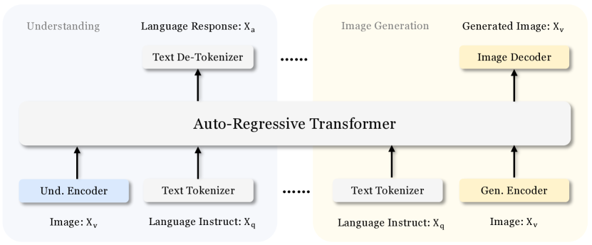
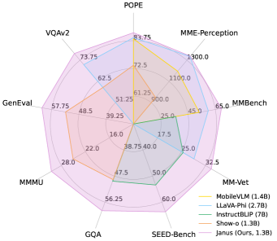

## 一句话定位
Janus 是 DeepSeek 提出的**统一多模态理解与生成自回归框架**，核心创新是**把视觉编码解耦成两条独立路径**（理解用 SigLIP 连续语义编码，生成用 VQ 离散 token 编码），但仍由**单一自回归 Transformer**处理，从而缓解"理解需高层语义 / 生成需低层细节"对视觉编码器的表征冲突。仅 1.3B 参数即在理解上超过 LLaVA-v1.5(7B)、Qwen-VL-Chat(7B)（MMBench 69.4 / SEED 63.7 / POPE 87.0），生成上 GenEval 61%、COCO-30K FID 8.53，超过 SDXL(0.55)、DALL-E 2(0.52) 与统一模型 Show-o(0.53)。

## 背景与定位
此前统一多模态模型走两条路：
1. **外接扩散模型**（Emu、DreamLLM、SEED-X、NExT-GPT 等，论文标 †）——LLM 输出作为预训练扩散模型的条件，"严格说不算真正统一"，因为生成功能由外部扩散模型承担，LLM 本身无法直接产图。
2. **单一 Transformer + 单一视觉编码器**统一两任务（[[chameleon]]、Show-o、LWM、VILA-U）——优点是统一、有涌现能力、减少冗余，但**理解与生成对表征的需求迥异**：理解需要高层语义（物体类别、视觉属性，做复杂语义推理），生成需要低维、能表达细粒度空间结构与纹理细节的编码。把两者塞进同一表征空间会产生冲突与折衷，导致**理解性能明显落后于专用理解模型**（论文消融 Exp-B vs Exp-C 量化了这一折衷）。

Janus 的定位：**第一个明确指出"在统一框架内解耦视觉编码"重要性的工作**。它不放弃单一 Transformer 的简洁与统一，而是只在"入口处"分叉视觉编码路径，让理解和生成各自选用最适合的编码器，既消除冲突又保留扩展性（未来可加点云/EEG/音频等模态）。这是 **Janus → [[janusflow]]（rectified flow）→ Janus-Pro（数据+模型 scaling）系列的起点**。相关脉络见 [[show-o]]、[[emu3]]、[[vila-u]]。

## 模型架构

> 图源：Janus: Decoupling Visual Encoding for Unified Multimodal Understanding and Generation, Figure 2 (arXiv:2410.13848)

**单一自回归 Transformer + 三套输入编码路径**，无需特别设计的 attention mask（标准因果自回归）。
- **基座 LLM**：DeepSeek-LLM 1.3B，最大序列长度 4096。
- **理解路径（Und.）**：SigLIP-Large-Patch16-384 编码器抽取高层语义特征 → 2D grid 展平成 1D 序列 → 经"理解 adaptor"（2 层 MLP）映射进 LLM 输入空间。这是连续特征（不离散化）。
- **生成路径（Gen.）**：采用 LlamaGen 的 **VQ tokenizer**，codebook 大小 **16,384**，下采样因子 **16**（384×384 → 24×24 = 576 个 token）。图像 → 离散 ID → 展平为 1D → "生成 adaptor"（2 层 MLP）将 codebook embedding 映射进 LLM 输入空间。
- **文本路径**：LLM 内置 tokenizer 转离散 ID。
- **预测头**：文本（纯文本理解 + 多模态理解）用 LLM 内置预测头；图像生成用一个**随机初始化的 image head**。
- **条件注入**：把三类特征序列拼接成多模态序列喂入 LLM，靠自回归上下文实现条件控制（生成时 `<caption><image>`）。
- **分辨率策略**：全部 resize 到 384×384。理解数据 resize 长边、短边用背景色 (127,127,127) padding；生成数据 resize 短边、裁剪长边。训练用 sequence packing 提效。
- **可扩展性设计**：解耦后理解侧可换更强编码器（EVA-CLIP / InternViT）、上动态高分辨率与 pixel shuffle 压 token；生成侧可换更细粒度编码器（MoVQGAN）、加 diffusion loss、AR+并行混合。

> 注：论文还在消融中构建了一个 **semantic tokenizer**（基于 LlamaGen tokenizer，下采样 16，VQ 后接一个 12 层 / 12 头 / 768 维 ViT 语义解码器，用因果 mask，SigLIP-Large 作教师做 BEiT-v2 式语义重建蒸馏，语义损失权重 0.25）。但**仅用于消融对照（Exp-B），正式 Janus 不用它**——正式版生成侧用普通 VQ tokenizer。

## 数据
**三阶段共用一套混合多模态语料**，数据配比（理解:纯文本:生成）随阶段变化（见训练方法表）。
- **Stage I（adaptor 预热）**：125 万 ShareGPT4V 图文对（理解，格式 `<image><text>`）+ 约 120 万 ImageNet-1k 样本（生成，按类名构造 `<category_name><image>`）。
- **Stage II（统一预训练）**：
  - 纯文本：DeepSeek-LLM 预训练语料。
  - 交错图文：WikiHow、WIT。
  - 图像 caption：多个开源数据集，其中部分用**开源多模态模型 re-caption**，格式化为问答对（`<image>Describe the image in detail.<caption>`）。
  - 表格/图表：取自 DeepSeek-VL。
  - 视觉生成：多个图文对数据集 + **200 万 in-house 数据**；对部分数据按**美学分数与图像尺寸过滤，仅保留 20%**。训练时**25% 概率只用 caption 第一句**（增强短描述生成能力）。
  - 数据课程：**ImageNet 样本只在前 120K 步出现，其余生成数据在后 60K 步**——先学基础像素依赖再学复杂场景（借鉴 PixArt）。生成格式 `<caption><image>`。
- **Stage III（SFT）**：纯文本理解数据 + 多模态指令微调数据 + 视觉生成（Stage II 子集 + **400 万 in-house 数据**）。指令格式 `User:<Input Message> \n Assistant: <Response>`，多轮重复。

具体每个引用数据集编号见论文，规模配比明确但部分来源用编号未点名。

## 训练方法
**纯自回归，单一交叉熵损失** `L = -Σ log P_θ(x_i | x_<i)`：纯文本/理解任务只在文本序列算 loss，生成任务只在图像序列算 loss，**不给不同任务分配不同 loss 权重**（保持简单）。

**三阶段训练**（火焰/雪花表示更新/冻结）：
- **Stage I — 训练 adaptor 与 image head**：冻结两个视觉编码器和 LLM，只训理解 adaptor、生成 adaptor、image head。建立视觉-语言概念连接，赋予初步生成能力。LR 1e-3，10,000 步，batch 256，配比 1:0:1。
- **Stage II — 统一预训练**：解冻 LLM，用全部数据类型。借 PixArt 思路先用 ImageNet 学像素依赖再扩到开放域 t2i。LR 1e-4，180,000 步，batch 512，配比 2:3:5（warm-up 5,000）。
- **Stage III — 监督微调（SFT）**：微调除生成编码器外的所有参数；只监督 answer、mask 系统/用户提示；混合纯文本对话+理解+生成数据，**不为单一任务微调单独模型**。LR 2e-5，24,000 步，batch 256，配比 7:3:10。

**优化器**：AdamW (β1=0.9, β2=0.95)，gradient clip 1.0，weight decay Stage I/II=0、Stage III=0.1；LR scheduler：Stage I cosine，Stage II/III constant。

**推理**：next-token 预测；图像生成用 **classifier-free guidance**，logit `l_g = l_u + s(l_c - l_u)`，默认 **s=5**；训练时 10% 概率用 pad token 替换文本条件以获得无条件生成能力。

**未涉及**：无 RLHF/DPO/偏好对齐，无蒸馏/步数加速（生成靠 AR 逐 token，576 token/图）。

## Infra（训练 / 推理工程）
- **框架**：HAI-LLM（DeepSeek 自研、基于 PyTorch 的轻量高效分布式训练框架）。
- **算力**：**16 节点 × 8 张 Nvidia A100 (40GB) = 128 卡，整个训练约 7 天**。
- **效率技巧**：sequence packing；单步内按配比混合所有数据类型。
- **推理**：自回归生成，CFG（s=5）；README 注明早期 `tokenizer_config.json` 的 bug 曾使 CFG 失效、生成质量偏低，已在 2024.10.20 修复并发 Gradio demo。
- **量化/缓存/部署细节**：未披露（论文未报告吞吐、显存、量化方案）。

## 评测 benchmark（把效果讲清楚）

> 图源：Janus: Decoupling Visual Encoding for Unified Multimodal Understanding and Generation, Figure 1(a) Benchmark Performance (arXiv:2410.13848)

**多模态理解（Janus 1.3B，Table 2）**：MMBench **69.4**、SEED-Bench **63.7**、POPE **87.0**、VQAv2(test) **77.3**、GQA **59.1**、MMMU **30.5**、MM-Vet **34.3**、MME-P **1338.0**。
- 对比上一代最佳统一模型 Show-o：MME **949→1338（+41%）**、GQA **48.7→59.1（+30%）**。
- 在 POPE、MMBench、SEED、MM-Vet 等多项上**超过 LLaVA-v1.5(7B) 与 Qwen-VL-Chat(7B)**（参数仅其 ~1/5）。

**视觉生成 — GenEval（Table 3，overall）**：Janus **0.61**，超过 Show-o(0.53)、SDXL(0.55)、DALL-E 2(0.52)、Emu3-Gen(0.54)、PixArt-α(0.48)、LlamaGen(0.32)、Chameleon-34B(0.39)。分项亮点：Two Obj. 0.68、Position **0.46**、Color Attri. **0.42**（位置与属性绑定显著领先同类统一模型，说明指令跟随强）。

**视觉生成 — FID（Table 4，越低越好）**：COCO-30K **8.53**、MJHQ-30K **10.10**。超过统一模型 Show-o(COCO 9.24)、LWM(12.68)，与一些专用生成模型有竞争力（不及 PixArt-α 7.32 / Imagen 7.27）。

**关键消融（Table 5，验证解耦）**：
- **Exp-A**（VQ tokenizer 同时做理解+生成，类 Chameleon 基线）：理解极差 POPE 60.1 / MMB 35.0 / SEED 34.9，但生成 COCO-FID 8.72 尚可。
- **Exp-B**（用 SigLIP 蒸馏的 semantic tokenizer 共享）：理解改善（POPE 82.4 / MMB 52.7）但仍逊于 Janus；生成 FID 7.11 反而最好（因语义 token 预测目标更连贯 + 编码器参数更多）。
- **Exp-C**（semantic tokenizer 仅训理解）：POPE 83.9 / MMB 62.1 / SEED 60.8 — **明显高于 Exp-B**，证明共享单编码器在理解上做了折衷/牺牲。
- **Exp-D（Janus，SigLIP+VQ 解耦）**：POPE 87.0 / MMB 69.4 / SEED 63.7 / MMMU 30.5 / FID 8.53 — **理解全面最优**，验证解耦的价值。
- **统一 vs 专用（Exp-E 纯理解 / Exp-F 纯生成）**：统一训练（D）与单独训理解（E：POPE 85.9/MMB 70.6）或单独训生成（F：FID 8.92）**性能相当**，说明 Janus 在加入强生成能力的同时**对理解几乎无损**。

**额外发现**：尽管训练数据只有英文 t2i，Janus 能做多语种 t2i（归因于底座 LLM 把多语言映射到统一语义空间）。

## 创新点与影响
**核心贡献**：
1. **首次提出在统一多模态框架内"解耦视觉编码"**——理解走 SigLIP 连续语义、生成走 VQ 离散 token，两路独立但共享单一自回归 Transformer，系统性地解决了 Chameleon 式单编码器的理解-生成表征冲突，并用消融把"折衷"量化坐实。
2. **小模型高性价比**：1.3B 即超 7B 级理解模型与 SDXL/DALL-E 2 级生成模型，证明解耦设计的有效性而非靠堆参数。
3. **简洁与可扩展**：纯 AR + 单一交叉熵、无需特殊 mask；解耦入口天然支持换更强编码器、加新模态。

**影响**：开启 DeepSeek 的 Janus 系列——**[[janusflow]]**（2024.11，引入 rectified flow 做生成，在 LLM 框架内直接训 flow，无需复杂架构改动）与 **Janus-Pro**（2025.01，优化训练策略 + 扩数据 + scale 到 7B，理解与 t2i 指令跟随显著提升、生成更稳定）。"解耦理解/生成视觉路径"成为统一多模态领域的重要设计范式之一。

**已知局限**（论文与后续披露）：
- 生成分辨率仅 384×384，细节受限；VQ 离散化损失细节。
- 多模态理解输入分辨率低（384），细粒度 OCR/高分辨率场景受限（论文把动态高分辨率列为"未来扩展"而非已实现）。
- 无偏好对齐/RLHF；无生成加速（逐 token AR）。
- 文本渲染、复杂计数等仍是统一模型短板（Janus-Pro 才进一步改善稳定性）。

## 原始链接
- arxiv_abs: https://arxiv.org/abs/2410.13848
- arxiv_pdf: https://arxiv.org/pdf/2410.13848
- github: https://github.com/deepseek-ai/Janus
- hf (model): https://huggingface.co/deepseek-ai/Janus-1.3B
- hf (demo): https://huggingface.co/spaces/deepseek-ai/Janus-1.3B

## 一手源存档（sources/）
- [arxiv-2410.13848.pdf](https://arxiv.org/pdf/2410.13848)  （arXiv 原文 PDF，不入 git）
- [readme.md](https://github.com/zhao9797/ai-research/blob/main/sources/omni/2024/janus--readme.md)
