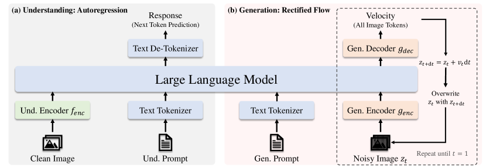
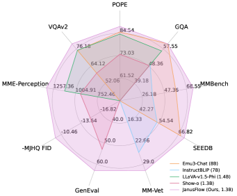

## 一句话定位
JanusFlow 用一个仅 **1.3B** 的 LLM（DeepSeek-LLM-1.3B-base）把"理解 = 自回归 next-token"与"生成 = rectified flow 流匹配"统一在同一个 transformer 内，证明 **rectified flow 可以直接在 LLM 框架里训练、无需复杂架构改动**；以极小体量在 GenEval 0.63 / DPG-Bench 80.09 / MJHQ FID-30k **9.51** 上超过 SDv1.5、SDXL、DALL-E 2 等专用生成模型，同时理解侧 MMBench 74.9 / SEEDBench 70.5 超过 LLaVA-v1.5、Qwen-VL-Chat。

## 背景与定位
统一"理解+生成"模型当时有三条路线：(1) 把 LLM 当 condition 生成器、外挂预训练扩散模型（SEED-X、DreamLLM、Emu），架构复杂且生成能力受限于外部模型；(2) 单 LLM + VQ 离散 token 全自回归生成（Chameleon、[[janus]]、LWM），受限于图像 tokenizer 量化质量；(3) 单 LLM 内融合扩散/流（Transfusion、Show-o）。

JanusFlow 走第三条路，核心改进是把当时图像生成 SOTA 方法 **rectified flow**（[[rectified-flow]]，被 [[stable-diffusion-3]] 验证）直接嵌进 LLM：不像 Transfusion 那样在 LLM 上设计复杂的注意力掩码，作者发现**普通 causal attention 就够用**，只需给 LLM 配一对轻量 encoder/decoder 适配流匹配操作。相对同门前作 [[janus]]（VQ 自回归生成，FID 10.10）的关键升级，就是把生成从离散自回归换成连续 rectified flow，FID 提升到 9.51，并在指令跟随类生成 benchmark 上大幅领先。

## 模型架构

> 图源：JanusFlow 论文 Fig. 2 "Architecture of the proposed JanusFlow"（arXiv:2411.07975）

**Backbone**：单个增强版 DeepSeek-LLM-1.3B，24 层 transformer，序列长 4096，理解与生成共用同一套 LLM 权重。

**解耦双视觉编码器（核心设计）**：
- 理解编码器 `f_enc`：预训练 **SigLIP-Large-Patch/16**（约 300M 参数），输出连续语义特征，经线性层投影到 LLM 词嵌入空间；图像加 `|BOI|`/`|EOI|` 特殊 token 定位。理解走 384×384 输入。
- 生成编码器/解码器 `g_enc`/`g_dec`：从零初始化的轻量 **ConvNeXt** 模块（两者合计仅约 70M 参数）。`g_enc` = 2×2 patchify + 2 个 ConvNeXt block + 线性层；`g_dec` = 2 个 ConvNeXt block + pixel-shuffle 上采样 + 线性层；二者之间加一条 **long skip connection**。
- 之所以解耦，是因为前人（Janus）发现理解/生成共享编码器会任务互相干扰、次优；消融（Exp. B/C/F）验证解耦显著更好。

**生成的潜空间**：在预训练 **SDXL-VAE** 的 latent 空间做流匹配（不在像素空间）。论文只给符号化的 latent 形状 H_latent×W_latent×D_latent，未列具体数值；按 SDXL-VAE 已知规格（8 倍下采样、4 通道）推算，384px → 4×48×48 latent（此为推导，非论文明示）。

**生成前向流程**：从高斯噪声 z0 出发 → `g_enc` 编成 embedding 序列，拼接一个 time embedding（时间步 t）→ 输入 LLM（causal attention）→ LLM 输出经 `g_dec` 解回 latent 得到**速度向量 v**，Euler solver `z_{t+dt}=z_t+v·dt` 迭代到 t=1 → SDXL-VAE decoder 出图。推理用 CFG：`v = w·v(·|cond) + (1-w)·v(·|∅)`。

**条件注入**：文本走 LLM 文本 tokenizer；生成时文本作为前缀 condition，图像 latent token 作为 response，`|BOI|` 标记生成起点。

## 数据
全部数据配置沿用 [[janus]] 思路构建。三大类（理解 / 生成 / 纯文本）。

**理解数据**：图像 caption（DetailedCaption、SAM、PixelProse、re-caption 的 LAION-Aesthetics 与 Open Images V4 等；部分用开源 MLLM 补打 caption）；图表/表格（直接取自 DeepSeek-VL 训练数据）；任务 QA（ShareGPT4V）；交错图文（WikiHow、WIT）。模板如 `<image>Generate the caption of this picture. <caption>`。

**生成数据**：高质量图（LAION-Aesthetics、DALL-E 3 1M、SAM、Open Images V4、Megalith-10M、YFCC-15M、PixelProse、JourneyDB）+ **200 万自有数据**；全部用 MLLM **机器重打 caption**；按**长宽比与美学分**过滤 LAION/PixelProse，**只保留约 20%**；**25% 数据用单句短 caption**以让模型适配短 prompt。格式 `<prompt><image>`。

**纯文本**：直接用 DeepSeek-LLM 文本语料。

**SFT 数据**：多模态指令（LLaVA-OneVision 等指令集）；生成指令（把高质量图文对改写成 `User:<prompt>\n\n Assistant:<image>`）；纯文本指令。

## 训练方法
**三阶段顺序训练**（trainable/frozen 见论文 Fig. 3）：
1. **Stage 1 适配**：只训新初始化模块（线性层、`g_enc`、`g_dec`），冻结 LLM 与 SigLIP，作为初始化。LR 1e-4，10,000 步，数据比 50:50:0。
2. **Stage 2 统一预训练**：除视觉编码器外全训。LR 1e-4，**390,000 步**，batch 512，数据比 14:80:6（前 10,000 步用 30:50:20 先打理解底子，之后提高生成比例以满足扩散类收敛需求）。
3. **Stage 3 SFT**：指令微调，并**解冻 SigLIP**。LR 2e-5，26,000 步，batch 256，数据比 21:70:9。

**三个训练目标（全阶段都用）**：
- **自回归损失 L_AR**：理解任务，对 response 文本 token 做最大似然 next-token。
- **Rectified Flow 损失 L_RF**：生成任务，`||v_θ(z_t,t|x_con) - (x_res - z0)||²`，`z_t = t·x_res + (1-t)·z0`。时间分布 P(t) 用 **logit-normal**（同 [[stable-diffusion-3]]）；训练随机 **drop 10% 文本** prompt 以支持 CFG。
- **表征对齐正则 L_REPA（关键 trick）**：借鉴 REPA，把理解编码器 `f_enc(x_res)` 的语义特征与 LLM 第 **6 层**中间特征（经一个小 MLP `h_φ` 投影）做余弦相似度对齐（stop-grad 不回传到理解编码器）。解耦编码器设计天然支持这一对齐，使 LLM 在噪声输入下的内部特征空间贴近语义特征，提升生成质量。理解走 L_AR，生成走 L_RF + L_REPA。

**优化器**：AdamW(β1=0.9, β2=0.95)，常数 LR，weight decay 0，grad clip 1.0，warmup 1k–2k；**EMA 比率 0.99**（发布 checkpoint 是预训练+SFT 后的 EMA 权重）。多序列 packing 成 4096 长序列提升效率；理解 resize 长边+padding，生成 resize 短边+随机方裁避免 padding 伪影。

## Infra（训练 / 推理工程）
- 训练平台：High-Flyer 的 **HAI-LLM**（PyTorch），**NVIDIA A100** GPU。
- 算力规模：每个模型约 **1,600 A100 GPU·天**（论文明确给出）。
- 并行/混合精度/吞吐等具体配置：**未披露**（仅说明序列 packing 至 4096 提升效率）。
- 推理：rectified flow Euler ODE，主结果默认 **30 步采样 + CFG w=2**（FID 计算用）；README 推理代码默认 30 步、bf16；附录给出 CFG 因子与采样步数的 sweep（步数越多/CFG 适中越好，存在折中）。量化/蒸馏/缓存加速：**论文未涉及**（未做步数蒸馏，纯多步 ODE）。
- 部署：HF 上提供 JanusFlow-1.3B 权重 + Gradio 在线 demo（`deepseek-ai/JanusFlow-1.3B`）；license MIT（代码）+ DeepSeek Model License（权重）。

## 评测 benchmark（把效果讲清楚）

> 图源：JanusFlow 论文 Fig. 1（雷达图：JanusFlow-1.3B vs Emu3-Chat/InstructBLIP/LLaVA-v1.5-Phi/Show-o 在理解与生成 benchmark 的对比，arXiv:2411.07975）

所有数字来自已落盘的 arXiv PDF（主表 + 附录）。主结果为 **384×384** 模型，1.3B。

**文生图 — GenEval（overall）**：JanusFlow **0.63**，超过统一模型 Show-o(0.53)/Chameleon(0.39)/LWM(0.47)/SEED-X(0.49)、与 Transfusion(7.3B, 0.63) 持平、超过前作 Janus(0.61)；并超过生成专用 SDv1.5(0.43)/SDXL(0.55)/DALL-E 2(0.52)/PixArt-α(0.48)/IF-XL(4.3B, 0.61)，在表中仅次于 DALL-E 3(0.67)。子项：Single 0.97 / Two 0.59 / Count 0.45 / Colors 0.83 / Pos 0.53 / Color-Attri 0.42。

**文生图 — DPG-Bench（overall）**：JanusFlow **80.09**，作为**唯一的非生成专用模型**与 Emu3-Gen(80.60)、PixArt-Σ(80.54) 同档，超过 SDXL(74.65)、Playground v2.5(75.47)、Hunyuan-DiT(78.87)。分项 Global 87.03 / Entity 87.31 / Attribute 87.39 / Relation 89.79 / Other 88.10。

**文生图 — MJHQ FID-30k（↓）**：JanusFlow **9.51**，论文称为 **1.3B 模型中最佳**——优于同尺度 Show-o(15.18) 与前作 Janus(10.10)。表中 7B 量级的 VILA-U-384(7.69) FID 更低（更优），但参数量是其 ~5 倍；VILA-U-256(12.81)、LWM(17.77) 则更高。结论：在 1.3B 量级 FID 9.51 为 SOTA，且证明 rectified flow 相对 VQ 自回归（Janus 10.10）在画质上的提升。

**多模态理解（1.3B 量级，blue 标注组内对比）**：MMBench-dev **74.9**、SEEDBench **70.5**、VQAv2-test **79.8**、GQA **60.3**、POPE **88.0**、MME-P **1333.1**、MM-Vet **30.9**。在相近参数量内全面领先 Show-o、Janus，并超过更大的理解专用模型 LLaVA-v1.5(7B)、Qwen-VL-Chat(7B)、Emu3-Chat(8B) 的多项指标。

**关键消融（Tab. 6，FID=MJHQ-10k @CFG 7.5/30 步，CLIP=ViT-L/14 相似度）**：
- **表征对齐 REPA**：Exp. A（无 REPA）vs F（有）→ 加 REPA 后 FID 更低、CLIP 更高，画质与语义对齐同时改善；作者强调其架构含 LLM + skip connection，与原 REPA 研究的网络不同，对齐仍有效，说明可泛化。
- **解耦编码器**：Exp. B（共享 ConvNeXt 于 VAE latent，类 Transfusion）/ C（同构但独立训练）/ F（SigLIP 理解 + ConvNeXt 生成）→ 解耦 + 用预训练语义编码器（SigLIP）显著优于共享，理解指标（POPE 84.73、VQAv2 69.20、GQA 54.83）明显更好。
- **统一 vs 单任务**：Exp. D（理解 only）/ E（生成 only）与 F（统一）在同数据、同 infra、同超参下对比，统一模型与单任务基线**差距极小**——证明统一不显著牺牲任一任务。
- **分辨率（附录 A）**：256 模型理解略弱（MMBench 71.9 vs 74.9），但在 GenEval(0.70 vs 0.63)/DPG(81.23 vs 80.09) 等指令跟随类反而更高，作者归因为低分辨率下语义控制更精确。

## 创新点与影响
- **核心贡献**：首次证明 **rectified flow 流匹配可以"原生"嵌入 LLM** 训练，无需特殊注意力掩码（普通 causal attention 即可），用一对极轻量（~70M）ConvNeXt encoder/decoder 就把 1.3B LLM 适配成速度场预测器，与自回归理解共存于同一 backbone。
- **两个被消融验证的关键策略**：解耦视觉编码器（理解用 SigLIP 语义编码、生成用 ConvNeXt latent 编码）+ 训练期表征对齐正则（REPA 思想，理解编码器特征对齐 LLM 中间层）。
- **影响**：是 DeepSeek "Janus 家族"统一多模态路线的重要一环（[[janus]] VQ-AR → JanusFlow rectified flow → [[janus-pro]] 规模化），把"扩散/流 + LLM 统一"路线（与 Transfusion 同期）以更小体量、更简洁实现推到 SOTA；REPA + 解耦编码器组合后续被多个统一模型借鉴。
- **已知局限**：分辨率仅 384×384（latent 48×48），无高分辨率/超分；纯多步 ODE 推理（默认 30 步），未做步数蒸馏/一致性加速；并行与吞吐等 infra 细节未公开；理解侧整体规模仍小（1.3B），与同期大 VLM 在复杂推理上有差距；编辑（image editing）等任务未覆盖。

## 原始链接
- arxiv_abs: https://arxiv.org/abs/2411.07975
- arxiv_pdf: https://arxiv.org/pdf/2411.07975
- github: https://github.com/deepseek-ai/Janus （含 JanusFlow 用法、release note 2024.11.13）
- hf_model: https://huggingface.co/deepseek-ai/JanusFlow-1.3B
- hf_demo: https://huggingface.co/spaces/deepseek-ai/JanusFlow-1.3B

## 本地落盘文件
- ../../../sources/omni/2024/arxiv-2411.07975.pdf
- ../../../sources/omni/2024/janusflow--readme.md
- ../../../sources/omni/2024/janusflow--hf-modelcard.md
