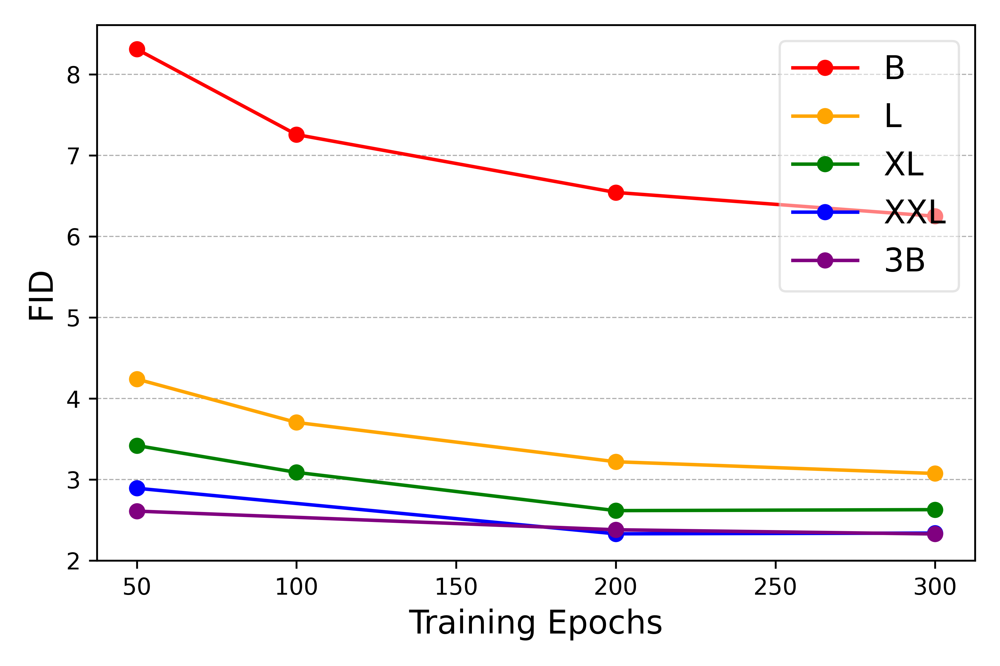

## 一句话定位
LlamaGen 把 LLM 的原生「next-token prediction」范式原封不动搬到图像生成：用一个好的 VQ tokenizer（下采样 16、码本 16384、码本利用率 97%、rFID 0.94/0.70）把图像变成离散 token，再用一个**纯 Llama 架构的 decoder-only 自回归 Transformer**（111M→3.1B）逐 token 生成。最大模型在 ImageNet 256×256 上做到 **FID 2.18**，超过 LDM、DiT 等主流扩散模型——且**不需要 [[var]] 的 next-scale 预测、不需要 MaskGIT 的掩码建模等任何视觉先验**，只用普通 raster-scan next-token。其 tokenizer + AR 配方成了开源社区的事实上的 AR 图像生成积木。

## 背景与定位
2024 年前，图像生成由扩散模型（[[ddpm]]、[[latent-diffusion-ldm]]、[[dit-diffusion-transformer]]）主导，配合活跃的开源社区。自回归路线（VQVAE/VQGAN/DALL-E/Parti）虽是先行者，但开源生态不成熟、长期落后。同期还涌现出修改架构、注入视觉先验的「类语言模型」生成法：MaskGIT/MAGVIT 用掩码图像建模（BERT 式），[[var]]（VAR，与本文同出字节 Yi Jiang/Zehuan Yuan 团队）用 next-scale 多尺度预测。这些都偏离了纯 LLM 架构。

LlamaGen 的研究哲学正相反：**减少视觉信号上的归纳偏置，架构与 LLM 完全一致**，目的是验证「原生语言模型架构能否做到 SOTA 图像生成」，并为未来语言-视觉统一模型铺路。作者把先进图像生成模型的成功归纳为三把钥匙——(1) 设计良好的图像压缩器（tokenizer），(2) 可扩展的生成模型，(3) 高质量训练数据——并逐一重新审视。结论是肯定的：vanilla AR 模型「if scaling properly」就能打过扩散。副产品是可以无缝复用 LLM 社区的训练/推理基建（FlashAttention、FSDP、vLLM 等）。

## 模型架构
**两段式：图像 tokenizer（VQ-VAE）+ 自回归 Transformer。**

**图像 tokenizer（VQ-VAE，VQGAN 架构）。** encoder-quantizer-decoder，编解码器是 ConvNet，下采样率 p（16 或 8）。量化器码本 Z∈R^{K×C}，K 个可学习向量，最近邻量化。三个关键设计（沿用 ViT-VQGAN）：码本向量做 **ℓ2 归一化**、**低码本向量维度 C**（论文消融 C=256→32→8，维度越低 rFID 与码本利用率越好）、**大码本 K=16384**。tokenizer 仅 72M（ds16）/70M（ds8）参数。注意：**不加 entropy loss**（MaskGIT/MAGVIT 用），保持简单。

**自回归 Transformer（纯 Llama 架构）。** 图像 token 按 raster-scan 展平成 h·w 序列，按 next-token 自回归生成 ∏ p(q_t | q_<t, c)。架构「largely based on Llama」：pre-norm 用 **RMSNorm**、**SwiGLU** 激活、**2D RoPE**（每层都用，沿用 EVA-02/Lumina 实现）。**刻意不用 DiT 的 AdaLN**，以保持与 LLM 结构完全一致。五档配置（Table 1）：

| 模型 | 参数 | 层数 | hidden | heads |
|---|---|---|---|---|
| LlamaGen-B | 111M | 12 | 768 | 12 |
| LlamaGen-L | 343M | 24 | 1024 | 16 |
| LlamaGen-XL | 775M | 36 | 1280 | 20 |
| LlamaGen-XXL | 1.4B | 48 | 1536 | 24 |
| LlamaGen-3B | 3.1B | 24 | 3200 | 32 |

**条件注入。** 类别条件：从可学习 embedding 集合取 class embedding 作为 prefilling token（DiT/VQGAN 式）。文本条件：用 **FLAN-T5 XL** 编码文本，再过一个额外 MLP 投影，作为 prefilling token embedding（PixArt/GenTron 式）；文本 token 最大长度 120，left padding。作者明确说这不是统一多模态模型的终极设计（未建立语言-视觉统一词表），留作未来工作。**Classifier-free guidance（CFG）**：训练时随机丢弃条件换成 null embedding；推理时 ℓg = ℓu + s·(ℓc − ℓu)。

**分辨率/token 数策略。** ds16 下：256×256→256 token（16×16），384×384→576 token（24×24），512×512→1024 token（32×32）。论文发现：tokenizer 重建质量随 token 数单调变好（256 tok rFID 2.19 → 576 tok 0.94 → 1024 tok 0.70），但**生成质量并非如此**——模型 <1B 时 256 token 反而比 576 好，模型大了之后 576 token 才更优（token 数与模型规模有协同效应）。

## 数据
**类别条件（ImageNet）。** tokenizer 与生成模型都只在 ImageNet train（约 100 万图）上训。tokenizer 用 256×256 + random crop；生成模型用预计算 image code 加速训练，并对原图取 **10 个 crop**（ten crops）的 code，训练时随机选一份以近似 random crop 增广。论文指出 ImageNet 仅约 1M 图是 3B 模型收益递减的瓶颈。

**文本条件（两阶段）。**
- **Stage I：LAION-COCO 的 50M 子集**。原始 LAION-COCO 有 600M 图文对，按**有效图片 URL、美学评分、水印评分、CLIP 图文相似度、图片尺寸**过滤，剩约 50M。短 caption 是其原始 caption（由 BLIP 生成）。分辨率 256×256。
- **Stage II：10M 内部高美学质量图**。每张图用 **LLaVA** 以「Describe this image in as much detail as possible」生成长 caption；作者发现长 caption 第一句通常是图像摘要，于是把它当短 caption 来增广训练。分辨率 512×512。
- 两阶段训练前，先把 tokenizer 在 50M LAION-COCO + 10M 内部数据的并集上微调。文本模型只取原图 center crop 的 code。

## 训练方法
**核心目标：next-token prediction（交叉熵），无 diffusion、无 flow matching、无 masked-token。** 与扩散模型范式根本不同，这正是其「统一语言-视觉」叙事的卖点。

**tokenizer 训练损失。** 直通梯度估计（straight-through estimator）；码本学习 L_VQ = ‖sg[f]−z‖² + β‖f−sg[z]‖²（commitment loss，β=0.25）；重建训练 L_AE = ℓ2 + LPIPS 感知损失 + λG·PatchGAN 对抗损失（λG=0.5，对抗损失在 20k iter 后才开启）。超参：constant lr 1e-4，AdamW(β1=0.9, β2=0.95)，weight decay 0.05，batch 128，40 epoch。

**类别条件生成训练。** base lr 1e-4 / 256 batch，AdamW(0.9, 0.95)，wd 0.05，grad clip 1.0，dropout 0.1（输入 embedding/attention/FFN），CFG 的 class condition dropout 0.1。预计算 image code 加速。

**文本条件生成训练。** 775M 模型，两阶段（见数据节）。预计算 FLAN-T5 XL 文本 embedding 与 image code。Stage I 学到图文对齐但细节不清；Stage II 用高美学数据 + 高分辨率显著提升视觉质量（作者归因于域偏移 + 高分辨率细节）。

**未用的技术。** 论文**没有**做偏好对齐（RLHF/DPO）、奖励模型、一致性/步数蒸馏（consistency/LCM/ADD）——这些在文中均未涉及。AR 模型加速主要靠下面的推理工程（vLLM），不是蒸馏。

**采样配置消融。** CFG=2.0 时 FID 最优，再增大反而变差（fidelity↑/diversity↓，precision↑/recall↓）；top-k 越大 FID 越好但 IS 下降（拿 fidelity 换 diversity），默认 top-k=码本全量。

## Infra（训练 / 推理工程）
- **训练。** 全部用 PyTorch 2 + 80GB A100。≤1.4B 用 DDP，>1.4B（XXL/3B）用 **PyTorch FSDP** 省显存。可无缝复用 LLM 社区训练配方（FlashAttention、DeepSpeed、Megatron 思路）。论文**未披露**具体 GPU 数 / GPU·时 / 吞吐数字。
- **推理加速（亮点）。** 因架构与 Llama 完全一致，**直接被 vLLM 支持**，无需改造。在 384×384、batch 16（含 CFG 生成 8 张）下，对比已含 KV-Cache 的 baseline：B 326%、L 380%、XL 408%、XXL **414%** 加速（Table 7）。**例外：3B 模型 head size=100 不被 vLLM 的 PagedAttention 支持**，故未报其加速。
- **部署。** 开源 HF Space gradio demo；本地 gradio；vLLM serving 脚本。

## 评测 benchmark（把效果讲清楚）

> 图源：LlamaGen 论文 Figure 2 "Scaling model size"（arXiv:2406.06525，with classifier-free guidance）

**Tokenizer 重建（ImageNet 256×256 val）。** 码本维度消融：C 从 256→8，rFID 9.21→2.19、利用率 0.29%→97%；码本大小：4096→16384，rFID 3.02→2.19。ds16 下 token 数 vs rFID：256 tok 2.19 / 576 tok **0.94** / 1024 tok 0.70；ds8 下 1024 tok rFID **0.59**（PSNR 24.45, SSIM 0.813, 利用率 97.6%）。与他法对比（Table 4）：ds16 本文 rFID 2.19 优于 VQGAN（4.99/8.30）、MaskGIT（2.28）；ds8 本文 0.59 优于 ViT-VQGAN（1.28）、VQGAN（1.19）。**关键结论**：离散 tokenizer 已能匹敌 SD-VAE/SDXL-VAE/OpenAI Consistency Decoder 等连续 VAE（ds8 rFID 0.59 vs SD-VAE 0.74、SDXL-VAE 0.68），「离散表示不再是图像重建瓶颈」。

**类别条件 ImageNet 256×256（FID 主指标，Table 6）。**

| 类型 | 模型 | 参数 | FID↓ | IS↑ | Prec↑ | Rec↑ |
|---|---|---|---|---|---|---|
| Diffusion | LDM-4 | 400M | 3.60 | 247.7 | – | – |
| Diffusion | DiT-XL/2 | 675M | 2.27 | 278.2 | 0.83 | 0.57 |
| GAN | StyleGAN-XL | 166M | 2.30 | 265.1 | 0.78 | 0.53 |
| Mask | MaskGIT | 227M | 6.18 | 182.1 | 0.80 | 0.51 |
| AR | VQGAN-re | 1.4B | 5.20 | 280.3 | – | – |
| AR | ViT-VQGAN-re | 1.7B | 3.04 | 227.4 | – | – |
| **AR** | **LlamaGen-B** | 111M | 5.46 | 193.6 | 0.83 | 0.45 |
| **AR** | **LlamaGen-L** | 343M | 3.07 | 256.1 | 0.83 | 0.52 |
| **AR** | **LlamaGen-XL** | 775M | 2.62 | 244.1 | 0.80 | 0.57 |
| **AR** | **LlamaGen-XXL** | 1.4B | 2.34 | 253.9 | 0.80 | 0.59 |
| **AR** | **LlamaGen-3B** | 3.1B | **2.18** | 263.3 | 0.81 | 0.58 |

- 3B（cfg=1.65）**FID 2.18 超过 LDM（3.60）、DiT-XL/2（2.27）**，并在所有规模上压过此前 AR 模型（VQGAN/ViT-VQGAN/RQ-Transformer），且不少 AR 对手还用了 rejection sampling（-re）。
- Scaling 趋势：B→XXL FID 持续改善，XXL→3B 仅边际提升（作者归因 ImageNet 数据量限制）。CFG 全规模提升视觉质量。
- Token 数 vs 模型（Table 5，50 epoch、cfg=1.75）：256 token 下 B/L/XL/XXL/3B = 8.69/4.21/3.39/3.09/3.06；576 token 下 = 12.89/5.01/3.42/2.89/**2.61**——大模型上 576 token 更优。

**文本条件。** 用 COCOPrompts/PartiPrompts 做**定性可视化**，展示 Stage II 相对 Stage I 在美学/细节上的明显提升，长 caption 对齐能力也不错。论文**未报告** GenEval / T2I-CompBench / DPG-Bench / MJHQ-30K / HPSv2 / ImageReward / PickScore 等 T2I 定量指标，作者明确说文本模型「still behind SOTA」，并列出局限：文字渲染错误、计数错误、常识误解。

## 创新点与影响
**核心贡献。** (1) 证明**纯 Llama 架构 + raster-scan next-token**（零视觉先验）能在 ImageNet 上击败扩散与此前所有 AR/掩码模型，与 [[var]] 的「改架构注入先验」路线形成鲜明对照；(2) 一个高质量、可复用的开源 VQ tokenizer（ds16 码本 16384、利用率 97%、rFID 0.94），证明离散表示不再是重建瓶颈；(3) 完整开源（2 个 tokenizer、7 个类别条件模型 111M–3.1B、775M 文本条件模型的 2 个两阶段 checkpoint〔stage1 256px / stage2 512px〕、HF demo）；(4) 把 LLM 推理基建（vLLM）零改造迁到图像 AR，拿到 326%–414% 加速。

**影响。** 这套「好 VQ tokenizer + 普通 decoder-only AR」配方成为开源社区做 AR 图像生成与统一多模态（understanding+generation）的事实上的积木，被后续大量工作（Show-o、Janus、Lumina-mGPT、统一 token 化方向等）作为基线或组件参考。它强化了「tokenizer is key」「LLM 架构可统一语言-视觉」的研究信念。

**已知局限。** 文本模型规模与数据有限，T2I 定量与最强扩散（SD3/Sora-级）仍有差距，无定量 T2I benchmark、无 RLHF/DPO 偏好对齐、无步数蒸馏；3B 模型受 vLLM PagedAttention head size 限制无法享受同等加速；raster-scan 序列长（高分辨率 token 数大）使 AR 推理本质上比一步扩散慢，作者把 ≥7B 大规模 AR 生成留作未来工作。

## 原始链接
- paper (arXiv abs): https://arxiv.org/abs/2406.06525
- paper PDF: https://arxiv.org/pdf/2406.06525
- code (GitHub): https://github.com/FoundationVision/LlamaGen
- weights (HF): https://huggingface.co/FoundationVision/LlamaGen ; 文本模型 https://huggingface.co/peizesun/llamagen_t2i
- HF demo Space: https://huggingface.co/spaces/FoundationVision/LlamaGen
- project page: https://peizesun.github.io/llamagen/

## 本地落盘文件
- ../../../sources/omni/2024/arxiv-2406.06525.pdf
- ../../../sources/omni/2024/llamagen-autoregressive-image-generation--readme.md
- ../../../sources/omni/2024/llamagen-autoregressive-image-generation--project.md
