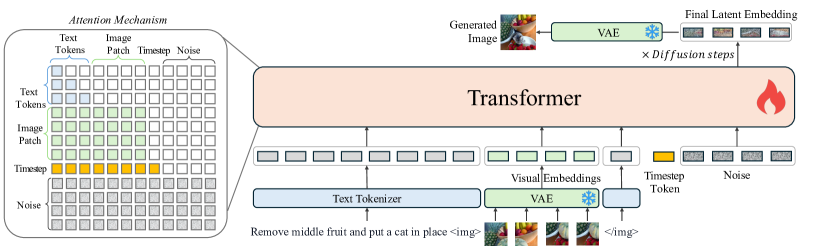
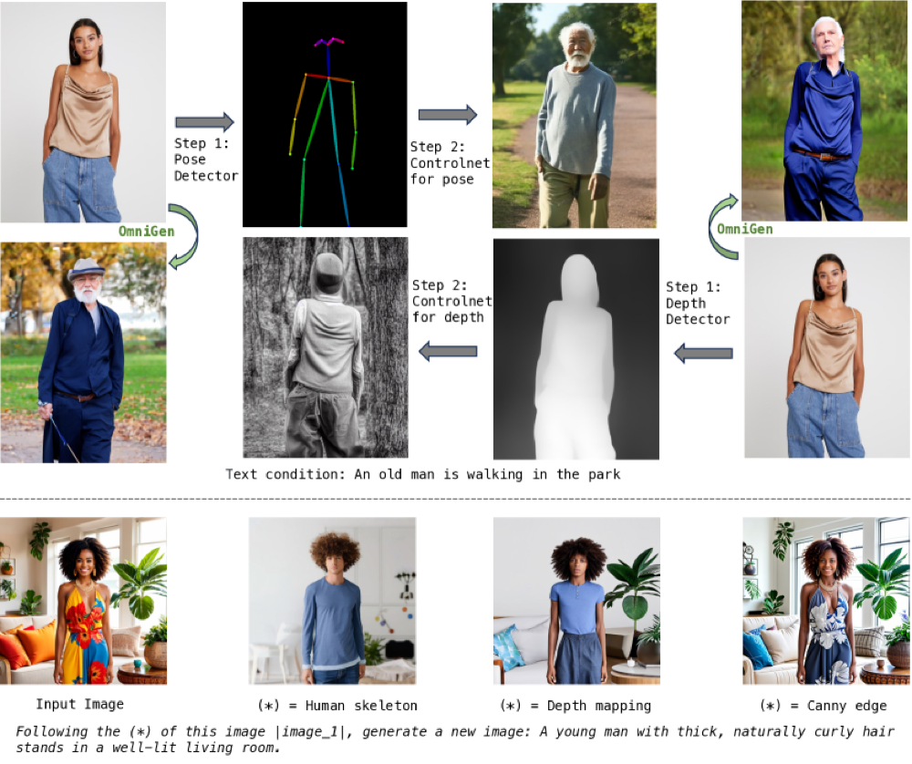

## 一句话定位
OmniGen 是首个用**单一扩散模型**统一文生图、图像编辑、主体驱动生成、ControlNet 式视觉条件生成以及经典 CV 任务的「通用图像生成基座」——架构仅 **VAE + 一个 Transformer**（无需 CLIP/额外编码器、无需任何插件），自由交错的图文多模态指令即可端到端完成任务；仅 **3.8B 参数**就在 GenEval 上取得 **0.70** 总分，与 12.7B 参数的 SD3（0.68）相当甚至更高。

## 背景与定位
LLM 已经把语言任务统一进单一框架（ChatGPT 范式），但图像生成长期处于「一任务一模型/一插件」的碎片化状态：[[stable-diffusion-1]] / [[dall-e-3]] / [[imagen-3]] 专攻 T2I；要做空间控制要加 [[controlnet]]，要做身份保持要加 InstantID（还得先跑人脸检测+人脸编码器），要做编辑要再加载 InstructPix2Pix。这导致用户无法「一句指令端到端搞定」，必须串联多模型、多步预处理的繁琐工作流。

OmniGen 的核心主张：图像生成应像 GPT 处理语言一样**简单、灵活**——任意多模态指令直接出图，不需任何附加插件与中间步骤。它是「通用图像生成基座模型的第一次尝试」（论文自述），并配套开源了首个大规模统一图像生成数据集 **X2I（"anything to image"）**。在技术脉络上，它继承了 [[latent-diffusion-ldm]] 的潜空间扩散、[[dit-scalable-diffusion-transformers]] 的 Transformer backbone、[[stable-diffusion-3]] 的 rectified flow 训练目标，但把「条件编码」这件事彻底并进主干 Transformer，从而抹掉了 CLIP/T5 文本编码器与各类条件 Adapter。与同期统一工作（TransFusion、Show-O）相比，后两者仍聚焦 T2I，而 OmniGen 覆盖编辑/主体/视觉条件/经典 CV 等更广的任务谱。

## 模型架构

> 图源：OmniGen: Unified Image Generation (arXiv:2409.11340) Figure 2 — The framework of OmniGen

**极简双组件**：一个 **VAE** + 一个 **大 Transformer**，训练时仅 VAE 冻结。

- **Backbone**：Transformer **用 Phi-3（3.8B）初始化**（论文称用 Phi-3 的权重初始化大 Transformer，并复用其 tokenizer 处理文本）。整模约 **3.8B 参数**——注意这是包含「条件编码」在内的全部参数，对比 SD3 的 8.0B 主干 + 4.7B 冻结文本编码器（合计 12.7B）。
- **VAE**：直接用 **SDXL 的 VAE**（[[sdxl]]）抽取连续视觉特征；patch size = 2（沿用 [[dit-scalable-diffusion-transformers]]）。输入图像经 VAE → 加一层线性层 → 按 patch 线性嵌入展平成视觉 token 序列。
- **没有独立 text encoder / image encoder**：这是与主流扩散模型最大的不同。OmniGen 不用 CLIP 文本/图像编码器，文本由 Phi-3 tokenizer 切分，图像由 VAE 编码，**文本与图像在同一个 Transformer 内联合建模**，模态间可充分交互（而非各自用独立编码器再做 cross-attention）。
- **输入表示**：自由交错的图文多模态序列。视觉 token 用标准频率位置编码；不同长宽比的图像处理方式同 [[stable-diffusion-3]]；每段图像序列用特殊 token `` / `</img>` 包裹后插入文本 token 流；时间步嵌入（timestep embedding）追加在序列末尾。**不需要任何 task-specific 特殊 token** 来指示任务类型。
- **注意力机制（关键设计）**：把 LLM 的因果注意力与双向注意力**混合**——序列层面用 causal attention（每个元素只能看到之前出现过的图像/文本），但**单张图像内部用 bidirectional attention**（同一图像的 patch 之间互相可见）。论文论证：图像应作为整体建模，纯单向 causal 注意力不适配 rectified flow（消融见下）。
- **推理**：从高斯噪声出发，用 flow matching 预测目标速度，迭代多步得到潜表示，再经 VAE decoder 解码出图。借助上述注意力设计，OmniGen 可像 LLM 一样用 **kv-cache** 缓存条件输入的 K/V，避免冗余计算来加速。

## 数据
**X2I 数据集**——首个大规模统一图像生成数据集，约 **0.1 billion（1 亿）张图**，全部转成统一的「交错图文序列」格式，`|image_i|` 占位符标记第 i 张输入图。构成：

- **文生图（T2I）**：聚合多个开源数据集——RecapDataComp（56M 子集）、SAM-LLaVA、ShareGPT4V、LAION-Aesthetic（4M 子集）、ALLaVA-4V、DOCCI、DenseFusion、JourneyDB。早期训练用它们学广覆盖的图文匹配与知识；**stage 3 之后**换用**内部 16M 高质量图像**提升美学质量。内部数据与 LAION-Aesthetic 的标注用 **InternVL2** 合成 re-caption。
- **多模态到图（Multi-modal to Image）**：
  - 编辑：MagicBrush、InstructPix2Pix、SEED-Edit。
  - 人体动作：Something-Something；虚拟试衣：HR-VITON、FashionTryon；风格迁移：StyleBooth。
  - 视觉条件控制：用 **MultiGen** 数据集，选 6 种代表性条件——Canny、HED、Depth、Skeleton、Bounding Box、Segmentation。
- **主体驱动（Subject-driven）**：
  - **GRIT-Entity 基础集（6M 对）**：基于 GRIT 数据集的物体名标注 → GroundingDINO 开集检测框 → SAM 分割物体 mask → 用 MS-Diffusion 重绘物体图提升质量与多样性。
  - **Web Images 高质量集（533K 对）**：从 Datacomp 采 2000 万 Alt-text → spaCy 做 NER → GPT-4o 过滤出 2000 个真实知名人物 → 扩展到约 1 万「人名对」→ 搜索引擎爬图 → 用 **InternVL 交叉验证**过滤（去掉不含目标人物的噪声图）→ 标注衣着/动作。用同一人的不同照片作输入/输出，避免「复制粘贴」捷径。
- **经典 CV 任务**：
  - 低层视觉（低光增强、去雨、去模糊、补全/外绘、上色）——标注本身是图，仅加文本指令（指令由 GPT-4o 生成并随机采样）。
  - 高层视觉——把标注也表示为图：用 LAION 图作源，MultiGen 标注作目标，构造源图→人体姿态/Depth/Canny/HED/分割图的图对；另加 RefCOCO、ADE20k、ReasonSeg 做指代分割（目标物体在输出图中高亮成蓝色）。
- **Few-shot to Image**：对上述各任务随机取少量示例与原输入拼成 in-context 输入，激发模型的 in-context learning；受资源限制只用 1 个示例。

数据质量/安全过滤：早期低质量数据用于打基础、stage 3 后切高质量内部数据提美学；未专门披露 NSFW/安全过滤管线细节。

## 训练方法
- **训练目标：rectified flow（flow matching）**。前向过程是噪声与数据的**直线线性插值**：x_t = t·x + (1−t)·ε（ε∼N(0,1)）。模型直接回归目标速度，损失为 `L = E[ ||(x−ε) − v_θ(x_t, t, c)||² ]`。
- **加权损失（编辑任务关键 trick）**：编辑任务输入图与目标图差异往往很小，模型易学到「直接复制输入」的捷径使 loss 极低。OmniGen 据输入/目标潜表示计算逐区域损失权重——**改变区域权重显著放大**（未变区域权重 1，变化区域权重 1/‖x−x′‖²），引导模型聚焦待修改区域。消融证实不加权损失会让编辑退化为复制输入。
- **多阶段渐进式分辨率训练（5 个 stage，全部在 104×A800 上）**：

  | Stage | 分辨率 | Steps(K) | Batch Size | Learning Rate |
  |---|---|---|---|---|
  | 1 | 256×256 | 500 | 1040 | 1e-4 |
  | 2 | 512×512 | 300 | 520 | 1e-4 |
  | 3 | 1024×1024 | 100 | 208 | 4e-5 |
  | 4 | 2240×2240 | 30 | 104 | 2e-5 |
  | 5 | 多分辨率(Multiple) | 80 | 104 | 2e-5 |

  低分辨率数据效率高、高分辨率提升美学；优化器 **AdamW**（β=(0.9,0.999)）。
- **CoT / 分步生成探索**：构造动漫数据集，用 PAINTS-UNDO 模拟人类作画的 8 个阶段帧，过滤不一致序列后微调模型 **16,000 步**，让模型模拟「从空白画布逐步细化」的作画过程。结论：能模拟人类作画行为，但最终质量**未超过原模型**（分步可能累积错误修改导致画面混乱），属初步探索；作者据「过程监督 > 结果监督」的 LLM 经验认为该方向值得继续。
- **蒸馏/步数加速**：论文**未做** consistency/LCM/ADD 等步数蒸馏（默认 50 步推理）；量化也列为 future work。

## Infra（训练 / 推理工程）
- **训练算力**：全部实验在 **104 张 A800 GPU** 上完成；论文未披露总 GPU·时、并行策略、混合精度等细节。
- **推理加速**：核心是 **kv-cache**（缓存条件输入 K/V）。开源推理代码提供多档省显存/加速开关：`use_kv_cache`、`offload_kv_cache`（KV 卸载到 CPU）、`separate_cfg_infer`（CFG 分离推理降显存）、`offload_model`（模型卸载到 CPU）。默认 `use_kv_cache=True, offload_kv_cache=True, separate_cfg_infer=True, offload_model=False`。
- **实测显存/耗时（默认设置，来自官方 inference 文档）**：
  - **A800**：纯文 1024² ≈ **9G/31s**；文+单图 1024² ≈ 12G/1m6s；文+双图 ≈ 13G/1m20s；降到 512² 纯文仅 9G/7s。
  - **RTX 3090(24G)**：纯文 1024² ≈ 9G/1m17s；文+单图 ≈ 12G/2m46s；文+双图 ≈ 13G/3m23s。
  - 极限省显存（全开 offload）：纯文最低 **3G/1m23s**（A800），可在小显存卡跑。仅开 kv_cache 不卸载时显存飙到 18~48G（A800），3090 上文+图直接 **OOM**——说明卸载策略是消费级卡可用的关键。
- **量化**：论文与文档均将量化列为「值得探索、留作 future work」，当前未提供量化推理。
- **部署形态**：开源权重（Shitao/OmniGen-v1，MIT 协议）、HF Gradio Demo、Replicate API；2025-02 起进入 **Diffusers** 主库；训练侧提供 `train.py` 支持 LoRA / 全量微调（用户只需准备数据，无需为新任务设计网络）。

## 评测 benchmark（把效果讲清楚）

> 图源：OmniGen: Unified Image Generation (arXiv:2409.11340) Figure 9 — 对比 ControlNet：ControlNet 需「检测器抽条件 + 加载控制模块」两步，OmniGen 一步端到端完成

默认推理 50 步，文本 CFG=2.5、图像 CFG=1.6（编辑任务图像 CFG 提到 2）。

**GenEval（文生图，越高越好）**：

| 模型 | 参数 | Overall | Single | Two obj | Counting | Colors | Position | Attr binding |
|---|---|---|---|---|---|---|---|---|
| SDv1.5 | 0.9B+0.1B* | 0.43 | 0.97 | 0.38 | 0.35 | 0.76 | 0.04 | 0.06 |
| SD-XL | 2.6B+0.8B* | 0.55 | 0.98 | 0.74 | 0.39 | 0.85 | 0.15 | 0.23 |
| DALL·E 3 | – | 0.67 | 0.96 | 0.87 | 0.47 | 0.83 | 0.43 | 0.45 |
| SD3 | 8.0B+4.7B* | 0.68 | 0.98 | 0.84 | 0.66 | 0.74 | 0.40 | 0.43 |
| **OmniGen** | **3.8B** | **0.70** | **0.99** | 0.86 | 0.64 | 0.85 | 0.31 | **0.55** |

（*为冻结文本编码器参数）OmniGen 用 3.8B 参数取得 0.70 总分，超过 SD3（0.68，12.7B）与 DALL·E 3（0.67），尤其 Attribute binding（0.55）领先；Position（0.31）弱于 SD3/DALL·E 3。作者强调这体现「参数利用效率」——省掉了额外编码器的成本。

**图像编辑（EMU-Edit test，CLIP 相似度）**：OmniGen CLIP-T **0.231**（与 EMU-Edit 0.231、MagicBrush 0.222 持平/更高，表示指令遵循好）、CLIP-I 0.829（保真度，略低于 EMU-Edit 0.859）。

**主体驱动（DreamBench，CLIP 相似度）**：OmniGen CLIP-T **0.315**（高于 DreamBooth 0.305、Kosmos-G 0.287，文本遵循最好）、CLIP-I 0.801。**且无需像 DreamBooth 那样对具体物体微调**，仅用一张参考图。

**可控生成（视觉条件，对比 ControlNet 系）**：

| 方法 | Seg mIoU↑ | Canny F1↑ | HED SSIM↑ | Depth RMSE↓ |
|---|---|---|---|---|
| ControlNet | 32.55 | 34.65 | 0.8097 | 35.90 |
| ControlNet++ | 43.64 | 37.04 | 0.8332 | 28.32 |
| **OmniGen** | **40.06** | **38.96** | 未报告 | 31.71 |

> 注：论文 Table 4 的 HED SSIM 列只给出 6 个数（对应 T2I-Adapter/Gligen/Uni-ControlNet/UniControl/ControlNet/ControlNet++），**OmniGen 行的 HED SSIM 未报告**（原文中 0.7969 属于 Uni-ControlNet，非 OmniGen）。

OmniGen 在 Canny F1（38.96，全表最高）上领先；Seg mIoU（40.06）低于 ControlNet++（43.64）但高于 ControlNet（32.55）；Depth RMSE（31.71）介于 ControlNet（35.90）与 ControlNet++（28.32）之间。关键是 **OmniGen 一步完成**，而 ControlNet 需「检测器抽条件 + 加载对应控制模块」两步多插件。

**关键消融**：
1. **注意力**：去掉「图像内双向注意力」改用纯 LLM 单向注意力 → 生成图大量噪声/扭曲，证明单向注意力不适配 rectified flow。
2. **加权损失**：不用加权损失 → 编辑任务退化为直接复制输入图。
3. **输入图像表示（VAE vs CLIP）**：用 VAE 编码输入图 vs 用 CLIP，效果差异不大；VAE 在 image similarity（CLIP-I：EMU-Edit 0.829 vs 0.820、DreamBench 0.801 vs 0.789）略优，且避免额外模块、保持简洁。

**涌现能力**（非量化，定性）：任务组合（一句话里多任务/多指令同时执行）、未见域 few-shot in-context learning（如不认识「卷笔刀」，给一个示例即可完成分割）、推理能力（"哪里能洗手"→推断出水槽并标注）、端到端替代 ControlNet 工作流。

## 创新点与影响
**核心贡献**：
1. **首个通用图像生成基座**：单模型统一 T2I / 编辑 / 主体驱动 / 视觉条件 / 经典 CV，无需任何插件与预处理，端到端跟随多模态指令——「图像生成界的 GPT 范式」雏形。
2. **极简架构**：VAE + 一个 Transformer，**消灭 CLIP/T5 文本编码器与所有条件 Adapter**，把条件编码内化进主干；3.8B 参数即达 SD3 级 GenEval 表现，参数利用效率高。
3. **首个统一图像生成数据集 X2I**（约 1 亿图，统一交错图文格式），并于 2024-12 开源；配套两个工程 trick——图像内双向注意力、编辑加权损失。
4. **展示跨任务知识迁移与涌现能力**：任务组合、未见域 few-shot、推理、CoT 式分步生成的初步探索。

**对后续的影响**：OmniGen 是「统一/通用图像生成」路线的里程碑式开源工作，验证了「用一个 LLM 风格 Transformer + 扩散目标统吃多任务」的可行性，直接启发了一批 unified generation 工作；2025-06 团队发布 **OmniGen2** 续作。其「VAE 直接编码输入图、无独立视觉编码器、图文同主干联合建模」的设计成为后续统一模型的重要参考；X2I 数据集为社区提供了稀缺的多任务统一训练数据。

**已知局限**（论文坦承）：
- 文本渲染弱，长文本无法准确生成；
- 训练时输入图最多 3 张（资源所限），不能处理长图序列；
- 细节易错（尤其手部、人脸小部件，主体驱动时面部相似度不及 PULID-FLUX 等专用模型）；
- 无法处理未见图像类型（如 surface normal 图）；
- 整体画质不及同期 FLUX（受高质量数据与模型规模限制）；
- CoT 分步生成质量未超原模型，仍属初步探索。

## 原始链接
- arxiv_abs: https://arxiv.org/abs/2409.11340
- arxiv_pdf: https://arxiv.org/pdf/2409.11340
- github: https://github.com/VectorSpaceLab/OmniGen
- hf_model: https://huggingface.co/Shitao/OmniGen-v1
- project_page: https://vectorspacelab.github.io/OmniGen/
- inference_docs: https://github.com/VectorSpaceLab/OmniGen/blob/main/docs/inference.md
- x2i_dataset: https://huggingface.co/collections/yzwang/x2i-dataset-674c66d1d700f7f816a9590d
- omnigen2(续作): https://github.com/VectorSpaceLab/OmniGen2

## 一手源存档（sources/）
- [arxiv-2409.11340.pdf](https://arxiv.org/pdf/2409.11340)  （arXiv 原文 PDF，不入 git）
- [arxiv-2409.11340.txt](https://github.com/zhao9797/ai-research/blob/main/sources/omni/2024/arxiv-2409.11340.txt)
- [readme.md](https://github.com/zhao9797/ai-research/blob/main/sources/omni/2024/omnigen--readme.md)
- [hf-modelcard.md](https://github.com/zhao9797/ai-research/blob/main/sources/omni/2024/omnigen--hf-modelcard.md)
- [inference-docs.md](https://github.com/zhao9797/ai-research/blob/main/sources/omni/2024/omnigen--inference-docs.md)
