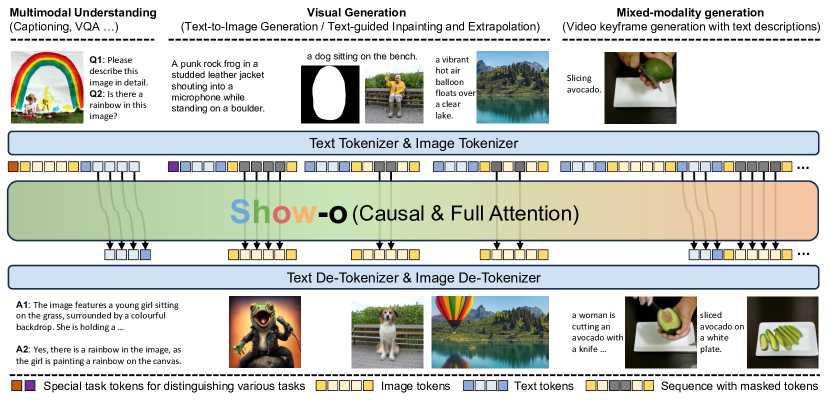
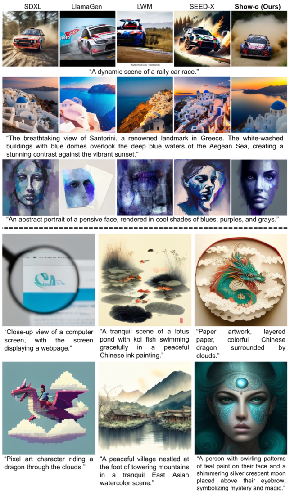

## 一句话定位
Show-o 是首个把**自回归（理解、文本）与离散扩散（生成、图像）融进同一个 Transformer** 的统一多模态模型：以 1.3B 的 Phi-1.5 为骨干，文本走 causal NTP、图像走 MaskGIT 式 masked-token 预测，单模型同时做 VQA、文生图、文引导 inpainting/extrapolation 与混合模态生成；以 1.3B 参数 + 35M 图文数据拿到 MSCOCO zero-shot FID 9.24、GenEval Overall 0.68，对标乃至超过参数量大数倍的专用/统一模型，且文生图采样步数约为自回归生成的 1/20。

## 背景与定位
多模态智能的两大支柱——**理解**（MLLM，如 LLaVA，Transformer + 自回归）与**生成**（扩散，如 [[latent-diffusion-ldm]]、Stable Diffusion 3）——长期由两类独立模型承担。早期"统一"方案（NExT-GPT、SEED-X、DreamLLM）多是把理解 LLM 与一个外挂预训练扩散模型拼起来，本质仍是多模型系统。[[chameleon]]（Meta, 2024）证明"单 Transformer 同时生成 text/image token"可行，但它对图像也用**自回归**建模——而自回归逐 token 生成图像在高分辨率下采样步数巨大（causal attention 限制并行），且实测扩散在视觉生成质量上普遍优于自回归。

Show-o 的核心洞见：**不必让图像也自回归**。它在同一个 Transformer 里让文本保留自回归（与 LLM 一致），让图像改用 MaskGIT（[[maskgit]]）那套"简化离散扩散"（masked-token prediction）——既享受扩散并行去噪的少步数优势，又把生成统一回"在离散 token 上预测"的范式，从而和文本 token 同处一套词表、一个网络。它还消除了扩散模型必需的独立 text encoder（T5/CLIP），由 Transformer 自身编码文本条件。论文中文版收录于 **ICLR 2025**；后续衍生出 Show-o2（1.5B/7B，NeurIPS 2025）。

## 模型架构

> 图源：Show-o: One Single Transformer to Unify Multimodal Understanding and Generation (arXiv:2408.12528) Figure 2

**骨干**：直接继承现成 LLM 架构（**Phi-1.5，1.3B**），**不改架构**，仅在每个注意力层前加 **QK-Norm**（借鉴 Chameleon/ViT-22B 稳定训练）。用预训练 LLM 权重初始化，embedding 层扩容：新增 **8,192 个可学习 image-token embedding**。

**视觉 tokenizer**：默认用 **MAGVIT-v2 风格的 lookup-free quantizer（LFQ）**，自己在大规模图像上训练，codebook 大小 **K=8,192**，把 256×256 图像编码为 **16×16=256 个离散 token**（默认 option a）。论文还探索了两种"理解专用"输入（Fig.3）：option b 用 MAGVIT-v2 连续表征（Show-o†）、option c 用 **CLIP-ViT 连续表征**（Show-o‡），后者显著提升理解指标。

**无独立 text encoder**：与 SD3 等"text encoder + denoiser 双模型"不同，Show-o 由自身编码文本条件，文生图时文本与图像同在一个序列里。

**统一 prompting（Fig.4）**：用任务标识 token `[MMU]`/`[T2I]` 区分理解与生成，`[SOT]/[EOT]` 标记文本起止、`[SOI]/[EOI]` 标记图像起止，把任意模态拼成一条序列。

**Omni-Attention（关键设计，Fig.5）**：一套可随序列格式自适应切换的注意力——**文本 token 用 causal attention，图像 token 用 full attention**（每个图像 token 互相可见）。于是：理解任务里文本可 attend 到前面所有图像 token；文生图里图像 token 可 attend 到前面所有文本 token；纯文本时退化为标准 causal LM。GitHub 提供基于 PyTorch **FlexAttention** 的实现以加速这套混合注意力（2024-09-01）。

**分辨率策略**：先 256×256 训练，再升到 **512×512**（继续训练）；视频则把 MAGVIT-v2 "inflate" 成 3D，把 3×17×256×256（8 FPS）压成 5×16×16 离散 token。

## 数据
三类训练数据（Appendix E）：
- **纯文本**：RefinedWeb（约 10 亿条 / 9.68 亿网页，2.8 TB），用于维持预训练 LLM 的文本推理能力。
- **类名图像**：ImageNet-1K 的 1.28M 图，用类名当文本，学 class-conditional 生成 + 像素依赖。
- **图文对**：预训练阶段约 **35M** 图文对（CC12M、SA-1B、LAION-aesthetics-12M）；进一步扩到约 **2.0B**（并入 DataComp、COYO-700M，附带过滤策略）。**用 ShareGPT4V 对这些数据做 re-caption**。
- **高质量微调**：约 **1M 内部图文对**做最终 T2I 微调；理解侧沿用 **LLaVA-Pretrain-558K + LLaVA-v1.5-mix-665K**做指令微调；混合模态用 **GenHowTo** 数据集。

消融（Table 4）证实：图文对从 35M→2.0B、分辨率 256→512，理解指标（POPE/MME/Flickr30k/VQAv2/GQA）单调提升——因离散 image-token embedding 是从零学的，需要更多图文对做模态对齐、更多 token 表征图像。

## 训练方法
**两个学习目标共同训练**（按序列格式自动切换）：
- **NTP（Next Token Prediction）**：对文本 token 标准语言建模（公式 1）。
- **MTP（Mask Token Prediction）**：对图像 token 按随机比例（由"时间步"控制）替换为 `[MASK]`，仅对被 mask 的 token 计 loss，条件是未 mask 图像 token + 前文文本 token（公式 2），采样/mask 调度沿用 **MaskGIT**。这被论文证明等价于一种简化的**离散扩散**（Appendix A 给出与 D3PM/discrete diffusion 的 ELBO 推导）。
- 总损失 **L = L_MTP + α·L_NTP**；文生图训练时按概率把文本条件替换为空文本 `""`，实现 **classifier-free guidance（CFG）**。

**三阶段渐进训练**（Appendix C/F）：
1. **Image Token Embedding & 像素依赖学习**：RefinedWeb（保语言）+ ImageNet-1K（类条件生成）+ 图文对（captioning），主学新 image-token embedding、像素依赖、图文对齐。
2. **图文对齐（理解 + 生成）**：把类条件生成替换为基于 ~35M 图文对的文生图训练，强化 captioning 与 T2I 对齐。
3. **高质量微调**：用过滤后的高质量图文对 + 指令数据（LLaVA 配置）做最终 refine，含混合模态生成。

**关键超参**：AdamW，weight decay 0.01，warm-up 5,000 步，初始 lr **1e-4 + cosine**。具体步数：阶段一联合训练 **500K 步**（含类条件生成）→ 换 35M 图文对再训 **1,000K 步**（base 模型）→ 在 2.0B 图文对上继续 **500K 步** → 升到 512×512 再训 **500K 步** → 最后 1M 高质量图文对 + LLaVA 指令微调。

**推理（Appendix D）**：生成时全 `[MASK]` 起步，T 步内并行预测全部 logits、按置信度逐步 re-mask（mask 调度 γ，m=⌈γ(t/T)M⌉），CFG 用 ℓ=(1+w)ℓ_c − w·ℓ_u。论文称文生图所需采样步数约为自回归生成的 **1/20**。

## Infra（训练 / 推理工程）
- **算力**：base 模型在 **48× A100 (80GB)** 上训练，**总 batch size = 1,152**。论文未披露总 GPU·时。
- **混合注意力实现**：Omni-Attention 通过 **FlexAttention（PyTorch）** 实现加速（GitHub 2024-09-01，致谢 Horace He）。
- **训练监控**：官方代码用 wandb 记录与可视化（README）。
- **推理加速来源**：离散扩散（MaskGIT 式）天然少步并行，是相对自回归图像生成的主要提速来源（~20×）；论文未报告量化/蒸馏/缓存等额外推理优化。
- 混合精度、并行/分布式细节、吞吐数字均**未披露**。

## 评测 benchmark（把效果讲清楚）

> 图源：Show-o: One Single Transformer to Unify Multimodal Understanding and Generation (arXiv:2408.12528) Figure 7（上：与 SDXL/LlamaGen/LWM/SEED-X 的 T2I 定性对比；下：Show-o 生成样本）

**多模态理解（Table 1，Show-o 1.3B）**：POPE 80.0 / MME 1097.2 / Flickr30k 67.6 / VQAv2(test) 69.4 / GQA 58.0 / MMMU 26.7。
- 对标自训的 LLaVA-v1.5-Phi-1.5（1.3B，纯理解）基本持平，证明统一不显著掉点。
- 用 CLIP-ViT 连续表征的 **Show-o‡** 进一步提升（Table 3 中 GenEval 也微升到 0.69）。
- 与更大的统一模型相比：VQAv2 大幅优于 NExT-GPT-13B、Chameleon-34B；Flickr30k 亦不俗。

**文生图保真度——MSCOCO zero-shot FID-30K（Table 2）**：Show-o **9.24**（1.3B / 35M 图）。优于 DALL·E(27.5)、GLIDE(12.24)、LDM(12.64)、DALL·E 2(10.39, 6.5B/650M 图)、SDv1.5(9.62)；统一模型里优于 CoDI(22.26)、SEED-X(14.99)、LWM(12.68)，接近 DreamLLM(8.76)。Imagen(7.27)/RAPHAEL(6.61)/PixArt(7.32) 更低，但参数与数据规模远大于 Show-o（论文亦指出 MSCOCO FID 因分布不匹配并非完全可靠）。

**文生图对齐——GenEval（Table 3）**：Show-o **Overall 0.68**（Show-o‡ 0.69）。逐项：Single Obj. 0.98 / Two Obj. 0.80 / Counting 0.66 / Colors 0.84 / Position 0.31 / Color Attri. 0.50。
- 同尺寸 LDM(1.4B) 仅 0.37，Show-o 全六项领先约 +0.24；超过 DALL·E 2(0.52, 6.5B)、SDXL(0.55, 2.6B)，逼近 SD3(0.62, 2B)；统一模型里大幅超 CoDI(0.31)、SEED-X(0.49)、Chameleon、Transfusion(0.63)，接近 Emu3(0.66)。

**消融关键结论**：
- 数据/分辨率（Table 4）：35M→2.0B、256→512 单调提升理解。
- 视觉编码器（Table 5）：理解任务上 **CLIP-ViT 连续表征 ≫ MAGVIT-v2 离散 token**，原因有二——CLIP 在 400M 数据上预训练（远超自训 MAGVIT-v2 的 35M），且 CLIP 的判别式（图文匹配）目标比 MAGVIT-v2 的重建目标更利于理解适配。
- 采样步数 / CFG（Appendix I）：步数越多越贴合 prompt、保真越好；CFG 显著增强色彩与内容多样性及文本一致性。

**其他能力**（定性）：免微调的文引导 inpainting/extrapolation；混合模态视频关键帧 + 文本描述生成（GenHowTo）；视频理解与生成（MAGVIT-v2 inflate）。

## 创新点与影响
**核心贡献**：(1) 首次在**单 Transformer 内统一自回归 + 离散扩散**，文本/图像用各自最优范式（NTP / MaskGIT-MTP），并以 Appendix A 把 masked-token 预测严格对接到离散扩散理论；(2) **Omni-Attention** 让 causal 与 full attention 随序列格式自适应混合，是统一不同模态建模的关键工程；(3) 自身编码文本条件，**消除独立 text encoder**；(4) 仅 1.3B + 35M 数据即逼近/超越大数倍专用模型，且采样步数约 1/20。

**影响**：开创 Show-o/Show-o2 系列（Show-o2 升级到 1.5B/7B LLM、支持 512/1024 分辨率与更好文本渲染，NeurIPS 2025），并与 [[chameleon]]、[[transfusion]]、[[janus]]、[[emu3]] 一起成为 2024 年"单模型统一理解+生成"路线的代表；其"理解走 AR、生成走离散扩散/掩码"的分治范式被后续统一模型反复借鉴。

**已知局限**：(1) 理解侧默认离散 token 弱于 CLIP 连续表征，需要 Show-o‡ 这类妥协；(2) GenEval 的 Position(0.31)/Counting(0.66) 仍偏弱；(3) MSCOCO FID 评测受分布不匹配影响、参考价值有限；(4) 1.3B 规模与高质量微调数据有限，绝对生成质量距同期顶级专用扩散（Imagen/SD3-large）仍有差距；论文 Appendix K 另讨论了失败模式。

## 原始链接
- arxiv_abs: https://arxiv.org/abs/2408.12528
- arxiv_pdf: https://arxiv.org/pdf/2408.12528
- openreview (ICLR 2025): https://openreview.net/pdf?id=o6Ynz6OIQ6
- github: https://github.com/showlab/Show-o
- hf demo: https://huggingface.co/spaces/showlab/Show-o
- hf checkpoints: https://huggingface.co/showlab （show-o, show-o-512x512, show-o-w-clip-vit, magvitv2, show-o2-1.5B/7B 等）

## 本地落盘文件
- ../../../sources/omni/2024/arxiv-2408.12528.pdf （即 ICLR 2025 camera-ready 版，PDF 页眉标注 "Published as a conference paper at ICLR 2025"，与 openreview 链接内容一致）
- ../../../sources/omni/2024/show-o--readme.md
- （openreview PDF 未单独落盘——内容与上面落盘的 arxiv PDF 相同，故不重复抓取）
