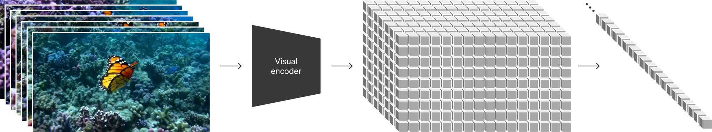

## 一句话定位
Sora 是 OpenAI 2024-02-15 以技术报告《Video generation models as world simulators》亮相的大规模文生视频生成模型，核心创新是**把视频/图像统一压缩成"时空潜 patch（spacetime latent patches）"，再用 Diffusion Transformer（DiT）在其上做大规模扩散训练**；最亮眼的结果是单一模型即可生成**最长 1 分钟、最高 1080p、任意时长/分辨率/宽高比**的高保真视频，并展现 3D 一致性、物体永久性等"涌现的世界模拟"能力——OpenAI 据此提出"扩展视频生成模型是通往通用物理世界模拟器的可行路径"这一范式判断。

## 背景与定位
- **要解决什么问题。** 此前视频生成（RNN、GAN、自回归 transformer、早期视频扩散如 Imagen Video / Align-your-Latents / Photorealistic Video Generation）大多局限于**窄类别数据、短视频、固定尺寸**（论文原话："narrow category of visual data, on shorter videos, or on videos of a fixed size"，典型设定 4 秒 @ 256×256）。Sora 的目标是做一个**通用的视觉数据生成器（generalist model of visual data）**：同一个模型覆盖不同时长、宽高比、分辨率，直至 1 分钟高清。
- **技术脉络中的位置。** Sora 把 LLM 的成功配方迁移到视觉：LLM 靠 internet-scale 数据 + 把代码/数学/多语种统一成 **token** 获得通才能力；Sora 则把视觉数据统一成 **patch**。它是 [[latent-diffusion-ldm]]（在压缩潜空间扩散）+ [[ddpm]]（去噪扩散目标）+ [[dit-scalable-diffusion-transformers]]（Diffusion Transformer, Peebles & Xie 2023）+ DALL·E 3 recaptioning（[[dall-e-3]]）几条线的工程集成，并首次把它们推到"原生变长/变分辨率/变宽高比的视频"这一新规模。论文显式援引 NaViT（Patch n' Pack）作为"任意宽高比与分辨率"的 patch 化思想来源。
- **相对前置工作的关键改进。**
  1. 放弃"把所有视频 crop/resize 成固定方形尺寸"的工业惯例，**用原生尺寸训练**，并实证这能提升构图与取景（framing/composition）。
  2. 验证 DiT 在**视频**上同样具备随训练算力扩展的 scaling 性质（base / 4× / 32× 算力的样本质量对比是报告核心实证）。
  3. 用同一模型统一图像与视频生成（图像 = 单帧视频）。
- **范式意义。** 技术报告把视频生成重新框定为"**世界模拟器**"问题，而非娱乐性玩具。论文末尾观点："continued scaling of video models is a promising path towards the development of capable simulators of the physical and digital world"。这一判断引爆了 2024–2025 视频生成军备竞赛（[[kling]]、[[gen-3-alpha]]、Veo、[[movie-gen]]、[[cogvideox]]、[[hunyuan-video]] 等），是该赛道的标杆事件。
- **时间线。** 2024-02 技术报告 + landing page 公布（仅研究预览，开放红队与艺术家访问）；2024-12-09 以更快的 **Sora Turbo** 转为公开产品（sora.com，详见 [[sora]] 的产品发布页）。本页聚焦 2024-02 这份技术报告所披露的**方法与研究结论**。

## 模型架构

> 图源：OpenAI, "Video generation models as world simulators" (2024) — https://openai.com/index/video-generation-models-as-world-simulators/

> 关键前提：技术报告原文明确声明"**Model and implementation details are not included in this report**"，因此**参数量、层数、tokenizer 具体结构、文本编码器选型、潜空间维度均未披露**。下文只整理一手源可确证的设计。

- **整体两段式：先压缩成潜空间，再分解为时空 patch。** "At a high level, we turn videos into patches by first compressing videos into a lower-dimensional latent space, and subsequently decomposing the representation into spacetime patches."

- **视频压缩网络（video compression network，VAE 式 encoder/decoder）。** 训练一个降维网络，输入原始视频，输出在**时间和空间两个维度上同时被压缩**的 latent；Sora 在该压缩潜空间内训练并生成，再用配套训练的 **decoder** 把生成的 latent 映射回像素空间。报告将其引用归到 LDM（Rombach et al.）与 VAE（Kingma & Welling），但未给压缩比/通道数等数字。

- **时空潜 patch（spacetime latent patches）作为 transformer token。** 给定压缩后的视频，抽取一串 spacetime patch 充当 transformer 的 token。
  - 图像被当作"单帧视频"统一处理，因此同一套 patch 表示同时支持图像与视频。
  - **可变尺寸训练/推理**：patch 表示天然支持不同分辨率、时长、宽高比的训练；推理时通过把随机初始化的 patch 排布成"合适大小的网格（appropriately-sized grid）"来控制输出视频的尺寸。
  - 生成图像时：把高斯噪声 patch 排布成"空间网格、时间维度为 1 帧"的形状，可生成最高 **2048×2048** 的图像。

- **Backbone：Diffusion Transformer（DiT）。** Sora 是 diffusion model——给定带噪 patch（及文本等条件），训练目标是预测原始"干净"patch；但更关键的是它是 diffusion **transformer**。报告强调 transformer 在语言、视觉、图像生成上都展现了优异 scaling，"we find that diffusion transformers scale effectively as video models as well"。2024-12 产品发布博客补充："By giving the model foresight of many frames at a time, we've solved … making sure a subject stays the same even when it goes out of view temporarily"——即一次性预测多帧来保证主体在暂时离开视野后保持同一性。

- **条件注入方式未披露**（文本如何 cross-attention/AdaLN 注入、用何种 text encoder 均未说明）。可确证的是文本条件来自经 recaptioning 的高描述性 caption（见"数据"与"训练方法"）。

- **多模态输入能力（非纯 t2i）。** 同一模型支持：图生视频（动画化 DALL·E 2/3 静图）、视频向前/向后延展（extend，可做无缝循环）、视频到视频零样本风格/场景编辑（用 SDEdit）、两段视频间插值过渡（connecting videos）。这些都靠"用图像/视频作为 prompt"的 patch 化输入实现，无需改架构。

## 数据
一手源（技术报告 + 系统卡）对数据的披露偏定性，无规模数字：

- **数据构成（系统卡口径）。** Sora 在多样数据集上训练，混合三类：
  1. **精选公开数据**——主要来自业界标准 ML 数据集与网络爬取（"industry-standard machine learning datasets and web crawls"）。
  2. **数据合作伙伴的专有数据**——通过合作获取非公开数据，系统卡点名与 **Shutterstock、Pond5** 的合作（"partnered with Shutterstock Pond5"），并委托定制符合需求的数据集。
  3. **人类数据**——AI trainer、红队、员工的反馈。
- **re-captioning（重标注，关键数据 trick）。** 沿用 DALL·E 3 的方法：先训练一个**高度描述性的 captioner 模型**，用它给训练集里**所有视频**生成详细文本 caption。报告实证："training on highly descriptive video captions improves text fidelity as well as the overall quality of videos"。
- **推理期 prompt 扩写。** 与 DALL·E 3 一致，用 GPT 把用户的简短 prompt 扩写成更长更详细的 caption 再喂给视频模型，以提升对用户意图的遵循度。
- **原生尺寸 / 不裁剪。** 与"crop 成方形"的常规做法相对，Sora **保留数据原生尺寸**训练，实证可改善取景构图。
- **预训练安全过滤（系统卡）。** 训练前所有数据集都经过滤，移除最露骨、暴力或敏感内容（含部分仇恨符号），是 DALL·E 2/3 过滤方法的延伸；并通过 NCMEC/Thorn 等渠道做 CSAM 责任化数据来源治理。
- **未披露：** 视频/图像对的总量、时长分布、各来源配比、美学打分阈值、分辨率分布等均**未披露**。

## 训练方法
- **训练目标：扩散去噪。** 标准 diffusion——从纯噪声 patch 出发，多步迭代去噪；模型被训练为在带噪 patch + 条件下预测原始干净 patch。报告把方法源头引到 DDPM、Improved DDPM、Diffusion-beats-GANs、EDM(Karras) 等扩散谱系；**未说明**用的是 ε-/v-/x0- 预测、是否 rectified flow / flow matching、噪声调度、采样步数等具体超参（均**未披露**）。
- **联合训练图像与视频。** "we train text-conditional diffusion models jointly on videos and images of variable durations, resolutions and aspect ratios"——变长、变分辨率、变宽高比的视频与图像**联合**训练。
- **原生尺寸训练的收益（消融性证据）。**
  - *采样灵活性*：可直出 1920×1080 横屏、1080×1920 竖屏及其间任意尺寸；还能先在低分辨率快速打样、再用同一模型生成全分辨率。
  - *取景改善*：对照实验显示，把训练视频全部裁成方形的版本（左）常把主体只截入半身，而原生宽高比训练的 Sora（右）取景更完整。
- **scaling 实证。** 报告给出固定 seed/输入、随训练算力增长的样本对比（**base / 4× / 32× compute**），结论是"sample quality improves markedly as training compute increases"——这是把 DiT 的可扩展性外推到视频的核心证据，但只给定性视频对比、**无 loss/FID 曲线数字**。
- **未披露：** 训练步数、batch、优化器、学习率、训练阶段划分（是否多阶段预训练→SFT→偏好对齐）、是否做步数蒸馏/一致性蒸馏加速。2024-12 产品版提到训练了"显著更快"的 **Sora Turbo**，但加速方法（蒸馏/缓存/量化）**未披露**。

## Infra（训练 / 推理工程）
- **几乎全部未披露。** 技术报告主旨是"表示方法 + 能力定性评估"，明确不含实现细节，因此 **GPU 规模、GPU·时、并行/分布式策略、混合精度、吞吐、训练成本均未公开**。
- 仅有的间接信号：报告强调把视频统一成 patch 的目的之一就是"highly-scalable"，并以 base/4×/32× compute 的视频对比佐证算力可扩展性；但未给绝对算力数字。
- **推理形态。** 2024-02 仅作研究预览（红队 + 少量艺术家）；2024-12 以 Sora Turbo 上线 sora.com，支持 ≤20 秒、≤1080p、横/竖/方三种比例（注意：产品版上限 20 秒、1080p，**低于技术报告演示的 1 分钟**，这是工程/成本权衡的结果——发布博客坦言"还在努力让技术对所有人都负担得起"）。
- 视频生成天然有数秒延迟，系统卡利用这段窗口做**异步审核**（不增加用户感知延迟）——这是少有的工程化披露。

## 评测 benchmark（把效果讲清楚）
> **重要：技术报告本身不含任何定量 benchmark。** 报告只做"qualitative evaluation of Sora's capabilities and limitations"，**没有 FID / CLIPScore / VBench / 人评 ELO 等任何数字**。任何把 Sora 套上具体 VBench 分数的说法都不来自 OpenAI 一手源，本页不予收录（避免编造）。

**(A) 定性能力（技术报告"涌现模拟能力"一节，无 inductive bias 强加 3D/物体先验，纯属规模涌现）：**
- **3D 一致性**：相机平移/旋转时人与场景在三维空间中一致运动。
- **长程一致性与物体永久性**：能在物体被遮挡或离开画面后仍保持其存在；可在单条视频里多次出现同一角色并保持外观一致。
- **与世界交互**：能模拟简单的状态改变（画家在画布上留下持久笔触；人咬汉堡后留下咬痕）。
- **模拟数字世界**：zero-shot 提到 "Minecraft" 即可同时用基本策略控制玩家并高保真渲染世界与动力学。
- **图像能力**：单帧模式下可生成最高 2048×2048 图像。

**(B) 明确承认的失败模式（landing page + 技术报告 Discussion，作为"反向 benchmark"）：**
- 不能准确模拟许多基础物理交互（如玻璃破碎不真实）；刚体建模失败（考古挖出的塑料椅子被建模成软体，物理交互错误）。
- 因果状态变化不一致（咬过的饼干不一定出现咬痕）。
- 长时长样本中会出现不连贯、物体/动物**自发凭空出现**（尤其多实体场景）。
- 空间细节混淆（左右不分）；难以精确描述随时间展开的事件（如特定相机轨迹）；偶发物理上不可能的运动（如跑步机上反向跑、篮球穿筐后爆炸式形变）。

**(C) 系统卡中的定量数字（均为安全分类器评测，非生成质量评测）：**
- under-18 人物分类器：在 ~4974 张图上，Realistic Child 准确率 97.86%、Realistic Adult 99.28%、Fictitious Adult 97.37%、Fictitious Child 69.24%；整体 Precision 80.95% / Recall 97.86%。
- Nudity & Suggestive：输入端准确率 97.25%、端到端输出 97.59%。
- 欺骗性选举内容 LLM 过滤器：Recall 98.23% / Precision 88.80%（N≈500 合成数据）。
- 红队规模：来自 9 国红队，2024-09–12 测试 **15,000+ 次生成**；早期艺术家访问 9 个月内观测 **300+ 用户 / 60+ 国 / 500,000+ 模型请求**。
- 这些数字衡量的是**护栏有效性**，与画面质量无关，引用时须如此标注。

## 创新点与影响
**核心贡献：**
1. **统一视觉表示 = spacetime latent patches。** 把"先 LDM 压缩到潜空间、再切成时空 patch 当 transformer token"确立为可扩展视频生成的标准表示，使**单模型覆盖任意时长/分辨率/宽高比**成为可能（patch 网格即尺寸控制旋钮）。
2. **DiT × 视频 × scaling 的实证。** 首次大规模验证 Diffusion Transformer 在视频上随算力扩展持续涨质，把 LLM 的"scale is all you need"叙事搬进视频生成。
3. **原生尺寸训练**优于"统一裁剪"，改善取景构图——一个被后续大量工作沿用的工程结论。
4. **视频 recaptioning + GPT prompt 扩写**：把 DALL·E 3 的图像 recaptioning 范式迁移到视频，显著提升文本遵循度。
5. **"世界模拟器"范式判断**：把视频生成升格为通往物理世界模拟 / AGI 的路径，重塑了整个赛道的目标函数。

**影响：**
- 直接点燃 2024–2025 文生视频军备竞赛；DiT + 3D-VAE + spacetime patch 成为后续几乎所有主流视频模型（[[cogvideox]]、[[hunyuan-video]]、[[movie-gen]]、[[kling]]、[[gen-3-alpha]]、Veo、[[mochi-1]]、[[ltx-video]]、[[open-sora-plan]] 等）的事实模板。
- 团队署名值得注意：research leads 为 **Bill Peebles（DiT 一作）与 Tim Brooks**，systems lead 为 Connor Holmes——DiT 论文作者亲自把方法工程化到视频规模。
- 催生大量"开源复刻" Sora 的努力（Open-Sora、Open-Sora-Plan 等）。

**已知局限（OpenAI 自陈）：** 物理（尤其刚体/碰撞/状态变化）不可靠、长时序不连贯、因果建模弱、空间关系易错、实现细节完全闭源（无法复现）、产品版上限被压到 20 秒/1080p。"世界模拟器"目前仍是愿景而非已达成的能力。

## 原始链接
- tech-report (Feb 2024, 一手): https://openai.com/index/video-generation-models-as-world-simulators/
- blog/landing (Feb 2024, 能力与失败模式 + 作者表): https://openai.com/index/sora/
- system-card (Dec 2024, 数据/红队/安全评测): https://openai.com/index/sora-system-card/
- product-launch blog (Dec 2024, Sora Turbo 产品发布): https://openai.com/index/sora-is-here/
- 引用：Brooks, Peebles, et al., "Video generation models as world simulators," 2024. BibTeX: https://openai.com/bibtex/videoworldsimulators2024.bib

## 本地落盘文件
- ../../../sources/omni/2024/sora--tech-report.md
- ../../../sources/omni/2024/sora--system-card.md
- ../../../sources/omni/2024/sora--blog-landing.md
- ../../../sources/omni/2024/sora--blog-launch.md
