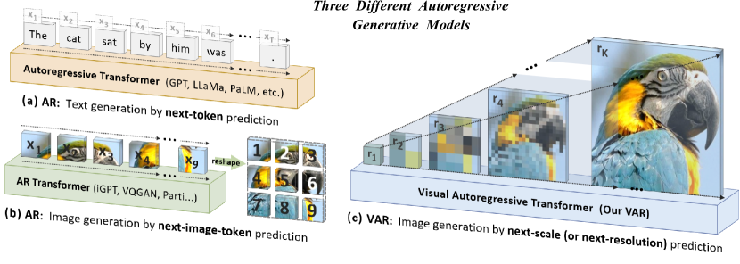

## 一句话定位
VAR 把图像自回归生成从光栅扫描的「next-token prediction」重新定义为由粗到细的「**next-scale prediction（下一尺度 / 下一分辨率预测）**」——以整张多尺度 token map 为自回归单元、尺度内 token 并行生成。它**首次让 GPT 风格的 AR 模型在 ImageNet 上超越扩散 Transformer（DiT）**：ImageNet 256×256 上 FID 从 AR 基线的 18.65 降到 **1.73**、IS 升至 **350.2**，推理快约 **20×**，并展现出与 LLM 一致、相关系数近 **−0.998** 的幂律 scaling laws。NeurIPS 2024 最佳论文。

## 背景与定位
扩散模型（[[ddpm]]、[[latent-diffusion-ldm]]、DiT）长期主导图像生成，而 GPT 风格的视觉 AR（[[taming-transformers-vqgan|VQGAN]]、VQVAE-2、RQ-Transformer、ViT-VQGAN、Parti）虽然继承了 LLM 的范式，效果却**显著落后于扩散**，且其 scaling laws 鲜有人研究——「AR 在视觉里的力量像是被锁住了」。

论文诊断传统视觉 AR 把 2D token grid 展平成 1D 序列再做 next-token 预测，存在四个根本问题：
1. **数学前提被违反**：VQVAE 编码器自带双向自注意力，量化后 token 之间是双向相关的，与 AR 的单向依赖假设矛盾（附录 A 用 VQGAN encoder 最后一层 attention 热图证明这种双向依赖）。
2. **无法做某些 zero-shot 泛化**：单向性使其难以「由下半张图预测上半张图」之类的双向推理任务。
3. **结构退化**：展平破坏了图像 feature map 的空间局部性，相邻 token `q(i,j)` 与其上下左右邻居的强相关被线性序列削弱。
4. **低效**：生成 n×n 个 token 需 O(n²) 个自回归步、O(n⁶) 计算量。

VAR 的核心洞察是**重新定义图像的「顺序」**：人类感知与作画都是先抓全局结构、再补局部细节，这种「由粗到细 / 多尺度」天然提供了一个自回归顺序。于是把自回归单元从「单个 token」升级为「整张尺度 token map」，从 1×1 起步逐级提分辨率。它在技术脉络上承接 VQGAN 的 latent VQ 思路、借鉴 RQ-Transformer 的残差量化，但把多尺度从「同分辨率叠码」改成「跨分辨率金字塔」，直接催生后续 [[infinity-bitwise-var|Infinity]]、FlowAR、HART、Switti、STAR、VARGPT 等一大批 scale-wise 工作。

## 模型架构

> 图源：VAR 论文 Figure 2 "Standard autoregressive modeling (AR) vs. our proposed visual autoregressive modeling (VAR)" (arXiv:2404.02905)

两阶段训练，类似 [[taming-transformers-vqgan|VQGAN]] 的「先 tokenizer 后 AR」。

**Stage 1 — 多尺度残差 VQVAE（tokenizer）**
- 架构沿用 VQGAN 的 CNN encoder/decoder，**仅替换量化层为多尺度量化**。空间下采样率 **16×**，**共享码本** V=4096（所有尺度同一词表 [V]）。仅增加 K 个额外卷积层 {φ_k}（约 0.03M 参数）用于上采样后的信息补偿（下采样后不加卷积）。
- 把连续 feature map f∈R^{h×w×C} 编码为 K 张分辨率递增的离散 token map R=(r₁,…,r_K)，r_K 与 f 同分辨率。
- **残差式编码（Algorithm 1）**：从 f 出发，每一尺度 k 先把 f 插值到 (h_k,w_k) 并量化得 r_k，再 lookup→插值回最大分辨率→过 φ_k，从 f 中**减去**这部分（`f = f − φ_k(z_k)`），余量进入下一尺度。这种残差设计经验上优于各尺度独立插值，且天然保证 r_k 只依赖前缀 r_{≤k}。
- **重建（Algorithm 2）**：`f̂ = Σ_k φ_k(interpolate(lookup(Z, r_k)))`，再过 decoder D 得图像。

**Stage 2 — VAR Transformer**
- 标准 **GPT-2 式 decoder-only Transformer**（参考 VQGAN），刻意保持简单以凸显算法本身的有效性。
- 自回归似然按尺度分解：`p(r₁,…,r_K) = Π_k p(r_k | r₁,…,r_{k-1})`。第 k 步**并行**生成该尺度全部 h_k×w_k 个 token，条件是所有前缀尺度 + 第 k 个位置编码 map。
- **block-wise causal attention mask**：训练时保证每个 r_k 只能 attend 到 r_{≤k}；推理时用 **kv-cache**、无需 mask。
- 条件注入：类别 embedding 同时作为起始 token [s] 与 **AdaLN（自适应 LayerNorm）** 的条件。
- 关键小 trick：attention 前把 **query / key 归一化到单位向量**（稳定训练）；**不用** RoPE / SwiGLU / RMSNorm 等 LLM 高级组件。
- **模型 shape 随深度线性缩放**：宽度 w=64d、head 数 h=d、drop rate dr=0.1·d/24；参数量 N(d)=18dw²=73728·d³。深度 d=16/20/24/30 对应 256 分辨率的 310M/600M/1.0B/2.0B；512 分辨率用 d=36（2.3B，因显存限制改用**单一共享 AdaLN**，参数量降至约 49152·d³）。

## 数据
- **Tokenizer 训练数据**：沿用 VQGAN baseline，多尺度 VQVAE 在 **OpenImages** 上训练（复合损失：L2 重建 + LPIPS 感知损失 + StyleGAN 判别器对抗损失），下采样率 16×。
- **VAR Transformer 训练数据**：**ImageNet-1K 训练集**（1.28M 图）做类别条件生成。论文给出在其 VQVAE 下，每个 epoch 约相当于 **870 亿 image tokens**；scaling 实验中最大累计训练 token 数达 **3050 亿**。
- 数据来源/清洗/re-captioning 等更多细节：本工作聚焦学习范式，未额外披露数据清洗或合成数据流程（这是 ImageNet 类别条件 benchmark，无文本标注）。

## 训练方法
- **训练目标**：尺度级 **next-scale prediction** 的标准**交叉熵**（离散 token 分类），而非扩散 / flow matching / 连续回归。这是把 LLM 的 next-token 范式平移到「next-scale」。
- **两阶段**：Stage 1 训练多尺度 VQVAE（提供 Stage 2 的 ground-truth token map），Stage 2 在固定 tokenizer 上训 VAR Transformer。论文未使用 SFT / RLHF / DPO / 偏好对齐（这是基础生成范式工作，非对齐工作）。
- **采样增强**：推理用 **classifier-free guidance（CFG，比例 2.0）** + **top-k 采样**（FID 评测用 top_k=900、top_p=0.96、cfg=1.5 权衡质量与多样性）。VAR-d30-re 的「-re」指 **rejection sampling（拒绝采样）**。
- **关键超参（来自 GitHub 训练脚本，已落盘）**：AdamW（β₁=0.9, β₂=0.95, weight decay=0.05），base lr=1e-4 / 256 batch；batch size 768–1024；训练 epoch 随模型增大 200→350；fp16 训练；adaptive-LN gamma 初始化系数 alng 随深度递减（d16/d20=1e-3、d24=1e-4、d30=1e-5、d36-s=5e-6），位置编码 lr 缩放 wpe=0.1→0.01。
  - d16: bs=768, ep=200；d20: bs=768, ep=250；d24: bs=768, ep=350, tblr=8e-5；d30: bs=1024, ep=350, tblr=8e-5, twde=0.08；d36-s (512): saln=1, pn=512, bs=768, ep=350。
- **加速 / 蒸馏**：本论文未做 consistency / LCM / 步数蒸馏；加速完全来自范式本身（见 Infra）。后续社区工作（Distilled Decoding、CoDe、FastVAR、LiteVAR）才补上蒸馏 / 剪枝 / 量化。

## Infra（训练 / 推理工程）
- **复杂度优势（核心工程卖点，附录 B 给出证明）**：生成 n×n latent，传统 AR 需 O(n²) 步、O(n⁶) 计算；**VAR 仅需 O(log n) 步、O(n⁴) 计算**——来自「每尺度内并行生成 + 尺度数对数增长」。Table 1 中 VAR 生成一张图只需 **10 个模型 step**（对比 VQGAN 256 步、RQ-Transformer 68 步、DiT 250 步、MaskGIT 8 步）。
- **推理速度**：墙钟时间对比 VAR-d30 归一为 1，VQGAN/ViT-VQGAN >24×、DiT-XL/2 45×、L-DiT-3B/7B >45×；VAR 比同类 AR 快约 **20×**，达到只需 1 步的高效 GAN 量级。消融表中 VAR-d16 相对 AR 基线推理成本仅 **0.013×**。
- **训练工程**：8×GPU `torchrun` 多机多卡（DDP）、**fp16 混合精度**；代码自动启用 **flash-attn / xformers** 加速注意力；支持断点自动续训。**具体 GPU 型号、卡时、并行策略、吞吐均未在论文 / README 披露。**
- **数据效率**：VAR 仅需 **350** 训练 epoch 即超过 DiT-XL/2 的 **1400** epoch，被作者列为「更省算力/数据」的证据之一。

## 评测 benchmark（把效果讲清楚）

> 图源：VAR 论文 Figure 5 "Scaling laws with VAR transformers"（test loss / token error 随参数量 N 与最优算力 C_min 的幂律，相关系数 ≈ −0.998）(arXiv:2404.02905)

**ImageNet 256×256 类别条件生成（Table 1，#Step=生成一张图所需模型运行次数，Time=相对 VAR 墙钟）**

| 类型 | 模型 | FID↓ | IS↑ | Pre↑ | Rec↑ | #参数 | #Step | Time |
|---|---|---|---|---|---|---|---|---|
| GAN | StyleGAN-XL | 2.30 | 265.1 | 0.78 | 0.53 | 166M | 1 | 0.3 |
| Diff. | DiT-XL/2 | 2.27 | 278.2 | 0.83 | 0.57 | 675M | 250 | 45 |
| Diff. | L-DiT-3B | 2.10 | 304.4 | 0.82 | 0.60 | 3.0B | 250 | >45 |
| Diff. | L-DiT-7B | 2.28 | 316.2 | 0.83 | 0.58 | 7.0B | 250 | >45 |
| Mask. | MaskGIT | 6.18 | 182.1 | 0.80 | 0.51 | 227M | 8 | 0.5 |
| AR | VQGAN | 18.65 | 80.4 | 0.78 | 0.26 | 227M | 256 | — |
| AR | RQTran.-re | 3.80 | 323.7 | — | — | 3.8B | 68 | 21 |
| **VAR** | **VAR-d24** | **2.09** | 312.9 | 0.82 | 0.59 | 1.0B | 10 | 0.6 |
| **VAR** | **VAR-d30** | **1.92** | 323.1 | 0.82 | 0.59 | 2.0B | 10 | 1 |
| **VAR** | **VAR-d30-re** | **1.73** | **350.2** | 0.82 | 0.60 | 2.0B | 10 | 1 |
| — | (validation 参考下界) | 1.78 | 236.9 | 0.75 | 0.67 | — | — | — |

要点：**2B 参数的 VAR 在 FID 上击败 3B / 7B 的 L-DiT**，并以约 **1/45** 的推理时间领先；FID 1.73 甚至略低于 ImageNet 验证集自身参考下界 1.78。

**ImageNet 512×512（Table 2）**：VAR-d36-s（共享 AdaLN）FID **2.63**、IS 303.2，Time=1；同 benchmark 上 DiT-XL/2 FID 3.04（Time 81×）、MaskGIT 7.32、VQGAN 26.52。VAR 在更高分辨率上的速度优势更悬殊。

**Scaling Laws（论文核心实证之一）**：训练 12 个模型（18M→2B，d=6→30），观察到清晰幂律：
- 模型参数 N：`L_last = (2.0·N)^{-0.23}`、`L_avg = (2.5·N)^{-0.20}`；token 错误率 `Err_last = (4.9·10²·N)^{-0.016}`。
- 最优训练算力 C_min：`L_last = (2.2·10⁻⁵·C_min)^{-0.13}`、`L_avg = (1.5·10⁻⁵·C_min)^{-0.16}`，跨 **6 个数量级**成立。
- Pearson 相关系数普遍 **≈ −0.998（参数）/ ≈ −0.99（算力）**，与 LLM 的 scaling law 高度一致——证明「更大的 VAR 更好且更省算力」，且未见饱和。

**消融（Table 3，从 AR 基线逐步加组件）**：

| 配置 | 参数 | FID↓ | Δ vs 基线 | 推理成本 |
|---|---|---|---|---|
| AR 基线（MaskGIT 实现的 GPT-2 式 AR） | 227M | 18.65 | 0.00 | 1 |
| AR→VAR（仅换范式，无任何 trick） | 207M | **5.22** | −13.43 | **0.013** |
| +AdaLN | 310M | 4.95 | −13.70 | 0.016 |
| +Top-k | 310M | 4.64 | −14.01 | 0.016 |
| +CFG(2.0) | 310M | 3.60 | −15.05 | 0.022 |
| +Attn.Norm（q/k 单位化） | 310M | 3.30 | −15.35 | 0.022 |
| +Scale up 到 2.0B（VAR-d30） | 2.0B | **1.73** | −16.85 | 0.052 |

最关键结论：**仅替换「展平 next-token → next-scale」这一范式**（不加任何 bells-and-whistles），FID 就从 18.65 暴降到 5.22、推理成本降到 0.013×——范式本身贡献最大，其余 trick 与放大锦上添花。

**Zero-shot 泛化**：VAR-d30 在 in-painting / out-painting / 类别条件编辑上，**不改网络、不微调、不注入类别**（mask 外 teacher-force ground-truth token，仅生成 mask 内 token）即可产出与上下文融洽的内容，初步复现了 LLM 的零样本下游能力。

> 模型库自报 FID（README，与论文采样设置略有差异）：d16=3.55、d20=2.95、d24=2.33、d30=1.97、d30-re=1.80、d36(512)=2.63。

## 创新点与影响
**核心贡献**
1. **新范式 next-scale prediction**：把自回归单元从 token 升级为整张尺度 token map，由粗到细金字塔式生成，尺度内并行；理论上同时修复了传统视觉 AR 的数学前提违反、空间局部性退化与 O(n⁶) 低效三大问题（降到 O(n⁴)、O(log n) 步）。
2. **多尺度残差共享码本 VQVAE**：仅以约 0.03M 额外参数改造 VQGAN 量化层，即提供 next-scale 学习所需的 ground-truth 金字塔。
3. **首次让 GPT 式 AR 在图像生成上超越扩散 Transformer**，且在 FID/IS、推理速度、数据效率、可扩展性四个维度全面领先 DiT。
4. **在视觉生成中首次系统验证 LLM 式幂律 scaling laws（相关系数 ≈−0.998）与 zero-shot 泛化**，把 LLM 的两大「AGI 标志属性」初步迁移到视觉。
5. 全量开源 tokenizer + AR 训练 pipeline + 多尺寸权重（MIT 协议）。

**影响**：获 **NeurIPS 2024 最佳论文**。直接催生 scale-wise 生成大家族——文本到图像的 [[infinity-bitwise-var|Infinity]]（bitwise scale-wise，CVPR 2025 Oral）、FlowAR / Switti / STAR / HART（scale-wise + flow/hybrid）、统一理解生成的 VARGPT、3D 的 SAR3D / VAT、超分 VARSR、视频的 InfinityStar（NeurIPS 2025 Oral）、以及一系列加速工作（Distilled Decoding、CoDe、FastVAR、LiteVAR、M-VAR）。README「Third-party」表已列出 30+ 后续工作。

**已知局限（作者自述）**
- 刻意冻结 VQVAE 架构 / 训练（沿用 VQGAN baseline）以隔离验证范式，**未优化 tokenizer**——更强 tokenizer 被列为正交的提升方向。
- 论文仅做 **类别条件 ImageNet**，**文本到图像、视频生成均为后续方向**（text-to-image 已在 Infinity 实现，video 在 InfinityStar 实现）。
- 训练算力 / GPU 卡时等工程细节未披露。

## 原始链接
- arxiv_abs: https://arxiv.org/abs/2404.02905
- arxiv_pdf: https://arxiv.org/pdf/2404.02905
- github: https://github.com/FoundationVision/VAR
- hf_weights: https://huggingface.co/FoundationVision/var
- project/demo: https://var.vision

## 本地落盘文件
- ../../../sources/omni/2024/arxiv-2404.02905.pdf
- ../../../sources/omni/2024/var--readme.md
