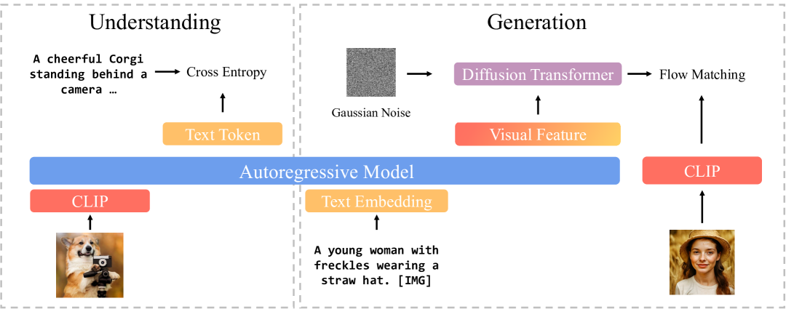
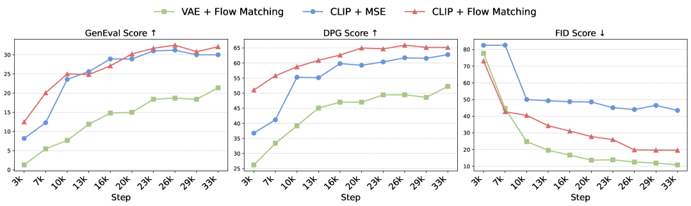

## 一句话定位
BLIP3-o 是 Salesforce Research 提出的"全开放"统一多模态模型族（4B/8B），核心创新是**用 diffusion transformer + flow matching 去扩散语义丰富的 CLIP 图像特征**（而非传统的 VAE 像素特征），并采用**顺序预训练**（先冻结的图像理解 MLLM 做底座、再单独训生成模块）；8B 模型在 GenEval 拿到 0.84、WISE 0.62、MME-P 1682.6、MMMU 50.6，且代码/权重/预训练数据/指令微调数据全部开源。

## 背景与定位
统一图像理解与生成是 2024–2025 的热点方向（[[janus]] / Janus-Pro、Show-o、Chameleon、Emu3、MetaMorph、LMFusion、MetaQuery 等）。论文指出：理解侧的架构选择已被充分研究，但**生成侧在统一框架下的最优架构与训练配方仍未被系统探索**。受 GPT-4o 图像生成被推测采用"自回归 + 扩散"混合管线（Tokens → AR Model → Diffusion Model → Image Pixels）的启发，作者沿这一思路系统研究三条设计轴：
1. **图像表征**：低层像素特征（VAE 编码器）vs 高层语义特征（CLIP 编码器）；
2. **训练目标**：MSE vs Flow Matching（[[flow-matching]] / rectified flow）；
3. **训练策略**：联合多任务训练（如 MetaMorph）vs 顺序训练（如 LMFusion / MetaQuery）。

三条轴的结论凝练为论文的核心 Finding：CLIP 特征比 VAE 特征更紧凑、语义更丰富，训练更快、生成质量更高；Flow Matching 比 MSE 更好（能建模分布、采样更多样）；顺序训练能保住理解能力又把全部容量留给生成。BLIP3-o 是 Salesforce BLIP-3（xGen-MM）开源谱系的延续，目标是把统一多模态做成"架构 + 训练 + 数据"全可复现的开放基线。相关前置工作可参见 [[latent-diffusion-ldm]]、[[clip]]、[[emu2]]、[[lumina-next]]。

## 模型架构

> 图源：BLIP3-o 论文 Figure 1（arXiv:2505.09568, https://arxiv.org/abs/2505.09568）

整体是 **Autoregressive + Diffusion 混合架构**（见论文 Figure 1）：

- **理解侧**：用 CLIP 编码图像，自回归模型在目标文本 token 与预测 token 间算交叉熵损失（标准 MLLM 范式）。
- **生成侧**：自回归模型先生成一串**中间视觉特征**（intermediate visual features），作为条件喂给 **diffusion transformer**，由后者扩散出 CLIP 图像特征去逼近 ground-truth CLIP 特征。理解与生成共享同一 CLIP 语义空间，从而把两个任务统一起来。

**自回归底座（backbone）**：
- 8B 模型：冻结 **Qwen2.5-VL-7B-Instruct**，只训 diffusion transformer，可训练参数约 **1.4B**。
- 4B 模型：同样架构，底座换成 **Qwen2.5-VL-3B-Instruct**。
- 因为已有强开源理解模型（Qwen2.5-VL），作者**直接跳过图像理解训练阶段**，把生成模块直接搭在 Qwen2.5-VL 上。
- 探索阶段（设计选择对比实验）用的是 **Llama-3.2-1B-Instruct** 作为 AR 模型。

**Diffusion Transformer（DiT）**：沿用 **Lumina-Next** 的架构（基于改进的 Next-DiT）——可扩展高效的 DiT，引入 **3D 旋转位置编码（3D RoPE）**编码时间/高/宽的时空结构（不依赖可学习位置 token）；每个 transformer block 采用 **sandwich normalization**（attention/MLP 前后各一次 RMSNorm）和 **Grouped-Query Attention** 提升稳定性、降算量。

**视觉 tokenizer / 表征**：关键设计是**用 CLIP 编码器 + 扩散解码器**当作一个"图像自编码器"。无论分辨率，每张图被编码成**固定长度 64 个连续向量**（与 Emu2 一致），比 VAE 在高分辨率下产生的长序列更紧凑——这是 CLIP-Diffusion 路线相对 VAE 的核心压缩比优势。

**条件注入（latent 建模）**：给定 prompt，先用 AR 模型 input embedding 编成序列 C，再拼接一组**随机初始化、可学习的 query 向量 Q**；[C; Q] 过 transformer 后，Q 学会从 prompt 抽取语义，作为 AR 模型产出的"中间视觉特征 / 潜表示"，被训练去逼近 ground-truth 图像特征 X。

**两阶段扩散的推理管线**（CLIP + Flow Matching 路线）：第一阶段以 Q 为条件迭代去噪得到 CLIP embedding；第二阶段由 diffusion 视觉解码器把 CLIP embedding 转成真实像素。

**视觉解码器（CLIP→像素，开源实现两套，见 GitHub README）**：
- **EVA-CLIP + SDXL**：扩散解码器从 SDXL-base 初始化、微调成以 EVA-CLIP 视觉 embedding 为条件重建原图（EVA-CLIP 冻结），即 Emu2 风格的"CLIP 编码器 + 扩散解码器"自编码器。
- **SigLIP2 + SANA**：另一套开源重建实现。

**分辨率**：论文示例图与 demo 给出 **1024×1024** 生成结果（Figure 2）。

## 数据
**预训练数据（Stage 1，图像生成）**：
- **8B（paper-reported）**：论文（§5.2）写"约 **25M 开源数据**（CC12M、SA-1B、JourneyDB）+ 额外 **30M 私有图像**"，合计约 **55M**。
- **4B / 全开源 8B**：仅用公开图像（CC12M、SA-1B、JourneyDB）。论文（§5.2）写 **25M**，但 GitHub README / HF card 的结果表把这批开源数据列为 **"30 million open-source data"**——源内数字口径不一致（README Highlights 与 Data Loading 两处又分别写 27M / 25M detailed caption），此处以论文正文 25M 为准、并保留 README 的 30M 标注供对照。
- **Re-captioning**：BLIP3-o 正式预训练的所有图像 caption 由 **Qwen2.5-VL-7B-Instruct** 生成详细描述，平均长度约 **120 token**（注：前期设计空间探索那批 25M 数据的 caption 由 **LLaVA** 生成，见论文 §3.3 Implementation Details，二者不同）；为提升对不同 prompt 长度的泛化，再混入约 **10%（6M for 8B / 3M for 4B）短 caption（约 20 token，来自 CC12M）**。
- 每个图文对格式化为 `"Please generate an image based on the following caption: <caption>"`。
- **开源发布**：论文正文写释出 **25M 详细 caption + 3M 短 caption**；GitHub README 的 Highlights 进一步把公开数据集拆为 **27M Long-Caption + 5M Short-Caption + 4M JourneyDB** 三个 HF dataset（README 内部对 detailed caption 数也是 27M / 25M 两种说法并存）。

**指令微调数据 BLIP3o-60k（Stage 2）**：预训练后观察到四类弱点——复杂人体姿态（如"搭弓射箭")、常见物体（各类果蔬）、地标（如金门大桥）、简单文字（如路面上写"Salesforce"）。针对每类**用 GPT-4o 生成约 10k 个 prompt–image 对**，再补充 JourneyDB 和 DALL·E 3 风格 prompt 提升美学，最终精选约 **60k 高质量 prompt–image 对**并开源（BLIP3o-60k）。这是从 GPT-4o 蒸馏的合成指令数据。

**清洗/美学/安全过滤**：论文未披露专门的美学评分过滤或安全过滤管线细节（未披露）。

## 训练方法
**核心生成目标——Flow Matching（rectified flow 风格）**：
- 采样时间步 t∼U(0,1)，噪声 X0∼N(0,1)，线性插值 Xt = t·X1 + (1−t)·X0（注：论文公式排版作 Xt = t·Xt + (1−t)·X0，应为 X1），目标速度 Vt = dXt/dt = X1 − X0。
- DiT 学习以 Q（AR 条件）和 t 预测速度 Vθ(Xt, Q, t)，损失为 E‖Vθ(Xt,Q,t) − Vt‖²。
- 对比基线 **MSE 损失** L = ‖X − WQ‖²（W 为线性投影）：MSE 只能对齐到目标分布的均值，导致给定 prompt 输出近乎确定、缺乏多样性；Flow Matching 继承扩散过程的随机性，能在同一 prompt 下生成多样样本（论文 Finding 2）。

**训练策略——顺序训练（Sequential Training）**：
- 第一阶段只训图像理解模块；第二阶段**冻结 MLLM 底座**、只训图像生成模块（仿 LMFusion / MetaQuery）。
- BLIP3-o 实际实现里更激进：直接复用现成的 Qwen2.5-VL（理解已强），**跳过理解训练**，冻结底座只训 DiT。
- 相对联合训练的好处：保住理解能力、避免任务间相互干扰、把全部训练容量给生成；联合训练受"总数据量"和"理解/生成数据配比"两个因素强烈影响，留作未来工作。

**两阶段训练配方**：
- **Stage 1 预训练（图像生成）**：在上述 25M+/55M 数据上训 DiT。README 建议**从头训 DiT 至少 150k step**，配 **cosine annealing LR，从 1×10⁻⁴ 退火到 1×10⁻⁵**。
- **Stage 2 指令微调**：用 BLIP3o-60k 微调，README 建议**至少 10k step**，cosine LR 从 1×10⁻⁴ 退到 0。论文 Finding 3：模型能**快速适配 GPT-4o 风格**，从 AI 生成图比从真实图学得更有效；仅 60k 对即可让 prompt 对齐和美学显著提升、快速消除生成 artifact（README 称可带来 GenEval/DPG **5–7 个绝对分**提升）。

**蒸馏/加速**：未采用 consistency/LCM/ADD 等步数蒸馏（未报告）；加速主要来自 CLIP 表征的紧凑性（固定 64 token）而非采样步数蒸馏。

## Infra（训练 / 推理工程）
- **训练框架**：GitHub 提供 `slurm.sh`（Slurm 多节点训练）与 `run.sh`（调试），基于 webdataset 加载（`load_dataset("webdataset", num_proc=128)`），HF datasets 直接读 tar 归档。
- **可训练规模**：8B 仅 1.4B 可训练参数（底座冻结），相对 LMFusion（并行 transformer 模块、显著增大模型）更轻量——只引入一个轻量 diffusion head。
- **算力规模 / GPU·时 / 并行策略 / 混合精度 / 吞吐**：论文与 README **均未披露**具体 GPU 数量、训练卡时、并行/精度配置。
- **推理**：提供 `inference.py` 与 gradio demo（`app.py`）；CLIP+Flow Matching 路线推理是两阶段扩散（Q→CLIP embedding→像素），具体采样步数未在论文正文披露（未报告）。
- **部署形态**：开放在线 demo（blip3o.salesforceresearch.ai）+ HF 权重（4B/8B）+ Discord/WeChat 社区支持。

## 评测 benchmark（把效果讲清楚）

> 图源：BLIP3-o 论文 Figure 4 "Comparison of different design choices"（arXiv:2505.09568, https://arxiv.org/abs/2505.09568）

**设计选择对比实验（探索阶段，Llama-3.2-1B 底座，约 25M 数据，每 ~3200 step 评一次）**：在 MJHQ-30k 上报 FID（美学），GenEval / DPG-Bench 报 prompt 对齐。结论：**CLIP + Flow Matching 在 GenEval 和 DPG-Bench 上 prompt 对齐最好**；VAE + Flow Matching 的 FID 最低（最优）但 FID 有误导性——作者测 GPT-4o 在 MJHQ-30k 的 FID 约 30.0，反而很高，说明 FID 衡量的是风格偏离而非真实生成质量。总体判定 **CLIP + Flow Matching 为最佳设计**。

**图像生成（论文 Table 2，与统一模型同期 SOTA 对比）**：

| Model | GenEval | DPG-Bench | WISE |
|---|---|---|---|
| Show-o 1.3B | 0.68 | 67.27 | 0.35 |
| EMU3 8B | 0.66 | 80.60 | 0.39 |
| TokenFlow-XL 14B | 0.63 | 73.38 | 0.18 |
| Janus 1.3B | 0.61 | 79.68 | 0.35 |
| Janus Pro 7B | 0.80 | 84.19 | 0.50 |
| **BLIP3-o 4B** | **0.81** | 79.36 | – |
| **BLIP3-o 8B** | **0.84** | 81.60 | **0.62** |

- 8B GenEval **0.84**（统一模型中最高），WISE（世界知识推理）**0.62** 大幅领先；DPG-Bench 81.60 略低于 Janus Pro 的 84.19，但作者指出 DPG 的模型化评测不可靠，遂补充人评。
- **WISE 分项（HF model card，8B paper-reported）**：Cultural 0.63 / Time 0.57 / Space 0.70 / Biology 0.62 / Physics 0.66 / Chemistry 0.51 / Overall 0.62。

**图像理解（论文 Table 1，8B 在多数基准最佳）**：
- BLIP3-o 8B：VQAv2 83.1、MMBench 83.5、SEED 77.5、MM-Vet 66.6、**MME-P 1682.6**、MME-C 647.1、**MMMU 50.6**、RealWorldQA 69.0、TextVQA 83.1——均为同表最佳或并列最佳，明显超过 Janus Pro 7B（MMMU 41.0 / MME-P 1567.1 等）。

**人评（论文 5.4，DPG-Bench 约 1000 prompt，BLIP3-o 8B vs Janus Pro 7B，每标准约 3000 判断）**：
- 视觉质量：BLIP3-o 胜 **51.5%** / 平 2.4% / Janus Pro 胜 46.1%。
- prompt 对齐：BLIP3-o 胜 **50.4%** / 平 4.7% / Janus Pro 胜 44.9%。
- p 值分别 5.05e-06 和 1.16e-05 —— 即便 Janus Pro 的 DPG 自动分更高，人评上 BLIP3-o 仍以高统计显著性胜出。

**开源版（GitHub/HF，纯开源数据，"30M open-source"）**：4B GenEval 0.81 / DBP 79.36 / WISE 0.50；8B GenEval 0.83 / DBP 80.73 / WISE 0.52（略低于含私有数据的 paper-reported 8B 0.84/81.60/0.62，差距主要在 WISE 世界知识维度）。

**关键消融结论**：Finding 1（AR 模型学语义级 CLIP 特征比像素级 VAE 特征更有效）、Finding 2（Flow Matching 优于 MSE）、Finding 3（GPT-4o 风格指令微调快速增益，AI 图比真实图更易学）。

## 创新点与影响
**核心贡献**：
1. **首个**对"自回归 + 扩散"统一框架做系统设计空间研究（图像表征 × 训练目标 × 训练策略三轴交叉），给出明确可复现的最优配方。
2. **CLIP 特征扩散**：把 diffusion 目标对准语义丰富的 CLIP 特征（固定 64 token）而非 VAE/像素，兼得训练效率与生成质量——区别于 MetaQuery 的 VAE + Flow Matching、LMFusion 的 Transfusion 像素扩散。
3. **顺序训练 + 冻结底座 + 轻量 diffusion head**：复用现成强理解模型（Qwen2.5-VL），保住理解、低成本扩展生成。
4. **BLIP3o-60k**：GPT-4o 蒸馏的小而精指令微调集，可给任意 T2I 模型带来 5–7 分 GenEval/DPG 增益。
5. **全开放**：代码、4B/8B 权重、27M+5M+4M 预训练数据、60k 指令数据、评测管线全部开源，是统一多模态领域少有的完全可复现基线。

**对后续工作的影响**：提供了"冻结 MLLM + CLIP 特征 flow matching 扩散"这一轻量统一范式的开源对照组；GitHub 后续放出 **Qwen3 + SigLIP2** 分支（支持 SigLIP2 理解编码器 + Qwen3 AR 底座，顺序或联合训练可选），延展到图像编辑（Image→Image）与多任务混训。

**已知局限**：
- 复杂人体姿态生成仍未被 60k 指令数据完全解决；
- DPG-Bench 自动分低于 Janus Pro（靠人评翻盘，说明对模型化评测敏感）；
- 私有 30M 数据带来的 WISE 增益（0.52→0.62）说明纯开源版世界知识仍有差距；
- 训练算力/卡时等 infra 细节未披露，复现成本不透明；
- 当前主要做 T2I 与理解，编辑/多轮对话/交错生成在论文发布时尚属"未来工作"。

## 原始链接
- arxiv_abs: https://arxiv.org/abs/2505.09568
- arxiv_pdf: https://arxiv.org/pdf/2505.09568
- github: https://github.com/JiuhaiChen/BLIP3o
- hf_model: https://huggingface.co/BLIP3o/BLIP3o-Model （4B: BLIP3o-Model-4B / 8B: BLIP3o-Model-8B）
- hf_data: https://huggingface.co/datasets/BLIP3o/BLIP3o-Pretrain , BLIP3o-Pretrain-Long-Caption / -Short-Caption / -JourneyDB , BLIP3o-60k
- project_demo: https://blip3o.salesforceresearch.ai/

## 一手源存档（sources/）
- [arxiv-2505.09568.pdf](https://arxiv.org/pdf/2505.09568)  （arXiv 原文 PDF，不入 git）
- [github-readme.md](https://github.com/zhao9797/ai-research/blob/main/sources/omni/2025/blip3-o--github-readme.md)
- [hf-model-card.md](https://github.com/zhao9797/ai-research/blob/main/sources/omni/2025/blip3-o--hf-model-card.md)
