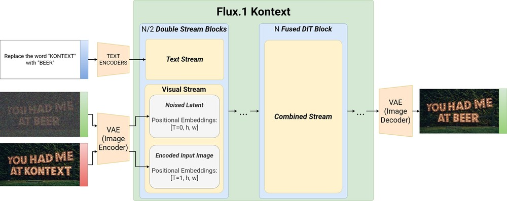
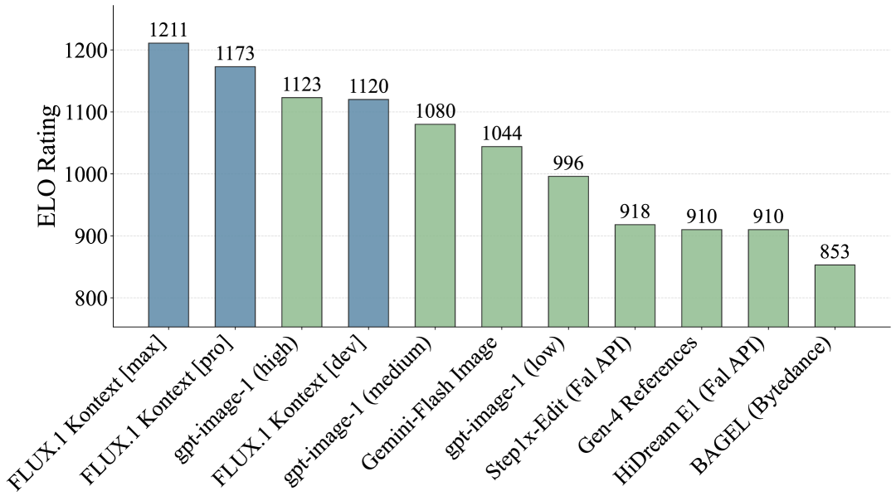

## 一句话定位
FLUX.1 Kontext 是 Black Forest Labs 2025 年 5 月发布的 **统一"生成 + 指令编辑"流匹配模型**：把参考图编码成 latent token，与目标图 token **简单序列拼接**喂进同一个 rectified-flow DiT，用一个速度预测目标同时干 text-to-image 与 image-to-image。最大亮点是**多轮迭代编辑下的角色/物体一致性**（用 AuraFace 人脸相似度量化，漂移显著慢于 GPT-Image-1 / Runway Gen-4），且 1024×1024 出图仅 **3–5 秒**，比 GPT-Image 快约 **8×（官博）/ 一个数量级（论文）**。发布 [pro]/[max] 闭源 API + [dev] 12B 开源权重，附带自建基准 **KontextBench（1026 image-prompt 对）**。

## 背景与定位
图像编辑领域 2025 年前的三大痛点（论文 Introduction 明确列出）：(i) InstructPix2Pix 类指令编辑器靠**合成指令-响应对**训练，继承生成管线的偏差，编辑多样性/真实感受限；(ii) **多轮编辑中角色/物体外观漂移**，难以做品牌/叙事类应用；(iii) 嵌进多模态 LLM 的自回归编辑器（GPT-Image、Gemini Native Image）质量与延迟都不友好，长 runtime 不适合交互。

FLUX.1 Kontext 的定位是：用**纯 flow matching（去噪式）**而非自回归，在统一架构里把"局部编辑 / 全局编辑 / 角色参考 / 风格参考 / 文字编辑"五类任务一网打尽，同时保证速度与一致性。技术脉络上它是 [[latent-diffusion-ldm]] → [[stable-diffusion-3]]（Esser 等 Scaling Rectified Flow Transformers）→ FLUX.1 → FLUX.1 Kontext 这条 BFL 主线的"in-context 化"延伸，把 in-context learning 思想（像 LLM 那样从 prompt 里的样例学任务、无需参数更新）搬到扩散 transformer，对标 InstructPix2Pix、Emu Edit、OmniGen、ICEdit、HiDream-E1 等指令编辑工作以及 GPT-Image-1 / Gemini / Runway Gen-4 等闭源系统。

## 模型架构

> 图源：FLUX.1 Kontext: Flow Matching for In-Context Image Generation and Editing in Latent Space (arXiv:2506.15742) Fig.4 高层概览

**Backbone：rectified-flow transformer（融合式 DiT），在图像 autoencoder 的 latent 空间训练。**

- **基座 FLUX.1**：rectified flow transformer，训练于自研卷积 autoencoder 的 latent 空间，**16 个 latent channel**（论文称这是相对同类模型重建质量提升的关键，VAE 用对抗目标从头训）。
- **双流 + 单流混合 block**：先过 **double stream blocks**（图像 token 与文本 token 各自独立权重，注意力在 token 拼接上做混合），再把两路序列 concat 后过 **38 个 single stream block**；最后丢弃文本 token、只解码图像 token。
- **融合 DiT block + 工程优化**：借鉴 Dehghani 等（ViT-22B），用 fused feed-forward block —— (i) 把 feedforward 的 modulation 参数砍半，(ii) 把 attention 的输入/输出线性层与 MLP 融合成更大的矩阵-向量乘，提升训练/推理效率。
- **3D RoPE 位置编码**：每个 latent token 用 (t, h, w) 时空坐标索引（单图输入 t≡0）。
- **In-context 条件注入（核心创新）**：参考图 y 经**冻结的 FLUX autoencoder** 编码为 latent token，直接**追加到目标图 token x 后面**，喂进 visual stream。这种**序列拼接**(i) 天然支持不同输入/输出分辨率与宽高比，(ii) 可平凡扩展到多张参考图 y₁…y_N。论文明确试过**通道拼接（channel-wise concat）**，初步实验发现效果更差，故弃用。
- **上下文/目标的位置区分**：context token 的 3D RoPE 加一个**常数偏移**——把参考图当作一个"虚拟时间步"，token 位置三元组 u=(t,h,w) 中，目标 token 设 u_x=(0,h,w)，第 i 张参考图 token 设 u_{yi}=(i,h,w)，干净地把 context 块与 target 块分开而保留各自内部空间结构。
- **参数量 / 形态**：[dev] 为 **12B 参数** rectified flow transformer（开源权重，diffusers `FluxKontextPipeline`，兼容旧 FLUX.1 [dev] 推理代码）。[pro]/[max] 参数量未披露。
- **text encoder**：论文正文未明确点名（沿用 FLUX.1 体系，业界已知 FLUX 系用 T5 + CLIP，但本报告未直接写出，**此处不臆测**）。

## 数据
- 训练数据：从一个**纯 text-to-image 的 FLUX.1 checkpoint 起步**，收集并清洗**数百万条关系对 (x | y, c)**（x 目标图、y 参考图、c 自然语言指令）做优化。**具体规模/来源/配比/合成占比未披露**。
- 安全过滤（model card 披露较细）：
  - **预训练 mitigation**：对预训练数据按多类 NSFW 内容过滤。
  - **后训练 mitigation**：与 **Internet Watch Foundation (IWF)** 合作过滤已知 CSAM；多轮定向 fine-tune 抑制 CSAM/NCII 相关行为与概念。
  - 训练实现里加入 **classifier-based filtering + 对抗训练**，专门防 NCII / CSAM 生成。
- re-captioning / 美学打分等数据工程细节**未披露**。

## 训练方法
**目标函数：rectified flow matching（速度预测 / velocity prediction）。**

- 损失：L_θ = E_{t,x,y,c} ‖v_θ(z_t, t, y, c) − (ε − x)‖²₂，其中 z_t 是目标 latent x 与噪声 ε~N(0,1) 的线性插值 z_t=(1−t)x+tε（附录给出 rectified flow 下 a_t=1−t, b_t=t 的推导）。
- **时间步调度**：用 **logit-normal shift schedule** p(t; μ, σ=1.0)，随训练数据分辨率改变 mode μ。附录 A.2 推导了 SD3 里 α-shift 与 logit-normal 的等价关系（α=3.0 对应 μ=log3≈1.0986），把高分辨率 timestep 重分配统一进 logit-normal 框架。
- **统一 T2I/I2I 训练**：从纯 T2I checkpoint 出发，**联合 fine-tune** image-to-image 与 text-to-image；采样纯文图对（y=∅）时省去全部 y token，从而保留 T2I 能力。当前**只用单张 context 图**做条件（架构支持多图，但本次聚焦单图）。
- **加速 / 蒸馏（两条线分化 [pro] 与 [dev]）**：
  - **[pro]**：flow 目标训练后接 **LADD（Latent Adversarial Diffusion Distillation）**——用对抗训练减少采样步数、同时提升样本质量，绕开多步 ODE/SDE 求解（原本 50–250 次带 guidance 的网络评估）带来的慢与过饱和伪影。
  - **[dev]**：通过 **guidance distillation**（Meng 等"On distillation of guided diffusion models"）蒸馏进 12B DiT；且 [dev] **只在 image-to-image 任务上训练**（不训纯 T2I），以最大化编辑表现。
  - **[max]**：用更多 compute 进一步提升生成表现（细节未披露）。

## Infra（训练 / 推理工程）
- **并行/分布式**：**FSDP2**（TorchTitan 体系）做混合精度——**all-gather 走 bfloat16，梯度 reduce-scatter 走 float32** 以提升数值稳定性。
- **显存优化**：**selective activation checkpointing** 降低峰值 VRAM。
- **吞吐优化**：**Flash Attention 3** + 对单个 Transformer block 的 **regional compilation**。
- **推理加速即上面的蒸馏路线**：[pro] 用 LADD 降步数，[dev] 用 guidance distillation；最终 1024×1024 出图 **3–5 秒**，T2I/I2I 延迟均为同期最低（论文 Fig.7，比对手快达一个数量级；官博称比 GPT-Image 快约 8×）。
- **部署形态**：[pro]/[max] 走 BFL API + Krea/Freepik/Lightricks/OpenArt/LeonardoAI 等前端，及 FAL/Replicate/Runware/DataCrunch/TogetherAI/ComfyOrg 等基础设施伙伴；[dev]（2025-06-26 公开）开源权重经 HF 分发，**day-0 支持 ComfyUI / HuggingFace Diffusers（`FluxKontextPipeline`）/ TensorRT**，兼容旧 FLUX.1 [dev] 推理代码，可在**消费级硬件**运行，附 **PixtralContentFilter 完整性检查器**（生成后跑 integrity check）。官方参考实现见 GitHub `black-forest-labs/flux`（含 TensorRT 安装路径）。
- **算力规模 / GPU·时 / 集群细节均未披露**。

## 评测 benchmark（把效果讲清楚）

> 图源：FLUX.1 Kontext (arXiv:2506.15742) — KontextBench 总体 Elo 排名（[max]/[pro] 居前，超 GPT-Image / Gemini Flash / Runway Gen-4 等）

**VAE 重建（Table 1，4096 张 ImageNet，越好越优）：Flux-VAE 全面领先**
| 模型 | PDist ↓ | SSIM ↑ | PSNR ↑ |
|---|---|---|---|
| **Flux-VAE** | **0.332** | **0.896** | **31.1** |
| SD3-VAE | 0.452 | 0.858 | 29.6 |
| SD3-TAE | 0.746 | 0.774 | 27.9 |
| SDXL-VAE | 0.890 | 0.748 | 25.9 |
| SD-VAE | 0.949 | 0.720 | 25.0 |

**KontextBench（自建，1026 image-prompt 对 / 108 base image，五类任务）：local edit 416、global edit 262、text edit 92、style ref 63、character ref 193。** 评测方式为人评 + AuraFace 人脸 embedding 量化。论文给出的**定性排名结论**（具体分值在论文为柱状图 Fig.8/9，文本未列数字，故此处只报排名/趋势，不编造数值）：

- **Image-to-Image（人评，Fig.8）**：FLUX.1 Kontext [max] 与 [pro] 在 **local editing、text editing、general character reference (CREF)** 三类**夺冠**；CREF 用 AuraFace 人脸相似度定量评，FLUX.1 Kontext **优于所有对手**。**global editing** 仅次于 gpt-image-1，**style reference (SREF)** 仅次于 Runway Gen-4 References。整体延迟最低，比对手快达一个数量级。
- **多轮一致性（Fig.12）**：同起点同 prompt 对比 FLUX.1 Kontext / gpt-image-1 / Runway Gen-4，用 AuraFace 余弦相似度跟踪每轮编辑后与输入的人脸相似度，**FLUX.1 Kontext 漂移最慢**（"Add sunglasses"那轮因部分遮脸有预期内的相对下降）。
- **Text-to-Image（Internal-T2I-Bench，1000 prompt 取自 DrawBench/PartiPrompts + 真实用户 query，外加 GenAI-bench）**：论文把 T2I 评测拆成 **prompt following / aesthetic / realism / typography / inference speed** 五维，并提出 **"bakeyness"（AI 味）** 概念批评单一"你更喜欢哪张"的偏好评测会偏向过饱和、强中心主体、过度 bokeh、风格趋同。结论：FLUX.1 Kontext **各维度均衡**，逐项稳超前代 FLUX1.1 [pro]，且 [pro]→[max] 有递进增益；对手各有偏科（Recraft 美学强但 prompt 跟随弱，GPT-Image-1 相反）。
- 具体 FID / CLIPScore / GenEval / DPG / HPSv2 / ImageReward 等**通用学术指标在本报告中未报告**——BFL 刻意用自建 KontextBench + 人评 + AuraFace 相似度，而非传统 t2i 指标。
- **[dev] 开源版对比（[dev] 公告博客，2025-06-26）**：在 KontextBench 人评上 **FLUX.1 Kontext [dev] 多项类别胜过开源编辑模型（字节 Bagel、HiDream-E1-Full）与闭源 Google Gemini-Flash Image**，并由第三方 **Artificial Analysis** 独立评测（Image Editing Arena）佐证。KontextBench 已作为 HF dataset 公开（`black-forest-labs/kontext-bench`）。

## 创新点与影响
**核心贡献：**
1. **统一 in-context 框架**：用**序列拼接 + 3D RoPE 常数偏移**把参考图当 context token，单一 rectified-flow DiT 同时做 T2I 与指令编辑（局部/全局/角色/风格/文字），无需 finetuning / LoRA / IP-Adapter。
2. **多轮编辑一致性**：显著缓解角色/物体身份漂移，并用 **AuraFace 相似度**给出可量化、可复现的一致性度量。
3. **交互级速度**：LADD（[pro]）/ guidance distillation（[dev]）把出图压到 3–5 秒，比自回归多模态系统快约一个数量级。
4. **KontextBench**：1026 对真实众包 image-prompt 的统一基准，覆盖五类任务，承诺连同 baseline 样本一起开源，填补 InstructPix2Pix/MagicBrush/Emu-Edit/GEdit 等基准在真实分布覆盖上的空白。
5. **开源 [dev] 12B**：HF 月下载 13.5 万+、衍生 244 adapter / 59 finetune / 18 量化、100+ Space，成为 2025 开源指令编辑生态事实标杆。

**影响**：FLUX.1 Kontext [dev] 成为社区指令编辑/角色一致性工作流的默认底座；其"参考图 token 直接拼接"范式被后续统一编辑工作广泛借鉴。

**已知局限（论文 + 官博）**：(i) 过度多轮编辑会累积可见伪影、降质（Fig.15 六轮后明显劣化）；(ii) 偶发不遵循指令、忽略具体要求；(iii) **世界知识有限**（官博），影响上下文准确性；(iv) **蒸馏本身会引入视觉伪影**影响保真度。未来方向：多图输入、继续 scaling、进一步降延迟到实时、扩展到视频域、根治多轮降质。

## 原始链接
- arxiv_abs: https://arxiv.org/abs/2506.15742
- arxiv_pdf: https://arxiv.org/pdf/2506.15742
- tech_report_pdf（官方托管）: https://cdn.sanity.io/files/2gpum2i6/production/880b072208997108f87e5d2729d8a8be481310b5.pdf
- blog（官方公告）: https://bfl.ai/announcements/flux-1-kontext （正文站点为 https://bfl.ai/blog/flux-1-kontext ）
- blog（[dev] 开源公告）: https://bfl.ai/blog/flux-1-kontext-dev
- hf（开源权重 model card）: https://huggingface.co/black-forest-labs/FLUX.1-Kontext-dev
- github（参考实现/采样代码）: https://github.com/black-forest-labs/flux
- product: https://bfl.ai/models/flux-kontext

## 一手源存档（sources/）
- [arxiv-2506.15742.pdf](https://arxiv.org/pdf/2506.15742)  （arXiv 原文 PDF，不入 git）
- [blog.md](https://github.com/zhao9797/ai-research/blob/main/sources/omni/2025/flux-1-kontext--blog.md) （官方公告博客，2025-05-29）
- [flux-1-kontext-dev--blog.md](https://github.com/zhao9797/ai-research/blob/main/sources/omni/2025/flux-1-kontext-dev--blog.md) （[dev] 开源公告博客，2025-06-26）
- [hf-modelcard.md](https://github.com/zhao9797/ai-research/blob/main/sources/omni/2025/flux-1-kontext--hf-modelcard.md)
- [github-readme.md](https://github.com/zhao9797/ai-research/blob/main/sources/omni/2025/flux-1-kontext--github-readme.md)
