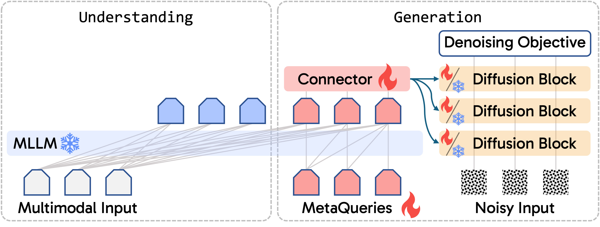
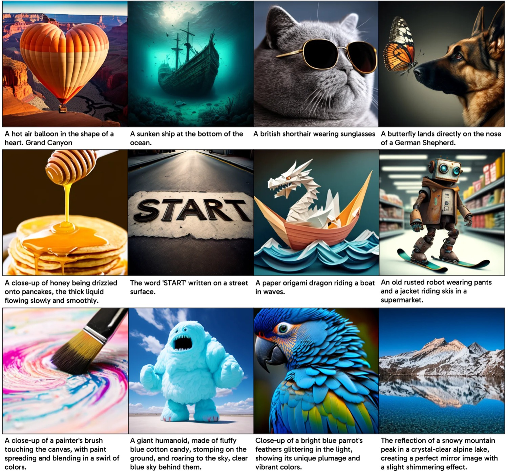

## 一句话定位
MetaQuery 用一组**可学习查询向量（learnable queries）**把**冻结的自回归多模态 LLM（MLLM）**接到**条件扩散解码器**上，仅用图文配对数据 + 标准去噪目标就训出统一理解-生成模型——MLLM 全程不动即可保留 SOTA 理解能力，同时获得 SOTA 级生成；最亮的结果是首个在世界知识推理生成基准 **WISE 上超过 SD-3.5/FLUX 等纯 T2I 模型**的统一模型（MetaQuery-L/XL WiScore 0.55，远超 Janus-Pro-7B 的 0.35）。

## 背景与定位
统一多模态模型想在一个架构里同时做"理解（出文本）"和"生成（出像素）"。主流路线（[[chameleon]]、[[emu3]]、[[show-o]]、[[transfusion]]、[[janus-pro]] 等）都要**改训 LLM backbone** 去联合建模 p(text, pixels)：要么自回归预测视觉 token，要么在 LLM 上挂 diffusion 目标。代价是复杂的架构设计、数据/损失配比、多阶段训练，而且优化生成往往**伤害原有理解能力**。

MetaQuery 走相反的哲学——"**生成归扩散，理解归 LLM**"（Render unto diffusion what is generative, and unto LLMs what is understanding）：不重建单体大模型，而是**桥接两个各自最强的预训练专家**。关键主张是冻结 MLLM 既保住其 SOTA 理解，又能被"查询"出高质量生成条件。

相对前置工作的差异：
- **vs. 用 LLM 末层 embedding 当文本编码器**（Lumina-Next、[[sana]]、Kosmos-G）：那种做法把 decoder-only LLM 当纯 text encoder，**无法激活 in-context learning**，做不了知识增强生成与交错多模态输出。MetaQuery 用可学习查询原生集成进 LLM，能激活 ICL。
- **vs. LMFusion / LlamaFusion**（冻结 LLM + 并行训练生成专家 FFN/QKV）：那种方案与特定 LLM 架构绑定、每换一个 backbone 就要重训生成模块，且无法复用强大的预训练生成模型。MetaQuery 的连接器与任意条件扩散解码器解耦。
- **vs. GILL**（早期向冻结 MLLM 喂可学习 token）：GILL 用对比+回归损失做检索/生成，未直接用去噪目标、未系统研究冻结 MLLM 与查询的影响，应用局限于上下文图像生成。

作者还点出本范式与同期 **GPT-4o 图像生成系统**（token → transformer → diffusion → pixels）可能共享高层哲学。技术脉络上接 [[latent-diffusion-ldm]] / [[sana]] 扩散解码器与 [[llava]] 系 MLLM。

## 模型架构

> 图源：MetaQueries (Transfer between Modalities with MetaQueries, arXiv:2504.06256) Figure 1 / 官方 GitHub facebookresearch/metaquery assets/metaquery.jpg

整体范式：`token → [冻结 MLLM] → [可学习查询] → [连接器 transformer] → [扩散解码器] → pixels`。

- **可学习查询（MetaQueries）**：随机初始化 `Q ∈ R^{N×D}`，N 为查询数、D 等于 MLLM 隐藏维度。把 Q 直接拼到 MLLM 输入序列中"查询"出生成条件 C。**全序列继续用因果掩码**（causal masking），不为 Q 特意开双向注意力——实验表明冻结 LLM 在因果掩码下已是强力的"特征重采样器"（feature resampler，类 Flamingo 思想）。最终论文统一取 **N = 256**（在质量与效率间平衡；reconstruction 任务 token 越多越好，T2I 视觉质量在 64 token 后收敛、prompt alignment 随 token 增加持续提升）。
- **冻结 MLLM backbone**：三档尺寸——Base = LLaVA-OneVision 0.5B；Large = Qwen2.5-VL 3B；X-Large = Qwen2.5-VL 7B。MLLM 参数与架构完全不动，保留原 SOTA 理解。
- **连接器（connector）**：把条件 C 对齐到扩散解码器输入空间的可训练 transformer 编码器，开**双向注意力**，架构沿用 Qwen2.5 LLM 的 transformer。论文最终用 **24 层、Enc-Proj 设计**。两种设计对比：
  - **Proj-Enc**（先投影到扩散输入维、再过 encoder 对齐）
  - **Enc-Proj**（先在 MLLM 隐藏维上过 encoder 对齐、再投影到扩散输入维）——**Enc-Proj 更优且参数更省**（24 层 Enc-Proj 仅 316M 参数 vs 24 层 Proj-Enc 2046M，FID 7.43 vs 7.41、GenEval 0.56 vs 0.51、DPG 75.35 vs 73.75）。
- **扩散解码器（生成头）**：可任意替换，只要有条件输入接口即可——直接把原条件换成 C。论文用了两个：**Sana-1.6B**（主力，已在美学数据上微调，用于多数指标）和 **Stable Diffusion v1.5**（用于 COCO FID）。设计研究阶段用 **Sana-0.6B @512 分辨率**。扩散解码器可冻结，也可进一步指令微调（训 DiT 能再涨点）。
- 架构在 T2I 之外可自然扩展到 audio / video / 3D（论文聚焦图像）。

## 数据
- **预训练**：**25M 公开图文配对**（image-caption pairs）。规模相对很小（强调低成本桥接）。代码仓库只放了 cc12m 的加载示例，并提示单用 cc12m 复现不出论文结果、建议加载 BLIP3o 数据。
- **指令微调数据（MetaQuery-Instruct-2.4M，已开源到 HF）**：本工作的一大数据贡献——**不依赖专家模型合成目标图，而是直接挖网络语料里"自然出现的图像对"**（受 MagicLens 启发）。流程：
  1. 取 **mmc4**（Multimodal C4）core fewer-faces 子集，每图带 caption；
  2. 用 **SigLIP** 按 caption 相似度聚类（每组 ≤6 图，相似度阈值 0.5），组内与他图平均相似度**最低者设为 target**，其余为 source；
  3. 得到 **2.4M 图像对**；
  4. 用 **Qwen2.5-VL 3B**（论文附录写实际 curation 用 Qwen2-VL-7B-Instruct）为每对生成"如何把 source 变成 target"的开放式指令——刻意只描述"共享的泛化相似点 + target 独有差异"，不写能脱离 source 独立生成 target 的具体细节。
- 这种"天然监督"覆盖从直接视觉相似到细微语义关联的广谱关系，意外解锁视觉联想（visual association）与 logo 设计等新能力。数据集 license：CC-BY-NC + ODC-BY（源自 mmc4，受 Common Crawl 条款约束）。
- 理解能力数据未单列（直接继承冻结 MLLM）。美学/安全过滤：未单独披露（视觉质量主要靠已在美学数据微调过的 Sana 解码器）。

## 训练方法
- **训练目标**：**标准扩散去噪目标**（denoising / 与所选扩散解码器一致），仅用图文配对，无需对齐损失、对比损失或多任务平衡。整套训练"和微调一个扩散模型一样高效稳定"。
- **可训练 vs 冻结**：两个训练阶段都**冻结 MLLM**，只微调可学习查询、连接器、扩散模型。
- **两阶段**：
  1. **预训练**：25M 图文对，**8 个 epoch**，学习率 1e-4，全局 batch size 4096，cosine 衰减 + 4000 步 warmup 后降到 1e-5。
  2. **指令微调**：在 2.4M 自然图像对数据上对 Base 模型微调 **3 个 epoch**，沿用预训练学习率 schedule，batch size 2048。
- **适配策略消融**（关键结论，Table 2）：冻结 MLLM（不训 LLM、不训 DiT）即可逼近全量调 MLLM 的效果，prompt alignment 略低但视觉质量略好；**额外训 DiT 能进一步涨点**（冻结 MLLM + 训 DiT：FID 6.06、GenEval 0.61）；端到端全调（E2E）最好（FID 6.28、GenEval 0.61、DPG 79.39）但代价高且会动 MLLM。
- **条件来源消融**（Table 1）：可学习查询（64 token，FID 7.43 / GenEval 0.56 / DPG 75.35）≈ 用 LLM 末层 embedding（FID 7.49 / GenEval 0.55 / DPG 78.41）；随机查询（64 token）FID 退到 8.59、prompt alignment 崩（GenEval 仅 0.35、DPG 54.81），证明"可学习"是关键；512 token 的可学习查询（FID 7.34 / DPG 78.43）反超末层 embedding。
- **下游能力转移**：
  - **图像重建**：可加入重建目标做对齐；纯重建目标 T2I 会退化（MJHQ FID 27.42），但**T2I + 重建混合训练**几乎不伤 T2I（FID 8.27 vs 纯 T2I 7.43），同时解锁重建能力。
  - **图像编辑**：从重建能力迁移而来，冻结 MLLM、对预训练 Base 仅微调 **1000 步**即可。
  - **主体驱动生成**：靠 2.4M 指令数据微调，零样本、无测试时调参。
- **蒸馏/步数加速**：未涉及（生成质量与速度直接继承所选扩散解码器，如 Sana 的线性注意力高效推理）。
- **RL / 偏好对齐（DPO/RLHF/reward model）**：未使用。

## Infra（训练 / 推理工程）
- **训练规模**：开源训练脚本用 `torchrun --nproc-per-node=8`（单节点 8 卡），并提供 SLURM 多节点样例脚本；全局 batch 4096（预训练）/ 2048（指令微调）。论文与仓库**未披露**总 GPU 卡时、具体加速器型号或墙钟训练时长。
- **效率对比（相对墙钟时间，连接器消融）**：24 层 Enc-Proj 仅 1.06× 基线时间、316M 参数，相对 Proj-Enc(24 层) 1.23×/2046M 大幅更省。训练目标消融里图像重建目标约 2.79× T2I 墙钟、混合约 2.61×。
- **核心工程卖点**：因 MLLM 冻结，**可训练参数极少**（查询 + 连接器 + 可选 DiT），训练"如同微调一个扩散模型"，远比联合训 MLLM 的统一模型省算力且稳定；天然支持**热插拔任意 SOTA 扩散解码器**与任意 SOTA MLLM。
- **推理/部署**：开源 `app.py` Gradio demo（给 checkpoint 即可起）；推理成本 = MLLM 前向（出条件）+ 扩散采样，量化/缓存/步数蒸馏等加速**未单独披露**，依赖底层 Sana/SD 的特性。

## 评测 benchmark（把效果讲清楚）

> 图源：MetaQueries 论文 Figure 5 定性 T2I 结果 / 官方 GitHub facebookresearch/metaquery assets/t2i.jpg

所有数字均来自论文 Table 4–10 / 项目页（一手源）。`†` = 重写提示，`‡` = 作者复测。

**理解 + 生成总表（Table 4，主力解码器 Sana；COCO FID 用 SD v1.5）**
| 模型 | backbone | MME-P | MMB | SEED | MMMU | MM-Vet | COCO FID↓ | MJHQ FID↓ | GenEval↑ | DPG↑ |
|---|---|---|---|---|---|---|---|---|---|---|
| MetaQuery-B | LLaVA-ov 0.5B | 1238.0 | 58.5 | 66.6 | 31.4 | 29.1 | 8.91 | 6.28 | 0.74† | 80.04 |
| MetaQuery-L | Qwen2.5-VL 3B | 1574.3 | 78.6 | 73.8 | 53.1 | 63.2 | 8.87 | 6.35 | 0.78† | 81.10 |
| MetaQuery-XL | Qwen2.5-VL 7B | **1685.2** | **83.5** | **76.9** | **58.6** | **66.6** | 8.69 | **6.02** | 0.80† | 82.05 |
| Janus-Pro-7B | DeepSeek-LLM 7B | 1567.1 | 79.2 | 72.1 | 41.0 | 50.0 | – | 13.48‡ | **0.80** | **84.19** |
| Transfusion | From Scratch 7B | – | – | – | – | – | 8.70 | – | 0.63 | – |
| Emu3 | From Scratch 7B | – | 58.5 | 68.2 | 31.6 | 37.2 | 12.80 | – | 0.66† | 80.60 |

要点：
- **视觉质量（MJHQ-30K FID）SOTA**：MetaQuery-XL **6.02**，远低于 Janus-Pro-7B（13.48‡，作者同设置复测）、Show-o-512（15.18）、JanusFlow（9.51）等，证明扩散解码器在视觉伪影控制上优于自回归生成。
- **COCO FID 新 SOTA（SD v1.5 系）**：MetaQuery-XL **8.69**，优于所有基于 SD v1.5 的统一模型（MetaMorph 11.8、Emu 11.66）。
- **prompt alignment**：GenEval 0.74/0.78/0.80（†），DPG 80–82，全面超过扩散系统一模型（Transfusion 0.63、JanusFlow）；但**略逊于自回归生成的 Janus-Pro-7B**（GenEval 0.80、DPG 84.19）。作者归因于两类失败模式不同——扩散更易"不遵循提示"、自回归更易出视觉伪影，而 GenEval/DPG 难量化伪影。
- **理解能力随 backbone 同步提升**且不退化：MetaQuery-XL MMMU 58.6、MM-Vet 66.6、MMB 83.5，得益于直接复用 Qwen2.5-VL。

**世界知识推理生成 — WISE（WiScore，Table 6）**
| 模型 | Cultural | Time | Space | Biology | Physics | Chemistry | Overall |
|---|---|---|---|---|---|---|---|
| GPT-4o | 0.94 | 0.64 | 0.98 | 0.93 | 0.98 | 0.95 | **0.89** |
| FLUX.1-dev | 0.48 | 0.58 | 0.62 | 0.42 | 0.51 | 0.35 | 0.50 |
| SD-3.5-large | 0.44 | 0.50 | 0.58 | 0.44 | 0.52 | 0.31 | 0.46 |
| Janus-Pro-7B | 0.30 | 0.37 | 0.49 | 0.36 | 0.42 | 0.26 | 0.35 |
| Emu3 | 0.34 | 0.45 | 0.48 | 0.41 | 0.45 | 0.27 | 0.39 |
| **MetaQuery-L** | 0.56 | 0.57 | 0.62 | 0.48 | 0.63 | 0.42 | **0.55** |
| **MetaQuery-XL** | 0.56 | 0.55 | 0.62 | 0.49 | 0.63 | 0.41 | **0.55** |

→ **MetaQuery 是首个在 WISE 上超过纯 T2I SOTA（FLUX 0.50 / SD-3.5 0.46）的统一模型**，且大幅碾压其它统一模型（Janus-Pro-7B 仅 0.35、Emu3 0.39）。验证了"冻结 MLLM 的世界知识与 ICL 能被有效转移到生成"这一核心命题。与 GPT-4o（0.89）仍有差距。

**视觉常识 — CommonsenseT2I（CLIP 评估，Table 7）**：MetaQuery-L 在带负提示设置下 **57.67**，超 FLUX.1-dev（22.50）、SD-XL（44.83）、Sana-1.6B（43.33）、DALL-E 3 w/ rewrite（40.17 无负提示），SOTA。

**主体驱动生成 — DreamBench（零样本无测试时调参，Table 5）**：MetaQuery-B-Instruct DINO **0.737** / CLIP-I 0.852 / CLIP-T 0.301，超过同类零样本方法 Kosmos-G（DINO 0.694）、BLIP-Diffusion，逼近需微调的方法。

**关键消融**
- **可学习 vs 末层 embedding（Table 9）**：视觉质量与 prompt alignment 几乎相同（FID 6.35 vs 6.41、DPG 81.10 vs 81.23），但 MetaQuery 在需要 ICL 的指标上显著更强——**WiScore 0.55 vs 0.48、CommonsenseT2I 57.67 vs 52.83**。证明可学习查询的价值在于激活 ICL 而非单纯质量。
- **backbone 正交性（Table 8）**：Qwen2.5-3B / -3B-Instruct / -VL-3B-Instruct 三种 backbone 的生成指标几乎一致（FID 6.20/6.36/6.35），说明**生成能力与（多模态）理解能力大体正交**——理解越强的 backbone 不必然带来更强的生成质量，但能带来更强的知识推理生成（CommonsenseT2I 56.00/54.33/57.67）。

## 创新点与影响
**核心贡献**
1. **极简统一范式**：用可学习 MetaQueries + 冻结 MLLM + 任意条件扩散解码器，仅靠图文对 + 去噪目标即得统一模型——把"训统一模型"降维成"微调一个扩散模型"，无需联合建模 p(text,pixels)、无需数据/损失平衡。
2. **首次证明冻结 MLLM 的高级能力可转移到生成**：世界知识、推理、in-context learning 通过查询被解码器复用，**首个在 WISE 上超过纯 T2I SOTA 的统一模型**；且理解能力零损失（直接保留 SOTA MLLM）。
3. **可扩展的指令数据范式**：从网络语料天然图像对（mmc4 + SigLIP 聚类 + MLLM 生成指令）造 2.4M 数据并开源，绕开"专家模型合成目标图"的偏差与扩展瓶颈，意外解锁视觉联想、logo 设计等新能力。
4. **系统性消融**：查询数 token scaling、连接器 Enc-Proj、冻结 vs 调 MLLM、可学习 vs 末层 embedding 等，为后续统一模型提供可复现的设计准则。

**影响**：作为"frozen-MLLM + diffusion-decoder + learnable-queries"路线的代表性、可复现 baseline（Meta 开源代码与数据），与同期 BLIP3-o 等"MLLM 接扩散"工作呼应，强化了"理解与生成解耦、各用最强专家"的设计思潮；其哲学被作者类比为 GPT-4o 图像生成的潜在路线。

**已知局限**
- prompt alignment（GenEval/DPG）仍略逊于自回归生成的 Janus-Pro-7B。
- 与领先闭源系统（GPT-4o WISE 0.89）仍有差距，作者推测主要靠**进一步数据 scaling** 弥合。
- 因果掩码下未开放双向注意力查询、生成质量受限于所选冻结扩散解码器；总 GPU 卡时/算力规模、推理加速细节未披露。

## 原始链接
- arxiv_abs: https://arxiv.org/abs/2504.06256
- arxiv_pdf: https://arxiv.org/pdf/2504.06256
- project_page / blog: https://xichenpan.com/metaquery/
- github: https://github.com/facebookresearch/metaquery
- hf_data (MetaQuery-Instruct-2.4M): https://huggingface.co/collections/xcpan/metaquery-instruction-tuning-data-685b0f16d81ce54bcb7ea3a8

## 本地落盘文件
- ../../../sources/omni/2025/arxiv-2504.06256.pdf
- ../../../sources/omni/2025/arxiv-2504.06256.txt
- ../../../sources/omni/2025/metaqueries--project-page.md
- ../../../sources/omni/2025/metaqueries--readme.md
