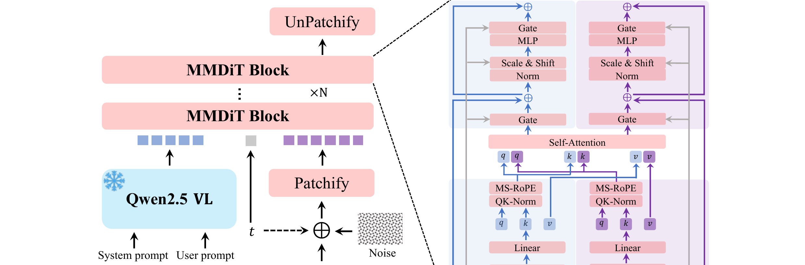
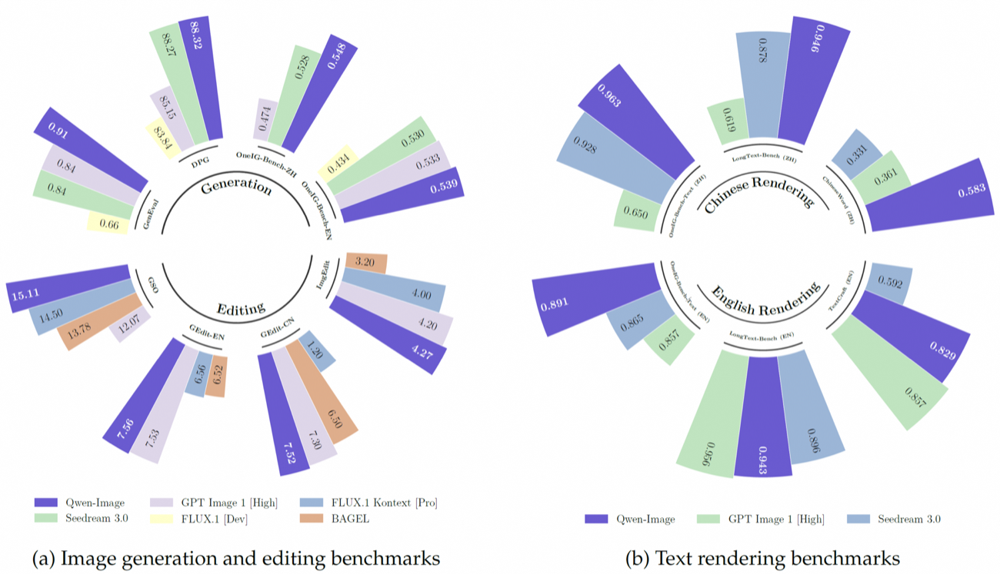

## 一句话定位

Qwen-Image 是通义千问系列首个图像生成基础模型：一个 20B 参数的 MMDiT 文生图模型，以**复杂文本渲染（尤其中文）**和**精确图像编辑**为核心卖点，Apache-2.0 开源权重。在 GenEval 上经 RL 后达 0.91（榜上唯一破 0.9 的基础模型），在中文长文本渲染 LongText-Bench-ZH 0.946、ChineseWord 总分 58.30 大幅碾压 GPT Image 1（36.14）和 Seedream 3.0（33.05），AI Arena 人评中作为唯一开源模型位列第三。

## 背景与定位

文生图（T2I）与图像编辑（TI2I）已成现代 AI 的基础组件，但 Qwen 团队指出两大未解难题：
1. **复杂提示对齐**——即便 GPT Image 1、Seedream 3.0 这类顶尖闭源模型，在多行文字渲染、非字母语言（中文）渲染、局部文字插入、文字与视觉元素无缝融合上仍力不从心；
2. **编辑一致性**——既要视觉一致（只改目标区域、保留其余细节，如改发色不动脸），又要语义连贯（结构改变时保持全局语义，如改姿态但保持身份与场景）。

Qwen-Image 站在 [[latent-diffusion-ldm]] → [[mmdit]]（[[stable-diffusion-3]] 的双流架构）→ FLUX / Seedream 这一技术脉络上，沿用 [[rectified-flow]] / flow matching 训练范式，但把"原生文本渲染"作为一等公民来设计数据与课程，并把编辑、深度估计、新视角合成等都统一进 TI2I 框架。它是 Qwen 系列在"生成"支柱上的补全，与擅长"理解"的 [[qwen2-5-vl]] 形成互补——技术报告明确把这视为通往"理解-生成统一"多模态系统的一步。

## 模型架构

> 图源：Qwen-Image Technical Report (arXiv:2508.02324) Figure 6 — Overview of the Qwen-Image architecture

采用标准**双流（double-stream）MMDiT** 架构（Esser et al. 2024，即 SD3 的 MMDiT），由三大组件协同：

**1. 条件编码器 = 冻结的 Qwen2.5-VL（MLLM）**
- 用 Qwen2.5-VL 而非纯语言模型 Qwen3 提取文本特征，理由：(a) 其语言/视觉空间已对齐，更适配 T2I；(b) 语言建模能力未明显退化；(c) 支持多模态输入，可解锁图像编辑等能力。
- 取 Qwen2.5-VL 语言模型 backbone **最后一层 hidden state** 作为用户输入的表征。
- 针对纯文本 / 图文输入设计了**不同的 system prompt**（T2I 模板 vs TI2I 模板，见报告 Fig.7/Fig.15）来引导特征提取。
- VLM 配置：ViT 部分 54M，LLM 部分 7B（即 Qwen2.5-VL-7B 量级）。

**2. 图像 tokenizer = 单编码器-双解码器 VAE**
- 不训纯图像 VAE，而是采用 **Wan-2.1-VAE** 架构做"图像-视频联合"表征：共享编码器（兼容图/视频），图像、视频各用专用解码器——目的是让该图像基础模型可作为未来视频模型的 backbone。
- 具体做法：**冻结 Wan-2.1-VAE 的编码器，只微调图像解码器**。微调语料为富文本图像（PDF、PPT、海报 + 合成段落，中英双语），以提升小字与细节重建。
- 训练观察：(1) 平衡重建损失与感知损失能减少灌木等重复纹理的网格伪影；(2) 重建质量提高后判别器失效，故**仅用重建+感知损失，动态调比例，不用对抗损失**。8×8 压缩率、latent 通道 16。

**3. backbone = MMDiT（20B）**
- 配置（Table 1）：**60 层**，24 个 Q/KV head，head size 128，intermediate size 12288，patch/scale factor 2，参数 **20B**。
- **MSRoPE（Multimodal Scalable RoPE）**：本文新设计的图文联合位置编码。传统 MMDiT 把文本 token 直接接在展平的图像位置嵌入之后；Seedream 3.0 的 Scaling RoPE 把图像位置编码移到图像中心、文本视为 [1,L] 的 2D token，但会使文本与图像在第 0 中间行的位置编码同构、难以区分。MSRoPE **从图像中心开始编码，把文本编码放在网格的对角线上**，既利于分辨率缩放训练，又改善图文对齐。
- normalization：QK-Norm 用 RMSNorm，其余归一化层用 LayerNorm。

**编辑（TI2I）的双编码机制（关键设计）**：
- 把原图同时送入两条路径——经 Qwen2.5-VL 得**语义特征**（高层场景理解，注入文本流，利于指令遵循），经 VAE 编码器得**重建特征**（低层视觉细节，沿序列维拼接到加噪图像 latent 上，注入图像流，利于保真与结构一致）。
- 双条件让编辑同时兼顾语义连贯与视觉一致。多图编辑时把 MSRoPE 扩展一个 **frame 维度**来区分编辑前后/多张图。

## 数据

系统性收集并标注了**数十亿图文对**，强调质量与均衡分布而非纯堆规模。四大域：
- **Nature（自然，约 55%）**：物体、风景、城市、植物、动物、室内、食物等通用域，模型现实多样性的根基。
- **Design（设计，约 27%）**：海报、UI、PPT 幻灯片，以及绘画/雕塑/数字艺术——富含文字、复杂版式与设计语义，是文本渲染与版式能力的关键来源。
- **People（人物，约 13%）**：肖像、运动、人类活动。
- **Synthetic（合成，约 5%）**：**仅指受控文本渲染合成的数据，明确排除其他 AI 模型生成的图像**（团队认为 AI 生成图带伪影、文字畸变、偏见、幻觉风险，会损害泛化与可靠性）。

**七阶段过滤流水线（S1–S7，随训练推进逐步收紧；合成数据从 S4 引入）**：
- S1 初筛（256p）：损坏文件 / 文件大小 / 分辨率（<256p 删）/ 去重 / NSFW。
- S2 画质增强：旋转（EXIF）/ 清晰度 / 亮度 / 饱和度 / 熵（去低熵大块均匀区）/ 纹理（去噪声型复杂纹理）。
- S3 图文对齐：按 caption 来源分三路——Raw Caption（网站原标题/标签，保留真实世界知识如植物名、卡通 IP）、Recaption（Qwen-VL Captioner 生成）、Fused Caption（融合）；用 Chinese-CLIP + SigLIP 2 过滤错配，Token 长度过滤、无效 caption 过滤。
- S4 文本渲染增强：按文本语言分英/中/其他/无文本四路；引入合成文本数据；密集文本 / 小字过滤。
- S5 高分辨率精修（640p）：画质 / 分辨率 / 美学 / 异常元素（水印、二维码、条形码）过滤。
- S6 类别均衡与肖像增强：重分 General/Portrait/Text 三类做再平衡；关键词+图像检索补长尾；肖像专项（写实/卡通/名人）+ 去人脸马赛克。
- S7 均衡多尺度训练（640p+1328p）：受 WordNet 启发的层级分类体系，类内只留高质高美学样本；对文本渲染数据做重采样以应对 token 频率长尾。

**标注**：用 Qwen2.5-VL 类 captioner 一次性产出自然语言 caption（含物体属性、空间关系、环境上下文、**带引号逐字转写可见文字**）+ 结构化 JSON 元数据（图像类型/风格/水印列表/异常元素），再用专家规则与轻量分类模型精修关键任务（水印核验、内容过滤）。

**数据合成（应对中文等非拉丁字符的长尾低频）**：三策略——
1. **纯渲染**：从高质语料抽段落，动态版式算法渲染到干净背景；任一字符渲染失败（缺字体/报错）则整段丢弃，保证字级保真。
2. **组合渲染**：把文字"写/印"到纸、木板等物理介质再合成进真实背景，用 Qwen-VL Captioner 生成上下文 caption。
3. **复杂渲染**：基于 PPT / UI mockup 模板的程序化编辑，规则系统替换占位文本同时保持版式/对齐/格式——训练多行、精确空间布局、字体颜色控制能力。

## 训练方法

**预训练目标 = Flow Matching / Rectified Flow**：latent z=E(x)，噪声 x1~N(0,I)，timestep t 从 logit-normal 采样，插值 xt=t·x0+(1−t)·x1，目标速度 vt=x0−x1，损失为预测速度与 vt 的 MSE。

**多阶段课程学习（progressive curriculum）**，沿四条轴渐进：
- 分辨率：256×256（含 1:1/2:3/3:2/3:4/4:3/9:16/16:9/1:3/3:1 多比例）→ 640×640 → 1328×1328；
- 文本：从无文本 → 有文本，逐步引入叠加在自然背景上的渲染文字，再到段落级；
- 数据质量：从海量 → 精炼（过滤逐步收紧）；
- 数据分布：从不均衡 → 均衡（域与分辨率）；并用合成数据补超现实风格、长文本等真实数据稀缺分布。

**后训练（Post-training）= SFT + RL 两阶段**：
- **SFT**：构建层级语义类别数据集 + 精细人工标注，专攻模型短板；要求图像清晰、细节丰富、明亮、写实，引导更高写实度与细节。
- **RL（两策略）**：
  - **DPO**（大规模、离线、计算高效）：同一 prompt 用不同随机种子生成多张，人工选最好/最差（有参考图时先与参考比对）；基于 flow matching 准则构造 DPO 目标（Diff_policy/Diff_ref + sigmoid，参考 Wallace 2024）。
  - **GRPO**（DPO 之后做小规模细粒度精修）：遵循 **Flow-GRPO** 框架，组内 G 张图算优势 A_i（reward 标准化），并把无随机性的 flow 采样**改写为 SDE 过程**（Euler-Maruyama 离散化）以引入探索随机性；KL 项有闭式解。GenEval 从 SFT 的 0.87 经 RL 提升到 **0.91**。

**多任务训练（扩展到 TI2I）**：在 T2I 之外，把指令编辑、新视角合成、深度估计等统一为"广义图像编辑"。除文本流注入 MLLM 语义嵌入外，额外把原图 VAE latent 沿序列维拼到加噪 latent（参考 FLUX Kontext，提升角色/场景一致性），MSRoPE 加 frame 维区分多图。报告还引入 **I2I 重建任务**，对齐 Qwen2.5-VL 与 MMDiT 的 latent 表征。

**蒸馏/加速**：报告正文未将步数蒸馏作为模型本体的一部分；社区与官方生态后续提供加速。README 记载的"扩散蒸馏达成 25× DiT NFE 削减、整体 42.55× 加速"（LightX2V/Qwen-Image-Lightning）那组数字，原文明确是针对后续的 **Qwen-Image-Edit-2511** 变体（2025.12.23 条目），并非本基础模型；Lightning 对基础模型线（如 Qwen-Image-2512）提供的是 Day-0 加速支持（未给出具体倍数）。默认推理 50 步、true_cfg_scale=4.0（HF model card）。

## Infra（训练 / 推理工程）

- **Producer–Consumer 框架（Ray 启发）**：解耦数据预处理与模型训练，二者异步运行、可在不中断训练的情况下热更新数据管线。Producer 端做过滤、用 MLLM/VAE 编码成 latent、按分辨率分桶进快速缓存与位置感知存储；Producer↔Consumer 用专门的 **HTTP 传输层**（原生支持 RPC 语义、异步零拷贝调度，原文称基于 TensorPipe 思路）。Consumer 部署在 GPU 密集集群专注训练，MMDiT 在节点间用 **4-way 张量并行**布局，每个数据并行组异步拉取预处理 batch。
- **分布式训练优化（Megatron-LM）**：单靠 FSDP 装不下 20B，故用 **Megatron-LM**。
  - **混合并行**：数据并行 + 张量并行；MMDiT 用 NVIDIA **Transformer-Engine** 构建以便无缝切换张量并行度；多头自注意力用 **head-wise parallelism** 降低同步/通信开销。
  - **分布式优化器 + 激活重计算权衡**：实测开激活重计算虽把单卡显存从 71GB 降到 63GB（−11.3%），但单 iter 时间从 2s 涨到 7.5s（**3.75×**），故**关掉激活重计算，仅靠分布式优化器**。all-gather 用 bfloat16、梯度 reduce-scatter 用 float32，兼顾效率与数值稳定。
- **算力规模/GPU·时**：报告**未披露**总 GPU 数、GPU·时或训练总耗时（仅给出上述 256-image 多分辨率配置下的单卡显存/iter 数字）。
- **推理/部署**：开源 diffusers 集成；HF 默认 50 步、true_cfg=4.0、原生支持 1328×1328（1:1）/1664×928（16:9）等多比例。生态侧 LightX2V 提供 Day-0 加速（NVIDIA/海光/沐曦/昇腾/寒武纪），vLLM-Omni、SGLang-Diffusion 提供高性能推理（长序列并行、缓存加速、快算子）。

## 评测 benchmark（把效果讲清楚）

> 图源：Qwen-Image 官方 GitHub/博客 bench.png — (a) 图像生成与编辑 benchmark，(b) 文本渲染 benchmark（https://github.com/QwenLM/Qwen-Image）

**VAE 重建（Table 2，ImageNet-256 / 富文本-256，PSNR/SSIM）**：Qwen-Image-VAE 全面 SOTA。富文本图（Text_256）PSNR **36.63 / SSIM 0.9839**，远超 FLUX-VAE（32.65/0.9792）、Hunyuan-VAE（32.83/0.9773）、Wan2.1-VAE（26.77/0.9386）；ImageNet 域 PSNR 33.42 / SSIM 0.9159。图像处理时仅激活 19M 编码器 + 25M 解码器参数。

**T2I 通用生成**：
- **DPG（Table 3，Overall↑）**：Qwen-Image **88.32**，超 GPT Image 1（85.15）、Seedream 3.0（88.27）、HiDream-I1-Full（85.89）、FLUX.1[Dev]（83.84）；在 Attribute（92.02）等维度领先。
- **GenEval（Table 4，Overall↑）**：基座 SFT 模型 **0.87**（已超 Seedream 3.0 0.84、GPT Image 1 0.84），经 RL 后 **0.91**（榜上唯一 >0.9 的基础模型）；Position 0.87、Counting 0.93、Two-Object 0.95。
- **OneIG-Bench（Table 5/6）**：EN Overall **0.539**（榜首，超 GPT Image 1 0.533、Seedream 3.0 0.530），其中 Alignment 0.882、Text 0.891 均第一；ZH 轨同样 Overall 第一。
- **TIIF-mini（Table 7）**：Overall 第二，仅次于 GPT Image 1。

**文本渲染**：
- **CVTG-2K（英文，Table 8）**：Word Accuracy 均值 **0.8288**、NED **0.9116**、CLIPScore **0.8017**，与 GPT Image 1（0.8569/0.9478/0.7982）相当、CLIPScore 略高，远超 Seedream 3.0、FLUX.1[dev]、TextCrafter 等。
- **ChineseWord（中文字级，Table 9）**：L1 Acc **97.29** / L2 **40.53** / L3 **6.48** / Overall **58.30**，碾压 GPT Image 1（68.37/15.97/3.55/36.14）与 Seedream 3.0（53.48/26.23/1.25/33.05）。
- **LongText-Bench（Table 10）**：ZH **0.946**（榜首），EN **0.943**（第二，仅次于 GPT Image 1 的 0.956）；GPT Image 1 在中文长文本仅 0.619，差距悬殊。

**图像编辑（TI2I）**：
- **GEdit-Bench（Table 11，GPT-4.1 评，G_O=语义×感知几何均值）**：EN G_O **7.56**（榜首，超 GPT Image 1 7.53、Step1X-Edit 6.97、FLUX.1 Kontext[Pro] 6.56）；CN G_O **7.52**（榜首；FLUX.1 Kontext 因中文能力弱仅 1.23）。
- **ImgEdit（Table 12，9 类编辑、734 真实测试样例，GPT-4.1 评，1–5 分）**：Overall **4.27**（榜首），略高于 GPT Image 1（4.20）；分项强于多数对手（如 Style 4.81、Action 4.69、Replace 4.66、Add/Background 4.38）。
- **新视角合成 GSO（Table 13）**：PSNR **15.11** / SSIM **0.884** / LPIPS **0.153**，超过通用模型 FLUX.1 Kontext[Pro]、BAGEL、GPT Image 1，逼近专用 3D 模型 CRM（15.93/0.891/0.152）。
- **深度估计（Table 14）**：零样本 KITTI/NYUv2/ScanNet/DIODE/ETH3D 上与 DepthAnything 等专用判别模型"基本持平"（不超越但接近），印证"生成式理解"可做经典理解任务。

**人评（AI Arena，Elo）**：5000+ 多样 prompt、200+ 评估者、每模型 ≥10000 次成对对比（中文文字 prompt 被排除以保公平）。Qwen-Image 作为**唯一开源模型位列第三**，落后榜首 Imagen 4 Ultra Preview 约 30 Elo，但领先 GPT Image 1[High] 与 FLUX.1 Kontext[Pro] 30+ Elo。

**关键消融结论**：(1) 仅微调 VAE 解码器即可显著提升小字与细节重建，为文本渲染打基础；(2) VAE 训练去对抗损失、动态平衡重建/感知损失更稳；(3) 激活重计算的显存收益（−11.3%）远不抵速度代价（3.75×），故弃用；(4) MLLM 语义嵌入提升指令遵循、VAE 像素级嵌入提升保真与结构一致——二者互补。

## 创新点与影响

**核心贡献**：
1. **原生中英文复杂文本渲染**——以数据工程（七阶段过滤 + 三策略文本合成 + 富文本 VAE 解码器微调）+ "无文本→文本、简单→段落级"课程学习，把文字渲染从"AI 通病"做成 SOTA，中文优势尤为悬殊。
2. **MSRoPE**——从图像中心起、文本沿对角线的图文联合位置编码，兼顾分辨率缩放与图文对齐。
3. **编辑双编码机制**——Qwen2.5-VL 语义特征（指令遵循）+ VAE 重建特征（视觉保真）双注入，配合 frame 维 MSRoPE，在 GEdit/ImgEdit 双榜登顶。
4. **统一 TI2I 视角**——把编辑、新视角合成、深度估计统一为图像编辑，验证"生成式理解"路径。
5. **开源**——20B 权重 Apache-2.0 开放，附带活跃生态（Qwen-Image-Edit 系列 2509/2511、Lightning 蒸馏加速、LoRA 生态、vLLM-Omni/SGLang 推理）。

**影响**：作为 2025 开源 T2I 的重要里程碑，把"文本-图像精确对齐（尤其文字渲染）"重新确立为生成建模的优先级，而非一味追求写实/美学的"AI look"；并提出从语言界面（LUI）走向视觉-语言界面（VLUI）的愿景。它补全了 Qwen 系列在"生成"支柱上的空白，与 Qwen2.5-VL 的"理解"形成统一多模态系统的雏形。

**已知局限**：
- 训练**算力规模未披露**（无 GPU 数 / GPU·时 / 总训练时长）。
- ChineseWord L3（生僻字）准确率仅 6.48，长尾低频字仍是硬骨头。
- 深度估计等理解任务仅"接近"专用模型，未超越。
- 报告自陈对 AI 生成数据持保守态度（不入训练集），合成数据仅占 5% 且限于受控文本渲染。

## 原始链接

- arxiv_abs: https://arxiv.org/abs/2508.02324
- arxiv_pdf: https://arxiv.org/pdf/2508.02324
- github: https://github.com/QwenLM/Qwen-Image
- hf: https://huggingface.co/Qwen/Qwen-Image
- modelscope: https://modelscope.cn/models/Qwen/Qwen-Image
- blog (官方, 中文): https://qwen.ai/blog?id=qwen-image
- blog (镜像): https://qwenlm.github.io/blog/qwen-image/

## 本地落盘文件

- ../../../sources/omni/2025/arxiv-2508.02324.pdf
- ../../../sources/omni/2025/qwen-image--readme.md
- ../../../sources/omni/2025/qwen-image--hf-modelcard.md
- ../../../sources/omni/2025/qwen-image--blog.md
