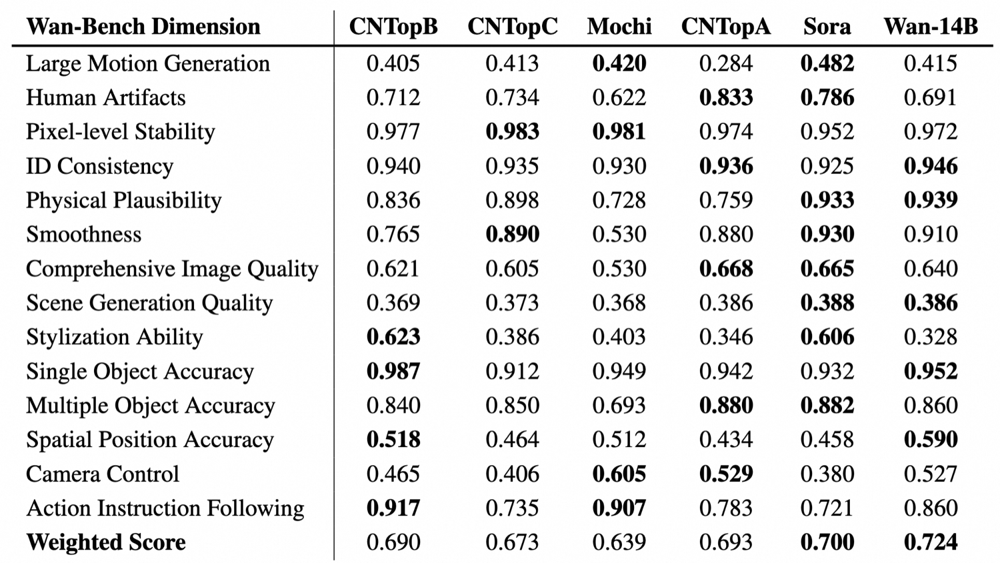

## 一句话定位
Wan 2.1 是阿里巴巴 Wan 团队 2025 年 2-3 月开源的大规模视频基础模型套件（1.3B/14B，T2V/I2V），核心创新是 4×8×8 高压缩、支持无限长视频流式编解码的 **Wan-VAE（仅 127M 参数）** 与基于 **Flow Matching + DiT（cross-attention 注文本）** 的扩散变换器；14B 模型在 VBench 上以 **86.22% 总分**登顶（超过 Sora 84.28%、Hailuo、HunyuanVideo），1.3B 模型仅需 **8.19 GB 显存**即可在消费级 GPU 上跑 480P，是 2025 年开源视频生成的里程碑。

## 背景与定位
自 OpenAI Sora（2024.02）问世后，视频生成进入军备竞赛：闭源侧有 Kling、Hailuo、Runway Gen-3、Luma、Veo 2 等，开源侧有 HunyuanVideo、Mochi、CogVideoX 等不断缩小差距。论文指出当时开源模型相对闭源仍存在三大短板：(1) 性能仍落后；(2) 能力受限（多数只做通用 T2V，无法覆盖编辑/定制等多样需求）；(3) 效率不足（动辄需高端硬件，创作团队难以负担）。

Wan 2.1 的定位即针对这三点：在性能上以 14B 模型对标并超越商业模型；在能力上覆盖 T2V、I2V、指令视频编辑、个性化、实时生成、视频配音等 8 类任务；在效率上提供 1.3B 小模型（8.19 GB 显存即可运行），并**完整开源训练 pipeline（数据构建、VAE、训练策略、加速、自动评测）**。技术脉络上，它建立在 DiT（[[dit-scalable-diffusion-transformers]]）+ Rectified Flow / Flow Matching（[[stable-diffusion-3]] 的训练范式）+ 3D 因果 VAE（参考 MagViT-v2）之上，是 [[latent-diffusion-ldm]] 路线在视频域的大规模工程化集大成者，并直接为后续 Wan 2.2、VACE 等工作奠基。

## 模型架构

> 图源：Wan2.1 官方 GitHub README（Video Diffusion DiT 架构图，assets/video_dit_arch.jpg，https://github.com/Wan-Video/Wan2.1）

**整体三件套**：Wan-VAE（像素↔latent）+ Diffusion Transformer（DiT）+ 文本编码器（umT5）。给定视频 V ∈ R^((1+T)×H×W×3)，Wan-VAE 编码到 latent x ∈ R^((1+T/4)×H/8×W/8)，channel 扩到 16，再喂给 DiT。

### Wan-VAE（3D 因果 VAE，127M 参数）
- **压缩比 4×8×8**（时间 4×、空间 8×8），latent 通道数 16。第一帧只做空间压缩（参考 MagViT-v2），以更好处理图像数据。
- **保证时间因果性**：把所有 GroupNorm 换成 RMSNorm，从而启用 **feature cache 机制**——把视频分成 1+T/4 个 chunk，每个 chunk 最多 4 帧，因果卷积维护前序 chunk 的帧级缓存（卷积核为 3 时缓存 2 帧；2× 时间下采样时缓存 1 帧），**支持无限长视频（甚至 1080P）的编解码而不丢失历史时间信息**。
- 空间上采样层把输入特征通道砍半，推理显存降 33%。
- 同硬件下重建速度比 SOTA（HunyuanVideo VAE）**快 2.5×**，且分辨率越高优势越大；PSNR 在 720×720/25 帧重建上领先（图 7）。

### Diffusion Transformer
- 三段式：patchify → transformer blocks → unpatchify。Patchify 用 (1,2,2) 的 3D 卷积，序列长度 L=(1+T/4)×H/16×W/16。
- **文本注入用 cross-attention**（区别于 MM-DiT 的 concat-then-full-attention），保证长上下文下的指令跟随；时间步用一个 **共享 MLP（Linear+SiLU）预测 6 个调制参数**，所有 transformer block 共享这个 MLP（每个 block 学一组不同 bias）——即全共享 AdaLN，相比非共享**减少约 25% 参数**且同规模下性能更好。
- 全时空注意力（full spatio-temporal attention）建模复杂动态。

### 配置表（来自 HF model card）

| 模型 | Dimension | FFN Dimension | Heads | Layers | 显存(480P) |
|---|---|---|---|---|---|
| 1.3B | 1536 | 8960 | 12 | 30 | 8.19 GB |
| 14B | 5120 | 13824 | 40 | 40 | — |

输入/输出 latent 维度均为 16，频率维度 256。

### 文本编码器：umT5
经大量实验选择 **umT5（5.3B，bidirectional attention）** 而非 decoder-only LLM。论文给出三条理由（§4.2.1）：(1) 多语言能力强，中英文及"画面内文字"都能理解；(2) 同条件下 umT5 在组合性（composition）上优于单向注意力 LLM；(3) 同规模收敛更快。消融：与 Qwen2.5-7B、GLM-4-9B 对比，umT5 训练 loss 最低（Table 5）；与 Qwen-VL-7B 对比（Table 6 FID↓：umT5=43.01、Qwen-VL last=43.72、Qwen-VL second-last=42.91），论文原文结论是 Qwen-VL second-last 与 umT5 **FID 相当但模型更大**，故选规模更小的 umT5。文本 token 长度固定 512。

### I2V 架构扩展
条件首帧 I 与零填充帧拼接后经 Wan-VAE 得到 condition latent z_c，加上二值 mask M（1 保留/0 生成），与噪声 latent 沿 channel 拼接（通道数 2c+s vs T2V 的 c），多出的通道用零初始化的 projection 层。另用 **CLIP image encoder** 抽首帧特征，经 3 层 MLP 作为 global context，通过 **decoupled cross-attention**（类似 IP-Adapter）注入 DiT。该 mask 机制统一支持 I2V、视频续写、首尾帧转换、随机帧插值。

## 数据
**总规模**：数十亿（billions）图像与视频，约 **O(1) 万亿 token**。坚持高质量、高多样性、大规模三原则。

**四步数据清洗（pre-training）**：
1. **基础维度过滤**：OCR 文字覆盖率检测、LAION-5B 美学分类器、内部 NSFW 安全模型、水印/logo 检测（训练时裁掉）、黑边检测、过曝检测、**合成图检测**（实验发现 <10% 合成图污染就会显著掉点，故训练专家分类器剔除）、模糊检测；视频时长须 >4s，分辨率按训练阶段设阈值。该步剔除约 **50%** 初始数据。
2. **视觉质量**：先聚成 100 个 cluster（防长尾小类被丢），每类抽样人工 1-5 分打分，再训练专家模型给全量打分。
3. **运动质量**：分 6 档——最优运动 / 中等质量 / 静态视频（访谈类，降采样比例）/ 镜头驱动运动（航拍类，低优先级）/ 低质量运动（人多遮挡，剔除）/ 抖动镜头（剔除）。
4. 各训练阶段动态调整 motion/quality/category 配比（图 3）。

**视觉文字数据**（Wan 是首个能在视频里生成中英文字的模型）：一方面在纯白底渲染**数亿张含中文字符**的合成图；另一方面从真实世界收集含字图，用多个 OCR 模型识别中英文，再喂给 **Qwen2-VL** 生成包含精确文字内容的描述。合成+真实结合，使罕见字也能正确生成字形。

**Post-training 数据**：图像取专家模型 top 20% + 人工精选共数百万张；视频用质量分类器筛 top，再按运动分类器选"百万级简单运动 + 百万级复杂运动"，覆盖科技/动物/艺术/人物/车辆等 **12 大类**，强调类别平衡。

**Dense caption 模型**（自研，LLaVA 式：ViT + 2 层 MLP + Qwen LLM）：三阶段训练（先冻结只训 MLP lr=1e-3，再全开 lr=1e-5/ViT 1e-6，最后高质量数据端到端）；视频用 slow-fast 编码（每第 4 帧保留原分辨率、其余 global avg pool），VideoMME 从 67.6%→69.1%。caption 评测（10 维 F1）总体与 Gemini 1.5 Pro 相当，在 event/camera angle/camera motion/style/color 上更强。in-house 数据还覆盖名人地标、物体计数（Grounding DINO 校验）、OCR、相机角度运动、细粒度类别、空间关系、re-caption、编辑指令 caption 等。

## 训练方法
**训练目标：Flow Matching（Rectified Flow）**。给定 latent x1、噪声 x0~N(0,I)、从 logit-normal 采样的 t∈[0,1]，中间 latent xt = t·x1 + (1−t)·x0，ground truth 速度 vt = x1 − x0，模型预测速度，loss 为 MSE：L = E‖u(xt, ctxt, t; θ) − vt‖²，ctxt 为 512-token 的 umT5 嵌入。

**多阶段课程（14B）**：
1. **低分辨率 T2I 预训练**（256px）：先建立跨模态语义对齐与几何结构保真，再引入高分辨率视频（直接联合高分辨率图+长视频会因序列过长降吞吐、显存爆导致 batch 过小、梯度方差尖峰不稳）。
2. **图-视频联合训练（分辨率递进课程）**三阶段：(a) 256px 图 + 5s 视频(192px,16fps)；(b) 图/视频都升到 480px，固定 5s；(c) 升到 720px，5s。
3. **Post-training**：架构/优化器不变，用 post-training 视频集在 480px 和 720px 联合微调。

**超参**：bf16-mixed 精度 + AdamW（weight decay 1e-3），初始 lr 1e-4，按 FID/CLIP Score 平台期动态降 lr。

**Prompt 对齐**：(1) 每个视频配多种长度（长/中/短）和风格（正式/口语/诗意）的 caption 增多样性；(2) 用 **Qwen2.5-Plus** 重写用户 prompt 对齐训练 caption 分布（加细节不改原意、加自然动作、按"风格→内容摘要→细节描述"结构）。

**加速/蒸馏（实时生成支线）**：
- **Streamer**：滑动时间窗 + denoising queue，假设时间依赖局限在有限窗口内，最旧 token 去噪完出队、新噪声 token 入队，实现**无限长视频流式生成**；训练时采 2w token，前 w 个 warmup 不计 loss。
- **Consistency Model 蒸馏**：用 LCM / VideoLCM 把扩散过程+CFG 蒸馏成 **4 步**一致性模型，配合 Streamer 得 **10-20× 加速、8-16 FPS**；论文给出 **8×A100 实时 8 FPS 生成 15 分钟长视频**的样例（图 30）。
- **量化部署**：int8（权重+激活转 8-bit，省显存）+ TensorRT（提速），**单张 RTX 4090 + int8 + TensorRT 达实时 20 FPS**（图 31）。

## Infra（训练 / 推理工程）
**Workload 分析**：DiT 占训练总算力 **>85%**；序列长度 s 常达数十万甚至百万，attention 计算量随 s² 增长，s=1M 时 attention 可占端到端 95%。14B DiT 在 s=1M、micro-batch=1 时激活显存可超 **8 TB**（γ≈60，远大于普通 LLM 的 34）。

**并行策略**：
- VAE/Text Encoder 用 DP（Text Encoder >20GB 需权重分片）。
- DiT 用 **FSDP（参数分片）+ 2D Context Parallel（CP）**。2D CP = 外层 Ring Attention + 内层 Ulysses（类似 USP），缓解 Ulysses 跨机慢通信和 Ring 需大 block 的矛盾。在 256K 序列/16 GPU/2 机场景，2D CP 通信开销从 Ulysses 的 >10% 降到 **<1%**。
- 示例（128 GPU）：CP=16（Ulysses=8, Ring=2）、FSDP=32、DP=4，global batch = 8×micro-batch。
- 模块间分布式策略切换：CP 组内先读不同数据再循环广播，使 VAE/Text Encoder 时间占比降到 1/CP。

**显存优化**：优先 **activation offloading**（PCIe 传输可与 1-3 层 DiT 计算重叠），CPU 内存吃紧时结合 gradient checkpointing（优先对显存/计算比高的层做 GC）。

**集群可靠性**：依托阿里云智能调度、慢机检测、自愈，故障节点隔离修复后任务自动重启续训。

**推理优化**：
- 采样约 50 步；FSDP + 2D CP 多卡近线性加速（图 12）。
- **Diffusion Cache**：利用 (1) 同 DiT block 跨步 attention 输出高相似 → attention cache 每隔几步算一次复用；(2) 后期采样阶段 conditional/unconditional 输出相似 → CFG cache（带残差补偿，类似 FasterCache）。14B T2V 推理提速 **1.62×**。
- **量化**：FP8 GEMM（per-tensor 权重 + per-token 激活），2× 于 BF16 GEMM、DiT 模块提速 **1.13×**；**8-bit FlashAttention**（混合 Int8 for S=QKᵀ、FP8 for O=PV，FP32 跨块累加借鉴 DeepSeek-V3 FP8 方法），在 NVIDIA **H20** 上达 **95% MFU**，提速 **>1.27×**。

**部署形态**：开源全部代码与权重（Apache 2.0），单卡/多卡（FSDP+xDiT USP）推理脚本均提供；1.3B 在 RTX 4090 上约 **4 分钟**生成 5s/480P（无优化）。**局限**：14B 在单张高端 GPU 无优化时推理约需 **30 分钟**。

## 评测 benchmark（把效果讲清楚）

> 图源：Wan2.1 官方 GitHub README（Wan-Bench vs SOTA 开源/闭源模型对比，assets/vben_vs_sota.png，https://github.com/Wan-Video/Wan2.1）

论文自建 **Wan-Bench**（动态质量/图像质量/指令跟随三大类、14 个细粒度指标），用 1,035 prompt、5,000+ 对人评做 Pearson 加权。

**Wan-Bench 加权总分（Table 2，越高越好）**：
- Wan **14B = 0.724**（最高），Wan 1.3B = 0.689，CN-TopB = 0.690，Hunyuan = 0.673，Mochi = 0.639，CN-TopA = 0.693，Sora = 0.700。
- 14B 在物理合理性(0.939)、smoothness(0.910)、单物体(0.952)、ID 一致性(0.946)、空间位置(0.590) 等多维领先；1.3B 在多项上已超 Hunyuan/Mochi 等更大开源模型。

**VBench 公开榜（Table 4，Total Score）**：
- **Wan 14B = 86.22%**（Quality 86.67% / Semantic 84.44%）——榜首，超过 Sora 84.28%、MiniMax-Video-01 83.41%、HunyuanVideo 83.24%、Gen-3 82.32%、CogVideoX1.5-5B 82.17%、Kling 81.85%。
- **Wan 1.3B = 83.96%**（Quality 84.92% / Semantic 80.10%）——超过 HunyuanVideo、Kling 1.0、CogVideoX1.5-5B，是当时最强的小模型。

**T2V 人评胜率（Table 3，700+ 任务、20+ 标注者、4 维）**：Wan 14B 对 CN-TopA/B/C 与 Runway 的总排名胜率 gap 分别 44.0% / 44.0% / 48.9% / 67.6%，全面占优。

**I2V 人评（Table 7）**：Wan-I2V 对四个 CN-Top 竞品在 visual/motion/matching/overall 多维偏好占优（对 CN-TopD overall 81.6%）。

**关键消融**：
- **AdaLN 共享 vs 不共享**：全共享 AdaLN-1.5B（加深到 35 层）训练 loss 最低，优于半共享 1.5B 与非共享 1.7B → 结论"把参数投在网络深度比投在 AdaLN 上更划算"，故采用全共享 AdaLN（省 ~25% 参数）。
- **文本编码器**：umT5 训练 loss 低于 Qwen2.5-7B、GLM-4-9B（Table 5）；与 Qwen-VL-7B 比 FID（Table 6）umT5=43.01、Qwen-VL second-last=42.91，论文判定二者"FID 相当"，但 Qwen-VL 规模更大 → 选更小的 umT5。
- **VAE vs VAE-D**（重建 loss vs diffusion loss）：VAE 在 T2I 上 FID 更低（10k 步 42.60 vs 44.21，15k 步 40.55 vs 41.16）。
- **VAE 重建**：720×720/25 帧 PSNR 领先且速度 2.5× HunyuanVideo VAE。

**音频（V2A）**：DiT + Flow Matching，1D-VAE 直接处理波形（保时间对齐），CLIP 抽帧+umT5-XXL 文本，输出 44.1kHz 立体声、最长 12s；训练数据约 O(1) 千小时（剔除含人声/音乐），Qwen2-audio 生成音频 caption。**未报告定量分数**，仅与 MMAudio 做定性对比（咖啡倾倒、打字、马蹄声等场景更连贯干净）；局限：不生成人声（语音数据被故意排除）。

## 创新点与影响
**核心贡献**：
1. **Wan-VAE**——127M 参数、4×8×8 压缩、RMSNorm+feature cache 实现因果性与无限长（1080P）流式编解码，重建质量与速度（2.5×）双优，是高效视频生成训练的关键底座。
2. **DiT + Flow Matching 工程范式**——cross-attention 注文本 + 全共享 AdaLN（省 25% 参数）+ umT5 多语言编码，验证视频生成的 scaling law（数据与模型规模双重）。
3. **首个中英文"画面内文字"生成**：合成数亿含字图 + 真实 OCR 数据 + Qwen2-VL re-caption。
4. **完整开源训练 pipeline**：数据四步清洗、自动评测 Wan-Bench、加速/量化全套，1.3B 仅 8.19 GB 显存普惠消费级 GPU。
5. **覆盖 8 类下游任务**：T2V、I2V、首尾帧/续写、统一视频编辑（VACE，含 inpaint/outpaint/depth/pose 等）、个性化、相机运动控制、实时流式（Streamer+LCM 蒸馏）、视频配音（V2A）。

**影响**：Wan 2.1 是 2025 年开源视频生成的标杆，VBench 登顶且超越 Sora 等闭源，直接推动社区（DiffSynth-Studio、ComfyUI 等生态）；其 VACE 统一编辑框架、Wan-VAE 与 2D CP 并行方案被后续广泛复用，并直接演进为 Wan 2.2（MoE 化、A14B）。

**已知局限**（论文自陈）：(1) 大幅运动下细粒度细节保真仍难（行业共性问题）；(2) 14B 推理成本高（无优化单卡 ~30min）；(3) 教育/医疗等专业垂直场景能力不足，寄望开源后社区共建；(4) V2A 无法生成人声。

## 原始链接
- arxiv_abs: https://arxiv.org/abs/2503.20314
- arxiv_pdf: https://arxiv.org/pdf/2503.20314
- github: https://github.com/Wan-Video/Wan2.1
- hf (T2V-14B): https://huggingface.co/Wan-AI/Wan2.1-T2V-14B
- modelscope: https://modelscope.cn/organization/Wan-AI
- project/blog: https://wan.video

## 本地落盘文件
- ../../../sources/omni/2025/arxiv-2503.20314.pdf （技术报告原文 PDF，已精读）
- ../../../sources/omni/2025/arxiv-2503.20314.txt （PDF 抽取文本）
- ../../../sources/omni/2025/wan-2-1--readme.md （GitHub README）
- ../../../sources/omni/2025/wan-2-1--hf-t2v-14b.md （HF T2V-14B model card，含配置表/效率表）
- ../../../sources/omni/2025/wan-2-1--blog.md （wan.video 官网快照；当前已为 Wan2.7 营销页，技术信息有限）
